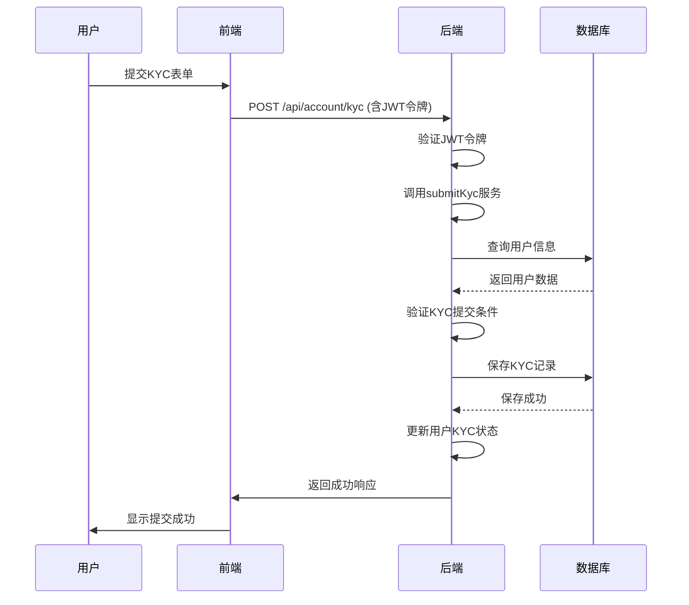
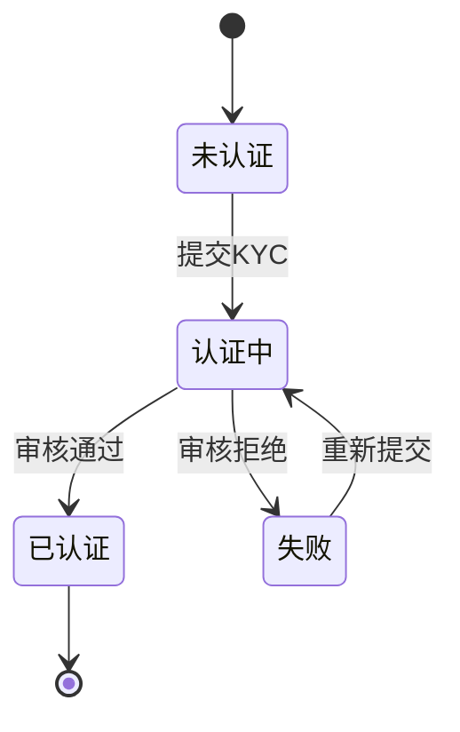

# KYC认证管理

<cite>
**本文档引用的文件**   
- [kyc.entity.ts](file://agx-backend/src/entities/kyc.entity.ts)
- [account.controller.ts](file://agx-backend/src/modules/account/account.controller.ts)
- [account.service.ts](file://agx-backend/src/modules/account/account.service.ts)
- [account.dto.ts](file://agx-backend/src/modules/account/account.dto.ts)
- [user.entity.ts](file://agx-backend/src/entities/user.entity.ts)
- [jwt-auth.guard.ts](file://agx-backend/src/modules/auth/jwt-auth.guard.ts)
- [kyc.vue](file://agx-admin/src/views/agx/kyc.vue)
</cite>

## 目录
1. [简介](#简介)
2. [核心端点实现](#核心端点实现)
3. [提交KYC数据传输对象](#提交kyc数据传输对象)
4. [KYC状态机](#kyc状态机)
5. [服务层与第三方集成](#服务层与第三方集成)
6. [安全与最佳实践](#安全与最佳实践)

## 简介
KYC（了解您的客户）认证管理功能是本系统中用于验证用户身份的核心模块。该功能允许用户提交身份证明文件以完成实名认证，从而解锁平台的高级功能，如提现等。本文档详细说明了KYC认证的实现细节，包括API端点、数据验证规则、状态转换逻辑以及安全最佳实践。

## 核心端点实现
KYC认证功能通过两个主要API端点实现：`POST /api/account/kyc`用于提交认证信息，`GET /api/account/kyc`用于查询认证状态。这两个端点均受JWT身份验证保护，确保只有登录用户才能访问。

**图示来源**
- [account.controller.ts](file://agx-backend/src/modules/account/account.controller.ts#L75-L79)
- [account.service.ts](file://agx-backend/src/modules/account/account.service.ts#L295-L334)

### POST /api/account/kyc 端点
此端点用于接收用户提交的KYC认证信息。在`account.controller.ts`中，该端点由`submitKyc`方法处理。该方法首先通过`@UseGuards(JwtAuthGuard)`确保用户已通过身份验证，然后从JWT令牌中提取用户ID，并将用户ID和请求体中的数据传递给`AccountService`的`submitKyc`方法。

**端点来源**
- [account.controller.ts](file://agx-backend/src/modules/account/account.controller.ts#L75-L79)

### GET /api/account/kyc 端点
此端点用于获取当前用户的KYC认证状态。同样受JWT保护，由`getKycStatus`方法处理。该方法调用服务层的`getKycStatus`方法，返回用户的KYC状态和最新的认证记录详情。

**端点来源**
- [account.controller.ts](file://agx-backend/src/modules/account/account.controller.ts#L85-L89)

## 提交KYC数据传输对象
`SubmitKycDto`定义了提交KYC认证时所需的数据结构和验证规则。该DTO位于`account.dto.ts`文件中，使用`class-validator`库进行数据验证。

| 字段 | 类型 | 验证规则 | 描述 |
| :--- | :--- | :--- | :--- |
| `realName` | string | `@IsString()`, `@Length(2, 50)` | 真实姓名，长度必须在2-50个字符之间 |
| `idNumber` | string | `@IsString()`, `@Length(6, 50)` | 证件号码，长度必须在6-50个字符之间 |
| `idType` | number | `@IsInt()` | 证件类型：1表示身份证，2表示护照 |
| `frontImage` | string (可选) | `@IsOptional()`, `@IsString()` | 证件正面照片的URL |
| `backImage` | string (可选) | `@IsOptional()`, `@IsString()` | 证件背面照片的URL |
| `holdImage` | string (可选) | `@IsOptional()`, `@IsString()` | 手持证件照片的URL |

**DTO来源**
- [account.dto.ts](file://agx-backend/src/modules/account/account.dto.ts#L48-L71)

## KYC状态机
KYC认证流程由一个状态机管理，该状态机定义了用户KYC认证的四种状态及其转换逻辑。

### 状态定义
在`user.entity.ts`中，`kycStatus`字段定义了用户的KYC状态：
- **0: 未认证** - 用户尚未提交KYC申请。
- **1: 认证中** - 用户已提交KYC申请，正在等待审核。
- **2: 已认证** - 用户的KYC申请已通过审核。
- **3: 失败** - 用户的KYC申请被拒绝。

在`kyc.entity.ts`中，`status`字段定义了单个KYC记录的状态：
- **0: 待审核** - 该KYC记录正在等待管理员审核。
- **1: 通过** - 该KYC记录已通过审核。
- **2: 拒绝** - 该KYC记录被拒绝。

**状态机来源**
- [user.entity.ts](file://agx-backend/src/entities/user.entity.ts#L41-L42)
- [kyc.entity.ts](file://agx-backend/src/entities/kyc.entity.ts#L42-L43)

### 状态转换逻辑
状态转换逻辑在`account.service.ts`的`submitKyc`方法中实现：
1.  **提交前检查**：在创建新的KYC记录之前，会检查用户是否已有待审核的KYC申请（`status: 0`）。如果有，则抛出错误，防止重复提交。
2.  **已认证检查**：如果用户的`kycStatus`已经是2（已认证），则不允许再次提交。
3.  **数据验证**：对`realName`和`idNumber`进行基本的长度验证。
4.  **状态更新**：成功创建KYC记录后，将用户的`kycStatus`更新为1（认证中），并保存到数据库。

**状态转换来源**
- [account.service.ts](file://agx-backend/src/modules/account/account.service.ts#L301-L338)

## 服务层与第三方集成
`AccountService`是处理KYC业务逻辑的核心服务。它与数据库通过TypeORM仓库进行交互，并与JWT身份验证系统集成。

### 服务层实现
`AccountService`在`account.service.ts`中定义，它注入了`Kyc`实体的仓库（`kycRepo`）和`User`实体的仓库（`userRepo`）。`submitKyc`方法负责协调KYC记录的创建和用户状态的更新。

### 第三方服务集成
虽然当前代码中没有直接集成第三方身份验证服务（如人脸识别API），但其架构为未来的集成预留了空间。`submitKyc`方法在保存KYC记录后，可以扩展为调用第三方服务进行自动验证。审核结果的异步通知机制可以通过消息队列或Webhook实现，但当前实现中尚未包含。

**服务层来源**
- [account.service.ts](file://agx-backend/src/modules/account/account.service.ts#L295-L334)

## 安全与最佳实践
### 敏感数据加密存储
用户的证件号码（`idNumber`）在数据库中以明文形式存储。最佳实践是使用加密算法（如AES）对敏感信息进行加密。此外，在返回给前端的响应中，`getKycStatus`方法对证件号码进行了部分掩码处理（`replace(/^(.{4}).*(.{4})$/, '$1****$2')`），以保护用户隐私。

### 审核日志审计
当前系统没有专门的KYC审核日志。为了满足审计要求，建议在`kyc`表中添加`reviewer_id`字段，记录审核操作的管理员ID，并在审核时记录操作时间。

### 防欺诈检测
基础的防欺诈检测通过以下方式实现：
- **重复提交检查**：防止用户在已有待审核申请时重复提交。
- **JWT身份验证**：确保所有操作都由经过身份验证的用户发起。
- **输入验证**：对关键字段进行长度和格式验证。

更高级的防欺诈检测（如图像真实性分析、活体检测）需要集成第三方服务。

**安全实践来源**
- [account.service.ts](file://agx-backend/src/modules/account/account.service.ts#L362)
- [kyc.entity.ts](file://agx-backend/src/entities/kyc.entity.ts#L27-L28)