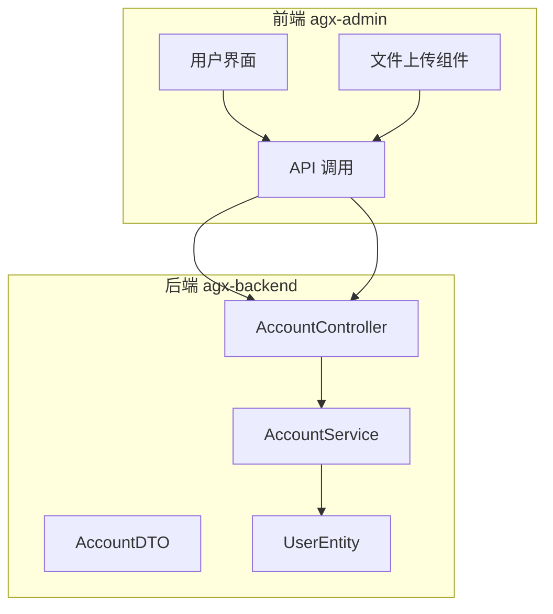
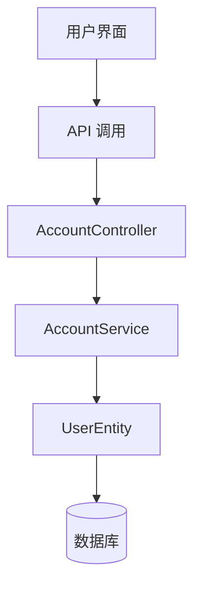
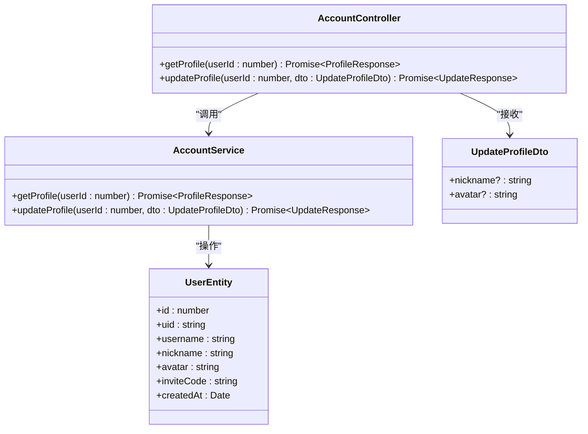
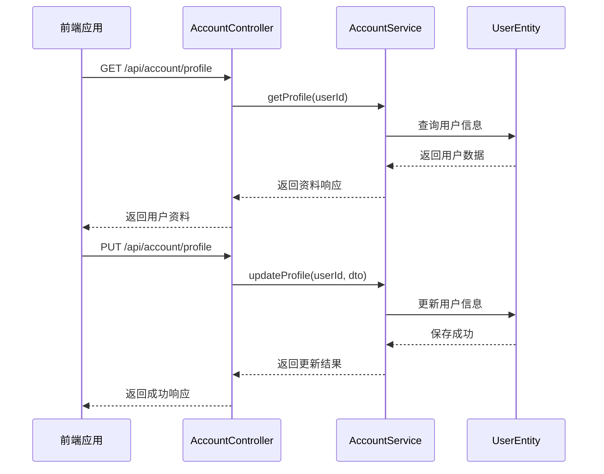
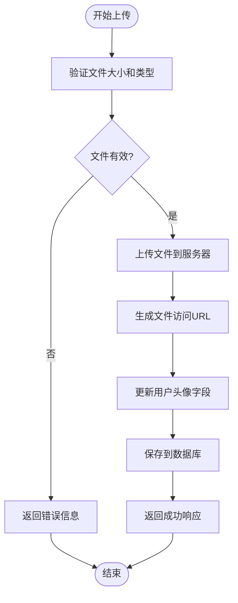
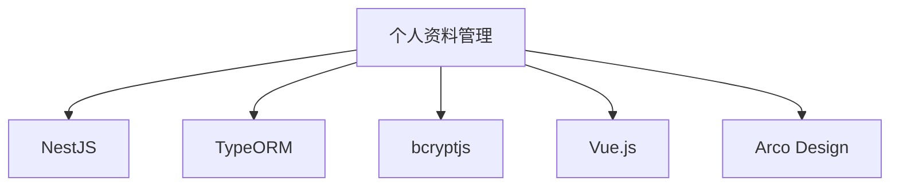

# 个人资料管理

<cite>
**本文档引用的文件**  
- [account.controller.ts](file://agx-backend/src/modules/account/account.controller.ts)
- [account.service.ts](file://agx-backend/src/modules/account/account.service.ts)
- [account.dto.ts](file://agx-backend/src/modules/account/account.dto.ts)
- [user.entity.ts](file://agx-backend/src/entities/user.entity.ts)
- [user.js](file://agx-admin/src/api/system/user.js)
- [userInfomation-BzhuTv01.js](file://agx-admin/dist/assets/userInfomation-BzhuTv01.js)
- [ma-upload/components/file-upload.vue](file://agx-admin/src/components/ma-upload/components/file-upload.vue)
- [ma-upload/js/utils.js](file://agx-admin/src/components/ma-upload/js/utils.js)
</cite>

## 目录
1. [简介](#简介)
2. [项目结构](#项目结构)
3. [核心组件](#核心组件)
4. [架构概述](#架构概述)
5. [详细组件分析](#详细组件分析)
6. [依赖分析](#依赖分析)
7. [性能考虑](#性能考虑)
8. [故障排除指南](#故障排除指南)
9. [结论](#结论)
10. [附录](#附录)（如有必要）

## 简介
本文档详细说明了个人资料管理功能的实现机制，重点聚焦于用户基本信息的获取与更新。文档涵盖了 `GET /api/account/profile` 和 `PUT /api/account/profile` 端点的实现，包括请求响应的数据结构、字段类型和业务逻辑处理流程。同时，解释了 `UpdateProfileDto` 中各字段的验证规则，以及服务层处理敏感信息更新的安全策略。此外，还提供了头像上传的实现细节，包括文件类型限制、大小控制和存储路径，并为不同层次的开发者提供了最佳实践建议。

## 项目结构
个人资料管理功能主要分布在后端 `agx-backend` 和前端 `agx-admin` 两个项目中。后端负责提供 REST API 接口和业务逻辑处理，前端负责用户界面展示和交互。核心功能模块位于 `agx-backend` 的 `modules/account` 目录下，包括控制器、服务和数据传输对象（DTO）。前端界面主要在 `agx-admin` 的 `views/userCenter` 和 `components/ma-upload` 目录下实现。

**Diagram sources**
- [account.controller.ts](file://agx-backend/src/modules/account/account.controller.ts)
- [account.service.ts](file://agx-backend/src/modules/account/account.service.ts)
- [user.entity.ts](file://agx-backend/src/entities/user.entity.ts)

**Section sources**
- [account.controller.ts](file://agx-backend/src/modules/account/account.controller.ts)
- [account.service.ts](file://agx-backend/src/modules/account/account.service.ts)
- [user.entity.ts](file://agx-backend/src/entities/user.entity.ts)

## 核心组件
个人资料管理的核心组件包括 `AccountController`、`AccountService` 和 `UserEntity`。`AccountController` 负责处理 HTTP 请求，`AccountService` 实现业务逻辑，`UserEntity` 定义了用户数据的数据库模型。

**Section sources**
- [account.controller.ts](file://agx-backend/src/modules/account/account.controller.ts)
- [account.service.ts](file://agx-backend/src/modules/account/account.service.ts)
- [user.entity.ts](file://agx-backend/src/entities/user.entity.ts)

## 架构概述
系统采用典型的分层架构，从前端到后端依次为：用户界面层、API 调用层、控制器层、服务层和实体层。这种分层设计确保了关注点分离，提高了代码的可维护性和可测试性。

**Diagram sources**
- [account.controller.ts](file://agx-backend/src/modules/account/account.controller.ts)
- [account.service.ts](file://agx-backend/src/modules/account/account.service.ts)
- [user.entity.ts](file://agx-backend/src/entities/user.entity.ts)

## 详细组件分析

### 个人资料获取与更新分析
`GET /api/account/profile` 和 `PUT /api/account/profile` 端点是个人资料管理的核心。`GET` 请求用于获取用户信息，`PUT` 请求用于更新用户信息。

#### 对象导向组件：

**Diagram sources**
- [account.controller.ts](file://agx-backend/src/modules/account/account.controller.ts)
- [account.service.ts](file://agx-backend/src/modules/account/account.service.ts)
- [account.dto.ts](file://agx-backend/src/modules/account/account.dto.ts)
- [user.entity.ts](file://agx-backend/src/entities/user.entity.ts)

#### API/服务组件：

**Diagram sources**
- [account.controller.ts](file://agx-backend/src/modules/account/account.controller.ts)
- [account.service.ts](file://agx-backend/src/modules/account/account.service.ts)
- [user.entity.ts](file://agx-backend/src/entities/user.entity.ts)

**Section sources**
- [account.controller.ts](file://agx-backend/src/modules/account/account.controller.ts)
- [account.service.ts](file://agx-backend/src/modules/account/account.service.ts)
- [user.entity.ts](file://agx-backend/src/entities/user.entity.ts)

### 头像上传分析
头像上传功能由前端的 `ma-upload` 组件和后端的文件处理逻辑共同实现。

#### 复杂逻辑组件：

**Diagram sources**
- [ma-upload/components/file-upload.vue](file://agx-admin/src/components/ma-upload/components/file-upload.vue)
- [ma-upload/js/utils.js](file://agx-admin/src/components/ma-upload/js/utils.js)
- [account.service.ts](file://agx-backend/src/modules/account/account.service.ts)

**Section sources**
- [ma-upload/components/file-upload.vue](file://agx-admin/src/components/ma-upload/components/file-upload.vue)
- [ma-upload/js/utils.js](file://agx-admin/src/components/ma-upload/js/utils.js)
- [account.service.ts](file://agx-backend/src/modules/account/account.service.ts)

## 依赖分析
个人资料管理功能依赖于多个模块和外部库。后端依赖于 NestJS 框架、TypeORM、bcryptjs 等。前端依赖于 Vue.js、Arco Design 等 UI 库。

**Diagram sources**
- [package.json](file://agx-backend/package.json)
- [package.json](file://agx-admin/package.json)

**Section sources**
- [package.json](file://agx-backend/package.json)
- [package.json](file://agx-admin/package.json)

## 性能考虑
在处理个人资料更新时，系统采用了直接更新数据库的方式，避免了复杂的事务处理，提高了性能。头像上传时，文件大小限制为 5MB，防止大文件上传影响系统性能。

## 故障排除指南
常见问题包括头像上传失败、资料更新无响应等。检查文件大小是否超过限制，确保网络连接正常，验证用户权限是否足够。

**Section sources**
- [ma-upload/components/file-upload.vue](file://agx-admin/src/components/ma-upload/components/file-upload.vue)
- [account.service.ts](file://agx-backend/src/modules/account/account.service.ts)

## 结论
个人资料管理功能实现了用户基本信息的获取与更新，通过清晰的分层架构和合理的业务逻辑设计，确保了系统的稳定性和可维护性。未来可以考虑增加更多的验证规则和安全措施，进一步提升用户体验。

## 附录
无