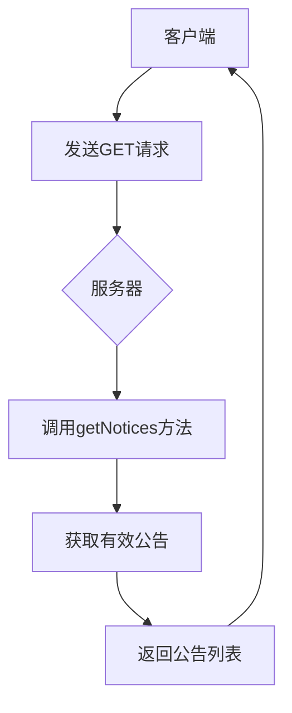
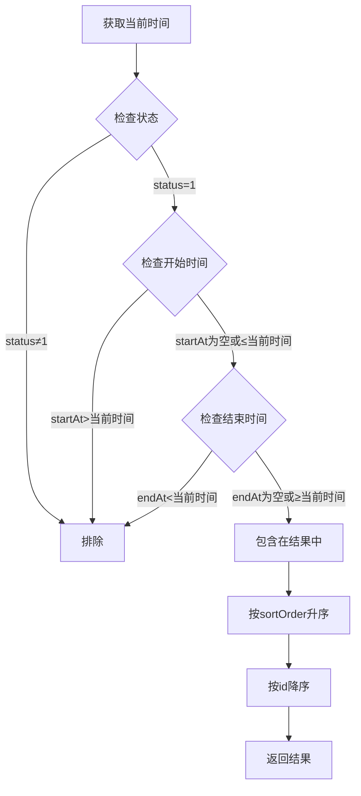
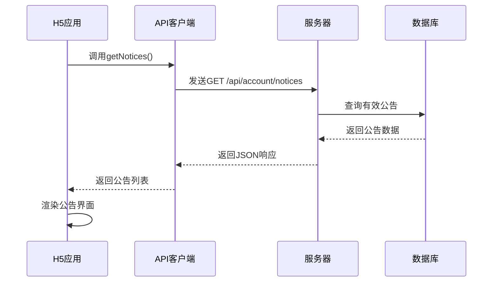
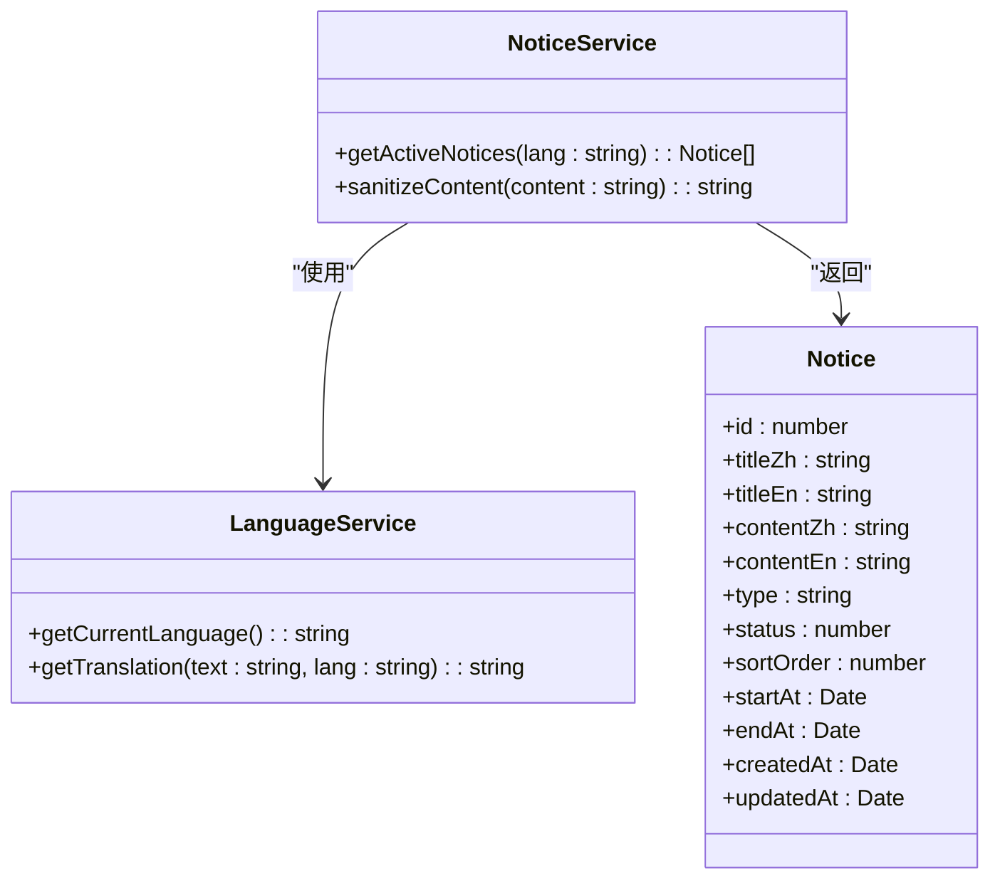

# 公共信息

<cite>
**本文档引用的文件**   
- [account.controller.ts](file://agx-backend/src/modules/account/account.controller.ts)
- [account.service.ts](file://agx-backend/src/modules/account/account.service.ts)
- [notice.entity.ts](file://agx-backend/src/entities/notice.entity.ts)
- [api.js](file://h5/src/utils/api.js)
- [notice.vue](file://agx-admin/src/views/agx/notice.vue)
</cite>

## 目录
1. [简介](#简介)
2. [API端点详情](#api端点详情)
3. [公告筛选逻辑](#公告筛选逻辑)
4. [公告展示时序图](#公告展示时序图)
5. [高级最佳实践](#高级最佳实践)
6. [结论](#结论)

## 简介

本API文档详细说明了账户服务中的公共信息获取功能，特别是公告获取端点 `GET /api/account/notices` 的实现细节。该端点允许用户在无需登录的情况下获取系统公告，为所有用户提供重要的系统信息和通知。

通过分析代码库，我们发现该功能由后端NestJS服务实现，前端H5应用和管理后台都使用了这一功能。公告信息存储在数据库的 `agx_notice` 表中，包含标题、内容、类型、状态、排序和生效时间等字段。

**Section sources**
- [account.controller.ts](file://agx-backend/src/modules/account/account.controller.ts#L152-L158)
- [notice.entity.ts](file://agx-backend/src/entities/notice.entity.ts#L1-L41)

## API端点详情

`GET /api/account/notices` 端点提供了获取有效公告列表的功能，其主要特点如下：

- **HTTP方法**: GET
- **请求路径**: `/api/account/notices`
- **认证要求**: 无需JWT认证
- **响应格式**: JSON数组，包含公告的ID、标题、内容和类型

该端点在账户控制器中定义，通过 `@Get('notices')` 装饰器标记，且没有使用 `@UseGuards(JwtAuthGuard)`，这表明它是一个公开的API端点，任何用户都可以访问。

响应数据经过了精简处理，只返回必要的字段（id、title、content、type），而没有暴露创建时间、更新时间等管理信息，这符合公共信息的安全设计原则。

**Diagram sources**
- [account.controller.ts](file://agx-backend/src/modules/account/account.controller.ts#L155-L158)

**Section sources**
- [account.controller.ts](file://agx-backend/src/modules/account/account.controller.ts#L152-L158)
- [api.js](file://h5/src/utils/api.js#L100-L101)

## 公告筛选逻辑

公告筛选逻辑在 `AccountService` 的 `getActiveNotices` 方法中实现，通过多个条件组合来确定哪些公告是当前有效的：

1. **状态筛选**: `n.status = 1` - 只获取启用状态的公告
2. **时间范围筛选**: 
   - `(n.startAt IS NULL OR n.startAt <= :now)` - 开始时间为空或已到达开始时间
   - `(n.endAt IS NULL OR n.endAt >= :now)` - 结束时间为空或未超过结束时间
3. **排序规则**: 按 `sortOrder` 升序排列，然后按 `id` 降序排列

这种筛选逻辑确保了只有在有效时间范围内且已启用的公告才会被返回给用户。排序规则首先考虑管理员设置的排序值，然后考虑公告的创建顺序，为内容管理提供了灵活性。

**Diagram sources**
- [account.service.ts](file://agx-backend/src/modules/account/account.service.ts#L588-L596)

**Section sources**
- [account.service.ts](file://agx-backend/src/modules/account/account.service.ts#L588-L604)
- [notice.entity.ts](file://agx-backend/src/entities/notice.entity.ts#L23-L33)

## 公告展示时序图

以下时序图展示了从H5前端应用获取并展示公告的完整流程：

该流程展示了无认证的公共API调用过程，从H5应用发起请求，通过API客户端发送到服务器，服务器查询数据库并返回结果，最后在前端渲染展示。这种设计模式确保了公告信息的高效获取和展示。

**Diagram sources**
- [api.js](file://h5/src/utils/api.js#L100-L101)
- [account.controller.ts](file://agx-backend/src/modules/account/account.controller.ts#L155-L158)

**Section sources**
- [api.js](file://h5/src/utils/api.js#L100-L101)
- [account.controller.ts](file://agx-backend/src/modules/account/account.controller.ts#L155-L158)

## 高级最佳实践

### 公告缓存策略

虽然当前实现中没有显式的缓存机制，但基于公告信息相对静态的特性，建议实现以下缓存策略：

1. **服务器端缓存**: 使用Redis等内存数据库缓存公告列表，设置合理的过期时间（如5-10分钟）
2. **HTTP缓存**: 在响应头中添加适当的缓存控制指令，如 `Cache-Control: public, max-age=300`
3. **客户端缓存**: H5应用可以在本地存储中缓存公告数据，减少网络请求

### 内容安全过滤

当前实现直接返回数据库中的内容，建议增加内容安全过滤：

1. **XSS防护**: 对公告内容进行HTML转义或使用内容安全策略（CSP）
2. **敏感词过滤**: 在保存和返回公告时进行敏感词检测和过滤
3. **链接验证**: 对公告中的外部链接进行安全验证

### 多语言支持扩展

为了支持国际化，可以扩展公告系统以支持多语言：

1. **多语言字段**: 在 `Notice` 实体中添加 `titleZh`、`titleEn`、`contentZh`、`contentEn` 等字段
2. **语言选择**: 根据请求头中的 `Accept-Language` 返回相应语言的公告
3. **管理界面**: 在管理后台提供多语言编辑界面，方便内容管理

**Diagram sources**
- [notice.entity.ts](file://agx-backend/src/entities/notice.entity.ts#L1-L41)
- [account.service.ts](file://agx-backend/src/modules/account/account.service.ts#L588-L604)

**Section sources**
- [notice.entity.ts](file://agx-backend/src/entities/notice.entity.ts#L1-L41)
- [account.service.ts](file://agx-backend/src/modules/account/account.service.ts#L588-L604)

## 结论

`GET /api/account/notices` 端点是一个设计良好的公共API，它允许用户在无需认证的情况下获取系统公告。通过状态、时间和排序的多重筛选逻辑，确保了只有当前有效的公告才会被展示。

该功能的实现体现了清晰的关注点分离：控制器处理HTTP请求，服务层实现业务逻辑，实体定义数据结构。前端应用通过统一的API客户端调用此端点，实现了代码的复用和维护的便利。

对于未来的优化，建议考虑添加缓存机制以提高性能，实施内容安全过滤以增强安全性，并扩展多语言支持以满足国际化需求。