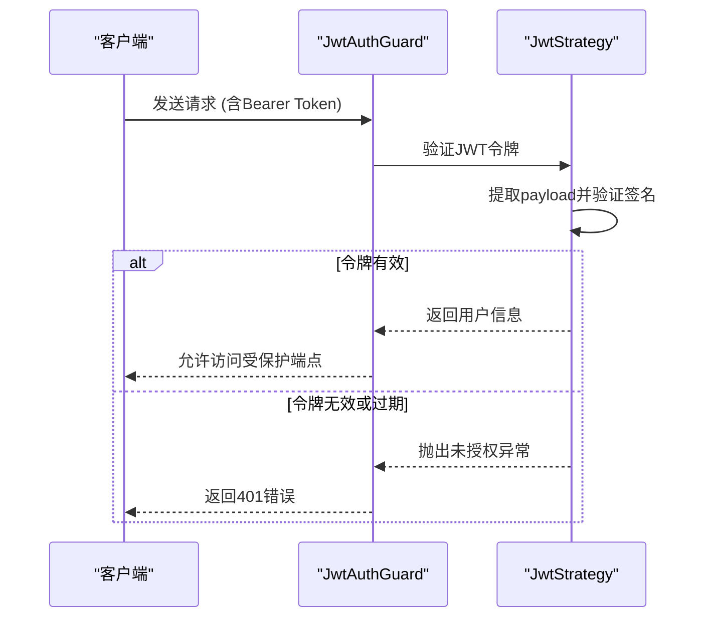
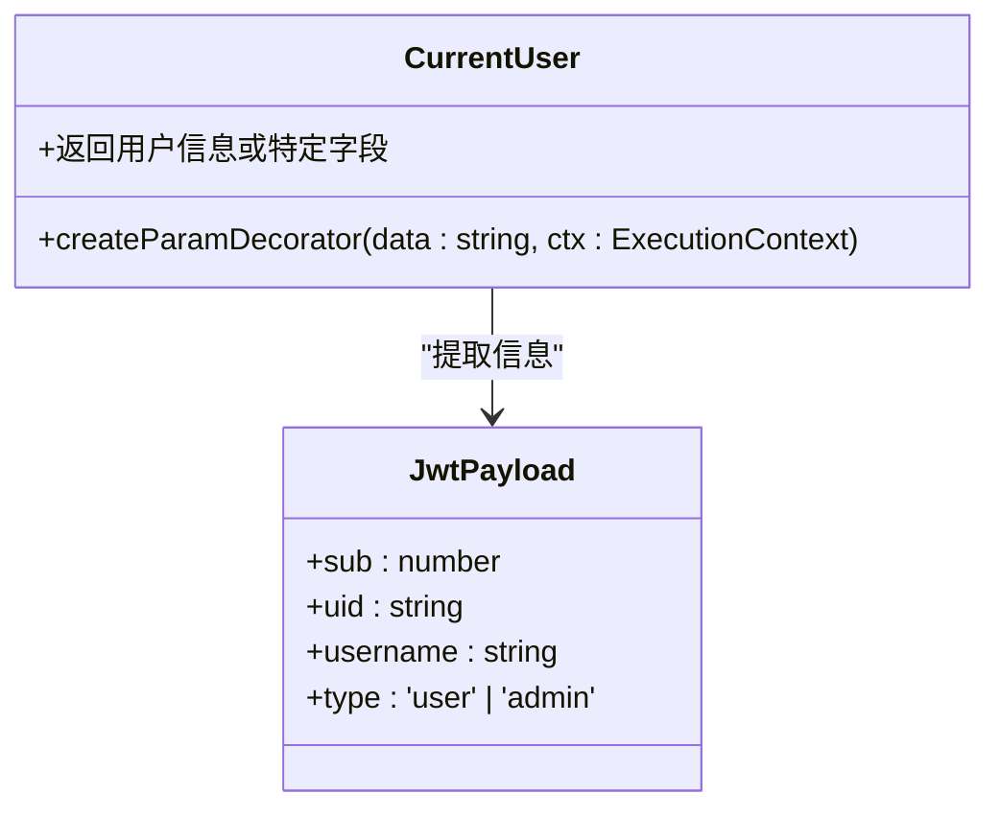
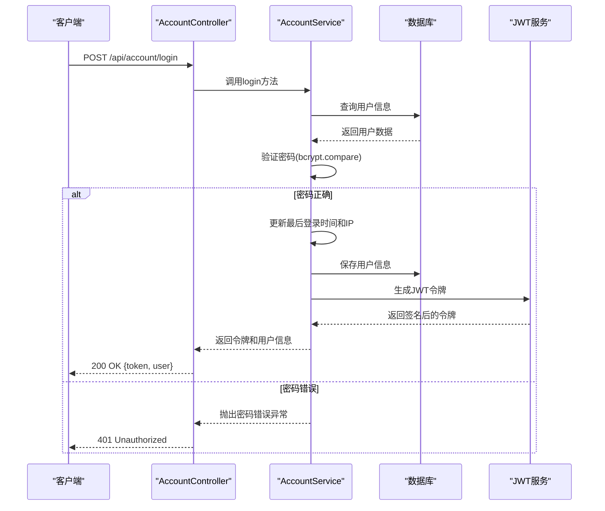
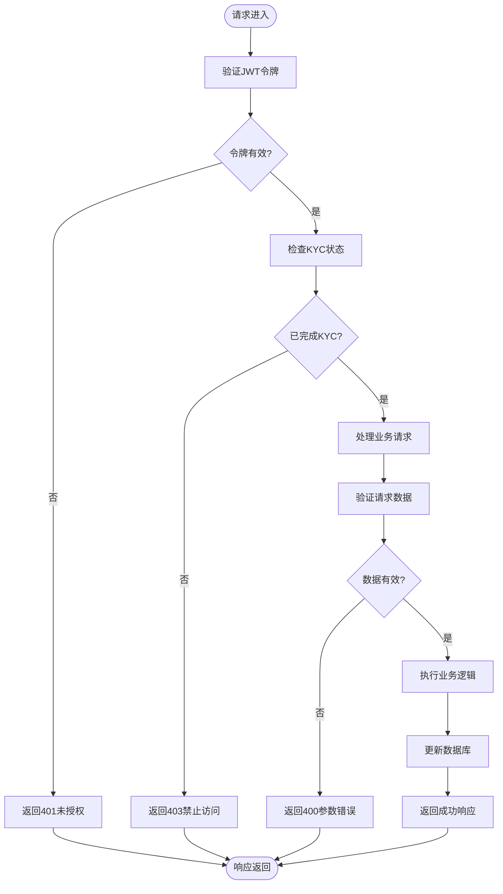

# 账户服务API

<cite>
**本文档引用的文件**  
- [account.controller.ts](file://agx-backend/src/modules/account/account.controller.ts)
- [account.dto.ts](file://agx-backend/src/modules/account/account.dto.ts)
- [account.service.ts](file://agx-backend/src/modules/account/account.service.ts)
- [jwt-auth.guard.ts](file://agx-backend/src/modules/auth/jwt-auth.guard.ts)
- [jwt.strategy.ts](file://agx-backend/src/modules/auth/jwt.strategy.ts)
- [current-user.decorator.ts](file://agx-backend/src/common/decorators/current-user.decorator.ts)
- [user.entity.ts](file://agx-backend/src/entities/user.entity.ts)
- [wallet.entity.ts](file://agx-backend/src/entities/wallet.entity.ts)
- [business.exception.ts](file://agx-backend/src/common/filters/business.exception.ts)
- [api-response.dto.ts](file://agx-backend/src/common/dto/api-response.dto.ts)
- [api.js](file://h5/src/utils/api.js)
</cite>

## 目录
1. [简介](#简介)
2. [核心功能端点](#核心功能端点)
3. [DTO数据验证规则](#dto数据验证规则)
4. [认证与安全机制](#认证与安全机制)
5. [用户认证流程序列图](#用户认证流程序列图)
6. [安全最佳实践](#安全最佳实践)

## 简介

账户服务API提供了完整的用户账户管理功能，包括注册、登录、个人资料管理、KYC认证、资金管理（充值/提现）和邀请统计等核心功能。该API采用NestJS框架构建，遵循RESTful设计原则，为前端应用提供稳定可靠的后端支持。

**本文档引用的文件**
- [account.controller.ts](file://agx-backend/src/modules/account/account.controller.ts#L1-L160)
- [account.service.ts](file://agx-backend/src/modules/account/account.service.ts#L1-L606)

## 核心功能端点

### 注册与登录
- **注册**：`POST /api/account/register`
  - 创建新用户账户，需要提供用户名、密码和邀请码
  - 成功后返回用户基本信息和JWT令牌
- **登录**：`POST /api/account/login`
  - 使用用户名和密码进行身份验证
  - 成功后返回JWT令牌和用户信息

### 个人资料管理
- **获取用户信息**：`GET /api/account/profile`
  - 获取当前登录用户的详细信息，包括UID、昵称、头像等
- **更新个人资料**：`PUT /api/account/profile`
  - 允许用户更新昵称和头像
- **修改密码**：`POST /api/account/password`
  - 需要提供旧密码和新密码来更改账户密码

### KYC认证
- **提交KYC**：`POST /api/account/kyc`
  - 提交实名认证信息，包括真实姓名、身份证号码等
- **获取KYC状态**：`GET /api/account/kyc`
  - 查询当前用户的KYC认证状态

### 资金管理
- **获取充值地址**：`GET /api/account/deposit/address`
  - 根据指定币种和链网络获取充值地址
- **获取充值记录**：`GET /api/account/deposit/history`
  - 查询用户的充值历史记录
- **申请提现**：`POST /api/account/withdraw`
  - 提交提现申请，需要完成KYC认证
- **获取提现记录**：`GET /api/account/withdraw/history`
  - 查询用户的提现历史记录

### 邀请统计
- **获取邀请列表**：`GET /api/account/invites`
  - 查询用户的邀请用户列表
- **获取邀请统计**：`GET /api/account/invite/stats`
  - 获取邀请人数统计和返佣信息

**本文档引用的文件**
- [account.controller.ts](file://agx-backend/src/modules/account/account.controller.ts#L16-L159)
- [account.service.ts](file://agx-backend/src/modules/account/account.service.ts#L65-L605)

## DTO数据验证规则

### RegisterDto（注册数据传输对象）
- **username**：用户名
  - 必须为字符串类型
  - 长度限制在4-20个字符之间
  - 只能包含字母、数字和下划线
- **password**：密码
  - 必须为字符串类型
  - 长度限制在8-20个字符之间
- **inviteCode**：邀请码
  - 必须为字符串类型
  - 长度必须为6个字符

### LoginDto（登录数据传输对象）
- **username**：用户名
  - 必须为字符串类型
  - 长度限制在4-50个字符之间
- **password**：密码
  - 必须为字符串类型
  - 长度限制在8-20个字符之间

### ChangePasswordDto（修改密码数据传输对象）
- **oldPassword**：旧密码
  - 必须为字符串类型
- **newPassword**：新密码
  - 必须为字符串类型
  - 长度限制在8-20个字符之间

### UpdateProfileDto（更新个人资料数据传输对象）
- **nickname**：昵称（可选）
  - 字符串类型
  - 长度限制在1-50个字符之间
- **avatar**：头像URL（可选）
  - 字符串类型

### SubmitKycDto（提交KYC数据传输对象）
- **realName**：真实姓名
  - 必须为字符串类型
  - 长度限制在2-50个字符之间
- **idNumber**：身份证号码
  - 必须为字符串类型
  - 长度限制在6-50个字符之间
- **idType**：证件类型
  - 整数类型
  - 1表示身份证，2表示护照
- **frontImage**：身份证正面照片（可选）
  - 字符串类型
- **backImage**：身份证背面照片（可选）
  - 字符串类型
- **holdImage**：手持身份证照片（可选）
  - 字符串类型

### WithdrawDto（提现数据传输对象）
- **coin**：币种
  - 必须为字符串类型
- **chain**：链网络
  - 必须为字符串类型
- **amount**：提现金额
  - 必须为字符串类型
- **address**：目标地址
  - 必须为字符串类型
- **payPassword**：支付密码（可选）
  - 字符串类型

**本文档引用的文件**
- [account.dto.ts](file://agx-backend/src/modules/account/account.dto.ts#L3-L98)

## 认证与安全机制

### JwtAuthGuard（JWT认证守卫）
`JwtAuthGuard`是保护敏感端点的核心安全机制，它基于JWT（JSON Web Token）实现身份验证。所有需要用户登录才能访问的端点都使用`@UseGuards(JwtAuthGuard)`装饰器进行保护。

**图示来源**
- [jwt-auth.guard.ts](file://agx-backend/src/modules/auth/jwt-auth.guard.ts#L6-L17)
- [jwt.strategy.ts](file://agx-backend/src/modules/auth/jwt.strategy.ts#L14-L32)

### CurrentUser装饰器
`CurrentUser`装饰器用于在控制器方法中获取当前登录用户的信息。它从JWT令牌的payload中提取用户ID和其他相关信息。

**图示来源**
- [current-user.decorator.ts](file://agx-backend/src/common/decorators/current-user.decorator.ts#L6-L17)
- [jwt.strategy.ts](file://agx-backend/src/modules/auth/jwt.strategy.ts#L6-L11)

**本文档引用的文件**
- [jwt-auth.guard.ts](file://agx-backend/src/modules/auth/jwt-auth.guard.ts#L6-L17)
- [jwt.strategy.ts](file://agx-backend/src/modules/auth/jwt.strategy.ts#L14-L32)
- [current-user.decorator.ts](file://agx-backend/src/common/decorators/current-user.decorator.ts#L6-L17)

## 用户认证流程序列图

**图示来源**
- [account.controller.ts](file://agx-backend/src/modules/account/account.controller.ts#L25-L29)
- [account.service.ts](file://agx-backend/src/modules/account/account.service.ts#L156-L199)

## 安全最佳实践

### 密码加密
系统使用`bcryptjs`库对用户密码进行加密存储，确保即使数据库泄露，攻击者也无法轻易获取明文密码。

- **盐值成本**：设置为10，平衡安全性和性能
- **哈希算法**：使用bcrypt算法，抗彩虹表攻击
- **存储字段**：`passwordHash`字段存储加密后的密码

### 会话管理
- **JWT令牌**：使用无状态的JWT进行会话管理
- **令牌有效期**：通过配置控制令牌过期时间
- **刷新机制**：支持令牌刷新以提高用户体验

### 防止暴力破解
- **失败尝试限制**：虽然当前代码未直接实现，但可通过中间件添加
- **IP监控**：记录用户登录IP，便于安全审计
- **异常检测**：通过日志监控异常登录行为

### 数据验证
- **DTO验证**：使用`class-validator`库进行请求数据验证
- **业务逻辑验证**：在服务层进行业务规则检查
- **错误处理**：统一的业务异常处理机制

### 安全响应

**图示来源**
- [account.service.ts](file://agx-backend/src/modules/account/account.service.ts#L433-L492)
- [business.exception.ts](file://agx-backend/src/common/filters/business.exception.ts#L7-L60)

**本文档引用的文件**
- [account.service.ts](file://agx-backend/src/modules/account/account.service.ts#L5-L606)
- [business.exception.ts](file://agx-backend/src/common/filters/business.exception.ts#L7-L60)
- [api-response.dto.ts](file://agx-backend/src/common/dto/api-response.dto.ts#L1-L68)