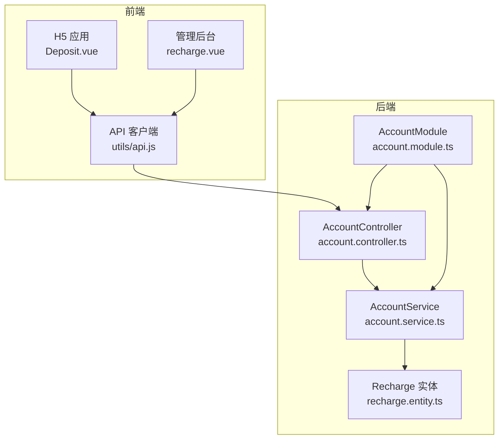
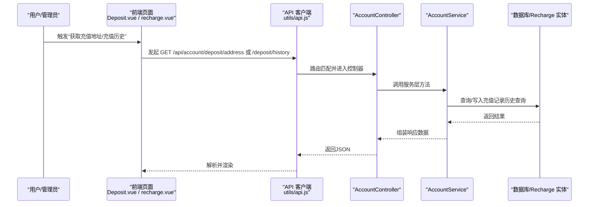
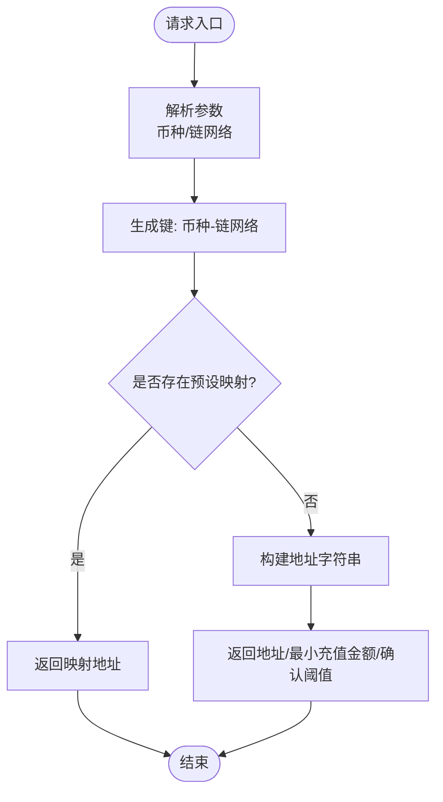
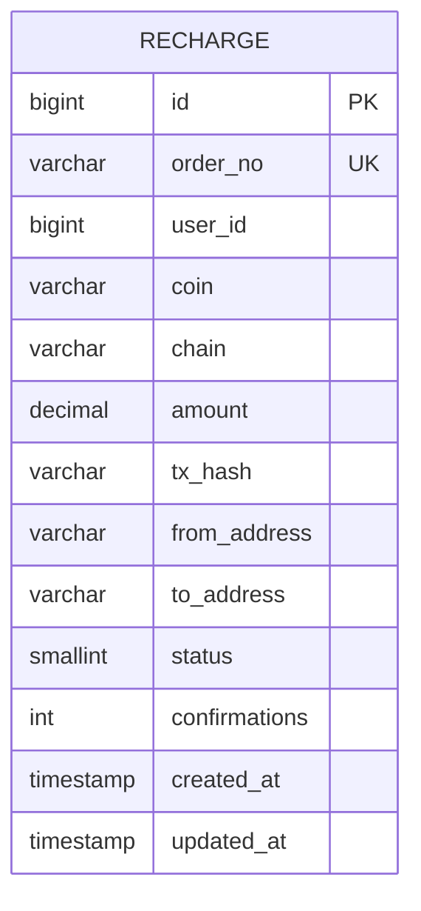
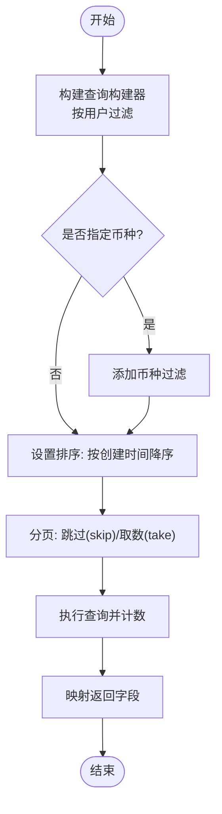
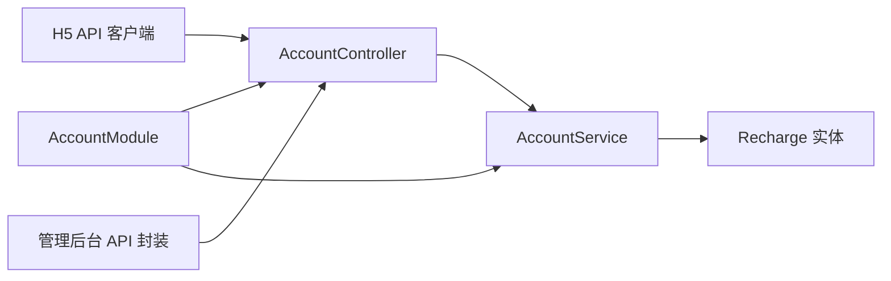
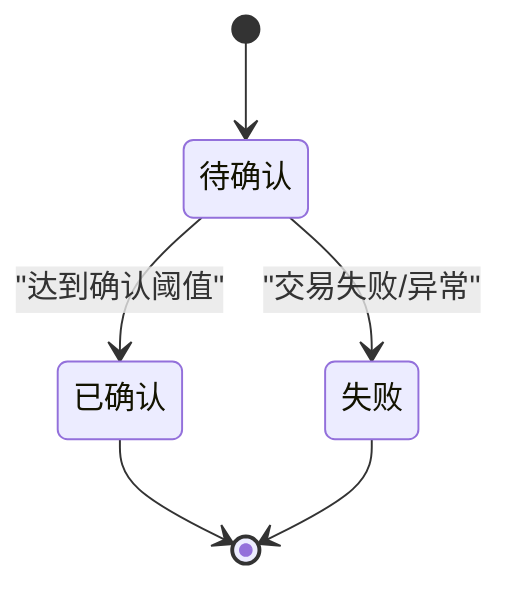

# 充值管理

<cite>
**本文引用的文件**
- [agx-backend/src/modules/account/account.controller.ts](file://agx-backend/src/modules/account/account.controller.ts)
- [agx-backend/src/modules/account/account.service.ts](file://agx-backend/src/modules/account/account.service.ts)
- [agx-backend/src/modules/account/account.dto.ts](file://agx-backend/src/modules/account/account.dto.ts)
- [agx-backend/src/modules/account/account.module.ts](file://agx-backend/src/modules/account/account.module.ts)
- [agx-backend/src/entities/recharge.entity.ts](file://agx-backend/src/entities/recharge.entity.ts)
- [agx-backend/src/modules/admin/admin.service.ts](file://agx-backend/src/modules/admin/admin.service.ts)
- [h5/src/utils/api.js](file://h5/src/utils/api.js)
- [h5/src/api/account.js](file://h5/src/api/account.js)
- [h5/src/views/Deposit.vue](file://h5/src/views/Deposit.vue)
- [agx-admin/src/api/agx/index.js](file://agx-admin/src/api/agx/index.js)
- [agx-admin/src/views/agx/recharge.vue](file://agx-admin/src/views/agx/recharge.vue)
</cite>

## 目录
1. [简介](#简介)
2. [项目结构](#项目结构)
3. [核心组件](#核心组件)
4. [架构总览](#架构总览)
5. [详细组件分析](#详细组件分析)
6. [依赖分析](#依赖分析)
7. [性能考虑](#性能考虑)
8. [故障排查指南](#故障排查指南)
9. [结论](#结论)
10. [附录](#附录)

## 简介
本文件聚焦“充值管理”功能，围绕以下两个核心端点展开：
- GET /api/account/deposit/address：为用户生成唯一的充值地址，并返回最小充值金额与确认阈值等信息。
- GET /api/account/deposit/history：实现分页查询用户的充值记录，支持按币种筛选。

同时，文档解释充值地址生成的安全机制、防碰撞策略，以及充值历史的状态机（待确认、已确认、失败），并提供面向初学者的充值流程状态图与面向高级开发者的最佳实践建议（区块链确认数处理、重复充值防护、地址重用风险控制）。

## 项目结构
充值管理涉及前后端协作：
- 前端（H5移动端与管理后台）通过统一的API客户端发起请求。
- 后端（NestJS）提供账户模块的充值接口，使用TypeORM实体持久化充值记录。

图表来源
- [agx-backend/src/modules/account/account.controller.ts](file://agx-backend/src/modules/account/account.controller.ts#L91-L109)
- [agx-backend/src/modules/account/account.service.ts](file://agx-backend/src/modules/account/account.service.ts#L371-L428)
- [agx-backend/src/entities/recharge.entity.ts](file://agx-backend/src/entities/recharge.entity.ts#L1-L57)
- [agx-backend/src/modules/account/account.module.ts](file://agx-backend/src/modules/account/account.module.ts#L1-L18)
- [h5/src/utils/api.js](file://h5/src/utils/api.js#L72-L102)
- [agx-admin/src/api/agx/index.js](file://agx-admin/src/api/agx/index.js#L230-L249)

章节来源
- [agx-backend/src/modules/account/account.controller.ts](file://agx-backend/src/modules/account/account.controller.ts#L91-L109)
- [agx-backend/src/modules/account/account.service.ts](file://agx-backend/src/modules/account/account.service.ts#L371-L428)
- [h5/src/utils/api.js](file://h5/src/utils/api.js#L72-L102)
- [agx-admin/src/api/agx/index.js](file://agx-admin/src/api/agx/index.js#L230-L249)

## 核心组件
- 控制器层：暴露充值地址与充值历史查询接口，鉴权采用JWT守卫。
- 服务层：负责业务逻辑，包括充值地址生成与充值历史分页查询。
- 实体层：定义充值记录的数据模型，包含状态与确认数字段。
- 前端API：封装请求与响应格式，自动注入Token并统一封装返回结构。

章节来源
- [agx-backend/src/modules/account/account.controller.ts](file://agx-backend/src/modules/account/account.controller.ts#L91-L109)
- [agx-backend/src/modules/account/account.service.ts](file://agx-backend/src/modules/account/account.service.ts#L371-L428)
- [agx-backend/src/entities/recharge.entity.ts](file://agx-backend/src/entities/recharge.entity.ts#L1-L57)
- [h5/src/utils/api.js](file://h5/src/utils/api.js#L72-L102)

## 架构总览
充值地址生成与充值历史查询的端到端调用序列如下：

图表来源
- [agx-backend/src/modules/account/account.controller.ts](file://agx-backend/src/modules/account/account.controller.ts#L91-L109)
- [agx-backend/src/modules/account/account.service.ts](file://agx-backend/src/modules/account/account.service.ts#L371-L428)
- [agx-backend/src/entities/recharge.entity.ts](file://agx-backend/src/entities/recharge.entity.ts#L1-L57)
- [h5/src/utils/api.js](file://h5/src/utils/api.js#L72-L102)

## 详细组件分析

### 充值地址生成：GET /api/account/deposit/address
- 接口职责
  - 根据币种与链网络生成或返回充值地址。
  - 返回最小充值金额与该链网络的确认阈值，用于前端提示。
- 安全机制与防碰撞策略
  - 当前实现采用简单映射与拼接策略生成地址，未见数据库级唯一性约束或分布式锁。
  - 建议在生产环境引入：
    - 数据库唯一索引（如联合唯一：用户ID+币种+链网络）。
    - 分布式锁或原子插入策略，避免并发重复生成相同地址。
    - 地址池预分配与回收策略，降低碰撞概率。
- 关键实现位置
  - 控制器：暴露接口并注入当前用户ID。
  - 服务层：根据币种与链网络生成地址，返回最小充值金额与确认阈值。
- 前端集成
  - H5端通过API客户端调用该接口，渲染地址与注意事项。

图表来源
- [agx-backend/src/modules/account/account.controller.ts](file://agx-backend/src/modules/account/account.controller.ts#L91-L109)
- [agx-backend/src/modules/account/account.service.ts](file://agx-backend/src/modules/account/account.service.ts#L371-L394)
- [agx-backend/src/modules/account/account.dto.ts](file://agx-backend/src/modules/account/account.dto.ts#L91-L98)

章节来源
- [agx-backend/src/modules/account/account.controller.ts](file://agx-backend/src/modules/account/account.controller.ts#L91-L109)
- [agx-backend/src/modules/account/account.service.ts](file://agx-backend/src/modules/account/account.service.ts#L371-L394)
- [agx-backend/src/modules/account/account.dto.ts](file://agx-backend/src/modules/account/account.dto.ts#L91-L98)

### 充值历史查询：GET /api/account/deposit/history
- 接口职责
  - 支持分页查询当前用户的充值记录，按创建时间倒序。
  - 支持按币种过滤。
- 数据模型与状态机
  - 实体字段包含状态与确认数，状态枚举为：0待确认、1已完成、2失败。
  - 前端展示对应标签颜色与文案。
- 关键实现位置
  - 控制器：鉴权后调用服务层。
  - 服务层：构造查询条件、分页、排序与计数。
  - 实体：定义字段与注释。

图表来源
- [agx-backend/src/entities/recharge.entity.ts](file://agx-backend/src/entities/recharge.entity.ts#L1-L57)

图表来源
- [agx-backend/src/modules/account/account.controller.ts](file://agx-backend/src/modules/account/account.controller.ts#L101-L109)
- [agx-backend/src/modules/account/account.service.ts](file://agx-backend/src/modules/account/account.service.ts#L396-L428)

章节来源
- [agx-backend/src/modules/account/account.controller.ts](file://agx-backend/src/modules/account/account.controller.ts#L101-L109)
- [agx-backend/src/modules/account/account.service.ts](file://agx-backend/src/modules/account/account.service.ts#L396-L428)
- [agx-backend/src/entities/recharge.entity.ts](file://agx-backend/src/entities/recharge.entity.ts#L1-L57)

### 前端集成与展示
- H5端 Deposit 页面
  - 选择币种与网络后，调用充值地址接口并渲染地址与复制按钮。
  - 充值记录区域展示空态，实际列表跳转至订单页。
- 管理后台充值列表
  - 支持按状态、关键词、用户ID筛选，分页显示充值记录。
  - 状态列以标签形式展示“待确认/已到账/已失败”。

章节来源
- [h5/src/views/Deposit.vue](file://h5/src/views/Deposit.vue#L1-L120)
- [h5/src/utils/api.js](file://h5/src/utils/api.js#L72-L102)
- [agx-admin/src/views/agx/recharge.vue](file://agx-admin/src/views/agx/recharge.vue#L1-L150)
- [agx-admin/src/api/agx/index.js](file://agx-admin/src/api/agx/index.js#L230-L249)

## 依赖分析
- 控制器依赖服务层；服务层依赖TypeORM仓库与实体；模块导入实体与鉴权模块。
- 前端通过统一API客户端封装请求，自动携带Token并统一封装响应。

图表来源
- [agx-backend/src/modules/account/account.controller.ts](file://agx-backend/src/modules/account/account.controller.ts#L91-L109)
- [agx-backend/src/modules/account/account.service.ts](file://agx-backend/src/modules/account/account.service.ts#L1-L30)
- [agx-backend/src/modules/account/account.module.ts](file://agx-backend/src/modules/account/account.module.ts#L1-L18)
- [h5/src/utils/api.js](file://h5/src/utils/api.js#L72-L102)
- [agx-admin/src/api/agx/index.js](file://agx-admin/src/api/agx/index.js#L230-L249)

章节来源
- [agx-backend/src/modules/account/account.module.ts](file://agx-backend/src/modules/account/account.module.ts#L1-L18)
- [agx-backend/src/modules/account/account.service.ts](file://agx-backend/src/modules/account/account.service.ts#L1-L30)
- [h5/src/utils/api.js](file://h5/src/utils/api.js#L72-L102)

## 性能考虑
- 分页查询
  - 使用 skip/take 实现分页，注意大数据量时的排序与索引优化。
  - 建议对用户ID与创建时间建立复合索引，提升查询性能。
- 查询条件
  - 币种过滤为可选条件，避免不必要的额外WHERE子句。
- 响应映射
  - 仅返回必要字段，减少序列化开销。

[本节为通用指导，不直接分析具体文件]

## 故障排查指南
- 常见问题定位
  - 未登录或Token失效：前端拦截器会重定向登录，检查本地存储中的Token。
  - 参数校验失败：确保币种与链网络参数符合后端DTO规则。
  - 充值历史为空：确认用户是否存在充值记录，或筛选条件是否过于严格。
- 后端异常
  - 业务异常：后端抛出的业务异常会被统一包装返回，关注返回码与消息。
  - 数据库异常：检查实体字段类型与索引是否满足查询需求。

章节来源
- [h5/src/utils/api.js](file://h5/src/utils/api.js#L13-L25)
- [h5/src/utils/api.js](file://h5/src/utils/api.js#L27-L70)
- [agx-backend/src/modules/account/account.dto.ts](file://agx-backend/src/modules/account/account.dto.ts#L91-L98)

## 结论
- 充值地址生成与充值历史查询接口清晰，职责单一，便于扩展。
- 当前地址生成策略简单，建议在生产环境引入数据库唯一约束与分布式锁，以增强安全性与一致性。
- 充值历史状态机明确，前端展示直观，建议在管理后台完善更多筛选维度与导出能力。

[本节为总结性内容，不直接分析具体文件]

## 附录

### 初学者：充值流程状态图

[本图为概念示意，不直接映射具体源码文件]

### 高级开发者：最佳实践清单
- 区块链确认数处理
  - 依据链网络设置合理的确认阈值，结合链上扫描器定期回查确认数。
  - 对于高价值交易，可叠加多重确认阈值与二次校验。
- 防止重复充值
  - 以交易哈希(txHash)作为幂等键，同一txHash只允许一次入账。
  - 引入Redis或数据库事务保证幂等写入。
- 地址重用风险
  - 为每个用户/币种/链网络生成唯一且不可复用的地址，或在地址池中进行严格回收与标记。
  - 对地址生命周期进行审计与追踪。
- 数据一致性
  - 在充值入账时，原子性地更新钱包余额与充值记录状态，避免竞态条件。
- 监控与告警
  - 对充值失败率、确认延迟、重复入账事件进行监控与告警。

[本节为通用指导，不直接分析具体文件]