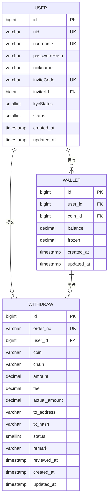
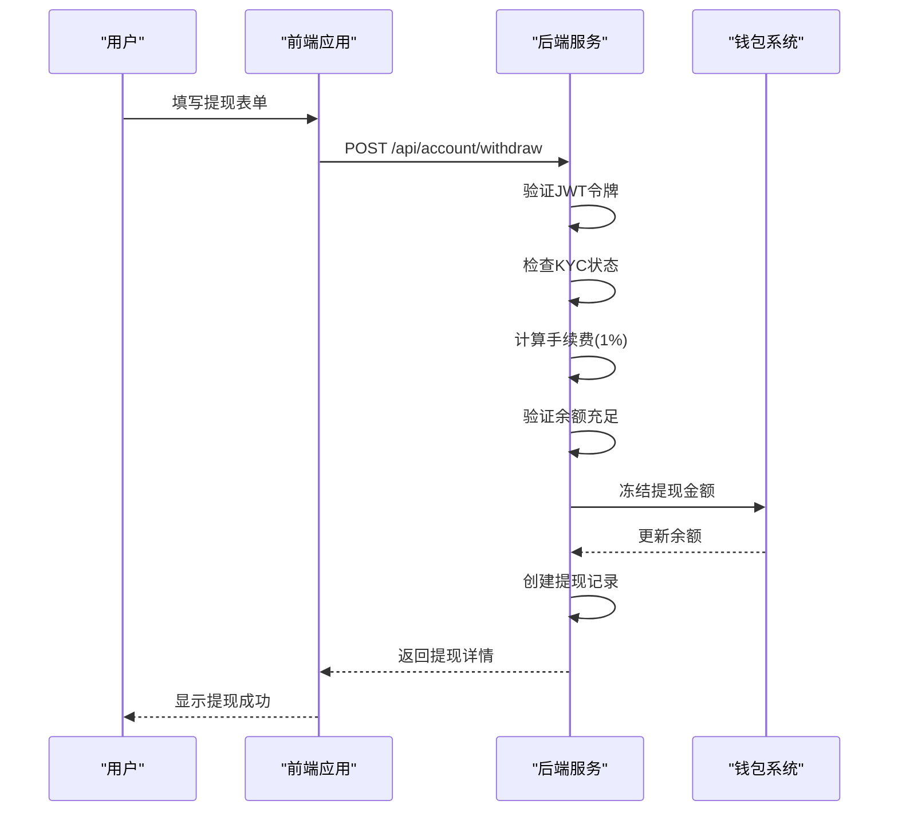
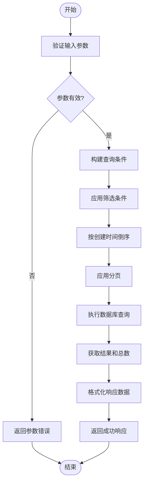
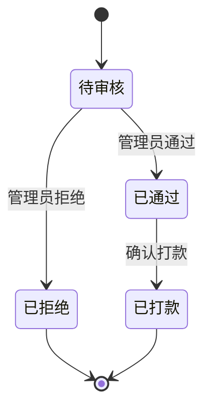
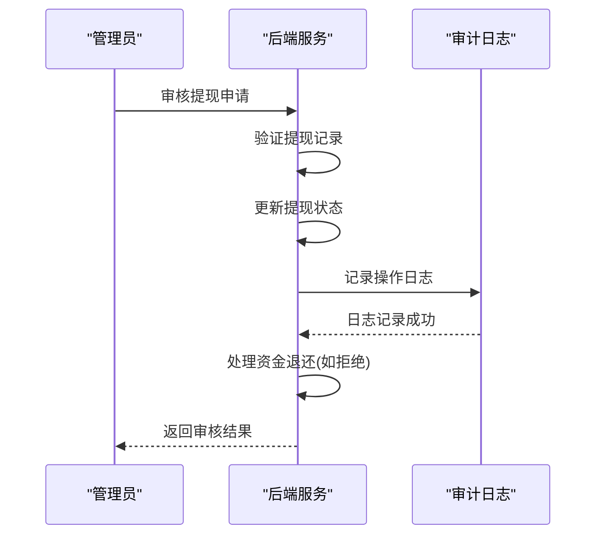

# 提现管理

<cite>
**本文档引用文件**   
- [withdraw.entity.ts](file://agx-backend/src/entities/withdraw.entity.ts)
- [account.service.ts](file://agx-backend/src/modules/account/account.service.ts)
- [account.controller.ts](file://agx-backend/src/modules/account/account.controller.ts)
- [admin.service.ts](file://agx-backend/src/modules/admin/admin.service.ts)
- [wallet.entity.ts](file://agx-backend/src/entities/wallet.entity.ts)
- [account.dto.ts](file://agx-backend/src/modules/account/account.dto.ts)
- [API_CONTRACT.md](file://agx-backend/API_CONTRACT.md)
- [withdraw.vue](file://agx-admin/src/views/agx/withdraw.vue)
</cite>

## 目录
1. [简介](#简介)
2. [核心功能](#核心功能)
3. [提现申请流程](#提现申请流程)
4. [提现历史查询](#提现历史查询)
5. [提现状态生命周期](#提现状态生命周期)
6. [风控校验与审计日志](#风控校验与审计日志)
7. [最佳实践](#最佳实践)
8. [错误处理与失败重试](#错误处理与失败重试)
9. [结论](#结论)

## 简介

提现管理功能是数字资产平台的核心模块之一，负责用户将资产从平台钱包提取到外部地址的全流程管理。本系统实现了完整的提现生命周期管理，包括提现申请、风控校验、余额冻结、管理员审核、打款确认和审计追踪。系统采用1%的固定手续费率，并通过余额冻结机制确保资金安全。提现状态包括待处理、处理中、成功和失败四种状态，支持分页查询历史记录和完整的审计日志。

**Section sources**
- [withdraw.entity.ts](file://agx-backend/src/entities/withdraw.entity.ts#L1-L63)
- [account.service.ts](file://agx-backend/src/modules/account/account.service.ts#L1-L606)

## 核心功能

提现管理模块包含两个主要API端点：`POST /api/account/withdraw`用于提交提现申请，`GET /api/account/withdraw/history`用于查询提现历史。系统通过`Withdraw`实体管理提现记录，包含订单号、币种、金额、手续费、实际到账金额、提现地址、交易哈希、状态等关键字段。钱包系统通过`balance`（可用余额）和`frozen`（冻结余额）两个字段实现余额管理，确保提现过程中的资金一致性。

**Diagram sources**
- [withdraw.entity.ts](file://agx-backend/src/entities/withdraw.entity.ts#L12-L63)
- [wallet.entity.ts](file://agx-backend/src/entities/wallet.entity.ts#L13-L42)
- [account.service.ts](file://agx-backend/src/modules/account/account.service.ts#L14-L31)

## 提现申请流程

### 提现申请端点

`POST /api/account/withdraw`端点处理用户的提现申请。用户需要提供币种、链网络、提现金额和目标地址。系统首先验证用户身份和KYC状态，然后检查钱包余额是否充足。提现金额的1%作为手续费，实际到账金额为提现金额减去手续费。系统生成唯一订单号并创建提现记录，同时冻结相应金额的余额。

**Diagram sources**
- [account.controller.ts](file://agx-backend/src/modules/account/account.controller.ts#L115-L119)
- [account.service.ts](file://agx-backend/src/modules/account/account.service.ts#L433-L492)
- [wallet.entity.ts](file://agx-backend/src/entities/wallet.entity.ts#L30-L34)

### 手续费计算与余额冻结

系统采用1%的固定手续费率。当用户申请提现时，系统计算手续费和实际到账金额：

- 手续费 = 提现金额 × 0.01
- 实际到账金额 = 提现金额 - 手续费

同时，系统执行余额冻结操作，确保资金安全：

1. 从可用余额中扣除提现金额
2. 将提现金额添加到冻结余额中
3. 保持总余额不变，但可用余额减少

这种机制防止了双花攻击，确保同一笔资金不会被重复提现。

**Section sources**
- [account.service.ts](file://agx-backend/src/modules/account/account.service.ts#L456-L483)
- [wallet.entity.ts](file://agx-backend/src/entities/wallet.entity.ts#L30-L34)

## 提现历史查询

### 分页查询实现

`GET /api/account/withdraw/history`端点支持分页查询用户的提现历史记录。系统使用标准的分页参数`page`和`pageSize`，默认每页20条记录。查询结果按创建时间倒序排列，确保最新的记录显示在最前面。系统支持按币种筛选，方便用户查看特定资产的提现历史。

**Diagram sources**
- [account.controller.ts](file://agx-backend/src/modules/account/account.controller.ts#L125-L129)
- [account.service.ts](file://agx-backend/src/modules/account/account.service.ts#L497-L528)

### 响应数据结构

提现历史查询返回标准化的响应结构，包含分页信息和提现记录列表。每条记录包含ID、订单号、币种、链网络、金额、手续费、实际到账金额、提现地址、状态和创建时间等关键信息。状态字段使用数字编码，前端负责转换为可读文本。

**Table sources**
- [API_CONTRACT.md](file://agx-backend/API_CONTRACT.md#L439-L440)

| 字段 | 类型 | 说明 |
|------|------|------|
| id | number | 提现记录ID |
| orderNo | string | 订单号 |
| coin | string | 币种代码 |
| chain | string | 链网络 |
| amount | string | 提现金额 |
| fee | string | 手续费 |
| actualAmount | string | 实际到账金额 |
| toAddress | string | 提现地址 |
| status | number | 状态码 |
| createdAt | string | 创建时间 |

## 提现状态生命周期

### 状态转换流程

提现记录有四种状态：待审核(0)、已通过(1)、已拒绝(2)和已打款(3)。状态转换遵循严格的流程，确保资金安全。初始状态为"待审核"，管理员审核后可以"通过"或"拒绝"。"通过"后状态变为"已通过"，等待打款确认。打款完成后状态变为"已打款"。

**Diagram sources**
- [withdraw.entity.ts](file://agx-backend/src/entities/withdraw.entity.ts#L48-L49)
- [admin.service.ts](file://agx-backend/src/modules/admin/admin.service.ts#L945-L1006)

### 状态管理实现

系统通过`status`字段管理提现状态，确保状态转换的原子性和一致性。管理员只能处理状态为"待审核"的提现申请，防止重复处理。状态变更时，系统记录审核时间和操作备注，并生成相应的审计日志。

**Section sources**
- [admin.service.ts](file://agx-backend/src/modules/admin/admin.service.ts#L951-L953)
- [withdraw.entity.ts](file://agx-backend/src/entities/withdraw.entity.ts#L48-L49)

## 风控校验与审计日志

### 风控校验机制

系统实施多层风控校验，确保提现安全：

1. **身份验证**：通过JWT令牌验证用户身份
2. **KYC校验**：用户必须完成实名认证才能提现
3. **余额校验**：检查可用余额是否充足
4. **状态校验**：防止重复处理已审核的提现申请

这些校验在提现申请和管理员审核两个阶段执行，形成双重保护。

**Section sources**
- [account.service.ts](file://agx-backend/src/modules/account/account.service.ts#L440-L461)
- [admin.service.ts](file://agx-backend/src/modules/admin/admin.service.ts#L951-L953)

### 审计日志记录

系统记录完整的审计日志，包括操作类型、操作人、操作结果和详细描述。当管理员审核提现申请时，系统记录操作日志，包含订单号、用户信息、金额和审核原因。拒绝提现时，系统还记录资产流水，退还冻结金额并更新钱包余额。

**Diagram sources**
- [admin.service.ts](file://agx-backend/src/modules/admin/admin.service.ts#L993-L1003)
- [account.service.ts](file://agx-backend/src/modules/account/account.service.ts#L977-L988)

## 最佳实践

### 防止双花攻击

为防止双花攻击，系统采用余额冻结机制。当用户提交提现申请时，系统立即冻结相应金额，确保同一笔资金不能被重复提现。冻结操作在数据库事务中执行，保证原子性。只有当提现被拒绝或成功完成后，冻结金额才会被释放或扣除。

### 应对网络拥堵

在区块链网络拥堵时，系统通过以下机制确保资金安全：

1. **交易哈希记录**：管理员打款后记录交易哈希，便于追踪
2. **状态机管理**：明确区分"已通过"和"已打款"状态
3. **人工复核**：支持管理员手动确认打款状态

### 钱包余额一致性

系统通过以下措施确保钱包余额一致性：

1. **精确计算**：使用`decimal`类型存储金额，避免浮点数精度问题
2. **事务处理**：关键操作在数据库事务中执行
3. **余额校验**：更新余额时检查负值，防止余额透支

**Section sources**
- [wallet.entity.ts](file://agx-backend/src/entities/wallet.entity.ts#L30-L34)
- [account.service.ts](file://agx-backend/src/modules/account/account.service.ts#L480-L483)
- [admin.service.ts](file://agx-backend/src/modules/admin/admin.service.ts#L970-L974)

## 错误处理与失败重试

### 错误码体系

系统采用统一的错误码体系，便于前端处理和用户提示。提现相关的错误码包括：

- 6001: 提现记录不存在
- 6002: 该提现订单已处理
- 6003: 钱包不存在
- 6004: 余额不足

这些错误码在`API_CONTRACT.md`中定义，前后端共同遵守。

**Table sources**
- [API_CONTRACT.md](file://agx-backend/API_CONTRACT.md#L410-L428)

### 失败重试机制

系统不自动重试失败的提现操作，而是通过状态机和人工干预处理异常情况。如果打款失败，管理员可以重新发起打款或拒绝申请。拒绝申请时，系统自动退还冻结金额到用户余额，确保资金安全。

**Section sources**
- [admin.service.ts](file://agx-backend/src/modules/admin/admin.service.ts#L964-L988)
- [API_CONTRACT.md](file://agx-backend/API_CONTRACT.md#L410-L428)

## 结论

提现管理功能通过严谨的状态机设计、余额冻结机制和多层风控校验，确保了数字资产提现的安全性和可靠性。系统实现了完整的提现生命周期管理，从申请、审核到打款确认，每个环节都有相应的审计日志。1%的手续费计算逻辑简单透明，分页查询功能提升了用户体验。对于高级开发者，系统提供了防止双花攻击、应对网络拥堵和确保钱包余额一致性的最佳实践，为构建安全可靠的数字资产平台奠定了坚实基础。