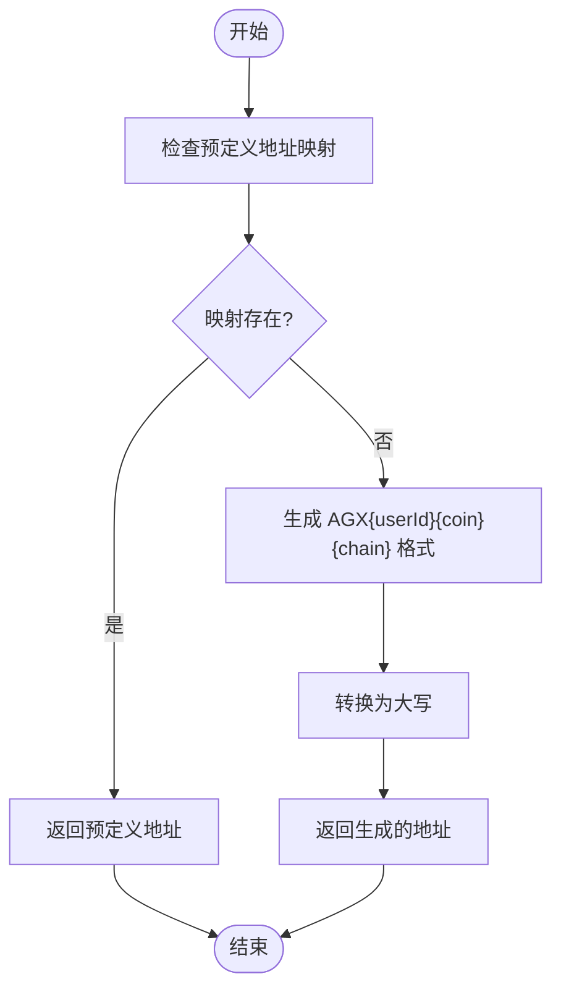
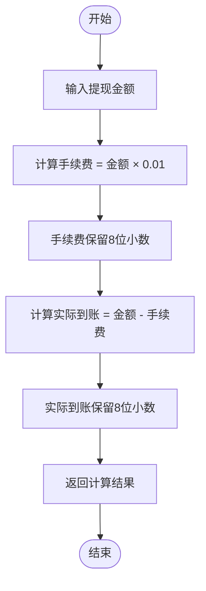
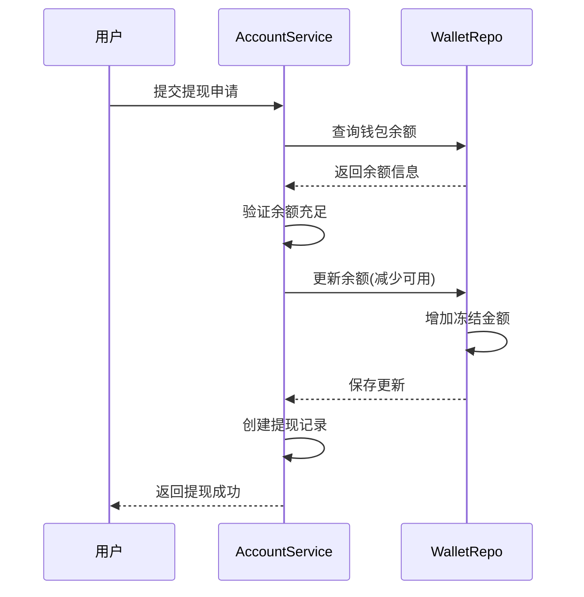
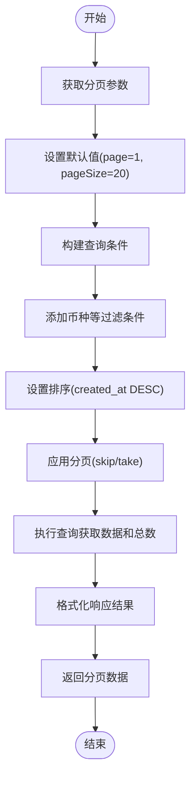
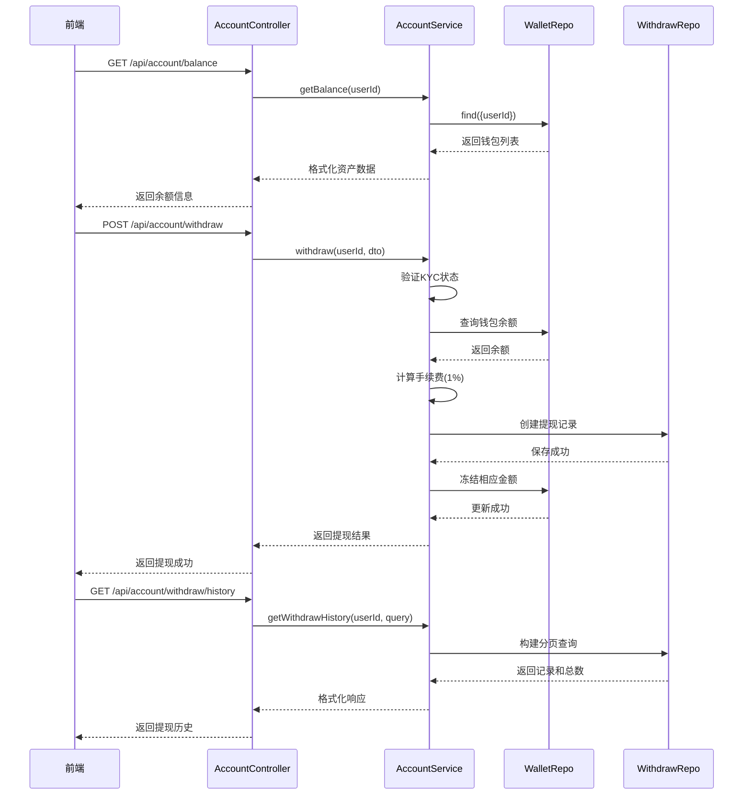
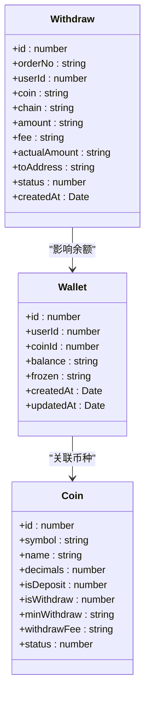

# 资金管理

<cite>
**本文档引用文件**   
- [account.controller.ts](file://agx-backend/src/modules/account/account.controller.ts)
- [account.service.ts](file://agx-backend/src/modules/account/account.service.ts)
- [account.dto.ts](file://agx-backend/src/modules/account/account.dto.ts)
- [wallet.entity.ts](file://agx-backend/src/entities/wallet.entity.ts)
- [recharge.entity.ts](file://agx-backend/src/entities/recharge.entity.ts)
- [withdraw.entity.ts](file://agx-backend/src/entities/withdraw.entity.ts)
- [coin.entity.ts](file://agx-backend/src/entities/coin.entity.ts)
- [schema.sql](file://agx-backend/schema.sql)
- [api.js](file://h5/src/utils/api.js)
- [Deposit.vue](file://h5/src/views/Deposit.vue)
- [Withdraw.vue](file://h5/src/views/Withdraw.vue)
</cite>

## 目录
1. [简介](#简介)
2. [核心API端点](#核心api端点)
3. [充值地址生成逻辑](#充值地址生成逻辑)
4. [提现手续费计算](#提现手续费计算)
5. [余额冻结机制](#余额冻结机制)
6. [分页查询实现](#分页查询实现)
7. [资金流转序列图](#资金流转序列图)
8. [高级最佳实践](#高级最佳实践)
9. [错误处理与响应](#错误处理与响应)
10. [前端集成示例](#前端集成示例)

## 简介
本API文档详细说明了账户服务中的资金管理功能，聚焦于充值、提现和余额查询等核心操作。系统实现了完整的资金流转闭环，包括充值地址生成、充值记录查询、余额实时查询、提现申请和提现记录查询等功能。所有资金操作均通过JWT认证保护，确保用户资金安全。

**Section sources**
- [account.controller.ts](file://agx-backend/src/modules/account/account.controller.ts#L8-L159)

## 核心API端点

### GET /api/account/balance - 查询余额
获取用户的资产余额信息。

**请求参数**
- 无请求参数

**响应格式**
```json
{
  "code": 0,
  "msg": "ok",
  "data": {
    "assets": [
      {
        "asset": "USDT",
        "name": "Tether USD",
        "free": "100.00",
        "locked": "50.00",
        "usdValue": "100.00",
        "icon": "https://..."
      }
    ]
  }
}
```

**Section sources**
- [account.controller.ts](file://agx-backend/src/modules/account/account.controller.ts#L41-L49)
- [account.service.ts](file://agx-backend/src/modules/account/account.service.ts#L233-L252)

### GET /api/account/deposit/address - 获取充值地址
根据指定币种和链网络获取用户的充值地址。

**请求参数**
- `coin` (string): 币种符号，如 "USDT"
- `chain` (string): 链网络，如 "TRC20"

**响应格式**
```json
{
  "code": 0,
  "msg": "ok",
  "data": {
    "coin": "USDT",
    "chain": "TRC20",
    "address": "TN3W4H6rK7qj6bX7d9bR3j6bX7d9bR3j6bX7",
    "minDeposit": "10",
    "confirmations": 20
  }
}
```

**Section sources**
- [account.controller.ts](file://agx-backend/src/modules/account/account.controller.ts#L91-L99)
- [account.service.ts](file://agx-backend/src/modules/account/account.service.ts#L371-L394)

### GET /api/account/deposit/history - 查询充值记录
获取用户的充值历史记录，支持分页查询。

**请求参数**
- `page` (number, 可选): 页码，默认为1
- `pageSize` (number, 可选): 每页数量，默认为20
- `coin` (string, 可选): 币种过滤

**响应格式**
```json
{
  "code": 0,
  "msg": "ok",
  "data": {
    "list": [
      {
        "id": 1,
        "orderNo": "D202401010001",
        "coin": "USDT",
        "chain": "TRC20",
        "amount": "100.00",
        "status": 1,
        "txHash": "0xabc...",
        "createdAt": "2024-01-01 12:00:00"
      }
    ],
    "total": 1
  }
}
```

**Section sources**
- [account.controller.ts](file://agx-backend/src/modules/account/account.controller.ts#L101-L109)
- [account.service.ts](file://agx-backend/src/modules/account/account.service.ts#L396-L428)

### POST /api/account/withdraw - 申请提现
提交提现申请，系统将验证KYC状态、余额充足性等条件。

**请求参数**
- `coin` (string): 提现币种
- `chain` (string): 提现链网络
- `amount` (string): 提现金额
- `address` (string): 提现地址
- `payPassword` (string, 可选): 支付密码

**响应格式**
```json
{
  "code": 0,
  "msg": "ok",
  "data": {
    "id": 1,
    "orderNo": "W202401010001",
    "amount": "100.00",
    "fee": "1.00",
    "actualAmount": "99.00"
  }
}
```

**Section sources**
- [account.controller.ts](file://agx-backend/src/modules/account/account.controller.ts#L111-L119)
- [account.service.ts](file://agx-backend/src/modules/account/account.service.ts#L430-L492)

### GET /api/account/withdraw/history - 查询提现记录
获取用户的提现历史记录，支持分页查询。

**请求参数**
- `page` (number, 可选): 页码，默认为1
- `pageSize` (number, 可选): 每页数量，默认为20
- `coin` (string, 可选): 币种过滤

**响应格式**
```json
{
  "code": 0,
  "msg": "ok",
  "data": {
    "list": [
      {
        "id": 1,
        "orderNo": "W202401010001",
        "coin": "USDT",
        "chain": "TRC20",
        "amount": "100.00",
        "fee": "1.00",
        "actualAmount": "99.00",
        "toAddress": "0xabc...",
        "status": 0,
        "txHash": null,
        "createdAt": "2024-01-01 12:00:00"
      }
    ],
    "total": 1
  }
}
```

**Section sources**
- [account.controller.ts](file://agx-backend/src/modules/account/account.controller.ts#L121-L129)
- [account.service.ts](file://agx-backend/src/modules/account/account.service.ts#L494-L529)

## 充值地址生成逻辑
系统根据用户ID、币种和链网络生成唯一的充值地址。地址生成遵循以下规则：

1. 首先检查预定义的地址映射表
2. 如果未找到匹配项，则生成格式为 `AGX{userId}{coin}{chain}` 的地址
3. 所有地址均转换为大写格式



**Diagram sources**
- [account.service.ts](file://agx-backend/src/modules/account/account.service.ts#L374-L394)

## 提现手续费计算
系统采用1%的固定费率计算提现手续费，具体计算逻辑如下：

- 手续费 = 提现金额 × 0.01
- 实际到账金额 = 提现金额 - 手续费
- 所有金额均保留8位小数精度



**Diagram sources**
- [account.service.ts](file://agx-backend/src/modules/account/account.service.ts#L456-L458)

## 余额冻结机制
为确保资金安全，在用户申请提现时，系统会立即冻结相应金额，防止双花攻击。

1. 检查用户钱包余额是否充足
2. 冻结提现金额：从可用余额转移到冻结余额
3. 创建提现记录
4. 当提现完成或取消时，解冻相应金额



**Diagram sources**
- [account.service.ts](file://agx-backend/src/modules/account/account.service.ts#L480-L483)

## 分页查询实现
所有历史记录查询均支持标准分页，实现方式如下：

- 默认页码：1
- 默认每页数量：20
- 按创建时间倒序排列
- 使用TypeORM的QueryBuilder构建分页查询



**Diagram sources**
- [account.service.ts](file://agx-backend/src/modules/account/account.service.ts#L400-L413)

## 资金流转序列图
以下序列图展示了用户资金流转的完整流程：



**Diagram sources**
- [account.controller.ts](file://agx-backend/src/modules/account/account.controller.ts)
- [account.service.ts](file://agx-backend/src/modules/account/account.service.ts)

## 高级最佳实践

### 防双花攻击策略
系统通过余额冻结机制有效防止双花攻击：

1. 在提现申请时立即冻结资金
2. 使用数据库事务确保余额更新的原子性
3. 冻结期间不允许对同一资金进行其他操作

### 提现风控策略
实施多层次的提现风控：

- KYC认证强制：未完成KYC的用户无法提现
- 余额验证：确保可用余额大于提现金额
- 最小提现限制：防止微额提现攻击
- IP记录：记录操作IP用于风险分析

### 钱包余额一致性保证
通过以下机制保证钱包余额一致性：

1. 使用数据库唯一索引确保用户-币种组合唯一
2. 所有余额更新操作使用事务处理
3. 冻结余额与可用余额总和等于账户总额
4. 定期对账确保数据一致性



**Diagram sources**
- [wallet.entity.ts](file://agx-backend/src/entities/wallet.entity.ts)
- [coin.entity.ts](file://agx-backend/src/entities/coin.entity.ts)
- [withdraw.entity.ts](file://agx-backend/src/entities/withdraw.entity.ts)

## 错误处理与响应
系统采用统一的错误响应格式，所有资金操作可能返回的错误码：

| 错误码 | 错误消息 | 说明 |
|--------|---------|------|
| 0 | ok | 操作成功 |
| 1002 | 请先登录 | 用户未登录或Token过期 |
| 2001 | 用户不存在 | 用户ID无效 |
| 6002 | 请先完成实名认证 | KYC未通过 |
| 6004 | 余额不足 | 可用余额小于提现金额 |

**Section sources**
- [api-response.dto.ts](file://agx-backend/src/common/dto/api-response.dto.ts)
- [business.exception.ts](file://agx-backend/src/common/filters/business.exception.ts)

## 前端集成示例
前端通过封装的API工具类调用资金管理接口：

```javascript
// 获取余额
const getBalance = async () => {
  const response = await api.account.balance();
  if (response.success) {
    console.log('余额:', response.data.assets);
  }
};

// 申请提现
const withdraw = async (data) => {
  const response = await api.account.withdraw(data);
  if (response.success) {
    console.log('提现成功:', response.data);
  } else {
    console.error('提现失败:', response.message);
  }
};
```

**Section sources**
- [api.js](file://h5/src/utils/api.js#L87-L96)
- [Withdraw.vue](file://h5/src/views/Withdraw.vue)