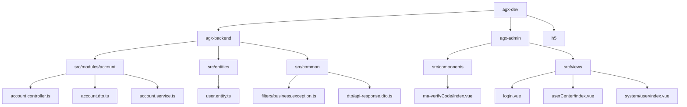
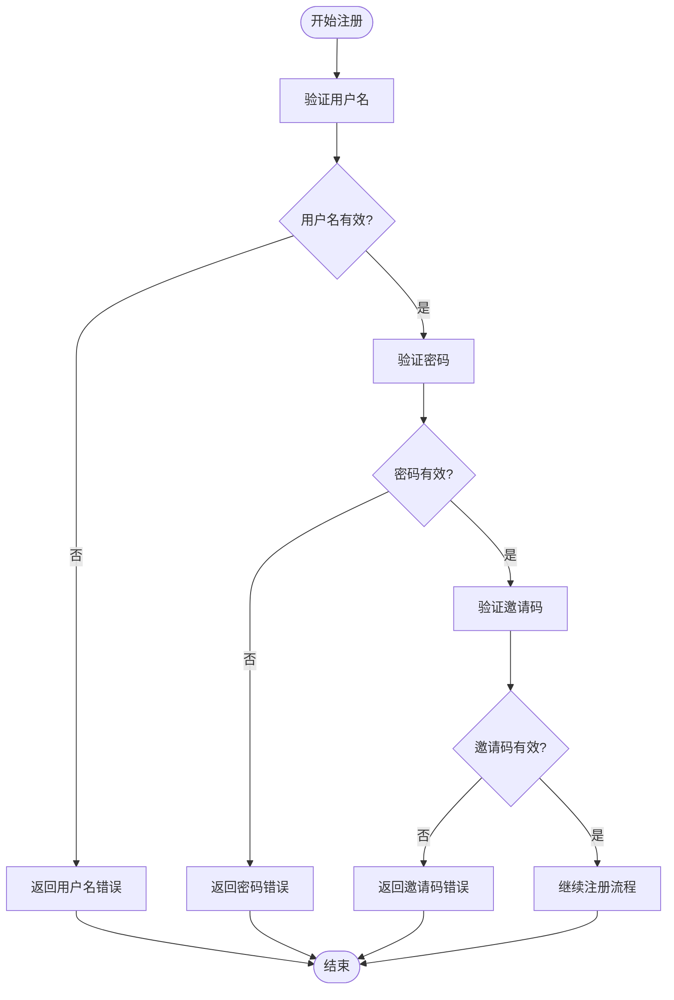
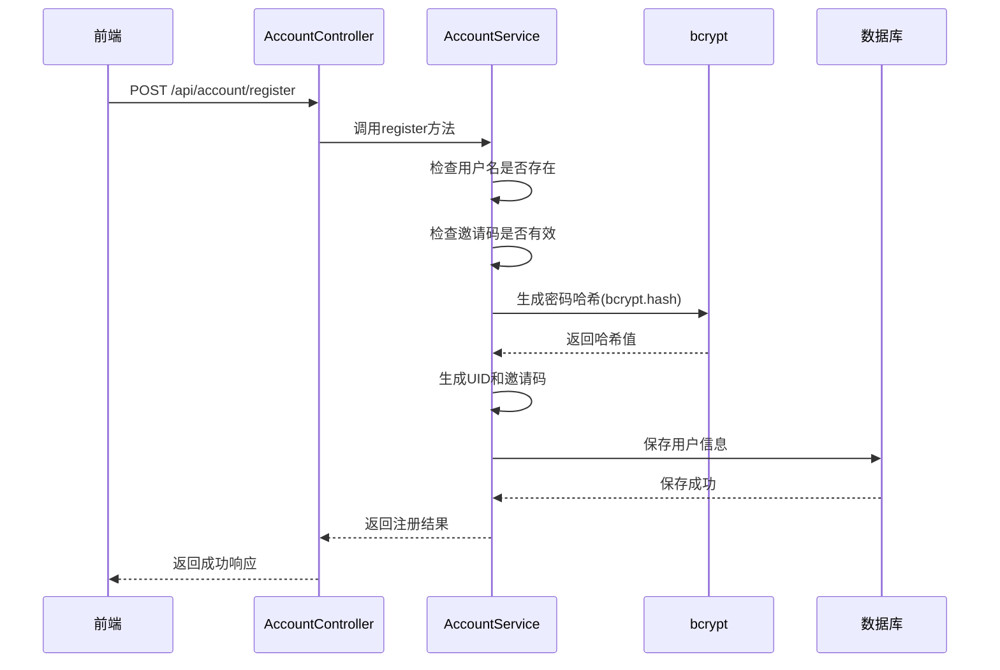
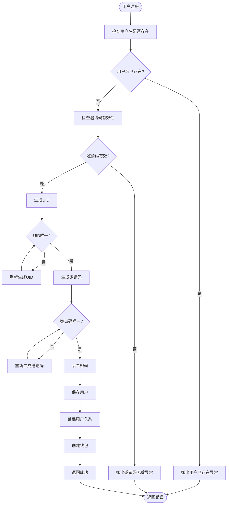
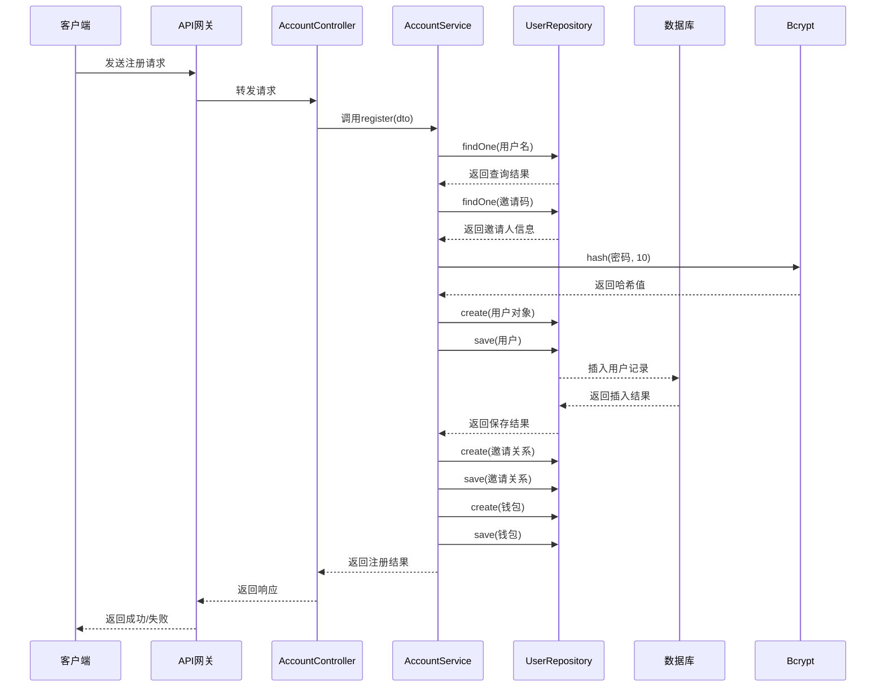
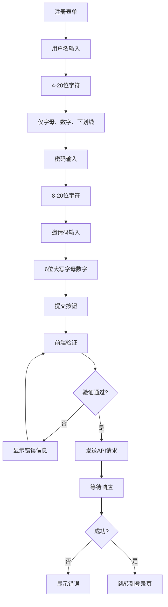
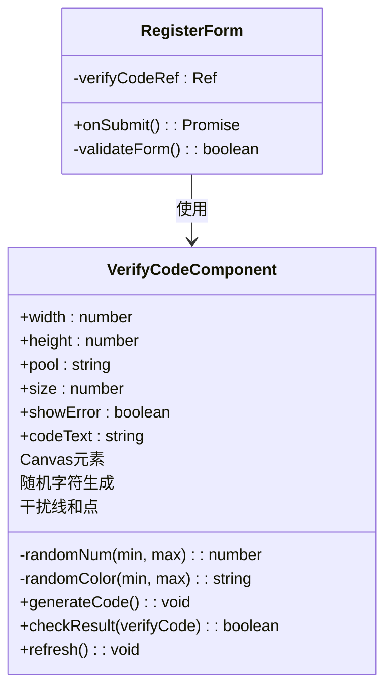

# 注册管理

<cite>
**本文档引用的文件**  
- [account.controller.ts](file://agx-backend/src/modules/account/account.controller.ts)
- [account.dto.ts](file://agx-backend/src/modules/account/account.dto.ts)
- [account.service.ts](file://agx-backend/src/modules/account/account.service.ts)
- [user.entity.ts](file://agx-backend/src/entities/user.entity.ts)
- [business.exception.ts](file://agx-backend/src/common/filters/business.exception.ts)
- [api-response.dto.ts](file://agx-backend/src/common/dto/api-response.dto.ts)
- [ma-verifyCode/index.vue](file://agx-admin/src/components/ma-verifyCode/index.vue)
</cite>

## 目录
1. [项目结构](#项目结构)
2. [核心组件](#核心组件)
3. [注册数据验证规则](#注册数据验证规则)
4. [密码加密存储流程](#密码加密存储流程)
5. [用户创建异常处理](#用户创建异常处理)
6. [注册流程时序图](#注册流程时序图)
7. [前端表单验证示例](#前端表单验证示例)
8. [验证码集成方案](#验证码集成方案)
9. [用户数据隐私保护](#用户数据隐私保护)

## 项目结构



**Diagram sources**
- [account.controller.ts](file://agx-backend/src/modules/account/account.controller.ts)
- [account.dto.ts](file://agx-backend/src/modules/account/account.dto.ts)
- [account.service.ts](file://agx-backend/src/modules/account/account.service.ts)
- [user.entity.ts](file://agx-backend/src/entities/user.entity.ts)
- [business.exception.ts](file://agx-backend/src/common/filters/business.exception.ts)
- [api-response.dto.ts](file://agx-backend/src/common/dto/api-response.dto.ts)
- [ma-verifyCode/index.vue](file://agx-admin/src/components/ma-verifyCode/index.vue)

**Section sources**
- [account.controller.ts](file://agx-backend/src/modules/account/account.controller.ts)
- [account.dto.ts](file://agx-backend/src/modules/account/account.dto.ts)
- [account.service.ts](file://agx-backend/src/modules/account/account.service.ts)
- [user.entity.ts](file://agx-backend/src/entities/user.entity.ts)
- [business.exception.ts](file://agx-backend/src/common/filters/business.exception.ts)
- [api-response.dto.ts](file://agx-backend/src/common/dto/api-response.dto.ts)
- [ma-verifyCode/index.vue](file://agx-admin/src/components/ma-verifyCode/index.vue)

## 核心组件

账户注册功能的核心组件包括控制器、数据传输对象、服务类和实体类。控制器负责处理HTTP请求，数据传输对象定义请求参数结构，服务类实现业务逻辑，实体类映射数据库表结构。

**Section sources**
- [account.controller.ts](file://agx-backend/src/modules/account/account.controller.ts)
- [account.dto.ts](file://agx-backend/src/modules/account/account.dto.ts)
- [account.service.ts](file://agx-backend/src/modules/account/account.service.ts)
- [user.entity.ts](file://agx-backend/src/entities/user.entity.ts)

## 注册数据验证规则

注册功能通过`RegisterDto`类定义数据验证规则，确保用户输入符合系统要求。验证规则包括用户名、密码和邀请码的格式要求。



**Diagram sources**
- [account.dto.ts](file://agx-backend/src/modules/account/account.dto.ts#L3-L16)

**Section sources**
- [account.dto.ts](file://agx-backend/src/modules/account/account.dto.ts#L3-L16)

## 密码加密存储流程

系统使用bcrypt哈希算法对用户密码进行加密存储，确保密码安全。bcrypt是一种自适应哈希函数，具有盐值生成和计算成本控制特性。



**Diagram sources**
- [account.service.ts](file://agx-backend/src/modules/account/account.service.ts#L94-L108)
- [user.entity.ts](file://agx-backend/src/entities/user.entity.ts#L24)

**Section sources**
- [account.service.ts](file://agx-backend/src/modules/account/account.service.ts#L94-L108)
- [user.entity.ts](file://agx-backend/src/entities/user.entity.ts#L24)

## 用户创建异常处理

系统在用户创建过程中实现了完善的异常处理机制，能够识别和处理各种异常情况，如用户名重复、邀请码无效等。



**Diagram sources**
- [account.service.ts](file://agx-backend/src/modules/account/account.service.ts#L65-L93)
- [business.exception.ts](file://agx-backend/src/common/filters/business.exception.ts#L36-L42)

**Section sources**
- [account.service.ts](file://agx-backend/src/modules/account/account.service.ts#L65-L93)
- [business.exception.ts](file://agx-backend/src/common/filters/business.exception.ts#L36-L42)

## 注册流程时序图

完整的注册流程时序图展示了从前端请求到后端处理再到数据库存储的完整流程。



**Diagram sources**
- [account.controller.ts](file://agx-backend/src/modules/account/account.controller.ts#L16-L19)
- [account.service.ts](file://agx-backend/src/modules/account/account.service.ts#L65-L151)
- [user.entity.ts](file://agx-backend/src/entities/user.entity.ts)

**Section sources**
- [account.controller.ts](file://agx-backend/src/modules/account/account.controller.ts#L16-L19)
- [account.service.ts](file://agx-backend/src/modules/account/account.service.ts#L65-L151)

## 前端表单验证示例

为初学者提供的前端表单验证示例代码，展示了如何在前端实现基本的表单验证。



**Diagram sources**
- [account.dto.ts](file://agx-backend/src/modules/account/account.dto.ts#L3-L16)

**Section sources**
- [account.dto.ts](file://agx-backend/src/modules/account/account.dto.ts#L3-L16)

## 验证码集成方案

为高级开发者提供的验证码集成方案，用于防止机器人注册。



**Diagram sources**
- [ma-verifyCode/index.vue](file://agx-admin/src/components/ma-verifyCode/index.vue)

**Section sources**
- [ma-verifyCode/index.vue](file://agx-admin/src/components/ma-verifyCode/index.vue)

## 用户数据隐私保护

系统实施了多项用户数据隐私保护措施，确保用户信息安全。

```mermaid
flowchart TD
A[用户数据] --> B[传输层]
B --> C[HTTPS加密]
C --> D[存储层]
D --> E[密码哈希(bcrypt)]
E --> F[数据库]
F --> G[敏感数据脱敏]
G --> H[日志记录]
H --> I[IP地址匿名化]
I --> J[访问控制]
J --> K[JWT认证]
K --> L[权限验证]
L --> M[审计日志]
subgraph "安全措施"
C
E
G
I
K
M
end
```

**Diagram sources**
- [account.service.ts](file://agx-backend/src/modules/account/account.service.ts#L94)
- [jwt.strategy.ts](file://agx-backend/src/modules/auth/jwt.strategy.ts)
- [user.entity.ts](file://agx-backend/src/entities/user.entity.ts#L316)

**Section sources**
- [account.service.ts](file://agx-backend/src/modules/account/account.service.ts#L94)
- [jwt.strategy.ts](file://agx-backend/src/modules/auth/jwt.strategy.ts)
- [user.entity.ts](file://agx-backend/src/entities/user.entity.ts#L316)