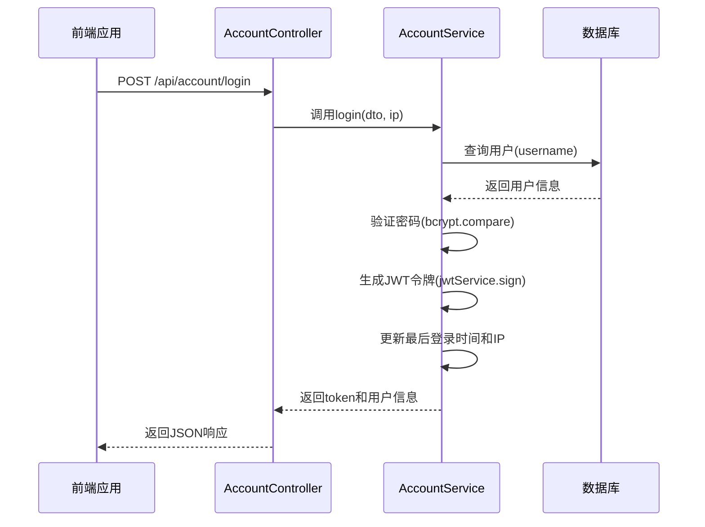
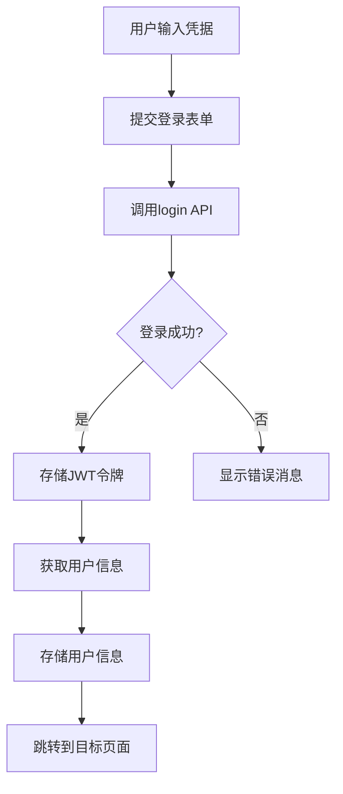
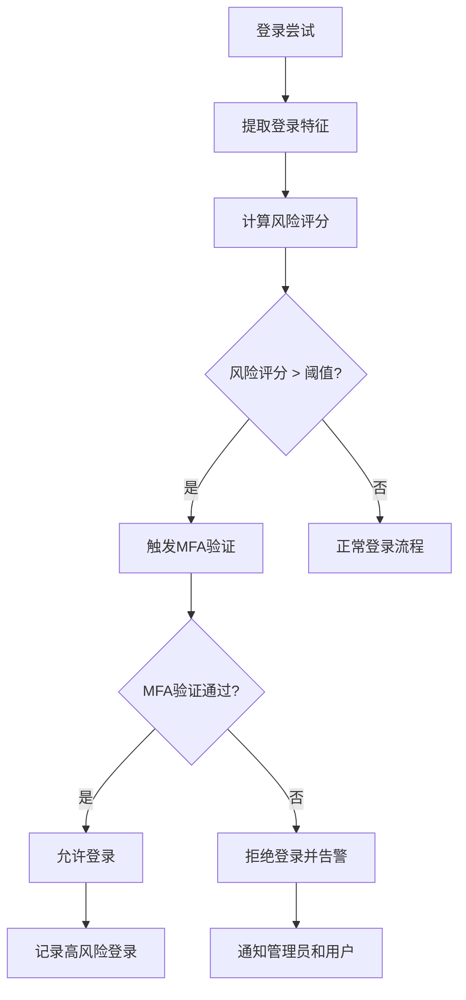
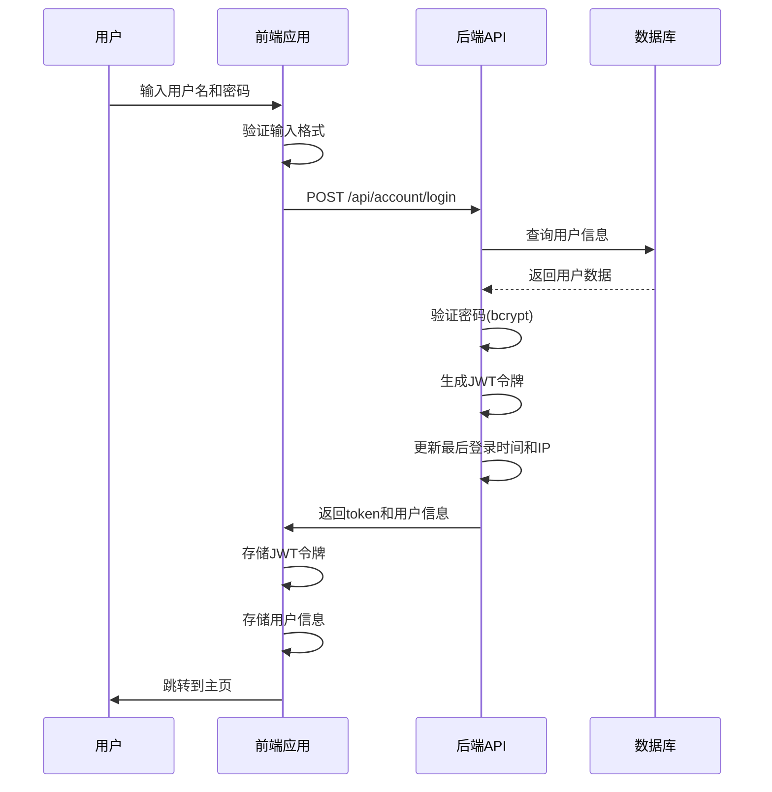

# 登录管理

<cite>
**本文档引用文件**   
- [account.controller.ts](file://agx-backend/src/modules/account/account.controller.ts)
- [account.dto.ts](file://agx-backend/src/modules/account/account.dto.ts)
- [account.service.ts](file://agx-backend/src/modules/account/account.service.ts)
- [jwt.strategy.ts](file://agx-backend/src/modules/auth/jwt.strategy.ts)
- [auth.module.ts](file://agx-backend/src/modules/auth/auth.module.ts)
- [login.vue](file://agx-admin/src/views/login.vue)
- [login.js](file://agx-admin/src/api/login.js)
- [user.js](file://agx-admin/src/store/modules/user.js)
- [API_CONTRACT.md](file://agx-backend/API_CONTRACT.md)
</cite>

## 目录
1. [简介](#简介)
2. [登录端点实现](#登录端点实现)
3. [LoginDto验证逻辑](#logindto验证逻辑)
4. [JWT令牌生成与结构](#jwt令牌生成与结构)
5. [登录响应结构](#登录响应结构)
6. [JWT令牌刷新与过期策略](#jwt令牌刷新与过期策略)
7. [安全性考虑](#安全性考虑)
8. [前端登录状态管理示例](#前端登录状态管理示例)
9. [安全增强方案](#安全增强方案)
10. [登录流程序列图](#登录流程序列图)

## 简介
本文档详细说明了AGX系统中用户登录功能的实现，重点聚焦于`POST /api/account/login`端点。文档涵盖了从请求验证、JWT令牌生成到响应结构的完整流程，并提供了安全性考虑和增强方案。系统采用NestJS后端框架和Vue3前端框架，通过JWT实现无状态认证。

## 登录端点实现
登录功能由后端`AccountController`中的`login`方法处理，该方法接收用户名和密码进行认证，并返回JWT令牌和用户信息。



**Diagram sources**
- [account.controller.ts](file://agx-backend/src/modules/account/account.controller.ts#L25-L29)
- [account.service.ts](file://agx-backend/src/modules/account/account.service.ts#L156-L198)

**Section sources**
- [account.controller.ts](file://agx-backend/src/modules/account/account.controller.ts#L25-L29)
- [account.service.ts](file://agx-backend/src/modules/account/account.service.ts#L156-L198)

## LoginDto验证逻辑
`LoginDto`类使用`class-validator`库定义了登录请求的验证规则，确保输入数据的完整性和安全性。

| 字段 | 验证规则 | 错误消息 |
|------|---------|---------|
| username | 必须是字符串，长度4-50位 | 无特定消息，使用默认验证 |
| password | 必须是字符串，长度8-20位 | 无特定消息，使用默认验证 |

```typescript
export class LoginDto {
  @IsString()
  @Length(4, 50)
  username: string;

  @IsString()
  @Length(8, 20)
  password: string;
}
```

验证逻辑在NestJS框架层面自动执行，如果请求数据不符合规则，系统会返回400错误。

**Section sources**
- [account.dto.ts](file://agx-backend/src/modules/account/account.dto.ts#L18-L25)

## JWT令牌生成与结构
成功登录后，系统使用`@nestjs/jwt`包生成JWT令牌，令牌包含用户身份的关键声明信息。

### JWT有效载荷结构
```typescript
export interface JwtPayload {
  sub: number;      // 用户ID
  uid: string;      // 用户UID
  username: string; // 用户名
  type: 'user' | 'admin'; // 用户类型
}
```

### JWT配置
JWT的生成配置在`AuthModule`中定义，包括密钥和过期时间：

```typescript
JwtModule.registerAsync({
  useFactory: async (configService: ConfigService) => ({
    secret: configService.get<string>('JWT_SECRET'),
    signOptions: {
      expiresIn: configService.get<string>('JWT_EXPIRES_IN', '7d'),
    },
  }),
  inject: [ConfigService],
})
```

**Section sources**
- [jwt.strategy.ts](file://agx-backend/src/modules/auth/jwt.strategy.ts#L6-L11)
- [auth.module.ts](file://agx-backend/src/modules/auth/auth.module.ts#L11-L17)

## 登录响应结构
登录成功后，API返回标准化的JSON响应，包含JWT令牌和用户基本信息。

### 响应示例
```json
{
  "code": 0,
  "msg": "ok",
  "data": {
    "token": "eyJhbGciOiJIUzI1NiIsInR5cCI6IkpXVCJ9...",
    "user": {
      "id": 1,
      "uid": "10000001",
      "username": "user001",
      "nickname": "用户昵称",
      "avatar": null,
      "inviteCode": "XYZ789",
      "createdAt": "2024-01-01 12:00:00"
    }
  }
}
```

### 响应字段说明
| 字段 | 类型 | 说明 |
|------|------|------|
| code | number | 响应码，0表示成功 |
| msg | string | 响应消息 |
| data | object | 响应数据 |
| data.token | string | JWT令牌 |
| data.user.id | number | 用户ID |
| data.user.uid | string | 用户UID |
| data.user.username | string | 用户名 |
| data.user.nickname | string | 用户昵称 |
| data.user.avatar | string/null | 用户头像URL |
| data.user.inviteCode | string | 邀请码 |
| data.user.createdAt | string | 创建时间 |

**Section sources**
- [API_CONTRACT.md](file://agx-backend/API_CONTRACT.md#L124-L140)
- [account.service.ts](file://agx-backend/src/modules/account/account.service.ts#L187-L198)

## JWT令牌刷新与过期策略
系统实现了标准的JWT过期策略，但未实现自动刷新机制，需要前端在令牌即将过期时重新登录。

### 过期配置
- **默认过期时间**：7天（由`JWT_EXPIRES_IN`环境变量控制）
- **过期检查**：在`JwtStrategy`中设置`ignoreExpiration: false`，确保过期令牌被拒绝

### 刷新机制
当前系统未实现JWT刷新令牌（refresh token）机制。当令牌过期后，用户需要重新执行完整的登录流程。

```typescript
// JWT策略配置中明确检查过期时间
super({
  jwtFromRequest: ExtractJwt.fromAuthHeaderAsBearerToken(),
  ignoreExpiration: false, // 不忽略过期时间
  secretOrKey: configService.get<string>('JWT_SECRET'),
});
```

**Section sources**
- [auth.module.ts](file://agx-backend/src/modules/auth/auth.module.ts#L15-L16)
- [jwt.strategy.ts](file://agx-backend/src/modules/auth/jwt.strategy.ts#L18)

## 安全性考虑
系统在多个层面实施了安全措施，确保登录功能的安全性。

### 传输安全
- **HTTPS要求**：生产环境中必须通过HTTPS传输，防止令牌在传输过程中被窃取
- **敏感信息保护**：密码在数据库中使用bcrypt哈希存储，永不以明文形式传输或存储

### 令牌安全
- **Bearer认证**：JWT通过Authorization头以Bearer模式传输
- **服务端验证**：每个受保护的端点都使用`JwtAuthGuard`验证令牌的有效性

### 输入验证
- **DTO验证**：使用`class-validator`对输入进行严格验证
- **SQL注入防护**：使用TypeORM查询构建器，防止SQL注入攻击

### 密码安全
- **哈希算法**：使用bcrypt算法对密码进行哈希，盐值成本因子为10
- **密码强度**：要求密码长度8-20位，增强密码安全性

**Section sources**
- [account.service.ts](file://agx-backend/src/modules/account/account.service.ts#L168)
- [jwt.strategy.ts](file://agx-backend/src/modules/auth/jwt.strategy.ts#L17)
- [account.dto.ts](file://agx-backend/src/modules/account/account.dto.ts#L23-L24)

## 前端登录状态管理示例
前端使用Pinia状态管理库来管理登录状态和用户信息。

### 登录流程


### 关键代码实现
```javascript
// 存储令牌
setToken(token) {
  tool.local.set(import.meta.env.VITE_APP_TOKEN_PREFIX, token)
}

// 获取令牌
getToken() {
  return tool.local.get(import.meta.env.VITE_APP_TOKEN_PREFIX)
}

// 登录方法
login(form) {
  return loginApi.login(form).then(r => {
    if (r.code === 0 && r.data?.token) {
      this.setToken(r.data.token)
      return true
    } else {
      return false
    }
  })
}
```

**Section sources**
- [user.js](file://agx-admin/src/store/modules/user.js#L27-L37)
- [user.js](file://agx-admin/src/store/modules/user.js#L72-L87)

## 安全增强方案
为提高系统安全性，建议实现以下增强方案：

### 多设备登录管理
- **设备标识**：在JWT中添加设备标识符（device_id）
- **登录会话**：在数据库中维护用户的活跃登录会话
- **会话管理**：提供接口让用户查看和管理自己的登录会话
- **异地登录强制下线**：检测到异地登录时，自动使其他设备的会话失效

### 登录IP追踪
- **IP记录**：记录每次登录的IP地址和地理位置
- **IP分析**：分析登录IP模式，识别异常登录行为
- **可信IP**：允许用户设置可信IP地址范围
- **登录地图**：为管理员提供可视化的登录地理分布

### 异常登录告警
- **风险评分**：基于IP、设备、时间等因素计算登录风险评分
- **多因素认证**：高风险登录时要求二次验证
- **实时通知**：通过邮件或短信通知用户新设备登录
- **自动锁定**：连续失败登录后自动锁定账户一段时间



**Section sources**
- [account.controller.ts](file://agx-backend/src/modules/account/account.controller.ts#L26-L28)
- [account.service.ts](file://agx-backend/src/modules/account/account.service.ts#L173-L176)

## 登录流程序列图
以下是完整的登录流程序列图，展示了从用户输入到成功登录的完整过程。



**Diagram sources**
- [account.controller.ts](file://agx-backend/src/modules/account/account.controller.ts#L25-L29)
- [account.service.ts](file://agx-backend/src/modules/account/account.service.ts#L156-L198)
- [user.js](file://agx-admin/src/store/modules/user.js#L72-L87)