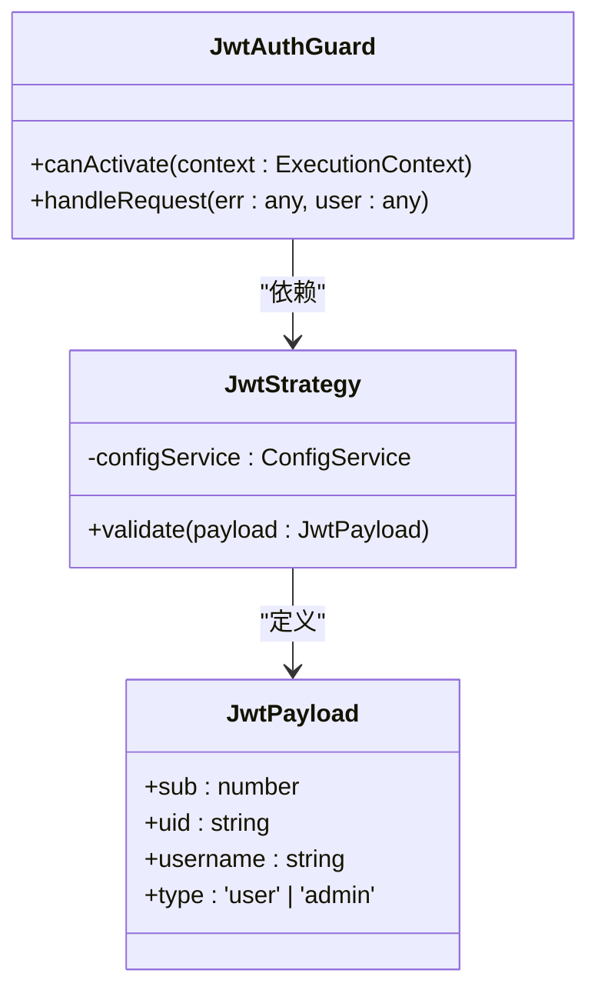
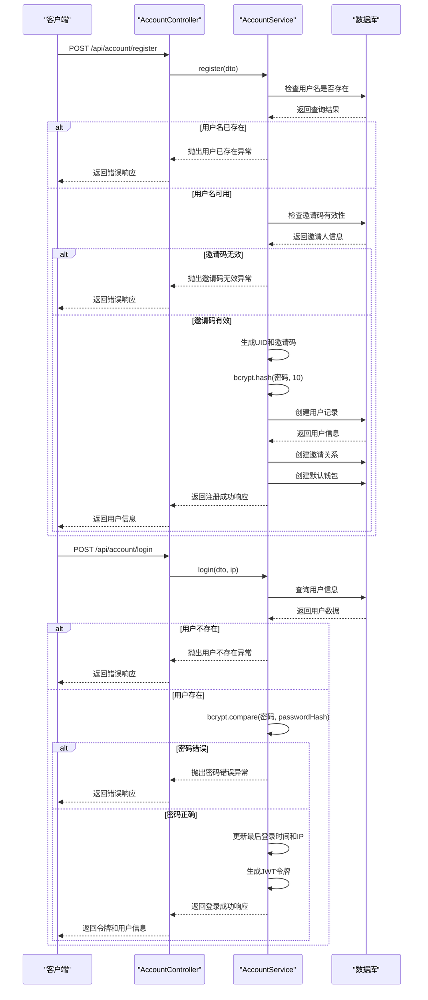
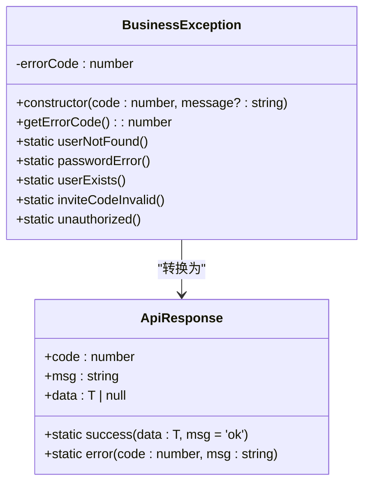

# 身份认证

<cite>
**本文档引用文件**  
- [account.controller.ts](file://agx-backend/src/modules/account/account.controller.ts)
- [account.service.ts](file://agx-backend/src/modules/account/account.service.ts)
- [account.dto.ts](file://agx-backend/src/modules/account/account.dto.ts)
- [jwt-auth.guard.ts](file://agx-backend/src/modules/auth/jwt-auth.guard.ts)
- [jwt.strategy.ts](file://agx-backend/src/modules/auth/jwt.strategy.ts)
- [user.entity.ts](file://agx-backend/src/entities/user.entity.ts)
- [api-response.dto.ts](file://agx-backend/src/common/dto/api-response.dto.ts)
- [business.exception.ts](file://agx-backend/src/common/filters/business.exception.ts)
</cite>

## 目录
1. [简介](#简介)
2. [API端点说明](#api端点说明)
3. [数据传输对象(DTO)定义](#数据传输对象dto定义)
4. [密码加密实现](#密码加密实现)
5. [JWT令牌机制](#jwt令牌机制)
6. [登录IP记录与安全](#登录ip记录与安全)
7. [用户注册登录流程](#用户注册登录流程)
8. [安全最佳实践](#安全最佳实践)
9. [错误处理](#错误处理)

## 简介

本文档详细说明了AGX系统中账户服务的身份认证API，重点关注用户注册和登录功能。文档涵盖了POST /api/account/register和POST /api/account/login端点的HTTP方法、请求路径、请求参数和响应格式。同时解释了密码加密（bcrypt）的实现方式、JWT令牌的生成与验证机制，以及登录IP记录的安全考虑。为初学者提供了用户注册登录流程的序列图，为高级开发者提供了防止暴力破解、账号锁定策略和密码安全最佳实践。

**Section sources**
- [account.controller.ts](file://agx-backend/src/modules/account/account.controller.ts#L8-L159)

## API端点说明

### 用户注册端点
- **HTTP方法**: POST
- **请求路径**: /api/account/register
- **功能描述**: 创建新用户账户
- **认证要求**: 无需认证

### 用户登录端点
- **HTTP方法**: POST
- **请求路径**: /api/account/login
- **功能描述**: 验证用户凭据并生成访问令牌
- **认证要求**: 无需认证

**Section sources**
- [account.controller.ts](file://agx-backend/src/modules/account/account.controller.ts#L16-L29)

## 数据传输对象(DTO)定义

### RegisterDto（注册数据传输对象）
用于用户注册请求的数据结构：

| 字段名 | 类型 | 约束条件 | 描述 |
|-------|------|---------|------|
| username | string | 长度4-20位，仅允许字母、数字、下划线 | 用户名 |
| password | string | 长度8-20位 | 密码 |
| inviteCode | string | 必须是6位 | 邀请码 |

### LoginDto（登录数据传输对象）
用于用户登录请求的数据结构：

| 字段名 | 类型 | 约束条件 | 描述 |
|-------|------|---------|------|
| username | string | 长度4-50位 | 用户名 |
| password | string | 长度8-20位 | 密码 |

**Section sources**
- [account.dto.ts](file://agx-backend/src/modules/account/account.dto.ts#L3-L26)

## 密码加密实现

系统使用bcryptjs库对用户密码进行加密存储，确保用户密码安全。

### 加密参数
- **盐值轮数**: 10轮
- **加密算法**: bcrypt

### 实现代码逻辑
1. 用户注册时，系统调用`bcrypt.hash(dto.password, 10)`对明文密码进行哈希
2. 生成的密码哈希值存储在数据库的`password_hash`字段中
3. 用户登录时，系统使用`bcrypt.compare(dto.password, user.passwordHash)`验证密码

这种加密方式具有以下优势：
- 加盐处理防止彩虹表攻击
- 自适应哈希计算，可调整计算强度
- 单向加密，无法从哈希值反推原始密码

**Section sources**
- [account.service.ts](file://agx-backend/src/modules/account/account.service.ts#L95-L96)
- [account.service.ts](file://agx-backend/src/modules/account/account.service.ts#L168-L169)

## JWT令牌机制

系统采用JWT（JSON Web Token）进行身份验证和授权管理。

### JWT策略实现


**Diagram sources**
- [jwt.strategy.ts](file://agx-backend/src/modules/auth/jwt.strategy.ts#L6-L11)
- [jwt-auth.guard.ts](file://agx-backend/src/modules/auth/jwt-auth.guard.ts#L5-L17)

### 令牌生成流程
1. 用户成功登录后，系统创建JWT有效载荷(Payload)
2. 有效载荷包含用户ID、UID、用户名和用户类型
3. 使用JWT_SECRET密钥签名生成令牌
4. 令牌通过HTTP响应返回给客户端

### 令牌验证流程
1. 客户端在后续请求中通过Authorization头发送Bearer令牌
2. JwtAuthGuard守卫拦截请求
3. 系统验证令牌签名和有效期
4. 验证通过后，将用户信息注入请求上下文

**Section sources**
- [account.service.ts](file://agx-backend/src/modules/account/account.service.ts#L179-L185)
- [jwt.strategy.ts](file://agx-backend/src/modules/auth/jwt.strategy.ts#L13-L31)
- [jwt-auth.guard.ts](file://agx-backend/src/modules/auth/jwt-auth.guard.ts#L5-L17)

## 登录IP记录与安全

系统记录用户的登录IP地址，增强账户安全性和审计能力。

### IP记录实现
- 从请求对象中获取客户端IP：`req.ip || req.socket.remoteAddress`
- 在用户成功登录后，更新数据库中的`lastLoginIp`字段
- 同时更新`lastLoginAt`（最后登录时间）

### 安全考虑
1. **IP记录用途**:
   - 异常登录检测
   - 用户行为分析
   - 安全审计追踪
   - 风险控制决策

2. **隐私保护**:
   - IP地址作为敏感信息妥善存储
   - 仅授权人员可访问登录日志
   - 符合数据保护法规要求

**Section sources**
- [account.controller.ts](file://agx-backend/src/modules/account/account.controller.ts#L27-L28)
- [account.service.ts](file://agx-backend/src/modules/account/account.service.ts#L174-L176)

## 用户注册登录流程



**Diagram sources**
- [account.controller.ts](file://agx-backend/src/modules/account/account.controller.ts#L16-L29)
- [account.service.ts](file://agx-backend/src/modules/account/account.service.ts#L65-L198)

## 安全最佳实践

### 防止暴力破解
1. **密码复杂度要求**:
   - 最小长度：8位
   - 必须包含大小写字母、数字
   - 建议包含特殊字符

2. **账户锁定策略**:
   - 连续失败登录尝试达到阈值后锁定账户
   - 锁定时间随失败次数递增
   - 管理员可手动解锁

3. **速率限制**:
   - 对登录接口实施请求频率限制
   - 基于IP地址和用户名的双重限制

### 密码安全建议
1. **密码策略**:
   - 禁止使用常见弱密码
   - 定期强制密码更新
   - 禁止密码重复使用

2. **传输安全**:
   - 所有认证请求必须通过HTTPS
   - JWT令牌通过安全的HTTP头传输
   - 前端密码输入采用安全的输入控件

3. **存储安全**:
   - 密码必须加密存储，永不存储明文
   - 使用强哈希算法（bcrypt）
   - 定期评估加密算法强度

**Section sources**
- [account.dto.ts](file://agx-backend/src/modules/account/account.dto.ts#L10-L11)
- [account.service.ts](file://agx-backend/src/modules/account/account.service.ts#L70-L71)
- [account.service.ts](file://agx-backend/src/modules/account/account.service.ts#L160-L161)

## 错误处理

系统采用统一的错误响应格式，便于客户端处理。

### 统一响应格式
```typescript
{
  code: number,
  msg: string,
  data: T | null
}
```

### 常见错误码
| 错误码 | 错误消息 | 触发条件 |
|-------|---------|---------|
| 2001 | 用户不存在 | 登录时用户名未找到 |
| 2002 | 密码错误 | 密码验证失败 |
| 2003 | 账号已存在 | 注册时用户名已存在 |
| 2006 | 邀请码无效 | 注册时邀请码不正确 |
| 1002 | 未登录 | JWT验证失败 |

### 异常处理机制
系统通过BusinessException类统一处理业务异常，确保错误信息的一致性和安全性。



**Diagram sources**
- [business.exception.ts](file://agx-backend/src/common/filters/business.exception.ts#L7-L60)
- [api-response.dto.ts](file://agx-backend/src/common/dto/api-response.dto.ts#L4-L22)

**Section sources**
- [business.exception.ts](file://agx-backend/src/common/filters/business.exception.ts#L7-L60)
- [api-response.dto.ts](file://agx-backend/src/common/dto/api-response.dto.ts#L27-L67)