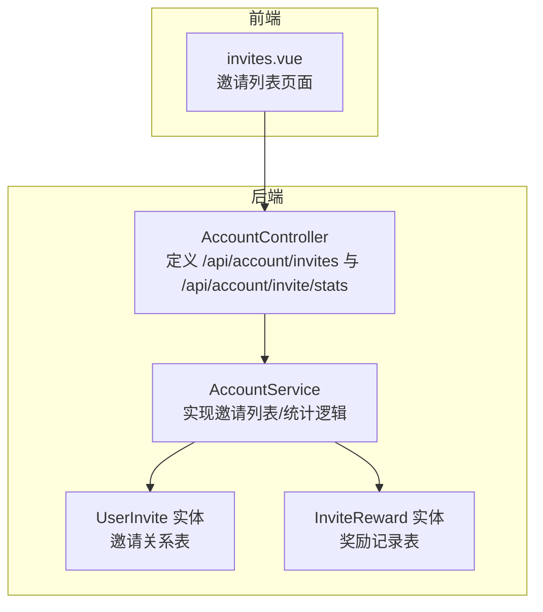
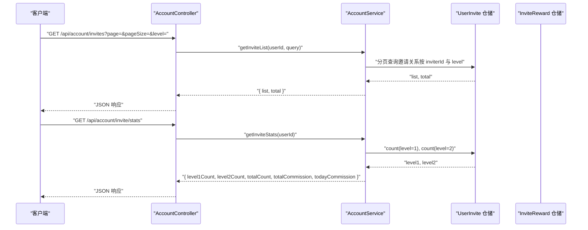
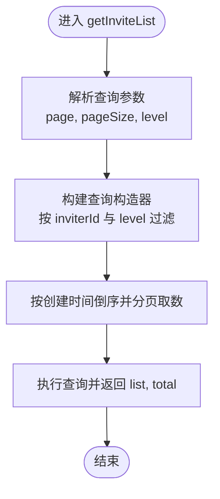
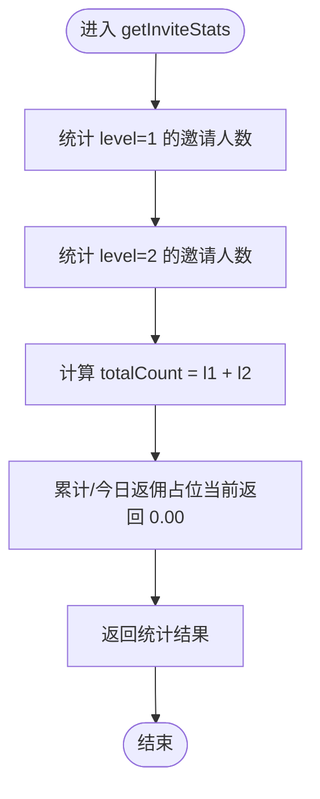
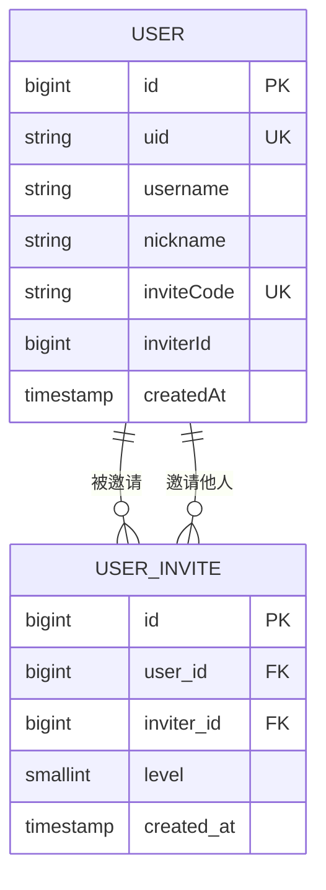
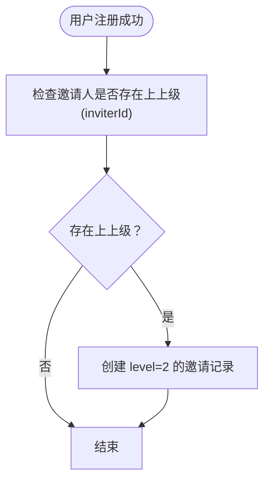
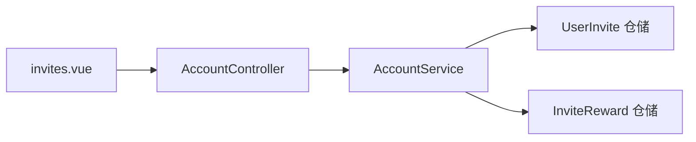

# 邀请统计

<cite>
**本文引用的文件**
- [agx-backend/src/modules/account/account.controller.ts](file://agx-backend/src/modules/account/account.controller.ts)
- [agx-backend/src/modules/account/account.service.ts](file://agx-backend/src/modules/account/account.service.ts)
- [agx-backend/src/entities/user-invite.entity.ts](file://agx-backend/src/entities/user-invite.entity.ts)
- [agx-backend/src/entities/invite-reward.entity.ts](file://agx-backend/src/entities/invite-reward.entity.ts)
- [agx-backend/API_CONTRACT.md](file://agx-backend/API_CONTRACT.md)
- [agx-admin/src/views/agx/invites.vue](file://agx-admin/src/views/agx/invites.vue)
</cite>

## 目录
1. [简介](#简介)
2. [项目结构](#项目结构)
3. [核心组件](#核心组件)
4. [架构总览](#架构总览)
5. [详细组件分析](#详细组件分析)
6. [依赖分析](#依赖分析)
7. [性能考虑](#性能考虑)
8. [故障排查指南](#故障排查指南)
9. [结论](#结论)
10. [附录](#附录)

## 简介
本文件面向账户服务中的“邀请统计”能力，聚焦以下两个API：
- GET /api/account/invites：获取当前用户的邀请列表（支持分页与层级过滤）
- GET /api/account/invite/stats：获取当前用户的邀请统计（一级/二级/总计人数，以及返佣占位字段）

文档同时解释邀请关系模型（含二级邀请建立逻辑）、邀请人数统计实现方式，并对返佣系统（目前占位）给出未来扩展点建议，帮助初学者理解ER模型，为高级开发者提供分页查询优化与奖励计算策略的最佳实践。

## 项目结构
围绕邀请统计的相关模块与实体分布如下：
- 控制器层：AccountController 提供邀请相关路由
- 服务层：AccountService 实现邀请列表与统计的业务逻辑
- 实体层：UserInvite（邀请关系）、InviteReward（奖励记录）
- 文档：API_CONTRACT.md 中包含通用响应约定
- 前端：agx-admin 的 invites.vue 页面用于展示邀请列表

图表来源
- [agx-backend/src/modules/account/account.controller.ts](file://agx-backend/src/modules/account/account.controller.ts#L131-L149)
- [agx-backend/src/modules/account/account.service.ts](file://agx-backend/src/modules/account/account.service.ts#L531-L583)
- [agx-backend/src/entities/user-invite.entity.ts](file://agx-backend/src/entities/user-invite.entity.ts#L1-L39)
- [agx-backend/src/entities/invite-reward.entity.ts](file://agx-backend/src/entities/invite-reward.entity.ts#L1-L43)
- [agx-admin/src/views/agx/invites.vue](file://agx-admin/src/views/agx/invites.vue#L1-L78)

章节来源
- [agx-backend/src/modules/account/account.controller.ts](file://agx-backend/src/modules/account/account.controller.ts#L131-L149)
- [agx-backend/src/modules/account/account.service.ts](file://agx-backend/src/modules/account/account.service.ts#L531-L583)
- [agx-backend/src/entities/user-invite.entity.ts](file://agx-backend/src/entities/user-invite.entity.ts#L1-L39)
- [agx-backend/src/entities/invite-reward.entity.ts](file://agx-backend/src/entities/invite-reward.entity.ts#L1-L43)
- [agx-admin/src/views/agx/invites.vue](file://agx-admin/src/views/agx/invites.vue#L1-L78)

## 核心组件
- 路由与控制器
  - GET /api/account/invites：调用 AccountController.getInviteList
  - GET /api/account/invite/stats：调用 AccountController.getInviteStats
- 服务层
  - getInviteList：基于邀请关系表进行分页查询，支持层级过滤
  - getInviteStats：统计一级/二级邀请人数，以及返佣占位字段
- 实体层
  - UserInvite：存储邀请关系（用户ID、邀请人ID、层级、创建时间）
  - InviteReward：存储奖励记录（奖励类型、金额、币种、状态等）

章节来源
- [agx-backend/src/modules/account/account.controller.ts](file://agx-backend/src/modules/account/account.controller.ts#L131-L149)
- [agx-backend/src/modules/account/account.service.ts](file://agx-backend/src/modules/account/account.service.ts#L531-L583)
- [agx-backend/src/entities/user-invite.entity.ts](file://agx-backend/src/entities/user-invite.entity.ts#L1-L39)
- [agx-backend/src/entities/invite-reward.entity.ts](file://agx-backend/src/entities/invite-reward.entity.ts#L1-L43)

## 架构总览
邀请统计的端到端流程如下：

图表来源
- [agx-backend/src/modules/account/account.controller.ts](file://agx-backend/src/modules/account/account.controller.ts#L131-L149)
- [agx-backend/src/modules/account/account.service.ts](file://agx-backend/src/modules/account/account.service.ts#L531-L583)

## 详细组件分析

### 邀请列表 API：GET /api/account/invites
- HTTP 方法与路径
  - 方法：GET
  - 路径：/api/account/invites
  - 需要认证：是（JWT）
- 查询参数
  - page：页码，默认 1
  - pageSize：每页条数，默认 20
  - level：层级过滤（1 或 2），默认 1
- 响应结构
  - list：数组，包含邀请用户的基本信息与邀请时间
  - total：总数
- 关键实现要点
  - 使用邀请关系仓储进行分页查询，按邀请时间倒序
  - 支持按层级过滤（1 为直接邀请，2 为二级邀请）
  - 返回字段包含用户标识与邀请层级及创建时间

图表来源
- [agx-backend/src/modules/account/account.service.ts](file://agx-backend/src/modules/account/account.service.ts#L531-L559)

章节来源
- [agx-backend/src/modules/account/account.controller.ts](file://agx-backend/src/modules/account/account.controller.ts#L131-L139)
- [agx-backend/src/modules/account/account.service.ts](file://agx-backend/src/modules/account/account.service.ts#L531-L559)

### 邀请统计 API：GET /api/account/invite/stats
- HTTP 方法与路径
  - 方法：GET
  - 路径：/api/account/invite/stats
  - 需要认证：是（JWT）
- 请求参数
  - 无查询参数
- 响应结构
  - level1Count：一级邀请人数
  - level2Count：二级邀请人数
  - totalCount：合计人数
  - totalCommission：累计返佣（占位，当前固定返回 0.00）
  - todayCommission：今日返佣（占位，当前固定返回 0.00）
- 关键实现要点
  - 分别统计 level=1 与 level=2 的邀请人数
  - 当前返佣字段为占位，后续可接入 InviteReward 表或 Commission 表进行实际统计

图表来源
- [agx-backend/src/modules/account/account.service.ts](file://agx-backend/src/modules/account/account.service.ts#L561-L583)

章节来源
- [agx-backend/src/modules/account/account.controller.ts](file://agx-backend/src/modules/account/account.controller.ts#L141-L149)
- [agx-backend/src/modules/account/account.service.ts](file://agx-backend/src/modules/account/account.service.ts#L561-L583)

### 邀请关系模型（ER 图）
邀请关系采用“用户-邀请人”的多级映射，支持一级与二级邀请。下图为邀请关系的 ER 概念图（概念性示意，非具体代码映射）：

说明
- USER_INVITE.level=1 表示直接邀请；level=2 表示二级邀请
- 二级邀请在用户注册时自动建立：当邀请人也有邀请人时，系统会为被邀请用户创建一条来自该“上上级”的二级邀请记录

章节来源
- [agx-backend/src/entities/user-invite.entity.ts](file://agx-backend/src/entities/user-invite.entity.ts#L1-L39)
- [agx-backend/src/modules/account/account.service.ts](file://agx-backend/src/modules/account/account.service.ts#L118-L126)

### 注册时二级邀请关系的建立逻辑
- 触发时机：用户注册成功后
- 逻辑要点：
  - 若邀请人的 inviterId 存在，则为被邀请用户创建一条 level=2 的邀请记录，指向邀请人的邀请人
  - 该逻辑确保“二级邀请”在用户注册时即建立，便于后续统计与返佣计算

图表来源
- [agx-backend/src/modules/account/account.service.ts](file://agx-backend/src/modules/account/account.service.ts#L118-L126)

章节来源
- [agx-backend/src/modules/account/account.service.ts](file://agx-backend/src/modules/account/account.service.ts#L118-L126)

### 返佣系统（占位）与未来扩展
- 当前状态
  - 邀请统计接口返回的 totalCommission 与 todayCommission 固定为 0.00
- 扩展方向（建议）
  - 引入 InviteReward 或 Commission 实体，记录奖励类型、金额、币种、状态、发放时间等
  - 在用户行为触发（如被邀请人完成首充、首笔交易等）时，按层级计算并生成奖励记录
  - 在统计接口中聚合 InviteReward 表，计算累计与当日返佣
  - 结合用户等级体系（UserLevel）设置不同层级的返佣比例

章节来源
- [agx-backend/src/entities/invite-reward.entity.ts](file://agx-backend/src/entities/invite-reward.entity.ts#L1-L43)
- [agx-backend/src/modules/account/account.service.ts](file://agx-backend/src/modules/account/account.service.ts#L561-L583)

## 依赖分析
- 控制器依赖服务：AccountController 依赖 AccountService 提供邀请列表与统计
- 服务依赖仓储：AccountService 依赖 UserInvite 仓储进行邀请关系查询与计数
- 实体依赖：UserInvite 与 User 实体关联，InviteReward 与用户/被邀请用户关联
- 前端依赖：invites.vue 通过 API 调用获取邀请列表并渲染表格

图表来源
- [agx-backend/src/modules/account/account.controller.ts](file://agx-backend/src/modules/account/account.controller.ts#L131-L149)
- [agx-backend/src/modules/account/account.service.ts](file://agx-backend/src/modules/account/account.service.ts#L531-L583)
- [agx-admin/src/views/agx/invites.vue](file://agx-admin/src/views/agx/invites.vue#L1-L78)

章节来源
- [agx-backend/src/modules/account/account.controller.ts](file://agx-backend/src/modules/account/account.controller.ts#L131-L149)
- [agx-backend/src/modules/account/account.service.ts](file://agx-backend/src/modules/account/account.service.ts#L531-L583)
- [agx-admin/src/views/agx/invites.vue](file://agx-admin/src/views/agx/invites.vue#L1-L78)

## 性能考虑
- 分页查询优化
  - 已使用 skip/take 进行分页，建议在 inviterId 与 level 上建立复合索引以提升查询效率
  - 对于超大表，可考虑使用“游标分页”或“基于主键范围”的分页策略减少偏移量扫描
- 计数统计
  - 统计 level1/level2 人数时，建议在 inviterId 与 level 上建立索引
  - 若邀请规模极大，可考虑缓存每日/每周统计数据，定期刷新
- 返佣计算
  - 奖励计算可异步化，结合定时任务批量统计与落库，避免请求路径上的高延迟
  - 对高频查询的统计字段可引入物化视图或汇总表

[本节为通用性能建议，不直接分析具体文件]

## 故障排查指南
- 401 未授权
  - 现象：访问 /api/account/invites 或 /api/account/invite/stats 返回未授权
  - 排查：确认请求头携带有效的 Authorization: Bearer <token>
- 404 路由不存在
  - 现象：浏览器或工具提示找不到 /api/account/invites
  - 排查：确认已启动后端服务且路由已注册
- 分页参数无效
  - 现象：level=2 无法返回数据或返回异常
  - 排查：确认 level 传参为 1 或 2；检查数据库中是否存在 level=2 的记录
- 返佣统计为 0
  - 现象：totalCommission 与 todayCommission 均为 0.00
  - 排查：当前为占位实现，需按“返佣系统（占位）与未来扩展”章节接入 InviteReward/Commission 表

章节来源
- [agx-backend/src/modules/account/account.controller.ts](file://agx-backend/src/modules/account/account.controller.ts#L131-L149)
- [agx-backend/src/modules/account/account.service.ts](file://agx-backend/src/modules/account/account.service.ts#L561-L583)

## 结论
- 邀请列表与统计接口已完整实现，支持分页与层级过滤
- 二级邀请在用户注册时自动建立，便于后续统计与返佣
- 返佣系统当前为占位，建议尽快接入 InviteReward/Commission 表并完善奖励计算策略
- 建议在 inviterId/level 上建立索引，必要时引入缓存与异步统计，保障大规模场景下的性能与稳定性

[本节为总结性内容，不直接分析具体文件]

## 附录

### API 定义与响应约定
- 通用响应约定
  - 成功响应包含 code、msg、data 字段
  - 业务异常时 code 非 0，msg 描述错误信息
- 邀请列表
  - 路径：GET /api/account/invites
  - 查询参数：page、pageSize、level
  - 响应：list 数组与 total
- 邀请统计
  - 路径：GET /api/account/invite/stats
  - 查询参数：无
  - 响应：level1Count、level2Count、totalCount、totalCommission、todayCommission

章节来源
- [agx-backend/API_CONTRACT.md](file://agx-backend/API_CONTRACT.md#L150-L175)
- [agx-backend/src/modules/account/account.controller.ts](file://agx-backend/src/modules/account/account.controller.ts#L131-L149)
- [agx-backend/src/modules/account/account.service.ts](file://agx-backend/src/modules/account/account.service.ts#L531-L583)