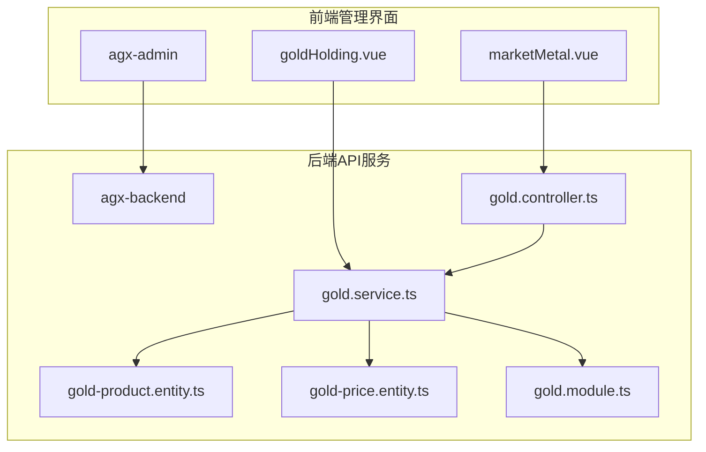
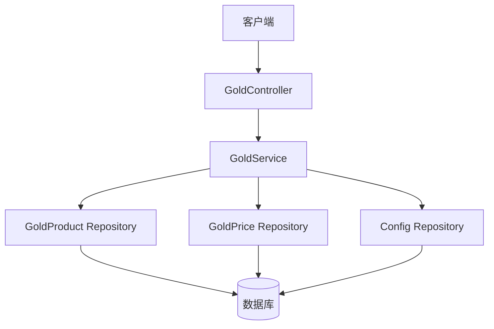
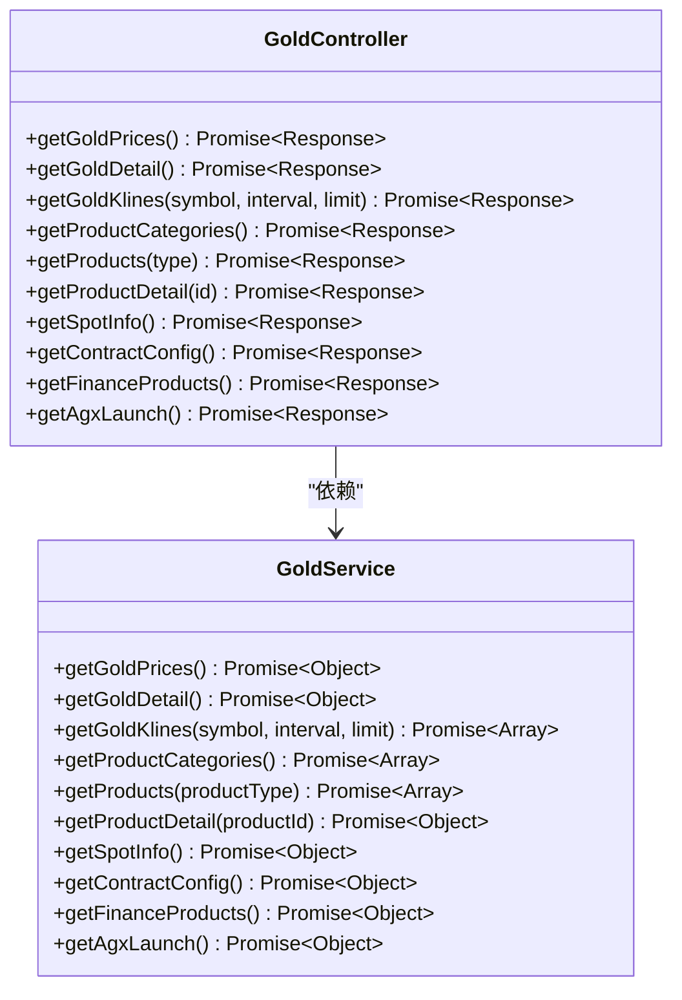
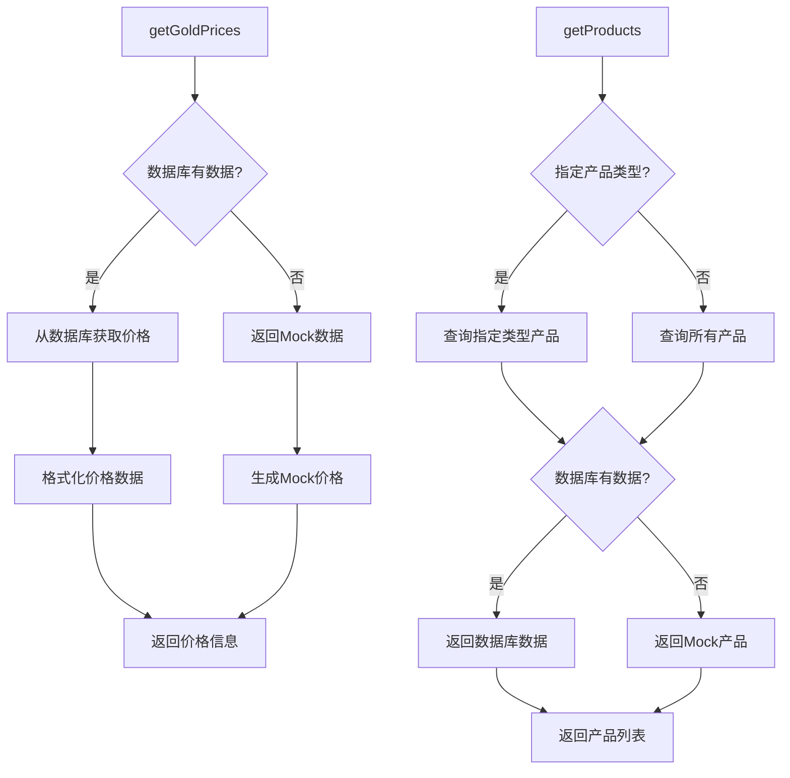
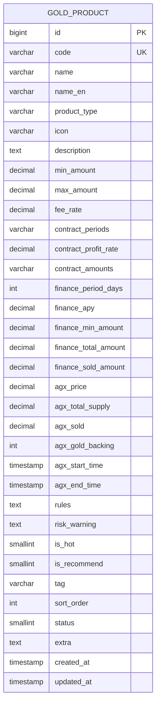
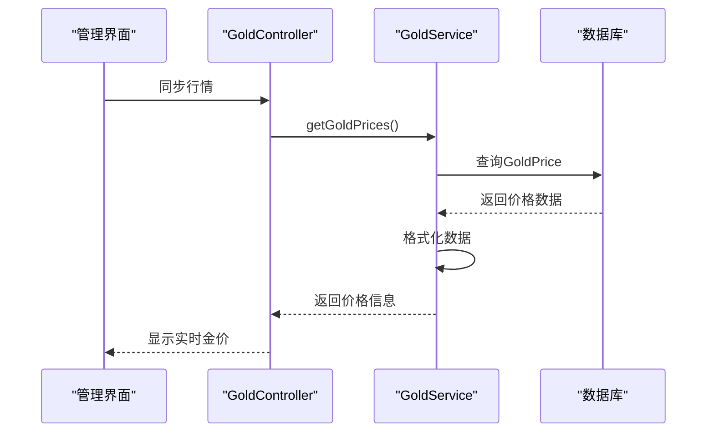
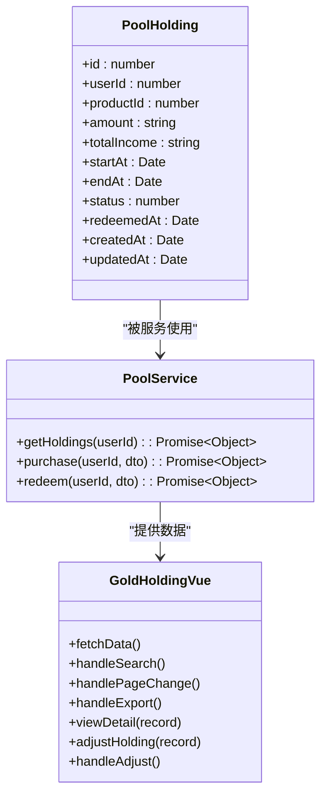
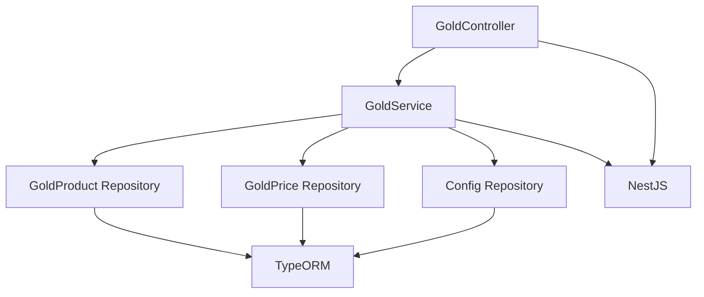

# 黄金产品API

<cite>
**本文档引用的文件**  
- [gold.controller.ts](file://agx-backend/src/modules/gold/gold.controller.ts)
- [gold.service.ts](file://agx-backend/src/modules/gold/gold.service.ts)
- [gold-product.entity.ts](file://agx-backend/src/entities/gold-product.entity.ts)
- [gold-price.entity.ts](file://agx-backend/src/entities/gold-price.entity.ts)
- [gold.module.ts](file://agx-backend/src/modules/gold/gold.module.ts)
- [marketMetal.vue](file://agx-admin/src/views/agx/marketMetal.vue)
- [goldHolding.vue](file://agx-admin/src/views/agx/goldHolding.vue)
- [pool-holding.entity.ts](file://agx-backend/src/entities/pool-holding.entity.ts)
- [pool.service.ts](file://agx-backend/src/modules/pool/pool.service.ts)
</cite>

## 目录
1. [简介](#简介)
2. [项目结构](#项目结构)
3. [核心组件](#核心组件)
4. [架构概述](#架构概述)
5. [详细组件分析](#详细组件分析)
6. [依赖分析](#依赖分析)
7. [性能考虑](#性能考虑)
8. [故障排除指南](#故障排除指南)
9. [结论](#结论)

## 简介
本文档详细介绍了黄金产品API，聚焦于`GoldController`中实现的黄金投资产品管理功能。文档涵盖了获取黄金产品列表、实时金价、用户持仓等端点的接口规范，解释了产品配置、价格更新机制和持仓计算逻辑。为初学者提供黄金产品投资流程的说明，为高级开发者分析价格同步的准确性和数据一致性保障措施。

## 项目结构
黄金产品相关功能主要分布在`agx-backend`和`agx-admin`两个模块中。`agx-backend`包含核心API实现，`agx-admin`提供管理界面。

**图表来源**  
- [gold.controller.ts](file://agx-backend/src/modules/gold/gold.controller.ts)
- [gold.service.ts](file://agx-backend/src/modules/gold/gold.service.ts)
- [gold-product.entity.ts](file://agx-backend/src/entities/gold-product.entity.ts)
- [gold-price.entity.ts](file://agx-backend/src/entities/gold-price.entity.ts)
- [gold.module.ts](file://agx-backend/src/modules/gold/gold.module.ts)
- [marketMetal.vue](file://agx-admin/src/views/agx/marketMetal.vue)
- [goldHolding.vue](file://agx-admin/src/views/agx/goldHolding.vue)

**章节来源**
- [gold.controller.ts](file://agx-backend/src/modules/gold/gold.controller.ts)
- [gold.service.ts](file://agx-backend/src/modules/gold/gold.service.ts)

## 核心组件
黄金产品API的核心组件包括`GoldController`、`GoldService`、`GoldProduct`实体和`GoldPrice`实体。`GoldController`提供RESTful API端点，`GoldService`处理业务逻辑，`GoldProduct`和`GoldPrice`实体定义数据模型。

**章节来源**
- [gold.controller.ts](file://agx-backend/src/modules/gold/gold.controller.ts)
- [gold.service.ts](file://agx-backend/src/modules/gold/gold.service.ts)
- [gold-product.entity.ts](file://agx-backend/src/entities/gold-product.entity.ts)
- [gold-price.entity.ts](file://agx-backend/src/entities/gold-price.entity.ts)

## 架构概述
黄金产品API采用典型的分层架构，包括控制器层、服务层和数据访问层。控制器层处理HTTP请求，服务层实现业务逻辑，数据访问层通过TypeORM与数据库交互。

**图表来源**  
- [gold.controller.ts](file://agx-backend/src/modules/gold/gold.controller.ts)
- [gold.service.ts](file://agx-backend/src/modules/gold/gold.service.ts)
- [gold-product.entity.ts](file://agx-backend/src/entities/gold-product.entity.ts)
- [gold-price.entity.ts](file://agx-backend/src/entities/gold-price.entity.ts)
- [gold.module.ts](file://agx-backend/src/modules/gold/gold.module.ts)

## 详细组件分析

### GoldController分析
`GoldController`是黄金产品API的入口，提供多个端点用于获取黄金产品信息、实时金价和用户持仓。

**图表来源**  
- [gold.controller.ts](file://agx-backend/src/modules/gold/gold.controller.ts)
- [gold.service.ts](file://agx-backend/src/modules/gold/gold.service.ts)

### GoldService分析
`GoldService`是黄金产品API的核心业务逻辑层，负责处理所有与黄金产品相关的业务逻辑。

**图表来源**  
- [gold.service.ts](file://agx-backend/src/modules/gold/gold.service.ts)

### 产品配置分析
黄金产品配置通过`GoldProduct`实体实现，支持多种产品类型，包括现货黄金、黄金秒合约、黄金理财和AGX首发。

**图表来源**  
- [gold-product.entity.ts](file://agx-backend/src/entities/gold-product.entity.ts)

### 价格更新机制分析
实时金价通过`GoldPrice`实体存储，价格更新机制包括从外部数据源获取和数据库存储。

**图表来源**  
- [gold.controller.ts](file://agx-backend/src/modules/gold/gold.controller.ts)
- [gold.service.ts](file://agx-backend/src/modules/gold/gold.service.ts)
- [gold-price.entity.ts](file://agx-backend/src/entities/gold-price.entity.ts)
- [marketMetal.vue](file://agx-admin/src/views/agx/marketMetal.vue)

### 持仓计算逻辑分析
用户持仓计算逻辑涉及多个组件，包括持仓实体、服务层和管理界面。

**图表来源**  
- [pool-holding.entity.ts](file://agx-backend/src/entities/pool-holding.entity.ts)
- [pool.service.ts](file://agx-backend/src/modules/pool/pool.service.ts)
- [goldHolding.vue](file://agx-admin/src/views/agx/goldHolding.vue)

**章节来源**
- [pool-holding.entity.ts](file://agx-backend/src/entities/pool-holding.entity.ts)
- [pool.service.ts](file://agx-backend/src/modules/pool/pool.service.ts)
- [goldHolding.vue](file://agx-admin/src/views/agx/goldHolding.vue)

## 依赖分析
黄金产品API的依赖关系清晰，主要依赖TypeORM进行数据访问，NestJS框架提供RESTful API支持。

**图表来源**  
- [gold.controller.ts](file://agx-backend/src/modules/gold/gold.controller.ts)
- [gold.service.ts](file://agx-backend/src/modules/gold/gold.service.ts)
- [gold.module.ts](file://agx-backend/src/modules/gold/gold.module.ts)

## 性能考虑
黄金产品API在设计时考虑了性能优化，包括缓存机制、数据库索引和异步处理。

**章节来源**
- [gold.service.ts](file://agx-backend/src/modules/gold/gold.service.ts)
- [gold-product.entity.ts](file://agx-backend/src/entities/gold-product.entity.ts)
- [gold-price.entity.ts](file://agx-backend/src/entities/gold-price.entity.ts)

## 故障排除指南
常见问题包括价格数据不更新、产品列表为空和用户持仓显示异常。检查数据库连接、价格同步任务和缓存状态。

**章节来源**
- [gold.service.ts](file://agx-backend/src/modules/gold/gold.service.ts)
- [gold.controller.ts](file://agx-backend/src/modules/gold/gold.controller.ts)
- [marketMetal.vue](file://agx-admin/src/views/agx/marketMetal.vue)

## 结论
黄金产品API提供了完整的黄金投资产品管理功能，包括产品配置、价格更新和用户持仓计算。通过清晰的分层架构和良好的依赖管理，确保了系统的可维护性和扩展性。