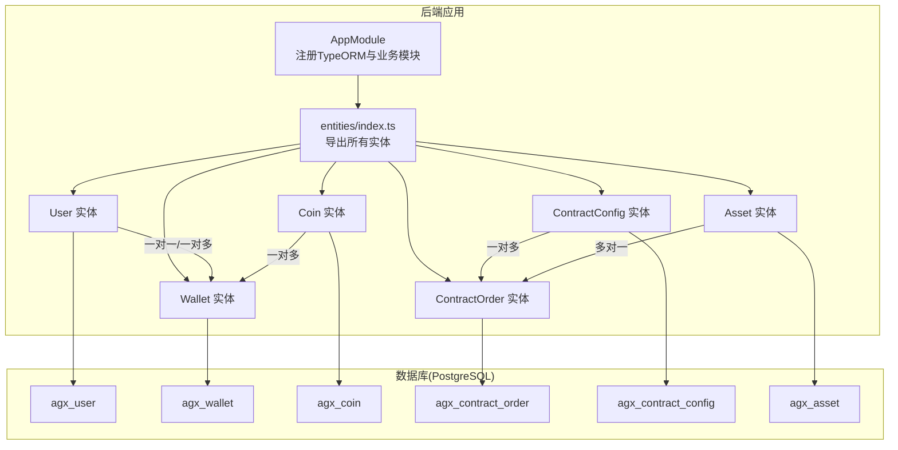
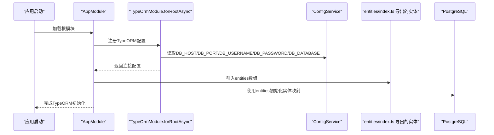
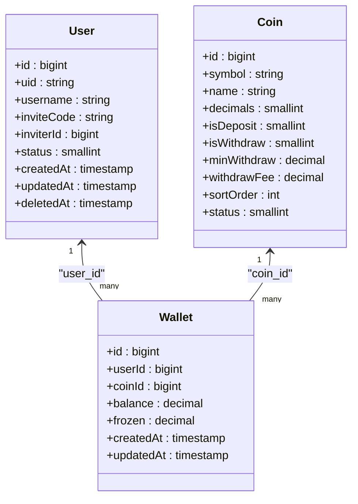
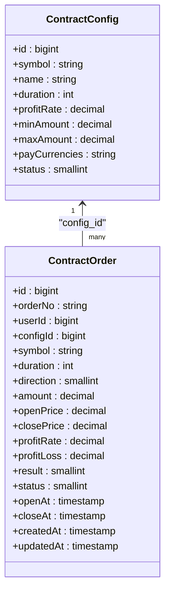
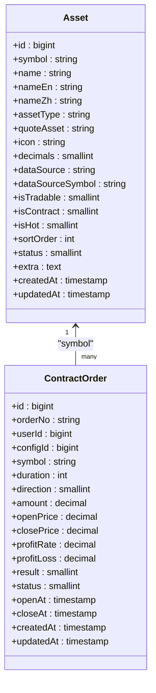
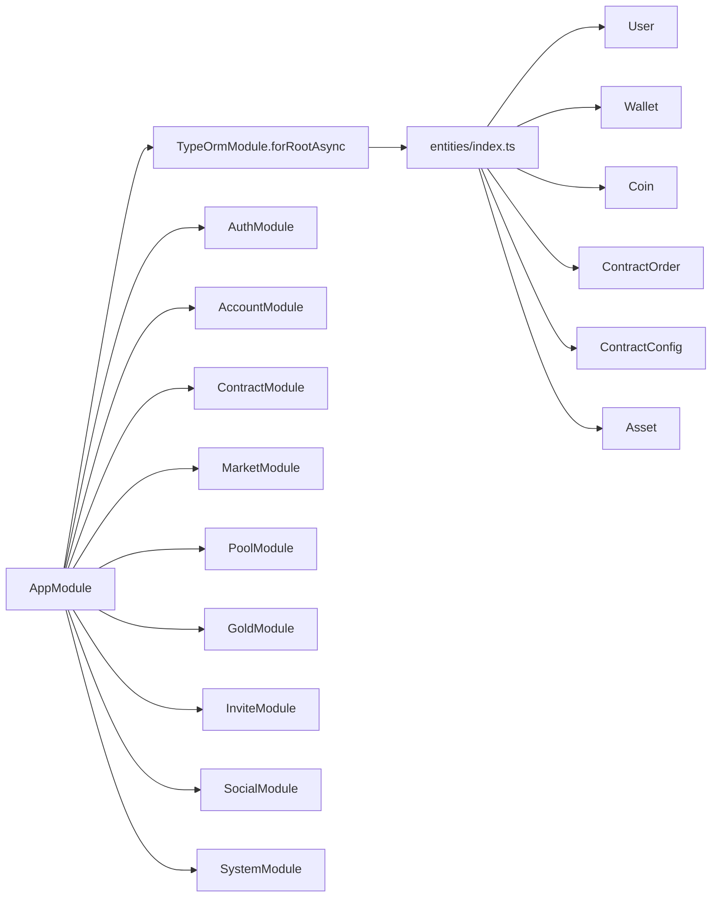

# ORM数据模型

<cite>
**本文引用的文件列表**
- [app.module.ts](file://agx-backend/src/app.module.ts)
- [entities/index.ts](file://agx-backend/src/entities/index.ts)
- [user.entity.ts](file://agx-backend/src/entities/user.entity.ts)
- [wallet.entity.ts](file://agx-backend/src/entities/wallet.entity.ts)
- [coin.entity.ts](file://agx-backend/src/entities/coin.entity.ts)
- [contract-order.entity.ts](file://agx-backend/src/entities/contract-order.entity.ts)
- [contract-config.entity.ts](file://agx-backend/src/entities/contract-config.entity.ts)
- [asset.entity.ts](file://agx-backend/src/entities/asset.entity.ts)
- [schema.sql](file://agx-backend/schema.sql)
</cite>

## 目录
1. [简介](#简介)
2. [项目结构](#项目结构)
3. [核心组件](#核心组件)
4. [架构总览](#架构总览)
5. [详细组件分析](#详细组件分析)
6. [依赖分析](#依赖分析)
7. [性能考虑](#性能考虑)
8. [故障排查指南](#故障排查指南)
9. [结论](#结论)
10. [附录](#附录)

## 简介
本文件聚焦于TypeORM实体与数据库表的映射关系，围绕User、ContractOrder、Asset等核心实体，系统梳理字段定义、数据类型、主外键约束、索引与关联关系（例如User与Wallet的一对多关系）。同时说明app.module.ts中entities数组如何注册所有实体，以及synchronize配置对数据库同步的影响，并结合schema.sql解释数据库初始化流程。文档还提供ER图、装饰器使用示例与最佳实践，帮助初学者建立规范，为高级开发者提供性能优化建议（索引设计、懒加载策略等）。

## 项目结构
- 后端采用NestJS + TypeORM，数据库为PostgreSQL。
- 实体统一位于src/entities目录，通过entities/index.ts集中导出，供TypeOrmModule.forRootAsync(entities: [...])注册。
- 数据库初始化脚本schema.sql定义了完整的表结构、索引与初始数据。

图表来源
- [app.module.ts](file://agx-backend/src/app.module.ts#L69-L129)
- [entities/index.ts](file://agx-backend/src/entities/index.ts#L1-L54)
- [user.entity.ts](file://agx-backend/src/entities/user.entity.ts#L1-L118)
- [wallet.entity.ts](file://agx-backend/src/entities/wallet.entity.ts#L1-L42)
- [coin.entity.ts](file://agx-backend/src/entities/coin.entity.ts#L1-L52)
- [contract-order.entity.ts](file://agx-backend/src/entities/contract-order.entity.ts#L1-L81)
- [contract-config.entity.ts](file://agx-backend/src/entities/contract-config.entity.ts#L1-L47)
- [asset.entity.ts](file://agx-backend/src/entities/asset.entity.ts#L1-L80)

章节来源
- [app.module.ts](file://agx-backend/src/app.module.ts#L69-L129)
- [entities/index.ts](file://agx-backend/src/entities/index.ts#L1-L54)

## 核心组件
本节从实体到数据库表的映射出发，逐项说明关键字段、数据类型、约束与索引，并给出典型查询场景下的索引选择建议。

- User（用户）
  - 主键：自增bigint无符号
  - 关键唯一索引：uid、username、inviteCode
  - 常用过滤索引：inviterId
  - 字段要点：包含用户基本信息、社交状态、登录信息、等级与邀请统计、累计返佣与交易额等
  - 参考路径：[user.entity.ts](file://agx-backend/src/entities/user.entity.ts#L1-L118)

- Wallet（钱包）
  - 主键：自增bigint无符号
  - 唯一索引：user_id与coin_id组合唯一
  - 常用过滤索引：user_id
  - 字段要点：可用余额balance、冻结余额frozen
  - 参考路径：[wallet.entity.ts](file://agx-backend/src/entities/wallet.entity.ts#L1-L42)

- Coin（币种）
  - 主键：自增bigint无符号
  - 唯一索引：symbol
  - 字段要点：币种名称、图标、精度、充值/提现开关、最小提现、手续费、排序、状态
  - 参考路径：[coin.entity.ts](file://agx-backend/src/entities/coin.entity.ts#L1-L52)

- ContractOrder（合约订单）
  - 主键：自增bigint无符号
  - 唯一索引：order_no；常用过滤索引：user_id、status
  - 字段要点：订单号、用户ID、配置ID、交易对、周期、方向、下单金额、开仓/平仓价、收益率、盈亏、结果、状态、开仓/平仓时间
  - 参考路径：[contract-order.entity.ts](file://agx-backend/src/entities/contract-order.entity.ts#L1-L81)

- ContractConfig（合约配置）
  - 主键：自增bigint无符号
  - 常用过滤索引：symbol、duration
  - 字段要点：交易对、名称、周期秒数、盈利收益率、最小/最大下单金额、支付币种、状态
  - 参考路径：[contract-config.entity.ts](file://agx-backend/src/entities/contract-config.entity.ts#L1-L47)

- Asset（资产/品种配置）
  - 主键：自增bigint无符号
  - 唯一索引：symbol；常用过滤索引：asset_type
  - 字段要点：资产代码、名称、类型（crypto/forex/stock/metal/fund/index）、报价资产、图标、价格小数位、数据源、是否可交易/支持合约/热门、排序、状态、扩展配置
  - 参考路径：[asset.entity.ts](file://agx-backend/src/entities/asset.entity.ts#L1-L80)

章节来源
- [user.entity.ts](file://agx-backend/src/entities/user.entity.ts#L1-L118)
- [wallet.entity.ts](file://agx-backend/src/entities/wallet.entity.ts#L1-L42)
- [coin.entity.ts](file://agx-backend/src/entities/coin.entity.ts#L1-L52)
- [contract-order.entity.ts](file://agx-backend/src/entities/contract-order.entity.ts#L1-L81)
- [contract-config.entity.ts](file://agx-backend/src/entities/contract-config.entity.ts#L1-L47)
- [asset.entity.ts](file://agx-backend/src/entities/asset.entity.ts#L1-L80)

## 架构总览
TypeORM在AppModule中通过forRootAsync注册连接参数与实体集合，synchronize设置为false，避免生产环境自动迁移破坏数据库结构。业务模块按功能拆分，TypeOrmModule.forFeature仅注册当前模块使用的实体，实现模块化管理。

图表来源
- [app.module.ts](file://agx-backend/src/app.module.ts#L69-L129)
- [entities/index.ts](file://agx-backend/src/entities/index.ts#L1-L54)

章节来源
- [app.module.ts](file://agx-backend/src/app.module.ts#L69-L129)

## 详细组件分析

### User 与 Wallet 的一对多关系
- User与Wallet通过user_id建立一对多关系：一个用户拥有多个钱包条目（按币种区分）。
- Wallet的唯一索引(user_id, coin_id)确保同一用户对同一币种仅有一条记录。
- 查询建议：
  - 按用户查询其全部资产：基于user_id过滤
  - 按用户与币种查询单条资产：基于(user_id, coin_id)唯一索引

图表来源
- [user.entity.ts](file://agx-backend/src/entities/user.entity.ts#L1-L118)
- [wallet.entity.ts](file://agx-backend/src/entities/wallet.entity.ts#L1-L42)
- [coin.entity.ts](file://agx-backend/src/entities/coin.entity.ts#L1-L52)

章节来源
- [user.entity.ts](file://agx-backend/src/entities/user.entity.ts#L1-L118)
- [wallet.entity.ts](file://agx-backend/src/entities/wallet.entity.ts#L1-L42)
- [coin.entity.ts](file://agx-backend/src/entities/coin.entity.ts#L1-L52)

### ContractOrder 与 ContractConfig 的多对一关系
- ContractOrder通过config_id关联ContractConfig，表示订单对应的具体合约配置。
- 常见查询：
  - 按用户查询其历史订单：基于user_id过滤
  - 按状态筛选进行中的订单：基于status过滤
  - 按交易对与周期查询配置：基于(symbol, duration)过滤

图表来源
- [contract-order.entity.ts](file://agx-backend/src/entities/contract-order.entity.ts#L1-L81)
- [contract-config.entity.ts](file://agx-backend/src/entities/contract-config.entity.ts#L1-L47)

章节来源
- [contract-order.entity.ts](file://agx-backend/src/entities/contract-order.entity.ts#L1-L81)
- [contract-config.entity.ts](file://agx-backend/src/entities/contract-config.entity.ts#L1-L47)

### Asset 与 ContractOrder 的多对一关系
- Asset用于描述交易标的（如加密货币、外汇、贵金属等），ContractOrder中的symbol指向Asset.symbol，形成多对一关联。
- 常见查询：
  - 按资产类型过滤：基于asset_type过滤
  - 按交易对查询：基于symbol过滤

图表来源
- [asset.entity.ts](file://agx-backend/src/entities/asset.entity.ts#L1-L80)
- [contract-order.entity.ts](file://agx-backend/src/entities/contract-order.entity.ts#L1-L81)

章节来源
- [asset.entity.ts](file://agx-backend/src/entities/asset.entity.ts#L1-L80)
- [contract-order.entity.ts](file://agx-backend/src/entities/contract-order.entity.ts#L1-L81)

### @ManyToOne 与 @OneToMany 装饰器的实际应用
- 在ContractOrder中，@ManyToOne(() => User)与@ManyToOne(() => ContractConfig)分别声明了与User、ContractConfig的多对一关系，并通过@JoinColumn指定外键列名。
- 在Wallet中，@ManyToOne(() => Coin)声明与Coin的多对一关系。
- 对应的反向关系（如User与Wallet的一对多）通常在TypeORM中通过查询构建器或懒加载实现，无需显式装饰器标注。

章节来源
- [contract-order.entity.ts](file://agx-backend/src/entities/contract-order.entity.ts#L1-L81)
- [wallet.entity.ts](file://agx-backend/src/entities/wallet.entity.ts#L1-L42)

### 实体注册与数据库同步
- entities数组：在AppModule中，entities数组集中导入并注册了所有实体，TypeORM据此生成实体映射。
- synchronize配置：synchronize设置为false，意味着不会自动根据实体变更同步数据库结构，生产环境更安全可控。
- 初始化流程：schema.sql定义了完整表结构、索引与初始数据，可通过psql命令执行初始化。

章节来源
- [app.module.ts](file://agx-backend/src/app.module.ts#L69-L129)
- [schema.sql](file://agx-backend/schema.sql#L1-L472)

## 依赖分析
- 模块耦合
  - AppModule集中注册TypeORM与业务模块，业务模块通过TypeOrmModule.forFeature按需注册实体，降低全局耦合度。
  - entities/index.ts作为统一出口，便于集中维护与导入。
- 外部依赖
  - PostgreSQL驱动与TypeORM运行时依赖由NestJS生态管理。
- 潜在风险
  - synchronize=false时，数据库结构变更需通过迁移或手动SQL维护，避免与实体定义脱节。

图表来源
- [app.module.ts](file://agx-backend/src/app.module.ts#L69-L129)
- [entities/index.ts](file://agx-backend/src/entities/index.ts#L1-L54)

章节来源
- [app.module.ts](file://agx-backend/src/app.module.ts#L69-L129)
- [entities/index.ts](file://agx-backend/src/entities/index.ts#L1-L54)

## 性能考虑
- 索引设计
  - 唯一索引：User(uid/username/inviteCode)、Wallet(user_id, coin_id)、ContractOrder(order_no)、Asset(symbol)等，确保唯一性约束与高效过滤。
  - 过滤索引：User(inviter_id)、ContractOrder(user_id, status)、Asset(asset_type)等，覆盖高频查询条件。
- 查询优化
  - 使用索引列进行WHERE过滤，避免全表扫描。
  - 对JOIN场景，优先保证外键列有索引。
- 懒加载策略
  - 对于一对多关系（如User与Wallet），建议在查询时按需加载，避免一次性加载大量关联数据导致N+1问题。
- 写入优化
  - 批量写入时注意事务边界，减少锁竞争。
- 监控与诊断
  - 开启TypeORM日志（开发环境）观察慢查询与重复查询，针对性补充索引或重构查询。

[本节为通用性能建议，不直接分析具体文件]

## 故障排查指南
- 启动报错：找不到实体或连接失败
  - 检查entities数组是否包含目标实体，确认TypeOrmModule.forRootAsync配置正确。
  - 章节来源：[app.module.ts](file://agx-backend/src/app.module.ts#L69-L129)
- 数据库结构不一致
  - synchronize=false时，需通过schema.sql或迁移工具维护结构，避免手动修改破坏一致性。
  - 章节来源：[schema.sql](file://agx-backend/schema.sql#L1-L472)
- 查询性能差
  - 检查WHERE条件是否命中索引，必要时补充索引或调整查询逻辑。
  - 章节来源：[user.entity.ts](file://agx-backend/src/entities/user.entity.ts#L1-L118)、[wallet.entity.ts](file://agx-backend/src/entities/wallet.entity.ts#L1-L42)、[contract-order.entity.ts](file://agx-backend/src/entities/contract-order.entity.ts#L1-L81)、[asset.entity.ts](file://agx-backend/src/entities/asset.entity.ts#L1-L80)

## 结论
本文从实体到数据库表映射、索引与约束、装饰器应用、模块化注册与初始化流程等方面，系统梳理了核心实体及其关系。通过合理的索引设计与懒加载策略，可在保证数据一致性的同时提升查询性能。生产环境建议关闭自动同步，采用schema.sql或迁移工具维护结构，确保演进可控。

## 附录
- 数据库初始化步骤（参考schema.sql）
  - 使用PostgreSQL客户端连接数据库，执行schema.sql完成建表、索引与初始数据插入。
  - 章节来源：[schema.sql](file://agx-backend/schema.sql#L1-L472)
- 实体创建规范（建议）
  - 明确主键与唯一约束，为高频查询列建立索引。
  - 使用@ManyToOne/@JoinColumn声明外键关系，保持命名一致。
  - 对数值型金额字段使用decimal并明确精度与小数位。
  - 统一时间戳字段命名（created_at/updated_at/deleted_at）。
  - 将实体集中在entities/index.ts统一导出，便于集中注册。
  - 章节来源：[entities/index.ts](file://agx-backend/src/entities/index.ts#L1-L54)、[user.entity.ts](file://agx-backend/src/entities/user.entity.ts#L1-L118)、[wallet.entity.ts](file://agx-backend/src/entities/wallet.entity.ts#L1-L42)、[contract-order.entity.ts](file://agx-backend/src/entities/contract-order.entity.ts#L1-L81)、[asset.entity.ts](file://agx-backend/src/entities/asset.entity.ts#L1-L80)