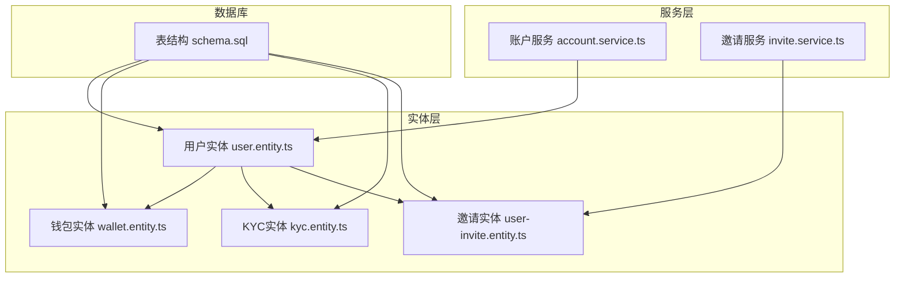
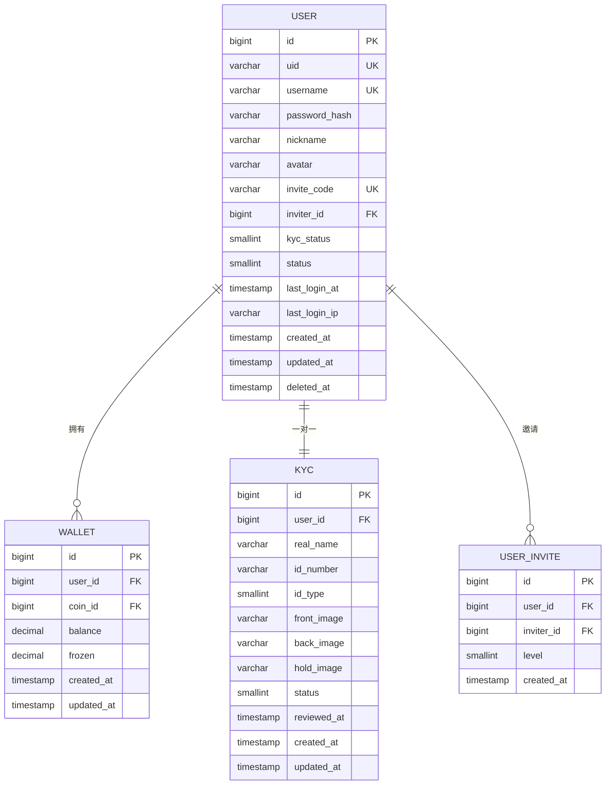
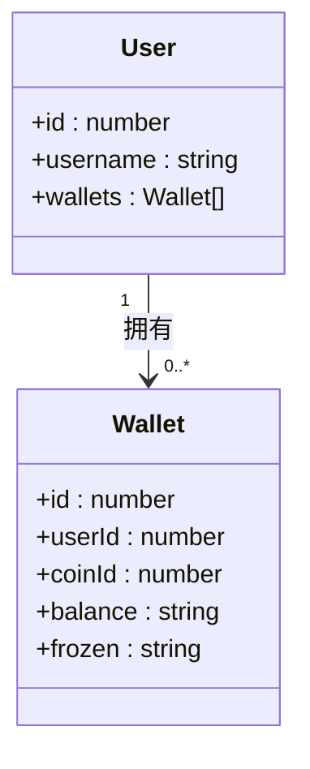
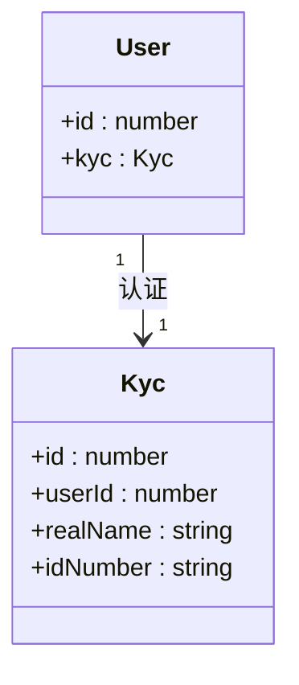
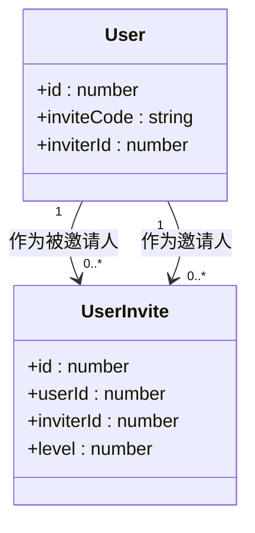
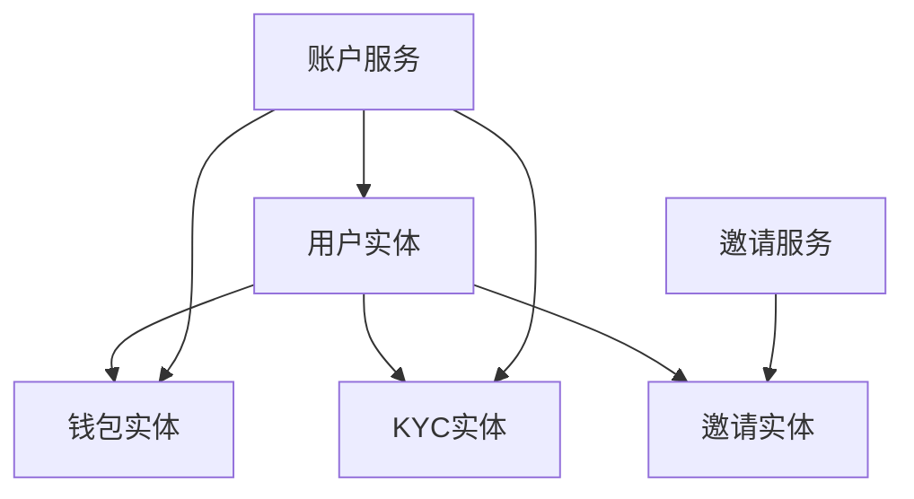

# 用户实体模型

<cite>
**本文档引用文件**   
- [user.entity.ts](file://agx-backend/src/entities/user.entity.ts)
- [wallet.entity.ts](file://agx-backend/src/entities/wallet.entity.ts)
- [kyc.entity.ts](file://agx-backend/src/entities/kyc.entity.ts)
- [user-invite.entity.ts](file://agx-backend/src/entities/user-invite.entity.ts)
- [schema.sql](file://agx-backend/schema.sql)
- [account.service.ts](file://agx-backend/src/modules/account/account.service.ts)
- [invite.service.ts](file://agx-backend/src/modules/invite/invite.service.ts)
</cite>

## 目录
1. [简介](#简介)
2. [项目结构](#项目结构)
3. [核心组件](#核心组件)
4. [架构概述](#架构概述)
5. [详细组件分析](#详细组件分析)
6. [依赖分析](#依赖分析)
7. [性能考虑](#性能考虑)
8. [故障排除指南](#故障排除指南)
9. [结论](#结论)
10. [附录](#附录)（如有必要）

## 简介
本文档详细解析了用户实体（User）的数据模型，涵盖其字段定义、实体间关系以及数据库表结构生成逻辑。重点分析了用户与钱包（Wallet）、KYC认证、邀请关系（UserInvite）等实体的关联方式，并结合代码示例说明了实体创建、关联查询及性能优化策略。

## 项目结构
用户实体模型位于后端服务的实体层，主要涉及用户管理、钱包、KYC认证和邀请系统。以下是相关文件的组织结构：



**图表来源**
- [user.entity.ts](file://agx-backend/src/entities/user.entity.ts)
- [wallet.entity.ts](file://agx-backend/src/entities/wallet.entity.ts)
- [kyc.entity.ts](file://agx-backend/src/entities/kyc.entity.ts)
- [user-invite.entity.ts](file://agx-backend/src/entities/user-invite.entity.ts)
- [schema.sql](file://agx-backend/schema.sql)

**章节来源**
- [user.entity.ts](file://agx-backend/src/entities/user.entity.ts#L1-L118)

## 核心组件
用户实体（User）是系统的核心数据模型，定义了用户的基本信息、状态、社交属性及扩展字段。其主要字段包括：
- `id`: 主键，自增
- `username`: 用户名，唯一索引
- `email`: 邮箱，唯一索引
- `phone`: 电话（在代码中为`uid`）
- `status`: 账户状态
- `kycStatus`: KYC认证状态
- `inviteCode`: 邀请码
- `inviterId`: 邀请人ID

**章节来源**
- [user.entity.ts](file://agx-backend/src/entities/user.entity.ts#L1-L118)

## 架构概述
用户实体模型采用TypeORM进行对象关系映射，通过装饰器定义字段类型、约束和索引。实体间通过一对多、一对一等关系进行关联，确保数据的一致性和完整性。



**图表来源**
- [user.entity.ts](file://agx-backend/src/entities/user.entity.ts#L1-L118)
- [wallet.entity.ts](file://agx-backend/src/entities/wallet.entity.ts#L1-L42)
- [kyc.entity.ts](file://agx-backend/src/entities/kyc.entity.ts#L1-L57)
- [user-invite.entity.ts](file://agx-backend/src/entities/user-invite.entity.ts#L1-L39)

## 详细组件分析
### 用户实体分析
用户实体定义了用户的基本属性和状态字段，使用TypeORM装饰器进行配置。

#### 字段定义与约束
| 字段名 | 类型 | 约束 | 说明 |
|--------|------|------|------|
| id | bigint | 主键，自增 | 用户唯一标识 |
| uid | varchar(32) | 唯一 | 用户UID |
| username | varchar(50) | 唯一 | 用户名 |
| passwordHash | varchar(255) | 非空 | 密码哈希 |
| nickname | varchar(50) | 可为空 | 昵称 |
| avatar | varchar(255) | 可为空 | 头像URL |
| inviteCode | varchar(16) | 唯一 | 邀请码 |
| inviterId | bigint | 外键 | 邀请人ID |
| kycStatus | smallint | 默认0 | KYC状态 |
| status | smallint | 默认1 | 账户状态 |

**章节来源**
- [user.entity.ts](file://agx-backend/src/entities/user.entity.ts#L1-L118)

#### 装饰器用途
- `@PrimaryGeneratedColumn`: 定义主键并自动递增
- `@Column`: 定义数据库列，可设置类型、长度、默认值等
- `@CreateDateColumn`: 自动记录创建时间
- `@UpdateDateColumn`: 自动记录更新时间
- `@DeleteDateColumn`: 软删除标记
- `@Index`: 创建数据库索引以提高查询性能

**章节来源**
- [user.entity.ts](file://agx-backend/src/entities/user.entity.ts#L1-L118)

### 实体关系分析
#### 与钱包实体的一对多关系
用户与钱包之间是一对多关系，一个用户可以拥有多个钱包（不同币种）。



**图表来源**
- [user.entity.ts](file://agx-backend/src/entities/user.entity.ts#L1-L118)
- [wallet.entity.ts](file://agx-backend/src/entities/wallet.entity.ts#L1-L42)

#### 与KYC实体的一对一关系
用户与KYC认证信息是一对一关系，每个用户最多有一个KYC记录。



**图表来源**
- [user.entity.ts](file://agx-backend/src/entities/user.entity.ts#L1-L118)
- [kyc.entity.ts](file://agx-backend/src/entities/kyc.entity.ts#L1-L57)

#### 用户邀请关系
用户邀请关系通过`UserInvite`实体实现，支持多级邀请体系。



**图表来源**
- [user.entity.ts](file://agx-backend/src/entities/user.entity.ts#L1-L118)
- [user-invite.entity.ts](file://agx-backend/src/entities/user-invite.entity.ts#L1-L39)

### 关联查询实现
通过TypeORM的`relations`选项实现关联查询，例如获取用户及其钱包信息：

```typescript
const user = await this.userRepo.findOne({
  where: { id: userId },
  relations: ['wallets', 'kyc']
});
```

**章节来源**
- [account.service.ts](file://agx-backend/src/modules/account/account.service.ts#L237-L240)

## 依赖分析
用户实体依赖于多个其他实体和服务，形成完整的用户管理体系。



**图表来源**
- [user.entity.ts](file://agx-backend/src/entities/user.entity.ts)
- [wallet.entity.ts](file://agx-backend/src/entities/wallet.entity.ts)
- [kyc.entity.ts](file://agx-backend/src/entities/kyc.entity.ts)
- [user-invite.entity.ts](file://agx-backend/src/entities/user-invite.entity.ts)
- [account.service.ts](file://agx-backend/src/modules/account/account.service.ts)
- [invite.service.ts](file://agx-backend/src/modules/invite/invite.service.ts)

**章节来源**
- [account.service.ts](file://agx-backend/src/modules/account/account.service.ts#L14-L29)
- [invite.service.ts](file://agx-backend/src/modules/invite/invite.service.ts#L13-L25)

## 性能考虑
### 索引优化建议
为提高查询性能，建议在以下字段上建立唯一索引：
- `username`: 用户名唯一性检查
- `email`: 邮箱唯一性检查（在代码中对应`uid`）
- `inviteCode`: 邀请码唯一性检查
- `inviterId`: 邀请关系查询

```sql
CREATE INDEX IF NOT EXISTS idx_username ON agx_user(username);
CREATE INDEX IF NOT EXISTS idx_uid ON agx_user(uid);
CREATE INDEX IF NOT EXISTS idx_invite_code ON agx_user(invite_code);
CREATE INDEX IF NOT EXISTS idx_inviter_id ON agx_user(inviter_id);
```

**章节来源**
- [schema.sql](file://agx-backend/schema.sql#L24)

### 延迟加载配置
对于关联实体，建议使用延迟加载（lazy loading）以减少不必要的数据查询：

```typescript
@OneToMany(() => Wallet, wallet => wallet.user, { lazy: true })
wallets: Promise<Wallet[]>;
```

**章节来源**
- [user.entity.ts](file://agx-backend/src/entities/user.entity.ts)

## 故障排除指南
### 常见问题
1. **用户注册失败**: 检查用户名或邀请码是否已存在
2. **KYC认证无法提交**: 确认用户未处于认证中状态
3. **邀请关系未建立**: 检查邀请码是否有效且用户存在

**章节来源**
- [account.service.ts](file://agx-backend/src/modules/account/account.service.ts#L67-L80)
- [account.service.ts](file://agx-backend/src/modules/account/account.service.ts#L302-L306)

## 结论
用户实体模型是系统的核心数据结构，通过TypeORM实现了完整的对象关系映射。合理的索引设计和关联配置确保了系统的高性能和数据一致性。建议在生产环境中根据实际查询模式进一步优化索引策略。

## 附录
### 表结构生成逻辑
从`schema.sql`文件可以看出，用户表的创建语句如下：

```sql
CREATE TABLE IF NOT EXISTS agx_user (
  id              BIGSERIAL PRIMARY KEY,
  uid             VARCHAR(32) NOT NULL UNIQUE,
  username        VARCHAR(50) NOT NULL UNIQUE,
  password_hash   VARCHAR(255) NOT NULL,
  nickname        VARCHAR(50),
  avatar          VARCHAR(255),
  invite_code     VARCHAR(16) NOT NULL UNIQUE,
  inviter_id      BIGINT,
  kyc_status      SMALLINT NOT NULL DEFAULT 0,
  status          SMALLINT NOT NULL DEFAULT 1,
  last_login_at   TIMESTAMP,
  last_login_ip   VARCHAR(45),
  created_at      TIMESTAMP NOT NULL DEFAULT CURRENT_TIMESTAMP,
  updated_at      TIMESTAMP NOT NULL DEFAULT CURRENT_TIMESTAMP,
  deleted_at      TIMESTAMP
);
```

**章节来源**
- [schema.sql](file://agx-backend/schema.sql#L7-L23)