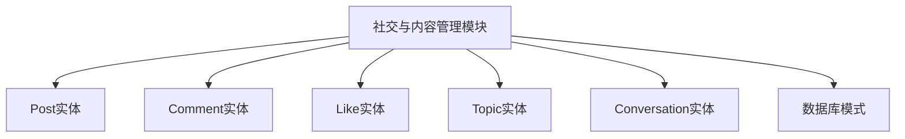
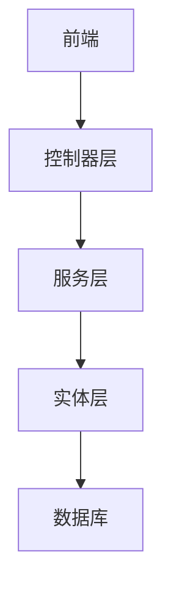
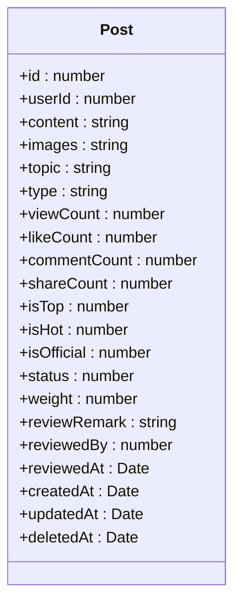
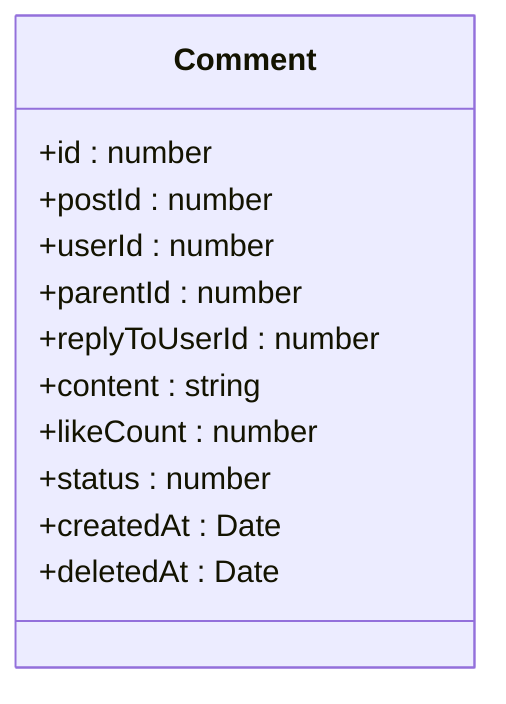
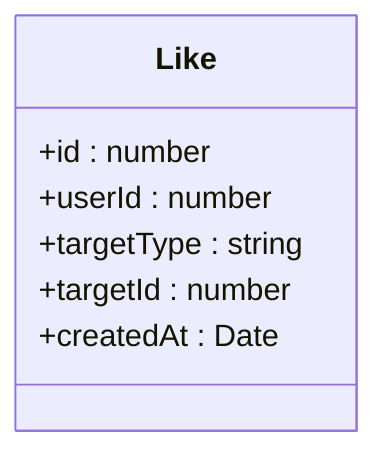
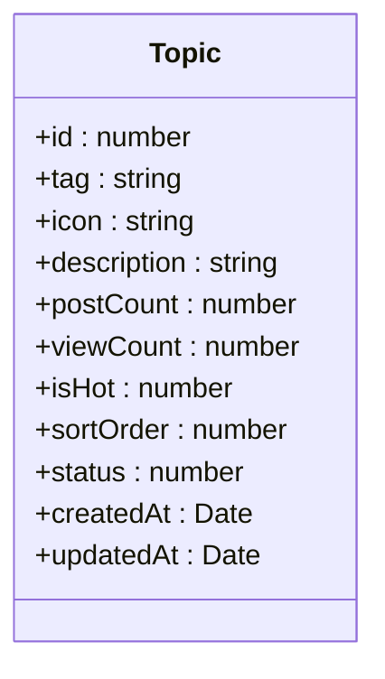
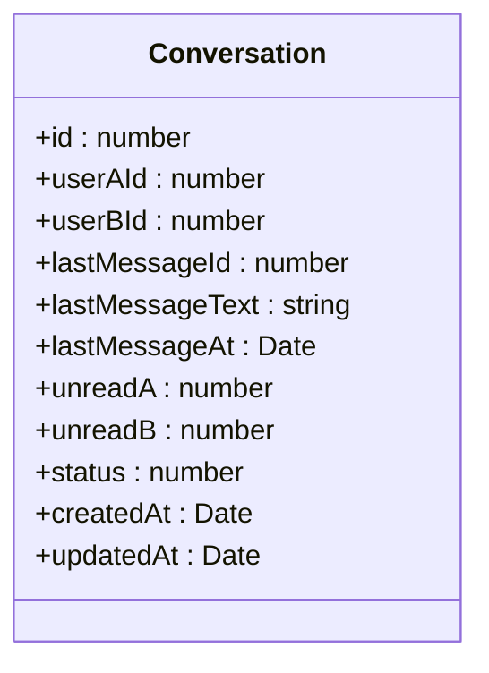
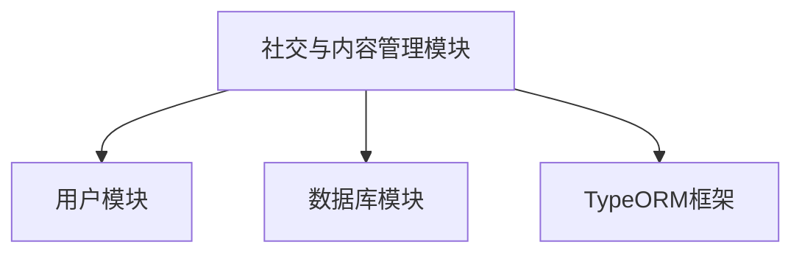

# 社交与内容管理模型

<cite>
**本文档引用的文件**  
- [post.entity.ts](file://agx-backend/src/entities/post.entity.ts)
- [comment.entity.ts](file://agx-backend/src/entities/comment.entity.ts)
- [like.entity.ts](file://agx-backend/src/entities/like.entity.ts)
- [topic.entity.ts](file://agx-backend/src/entities/topic.entity.ts)
- [conversation.entity.ts](file://agx-backend/src/entities/conversation.entity.ts)
- [schema.sql](file://agx-backend/schema.sql)
- [social-migration.sql](file://agx-backend/social-migration.sql)
</cite>

## 目录
1. [简介](#简介)
2. [项目结构](#项目结构)
3. [核心组件](#核心组件)
4. [架构概述](#架构概述)
5. [详细组件分析](#详细组件分析)
6. [依赖分析](#依赖分析)
7. [性能考虑](#性能考虑)
8. [故障排除指南](#故障排除指南)
9. [结论](#结论)

## 简介
本文档详细描述了社交与内容管理模块的数据模型，涵盖Post、Comment、Like、Topic和Conversation实体。重点解析发帖内容结构、评论层级关系、点赞去重机制、话题标签关联及私信会话模型。

## 项目结构
社交与内容管理模块主要位于agx-backend的entities目录下，包含帖子、评论、点赞、话题和会话等实体。数据库结构定义在schema.sql和social-migration.sql文件中。

**Diagram sources**
- [post.entity.ts](file://agx-backend/src/entities/post.entity.ts)
- [comment.entity.ts](file://agx-backend/src/entities/comment.entity.ts)
- [like.entity.ts](file://agx-backend/src/entities/like.entity.ts)
- [topic.entity.ts](file://agx-backend/src/entities/topic.entity.ts)
- [conversation.entity.ts](file://agx-backend/src/entities/conversation.entity.ts)
- [schema.sql](file://agx-backend/schema.sql)
- [social-migration.sql](file://agx-backend/social-migration.sql)

**Section sources**
- [post.entity.ts](file://agx-backend/src/entities/post.entity.ts)
- [comment.entity.ts](file://agx-backend/src/entities/comment.entity.ts)
- [like.entity.ts](file://agx-backend/src/entities/like.entity.ts)
- [topic.entity.ts](file://agx-backend/src/entities/topic.entity.ts)
- [conversation.entity.ts](file://agx-backend/src/entities/conversation.entity.ts)
- [schema.sql](file://agx-backend/schema.sql)
- [social-migration.sql](file://agx-backend/social-migration.sql)

## 核心组件
本模块的核心组件包括帖子(Post)、评论(Comment)、点赞(Like)、话题(Topic)和会话(Conversation)实体，它们共同构成了社交互动的基础数据结构。

**Section sources**
- [post.entity.ts](file://agx-backend/src/entities/post.entity.ts)
- [comment.entity.ts](file://agx-backend/src/entities/comment.entity.ts)
- [like.entity.ts](file://agx-backend/src/entities/like.entity.ts)
- [topic.entity.ts](file://agx-backend/src/entities/topic.entity.ts)
- [conversation.entity.ts](file://agx-backend/src/entities/conversation.entity.ts)

## 架构概述
社交与内容管理模块采用分层架构，实体层定义数据模型，服务层处理业务逻辑，控制器层提供API接口。数据存储使用PostgreSQL，通过TypeORM进行ORM映射。

**Diagram sources**
- [post.entity.ts](file://agx-backend/src/entities/post.entity.ts)
- [comment.entity.ts](file://agx-backend/src/entities/comment.entity.ts)
- [like.entity.ts](file://agx-backend/src/entities/like.entity.ts)
- [topic.entity.ts](file://agx-backend/src/entities/topic.entity.ts)
- [conversation.entity.ts](file://agx-backend/src/entities/conversation.entity.ts)

## 详细组件分析

### 帖子实体分析
帖子实体(Post)是社交内容的核心，包含发帖用户ID、内容、图片、话题标签等字段。通过userId字段与用户表关联，通过likeCount和commentCount字段维护点赞和评论计数。

**Diagram sources**
- [post.entity.ts](file://agx-backend/src/entities/post.entity.ts)

**Section sources**
- [post.entity.ts](file://agx-backend/src/entities/post.entity.ts)

### 评论实体分析
评论实体(Comment)支持父子评论的层级结构，通过parentId字段实现树形结构。虽然没有使用@Tree装饰器，但通过parentId字段实现了类似功能。评论可以回复其他用户，通过replyToUserId字段记录被回复的用户。

**Diagram sources**
- [comment.entity.ts](file://agx-backend/src/entities/comment.entity.ts)

**Section sources**
- [comment.entity.ts](file://agx-backend/src/entities/comment.entity.ts)

### 点赞实体分析
点赞实体(Like)支持对帖子和评论的点赞，通过targetType和targetId字段实现多态关联。通过在数据库层面创建联合唯一索引，防止用户对同一目标重复点赞。

**Diagram sources**
- [like.entity.ts](file://agx-backend/src/entities/like.entity.ts)

**Section sources**
- [like.entity.ts](file://agx-backend/src/entities/like.entity.ts)

### 话题实体分析
话题实体(Topic)用于管理热门话题，包含话题标签、描述、图标等信息。通过postCount和viewCount字段维护话题的热度。

**Diagram sources**
- [topic.entity.ts](file://agx-backend/src/entities/topic.entity.ts)

**Section sources**
- [topic.entity.ts](file://agx-backend/src/entities/topic.entity.ts)

### 会话实体分析
会话实体(Conversation)用于管理用户间的私聊会话，每对好友只有一个会话。通过userAId和userBId字段标识会话双方，通过unreadA和unreadB字段维护未读消息计数。

**Diagram sources**
- [conversation.entity.ts](file://agx-backend/src/entities/conversation.entity.ts)

**Section sources**
- [conversation.entity.ts](file://agx-backend/src/entities/conversation.entity.ts)

## 依赖分析
社交与内容管理模块依赖于用户模块、数据库模块和TypeORM框架。实体之间通过外键关联，形成完整的社交互动数据模型。

**Diagram sources**
- [post.entity.ts](file://agx-backend/src/entities/post.entity.ts)
- [comment.entity.ts](file://agx-backend/src/entities/comment.entity.ts)
- [like.entity.ts](file://agx-backend/src/entities/like.entity.ts)
- [topic.entity.ts](file://agx-backend/src/entities/topic.entity.ts)
- [conversation.entity.ts](file://agx-backend/src/entities/conversation.entity.ts)

**Section sources**
- [post.entity.ts](file://agx-backend/src/entities/post.entity.ts)
- [comment.entity.ts](file://agx-backend/src/entities/comment.entity.ts)
- [like.entity.ts](file://agx-backend/src/entities/like.entity.ts)
- [topic.entity.ts](file://agx-backend/src/entities/topic.entity.ts)
- [conversation.entity.ts](file://agx-backend/src/entities/conversation.entity.ts)

## 性能考虑
为提高查询性能，在关键字段上创建了索引，如userId、postId、parentId等。对于高并发场景，建议使用Redis缓存热点数据，如热门帖子和话题。

**Section sources**
- [schema.sql](file://agx-backend/schema.sql)
- [social-migration.sql](file://agx-backend/social-migration.sql)

## 故障排除指南
常见问题包括索引缺失导致查询缓慢、联合唯一约束冲突等。可通过检查数据库索引和约束定义来排查问题。

**Section sources**
- [schema.sql](file://agx-backend/schema.sql)
- [social-migration.sql](file://agx-backend/social-migration.sql)

## 结论
社交与内容管理模块通过精心设计的数据模型，实现了完整的社交互动功能。各实体之间的关系清晰，性能优化措施到位，为上层业务提供了坚实的基础。