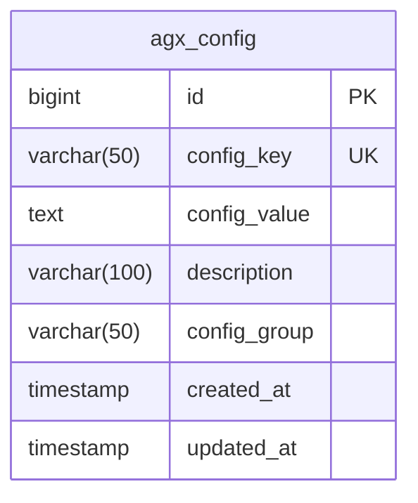
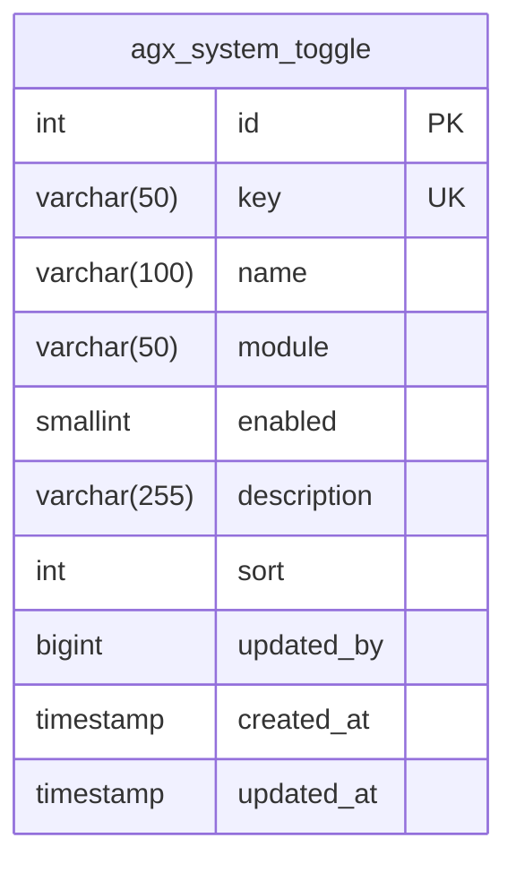
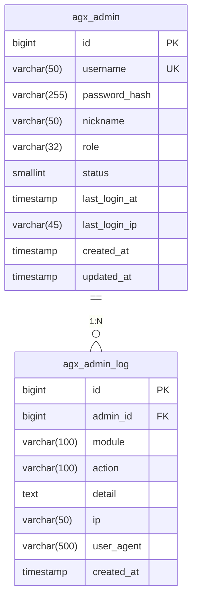
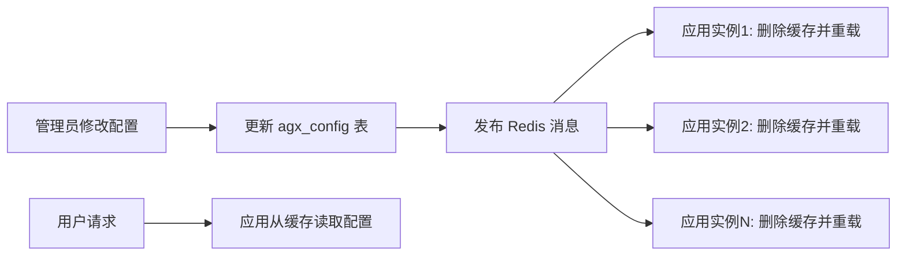

# 系统配置与日志模型

<cite>
**本文档引用文件**  
- [config.entity.ts](file://agx-backend/src/entities/config.entity.ts)
- [system-toggle.entity.ts](file://agx-backend/src/entities/system-toggle.entity.ts)
- [admin-log.entity.ts](file://agx-backend/src/entities/admin-log.entity.ts)
- [asset-log.entity.ts](file://agx-backend/src/entities/asset-log.entity.ts)
- [schema.sql](file://agx-backend/schema.sql)
</cite>

## 目录
1. [引言](#引言)
2. [系统配置实体](#系统配置实体)
3. [功能开关实体](#功能开关实体)
4. [管理员操作日志](#管理员操作日志)
5. [资产操作日志](#资产操作日志)
6. [日志职责分离机制](#日志职责分离机制)
7. [配置热更新数据流](#配置热更新数据流)
8. [高效读取模式](#高效读取模式)
9. [日志表分表与归档策略](#日志表分表与归档策略)
10. [数据库设计规范](#数据库设计规范)

## 引言
本文档详细阐述了系统中核心的配置与日志实体模型，包括配置项管理、功能开关控制、管理员行为审计及资产变动追踪。通过分析 `Config`、`SystemToggle`、`AdminLog` 和 `OperLog`（即 `AssetLog`）实体，揭示其数据结构、职责划分及运行机制。文档还探讨了配置热更新流程、基于数据库+缓存的读取优化方案，以及日志表的分表与归档策略，并结合 `schema.sql` 说明加密存储与审计字段的设计。

## 系统配置实体
`Config` 实体（对应数据库表 `agx_config`）是系统全局配置的核心，采用键值对（Key-Value）结构存储各类配置信息。

该实体的关键字段包括：
- **configKey**: 配置键，作为唯一标识符，用于程序中快速查找。
- **configValue**: 配置值，以文本格式存储，可容纳字符串、JSON序列化数据等，支持灵活的数据类型。
- **configGroup**: 配置分组，用于将配置项按功能或模块（如“支付”、“安全”、“界面”）进行逻辑划分，便于管理。
- **description**: 配置描述，提供配置项的业务含义说明。

此设计支持多环境配置管理，通过在不同环境（开发、测试、生产）的数据库中部署不同的 `config_value` 值，实现环境差异化配置，而无需修改代码。



**图表来源**
- [config.entity.ts](file://agx-backend/src/entities/config.entity.ts#L14-L30)
- [schema.sql](file://agx-backend/schema.sql#L309-L317)

**本节来源**
- [config.entity.ts](file://agx-backend/src/entities/config.entity.ts#L1-L32)
- [schema.sql](file://agx-backend/schema.sql#L309-L317)

## 功能开关实体
`SystemToggle` 实体（对应数据库表 `agx_system_toggle`）实现了系统功能的动态开关控制，其核心优势在于**实时生效**。

其工作原理如下：
1.  **集中管理**：所有功能开关的开启/关闭状态集中存储在数据库中。
2.  **应用监听**：后端应用启动时或通过定时任务/消息队列，将开关配置加载到内存或缓存（如Redis）中。
3.  **实时查询**：当业务代码执行到需要判断功能是否开启的节点时，直接查询内存或缓存中的开关状态。
4.  **动态更新**：管理员在管理后台修改开关状态后，系统会立即更新数据库，并通过发布-订阅模式（如Redis Pub/Sub）通知所有应用实例刷新其本地缓存。

这种机制避免了重启服务，实现了功能的秒级上线或下线。



**图表来源**
- [system-toggle.entity.ts](file://agx-backend/src/entities/system-toggle.entity.ts#L19-L46)
- [schema.sql](file://agx-backend/schema.sql) (未直接定义，但可通过实体推断)

**本节来源**
- [system-toggle.entity.ts](file://agx-backend/src/entities/system-toggle.entity.ts#L1-L48)

## 管理员操作日志
`AdminLog` 实体（对应数据库表 `agx_admin_log`）专门用于记录管理员在后台管理系统中的所有操作行为，是安全审计和责任追溯的关键。

其主要职责包括：
- **记录操作主体**：通过 `adminId` 关联 `agx_admin` 表，明确操作人。
- **记录操作行为**：`module` 字段记录操作所属模块（如“用户管理”、“配置管理”），`action` 字段记录具体动作（如“创建用户”、“修改配置”）。
- **记录操作详情**：`detail` 字段可存储操作前后的数据快照或详细描述。
- **记录操作环境**：`ip` 和 `userAgent` 字段记录操作发生的IP地址和浏览器信息，用于安全分析。



**图表来源**
- [admin-log.entity.ts](file://agx-backend/src/entities/admin-log.entity.ts#L16-L38)
- [schema.sql](file://agx-backend/schema.sql#L348-L360)

**本节来源**
- [admin-log.entity.ts](file://agx-backend/src/entities/admin-log.entity.ts#L1-L40)

## 资产操作日志
`AssetLog` 实体（对应数据库表 `agx_asset_log`）用于追踪用户资产（如币种余额）的所有变动，确保资产流水的可追溯性。

其核心字段设计旨在精确记录每一次资产变动：
- **userId**: 关联用户，明确资产变动的主体。
- **coin**: 记录变动的币种（如 AGX, USDT）。
- **type**: 变动类型，枚举值如 `recharge`（充值）、`withdraw`（提现）、`pool_in`（存入矿池）、`commission`（返佣）等。
- **amount**: 变动金额，使用高精度的 `decimal` 类型存储。
- **balanceBefore** 和 **balanceAfter**: 分别记录变动前后的余额，用于校验和对账。
- **refNo**: 关联单号，可关联到具体的充值单、提现单等业务单据。

```mermaid
erDiagram
agx_user ||--o{ agx_asset_log : "1:N"
agx_user {
bigint id PK
varchar(32) uid UK
varchar(50) username UK
timestamp created_at
}
agx_asset_log {
bigint id PK
bigint user_id FK
varchar(20) coin
varchar(20) type
decimal(30,8) amount
decimal(30,8) balance_before
decimal(30,8) balance_after
varchar(50) ref_no
varchar(255) remark
timestamp created_at
}
```

**图表来源**
- [asset-log.entity.ts](file://agx-backend/src/entities/asset-log.entity.ts#L17-L47)
- [schema.sql](file://agx-backend/schema.sql) (未直接定义，但可通过实体推断)

**本节来源**
- [asset-log.entity.ts](file://agx-backend/src/entities/asset-log.entity.ts#L1-L49)

## 日志职责分离机制
系统通过 `AdminLog` 和 `OperLog`（`AssetLog`）的明确分工，实现了日志的精细化管理：

- **AdminLog (管理员日志)**：
  - **职责**：记录**管理员**在后台执行的**管理性操作**。
  - **范围**：侧重于系统配置变更、用户权限调整、内容审核等后台管理行为。
  - **目的**：安全审计、操作追溯、责任认定。

- **OperLog / AssetLog (操作日志)**：
  - **职责**：记录**普通用户**在前台执行的**业务性操作**，特别是**资产变动**。
  - **范围**：侧重于充值、提现、交易、参与活动等直接影响用户资产的业务流程。
  - **目的**：业务对账、用户行为分析、资产安全监控。

这种分离确保了日志的清晰度和针对性，便于后续的查询、分析和合规性检查。

**本节来源**
- [admin-log.entity.ts](file://agx-backend/src/entities/admin-log.entity.ts)
- [asset-log.entity.ts](file://agx-backend/src/entities/asset-log.entity.ts)

## 配置热更新数据流
配置热更新的数据流遵循“数据库持久化 + 缓存加速 + 实时通知”的模式：

1.  **数据源**：所有配置项的最终状态存储在 `agx_config` 数据库表中。
2.  **缓存层**：应用启动时，从数据库批量加载所有配置项，并存入Redis等缓存中，键通常为 `config:{key}`。
3.  **应用读取**：应用代码在需要配置时，优先从缓存中读取，极大提升读取性能。
4.  **更新触发**：管理员在后台修改配置，更新数据库。
5.  **通知机制**：数据库更新后，系统向Redis频道（如 `config:updated`）发布一条消息，内容为被修改的 `config_key`。
6.  **缓存刷新**：所有应用实例订阅该频道，收到消息后立即删除本地缓存中对应的键，并从数据库重新加载最新值。

此流程确保了配置变更的实时性，同时保证了高并发下的读取效率。



**本节来源**
- [config.entity.ts](file://agx-backend/src/entities/config.entity.ts)
- [system-toggle.entity.ts](file://agx-backend/src/entities/system-toggle.entity.ts)

## 高效读取模式
为了实现配置和日志的高效读取，系统采用了“数据库+缓存”的混合模式：

- **配置项读取**：
  - **读路径**：应用 → Redis缓存 → （缓存未命中）→ PostgreSQL数据库。
  - **写路径**：管理后台 → PostgreSQL数据库 → (触发) → 清除Redis缓存。
  - **优势**：利用Redis的内存特性，将高频读取的配置项访问延迟降至毫秒级。

- **日志读取**：
  - **写入**：日志产生后，通过异步队列（如Kafka）批量写入数据库，避免阻塞主业务流程。
  - **查询**：对于高频查询的日志（如近期操作），可将聚合结果缓存到Redis；对于复杂查询和历史日志，则直接查询数据库或专用的分析型数据库（如Elasticsearch）。

**本节来源**
- [config.entity.ts](file://agx-backend/src/entities/config.entity.ts)
- [admin-log.entity.ts](file://agx-backend/src/entities/admin-log.entity.ts)
- [asset-log.entity.ts](file://agx-backend/src/entities/asset-log.entity.ts)

## 日志表分表与归档策略
随着业务增长，日志表会迅速膨胀，因此需要分表与归档策略：

- **分表策略**：
  - **按时间分表**：例如，`agx_admin_log` 表可按月分表为 `agx_admin_log_202501`, `agx_admin_log_202502`... 这能有效控制单表数据量，提升查询性能。
  - **按业务分表**：将不同类型的日志存入不同的表，如已有的 `agx_admin_log` 和 `agx_asset_log` 的分离。

- **归档策略**：
  - **冷热分离**：将超过一定期限（如一年）的历史日志从主数据库归档到成本更低的存储系统（如对象存储OSS或数据仓库）。
  - **自动化脚本**：通过定时任务（Crontab）定期执行数据迁移和删除脚本，确保主库性能。

**本节来源**
- [schema.sql](file://agx-backend/schema.sql)
- [admin-log.entity.ts](file://agx-backend/src/entities/admin-log.entity.ts)
- [asset-log.entity.ts](file://agx-backend/src/entities/asset-log.entity.ts)

## 数据库设计规范
根据 `schema.sql` 文件，系统在配置和日志设计上遵循了以下规范：

- **配置项加密存储**：虽然 `agx_config.config_value` 为明文TEXT类型，但敏感配置（如API密钥）应在应用层进行加密后再存入，或使用专门的密钥管理服务。
- **日志审计字段**：所有日志表均包含 `created_at` 字段，精确记录操作时间，是审计的基础。`AdminLog` 还包含 `ip` 和 `userAgent`，增强了安全审计能力。
- **索引优化**：关键查询字段均建立了索引，如 `agx_admin_log` 的 `admin_id` 索引，`agx_asset_log` 的 `user_id` 索引，以保障查询效率。
- **数据类型选择**：对金额等高精度数据使用 `decimal(precision, scale)` 类型，避免浮点数计算误差。

**本节来源**
- [schema.sql](file://agx-backend/schema.sql#L309-L360)
- [config.entity.ts](file://agx-backend/src/entities/config.entity.ts)
- [admin-log.entity.ts](file://agx-backend/src/entities/admin-log.entity.ts)