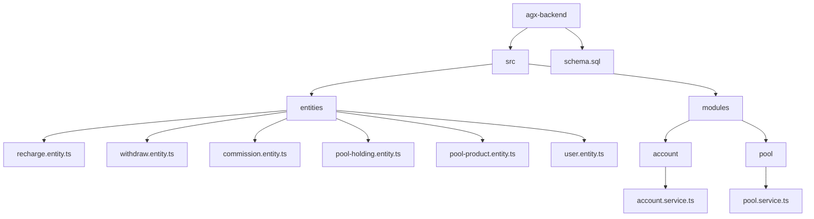
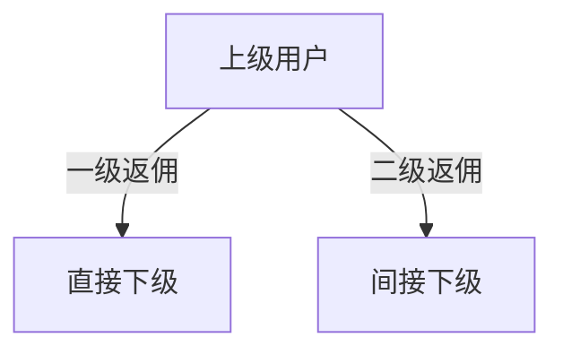
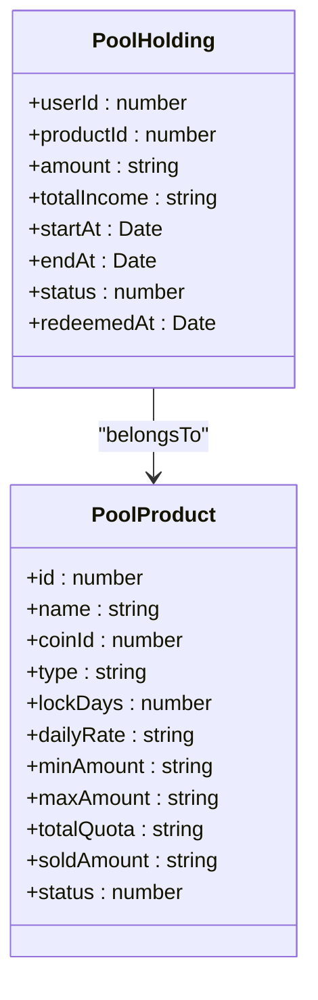
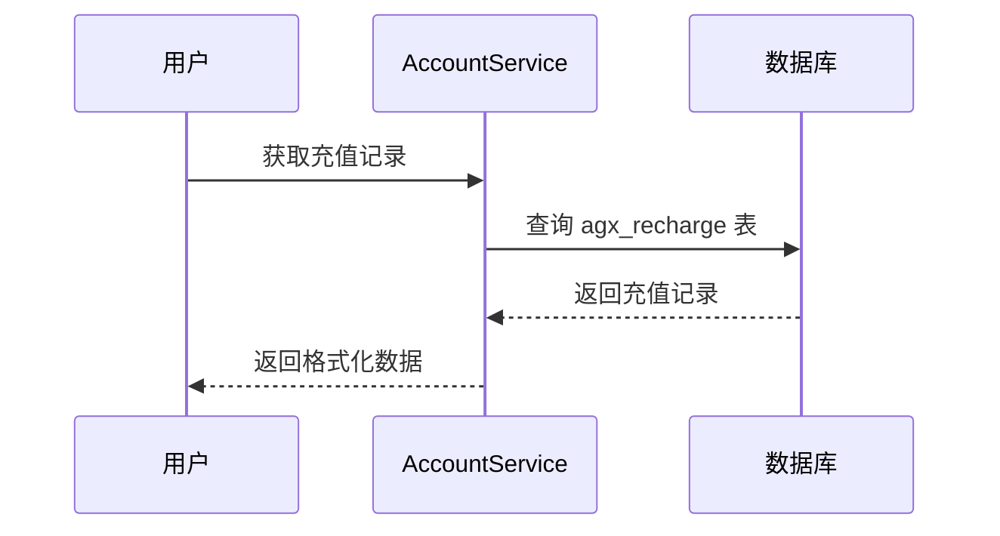
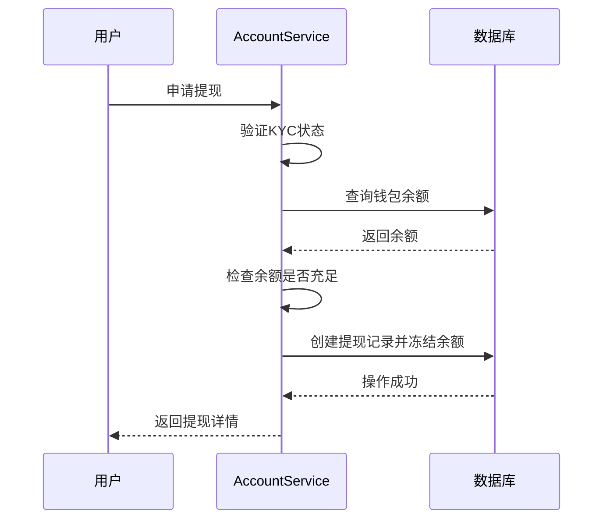
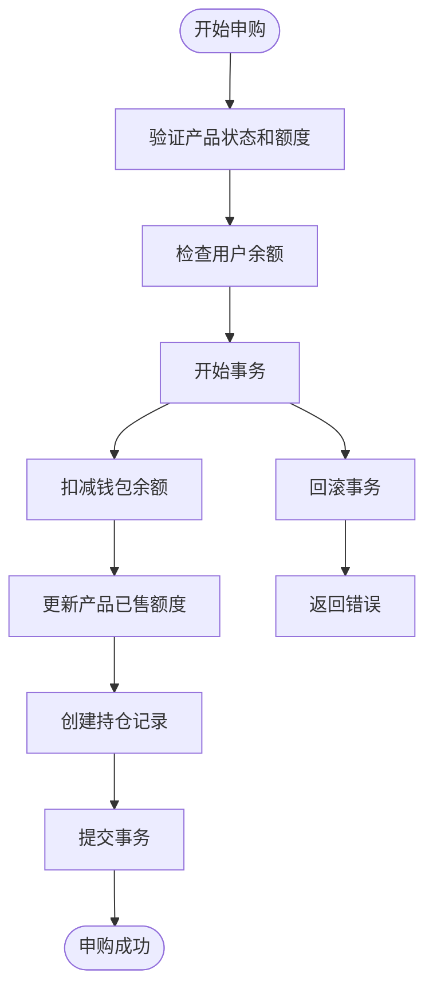

# 财务交易相关模型

<cite>
**本文档引用文件**  
- [recharge.entity.ts](file://agx-backend/src/entities/recharge.entity.ts)
- [withdraw.entity.ts](file://agx-backend/src/entities/withdraw.entity.ts)
- [commission.entity.ts](file://agx-backend/src/entities/commission.entity.ts)
- [pool-holding.entity.ts](file://agx-backend/src/entities/pool-holding.entity.ts)
- [pool-product.entity.ts](file://agx-backend/src/entities/pool-product.entity.ts)
- [user.entity.ts](file://agx-backend/src/entities/user.entity.ts)
- [account.service.ts](file://agx-backend/src/modules/account/account.service.ts)
- [pool.service.ts](file://agx-backend/src/modules/pool/pool.service.ts)
- [schema.sql](file://agx-backend/schema.sql)
</cite>

## 目录
1. [项目结构](#项目结构)
2. [核心财务实体模型](#核心财务实体模型)
3. [资金流动与事务处理](#资金流动与事务处理)
4. [关键实现建议](#关键实现建议)
5. [数据库审计与索引策略](#数据库审计与索引策略)

## 项目结构



**图示来源**
- [recharge.entity.ts](file://agx-backend/src/entities/recharge.entity.ts)
- [withdraw.entity.ts](file://agx-backend/src/entities/withdraw.entity.ts)
- [commission.entity.ts](file://agx-backend/src/entities/commission.entity.ts)
- [pool-holding.entity.ts](file://agx-backend/src/entities/pool-holding.entity.ts)
- [pool-product.entity.ts](file://agx-backend/src/entities/pool-product.entity.ts)
- [user.entity.ts](file://agx-backend/src/entities/user.entity.ts)
- [account.service.ts](file://agx-backend/src/modules/account/account.service.ts)
- [pool.service.ts](file://agx-backend/src/modules/pool/pool.service.ts)
- [schema.sql](file://agx-backend/schema.sql)

## 核心财务实体模型

### 充值记录 (Recharge)

充值记录实体 `Recharge` 用于跟踪用户的充值行为，包含链上交易信息和状态流转。

**字段说明：**
- `orderNo`: 订单号，唯一标识一次充值
- `userId`: 用户ID，外键关联用户表
- `coin`: 币种（如 USDT）
- `chain`: 链网络（如 TRC20）
- `amount`: 充值金额，高精度小数
- `txHash`: 交易哈希，用于链上验证
- `fromAddress`: 来源地址
- `toAddress`: 目标地址
- `status`: 状态码，0=待确认，1=已完成，2=失败
- `confirmations`: 确认数，用于判断交易是否安全
- `createdAt`: 创建时间
- `updatedAt`: 更新时间

**状态流转：**
```
待确认 (0) → 已完成 (1)
         ↘ 失败 (2)
```

**Section sources**
- [recharge.entity.ts](file://agx-backend/src/entities/recharge.entity.ts)

### 提现申请 (Withdraw)

提现记录实体 `Withdraw` 管理用户的提现请求，包含审核流程和手续费计算。

**字段说明：**
- `orderNo`: 订单号，唯一标识一次提现
- `userId`: 用户ID，外键关联用户表
- `coin`: 币种
- `chain`: 链网络
- `amount`: 提现金额
- `fee`: 手续费
- `actualAmount`: 实际到账金额（amount - fee）
- `toAddress`: 提现地址
- `txHash`: 链上交易哈希
- `status`: 状态码，0=待审核，1=处理中，2=已完成，3=拒绝
- `remark`: 审核备注
- `reviewedAt`: 审核时间
- `createdAt`: 创建时间
- `updatedAt`: 更新时间

**审核流程：**
```
待审核 (0) → 处理中 (1) → 已完成 (2)
         ↘ 拒绝 (3)
```

**Section sources**
- [withdraw.entity.ts](file://agx-backend/src/entities/withdraw.entity.ts)

### 佣金记录 (Commission)

佣金实体 `Commission` 实现多层级分佣结构，支持不同来源的返佣。

**字段说明：**
- `userId`: 获得返佣的用户ID
- `fromUserId`: 产生返佣的下级用户ID
- `level`: 返佣层级，1=一级，2=二级
- `source`: 来源类型（如 pool、contract）
- `sourceId`: 来源订单ID
- `coin`: 币种
- `amount`: 返佣金额
- `rate`: 返佣比例
- `status`: 状态，0=待发放，1=已发放
- `createdAt`: 创建时间

**层级分佣结构：**


**Section sources**
- [commission.entity.ts](file://agx-backend/src/entities/commission.entity.ts)

### 矿池持仓 (PoolHolding)

矿池持仓实体 `PoolHolding` 记录用户在矿池产品中的投资份额和收益。

**字段说明：**
- `userId`: 用户ID
- `productId`: 产品ID，外键关联矿池产品
- `amount`: 持仓数量
- `totalIncome`: 累计收益
- `startAt`: 开始计息时间
- `endAt`: 到期时间（定期产品）
- `status`: 状态，0=已赎回，1=持仓中
- `redeemedAt`: 赎回时间
- `createdAt`: 创建时间
- `updatedAt`: 更新时间

**与矿池产品的绑定关系：**


**图示来源**
- [pool-holding.entity.ts](file://agx-backend/src/entities/pool-holding.entity.ts)
- [pool-product.entity.ts](file://agx-backend/src/entities/pool-product.entity.ts)

**Section sources**
- [pool-holding.entity.ts](file://agx-backend/src/entities/pool-holding.entity.ts)
- [pool-product.entity.ts](file://agx-backend/src/entities/pool-product.entity.ts)

## 资金流动与事务处理

### 充值流程

充值操作通过 `AccountService` 中的 `getDepositHistory` 方法实现，确保充值记录与钱包余额更新的一致性。



**图示来源**
- [account.service.ts](file://agx-backend/src/modules/account/account.service.ts)
- [recharge.entity.ts](file://agx-backend/src/entities/recharge.entity.ts)

### 提现流程

提现操作在 `AccountService` 的 `withdraw` 方法中实现，包含KYC验证、余额检查和冻结。



**图示来源**
- [account.service.ts](file://agx-backend/src/modules/account/account.service.ts)
- [withdraw.entity.ts](file://agx-backend/src/entities/withdraw.entity.ts)

### 矿池申购与赎回

矿池操作在 `PoolService` 中通过事务保证数据一致性。



**图示来源**
- [pool.service.ts](file://agx-backend/src/modules/pool/pool.service.ts)
- [pool-holding.entity.ts](file://agx-backend/src/entities/pool-holding.entity.ts)

**Section sources**
- [account.service.ts](file://agx-backend/src/modules/account/account.service.ts)
- [pool.service.ts](file://agx-backend/src/modules/pool/pool.service.ts)

## 关键实现建议

### 防重提交与幂等性控制

- **订单号唯一性**：所有交易记录（充值、提现）使用唯一订单号，防止重复提交
- **状态机控制**：通过状态字段严格控制流程流转，避免重复操作
- **数据库约束**：利用唯一索引（如 `order_no`）确保数据唯一性

### 对账索引设计

- 在 `agx_recharge` 表中为 `user_id` 和 `status` 建立复合索引
- 在 `agx_withdraw` 表中为 `user_id` 和 `status` 建立复合索引
- 在 `agx_pool_holding` 表中为 `user_id` 和 `status` 建立复合索引

## 数据库审计与索引策略

### 审计字段

所有财务相关表均包含以下审计字段：
- `created_at`: 记录创建时间
- `updated_at`: 记录更新时间
- 部分表包含 `deleted_at` 实现软删除

### 索引策略

根据 `schema.sql` 文件，关键索引包括：

| 表名 | 索引名 | 字段 | 用途 |
|------|-------|------|------|
| agx_recharge | idx_user_id | user_id | 按用户查询充值记录 |
| agx_recharge | idx_status | status | 按状态查询 |
| agx_withdraw | idx_user_id | user_id | 按用户查询提现记录 |
| agx_withdraw | idx_status | status | 按状态查询 |
| agx_pool_holding | idx_user_id | user_id | 按用户查询持仓 |
| agx_pool_holding | idx_status | status | 按状态查询 |

**Section sources**
- [schema.sql](file://agx-backend/schema.sql)