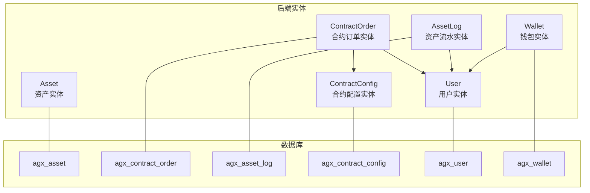
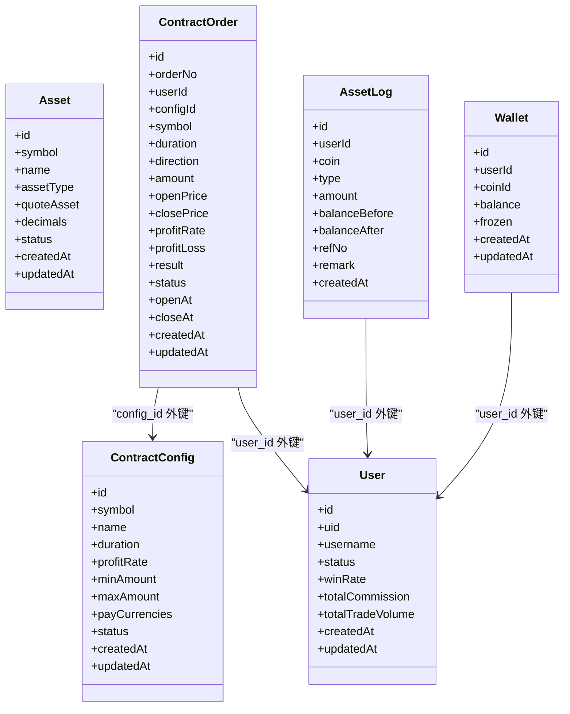
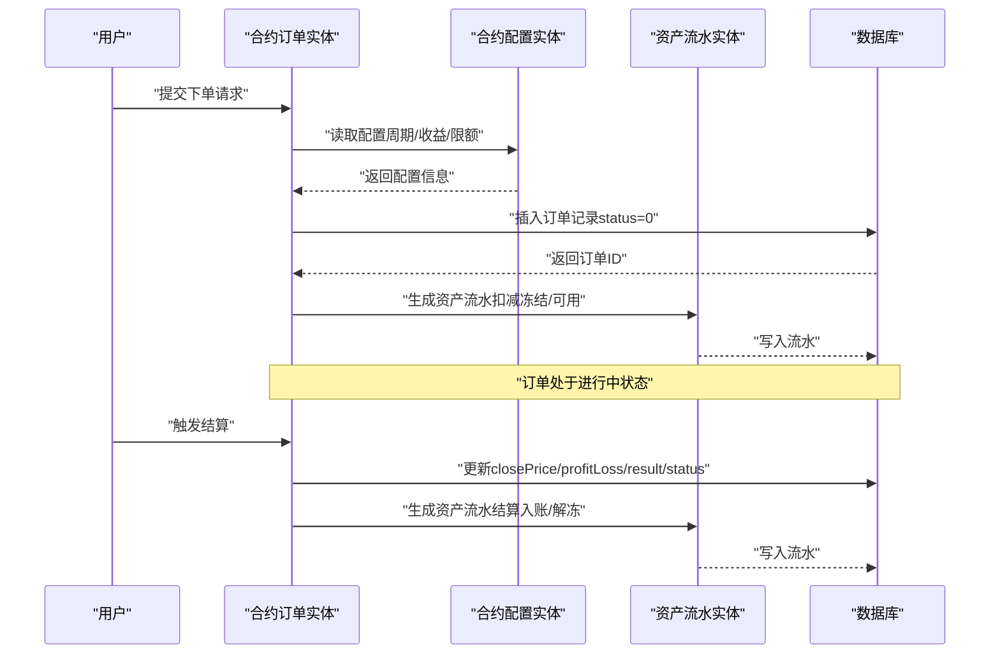
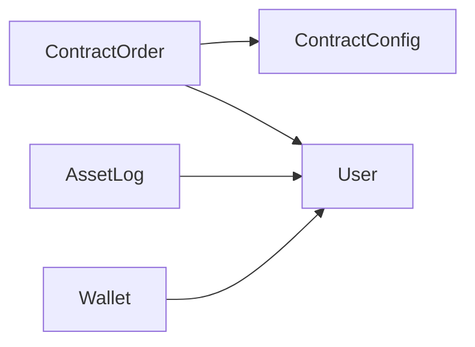

# 资产与合约订单模型

<cite>
**本文引用的文件列表**
- [asset.entity.ts](file://agx-backend/src/entities/asset.entity.ts)
- [contract-order.entity.ts](file://agx-backend/src/entities/contract-order.entity.ts)
- [asset-log.entity.ts](file://agx-backend/src/entities/asset-log.entity.ts)
- [contract-config.entity.ts](file://agx-backend/src/entities/contract-config.entity.ts)
- [user.entity.ts](file://agx-backend/src/entities/user.entity.ts)
- [wallet.entity.ts](file://agx-backend/src/entities/wallet.entity.ts)
- [schema.sql](file://agx-backend/schema.sql)
- [admin.service.ts](file://agx-backend/src/modules/admin/admin.service.ts)
</cite>

## 目录
1. [引言](#引言)
2. [项目结构](#项目结构)
3. [核心组件](#核心组件)
4. [架构总览](#架构总览)
5. [详细组件分析](#详细组件分析)
6. [依赖关系分析](#依赖关系分析)
7. [性能与索引优化](#性能与索引优化)
8. [故障排查指南](#故障排查指南)
9. [结论](#结论)
10. [附录](#附录)

## 引言
本文件围绕资产（Asset）与合约订单（ContractOrder）两大实体，系统梳理其数据模型、字段语义、业务含义与相互关系。重点包括：
- 资产实体的字段定义与业务含义，以及与资产流水（AssetLog）的关联关系；
- 合约订单的状态机设计、杠杆与保证金相关字段、与合约配置（ContractConfig）的引用关系；
- 资产与订单之间的多对多交互流程；
- TypeORM 中 @ManyToOne 与 @JoinColumn 的应用；
- 基于 TypeORM 的复杂查询示例（如按资产统计未平仓合约）；
- 高频交易场景下的索引优化与数据库锁策略建议；
- schema.sql 中资产与订单表的初始化结构说明。

## 项目结构
本项目采用分层与模块化组织，实体位于 backend 的 entities 目录，数据库初始化脚本位于根目录 schema.sql。资产与合约订单模型主要分布在以下文件：
- 资产实体：asset.entity.ts
- 合约订单实体：contract-order.entity.ts
- 资产流水实体：asset-log.entity.ts
- 合约配置实体：contract-config.entity.ts
- 用户实体：user.entity.ts
- 钱包实体：wallet.entity.ts
- 数据库初始化脚本：schema.sql
- 复杂查询示例：admin.service.ts

图表来源
- [asset.entity.ts](file://agx-backend/src/entities/asset.entity.ts#L1-L80)
- [contract-order.entity.ts](file://agx-backend/src/entities/contract-order.entity.ts#L1-L81)
- [asset-log.entity.ts](file://agx-backend/src/entities/asset-log.entity.ts#L1-L49)
- [contract-config.entity.ts](file://agx-backend/src/entities/contract-config.entity.ts#L1-L47)
- [user.entity.ts](file://agx-backend/src/entities/user.entity.ts#L1-L118)
- [wallet.entity.ts](file://agx-backend/src/entities/wallet.entity.ts#L1-L42)
- [schema.sql](file://agx-backend/schema.sql#L170-L206)

章节来源
- [asset.entity.ts](file://agx-backend/src/entities/asset.entity.ts#L1-L80)
- [contract-order.entity.ts](file://agx-backend/src/entities/contract-order.entity.ts#L1-L81)
- [asset-log.entity.ts](file://agx-backend/src/entities/asset-log.entity.ts#L1-L49)
- [contract-config.entity.ts](file://agx-backend/src/entities/contract-config.entity.ts#L1-L47)
- [user.entity.ts](file://agx-backend/src/entities/user.entity.ts#L1-L118)
- [wallet.entity.ts](file://agx-backend/src/entities/wallet.entity.ts#L1-L42)
- [schema.sql](file://agx-backend/schema.sql#L170-L206)

## 核心组件
- 资产（Asset）
  - 关键字段：symbol、name、nameEn、nameZh、assetType、quoteAsset、icon、decimals、dataSource、dataSourceSymbol、isTradable、isContract、isHot、sortOrder、status、extra、createdAt、updatedAt。
  - 业务含义：用于统一管理多类资产（加密货币、外汇、股票、贵金属、基金、指数），包含交易性与合约支持标记、排序与状态控制等。
- 合约订单（ContractOrder）
  - 关键字段：orderNo、userId、configId、symbol、duration、direction、amount、openPrice、closePrice、profitRate、profitLoss、result、status、openAt、closeAt、createdAt、updatedAt。
  - 业务含义：记录用户在特定合约配置下的开仓、持有与平仓过程，支持方向（看涨/看跌）、周期、金额与盈亏统计。
- 合约配置（ContractConfig）
  - 关键字段：symbol、name、duration、profitRate、minAmount、maxAmount、payCurrencies、status、createdAt、updatedAt。
  - 业务含义：定义合约交易对、周期、收益与下单限额等规则。
- 资产流水（AssetLog）
  - 关键字段：userId、coin、type、amount、balanceBefore、balanceAfter、refNo、remark、createdAt。
  - 业务含义：记录用户资产变动明细，便于审计与对账。
- 用户（User）
  - 关键字段：uid、username、passwordHash、inviteCode、kycStatus、status、winRate、level、totalCommission、totalTradeVolume、socialStatus 等。
  - 业务含义：用户身份与风控、等级、返佣等信息。
- 钱包（Wallet）
  - 关键字段：userId、coinId、balance、frozen、createdAt、updatedAt。
  - 业务含义：用户在各币种的可用与冻结余额。

章节来源
- [asset.entity.ts](file://agx-backend/src/entities/asset.entity.ts#L1-L80)
- [contract-order.entity.ts](file://agx-backend/src/entities/contract-order.entity.ts#L1-L81)
- [contract-config.entity.ts](file://agx-backend/src/entities/contract-config.entity.ts#L1-L47)
- [asset-log.entity.ts](file://agx-backend/src/entities/asset-log.entity.ts#L1-L49)
- [user.entity.ts](file://agx-backend/src/entities/user.entity.ts#L1-L118)
- [wallet.entity.ts](file://agx-backend/src/entities/wallet.entity.ts#L1-L42)

## 架构总览
资产与合约订单模型通过 TypeORM 实体映射到 PostgreSQL 表，形成如下关系：
- ContractOrder 与 ContractConfig：一对多引用，通过 config_id 外键关联；
- ContractOrder 与 User：多对一引用，通过 user_id 外键关联；
- AssetLog 与 User：多对一引用，通过 user_id 外键关联；
- Wallet 与 User：多对一引用，通过 user_id 外键关联；
- 资产（Asset）与合约配置（ContractConfig）：无直接外键约束，但通过 symbol 字段在业务上建立联系（例如合约订单中的 symbol 字段）。

图表来源
- [contract-order.entity.ts](file://agx-backend/src/entities/contract-order.entity.ts#L1-L81)
- [contract-config.entity.ts](file://agx-backend/src/entities/contract-config.entity.ts#L1-L47)
- [asset-log.entity.ts](file://agx-backend/src/entities/asset-log.entity.ts#L1-L49)
- [user.entity.ts](file://agx-backend/src/entities/user.entity.ts#L1-L118)
- [wallet.entity.ts](file://agx-backend/src/entities/wallet.entity.ts#L1-L42)

## 详细组件分析

### 资产（Asset）实体
- 字段与业务含义
  - symbol：资产代码（唯一索引），如“XAU/USD”、“BTC/USDT”等；
  - name/nameEn/nameZh：资产名称及国际化名称；
  - assetType：资产类型（crypto/forex/stock/metal/fund/index），配合索引提升筛选效率；
  - quoteAsset：报价资产（如 USD、USDT），用于定价与结算；
  - decimals：价格小数位数，影响显示与计算精度；
  - dataSource/dataSourceSymbol：数据源与对应符号，便于对接外部行情；
  - isTradable/isContract/isHot：交易性、合约支持与热门标记；
  - sortOrder/status：排序与启用状态；
  - extra：扩展配置（JSON 字符串）。
- 与资产流水（AssetLog）的关系
  - 资产流水记录用户在某币种的余额变动明细，可用于审计与财务核对；两者通过用户维度关联，便于追踪用户资产变化。

章节来源
- [asset.entity.ts](file://agx-backend/src/entities/asset.entity.ts#L1-L80)
- [asset-log.entity.ts](file://agx-backend/src/entities/asset-log.entity.ts#L1-L49)

### 合约订单（ContractOrder）实体
- 字段与业务含义
  - orderNo：订单号（唯一索引），用于幂等与追踪；
  - userId：下单用户；
  - configId：合约配置 ID，关联合约规则；
  - symbol/duration/direction：交易对、周期与方向（看涨/看跌）；
  - amount：下单金额；
  - openPrice/closePrice：开仓/平仓价格；
  - profitRate/profitLoss/result：收益率、盈亏金额与结果（盈/亏/平）；
  - status：状态（进行中/已结算），配合索引支持高频查询；
  - openAt/closeAt：开仓/平仓时间戳；
  - createdAt/updatedAt：创建与更新时间。
- 状态机设计
  - 初始状态：status=0（进行中）；
  - 结算状态：status=1（已结算），同时可能设置 result（1=盈，2=亏，3=平）与 closePrice、profitLoss 等字段。
- 与合约配置（ContractConfig）的引用关系
  - 通过 configId 外键关联，读取该配置的周期、收益、下单限额等规则，用于订单生命周期管理与风控校验。

章节来源
- [contract-order.entity.ts](file://agx-backend/src/entities/contract-order.entity.ts#L1-L81)
- [contract-config.entity.ts](file://agx-backend/src/entities/contract-config.entity.ts#L1-L47)

### 资产与订单的多对多交互流程
- 交互场景
  - 用户下单：根据合约配置生成订单，记录开仓价格与金额；
  - 订单结算：根据收盘价计算盈亏，更新订单状态与结果；
  - 资产流水：订单结算后产生资产变动流水，记录余额前后对比；
  - 风控与统计：按资产统计未平仓合约数量与金额，辅助风控与运营决策。
- 流程示意

图表来源
- [contract-order.entity.ts](file://agx-backend/src/entities/contract-order.entity.ts#L1-L81)
- [contract-config.entity.ts](file://agx-backend/src/entities/contract-config.entity.ts#L1-L47)
- [asset-log.entity.ts](file://agx-backend/src/entities/asset-log.entity.ts#L1-L49)

### TypeORM 关联注解与外键
- @ManyToOne 与 @JoinColumn 的应用
  - ContractOrder 与 ContractConfig：通过 config_id 外键关联；
  - ContractOrder 与 User：通过 user_id 外键关联；
  - AssetLog 与 User：通过 user_id 外键关联；
  - Wallet 与 User：通过 user_id 外键关联。
- 设计要点
  - 外键字段在实体中声明为数值型（bigint unsigned），与数据库表一致；
  - 使用 @JoinColumn 指定外键列名，确保与 schema.sql 定义一致；
  - 在高频查询字段上建立索引（如 order_no、user_id、status），以降低查询成本。

章节来源
- [contract-order.entity.ts](file://agx-backend/src/entities/contract-order.entity.ts#L1-L81)
- [asset-log.entity.ts](file://agx-backend/src/entities/asset-log.entity.ts#L1-L49)
- [user.entity.ts](file://agx-backend/src/entities/user.entity.ts#L1-L118)
- [wallet.entity.ts](file://agx-backend/src/entities/wallet.entity.ts#L1-L42)

### 复杂查询示例（基于 TypeORM）
以下示例展示如何使用 TypeORM 查询语言实现复杂统计，避免直接粘贴代码，仅给出路径与思路：
- 按资产统计未平仓合约
  - 思路：按合约订单的 symbol 分组，过滤 status=0 的记录，统计 amount 与数量；
  - 参考路径：[admin.service.ts](file://agx-backend/src/modules/admin/admin.service.ts#L482-L516) 中的统计模式（可借鉴 SUM/COUNT 与日期范围过滤）。
- 统计平台总资产（钱包余额总和）
  - 思路：对钱包表的 balance 与 frozen 求和；
  - 参考路径：[admin.service.ts](file://agx-backend/src/modules/admin/admin.service.ts#L512-L516)。
- 按用户统计今日订单数
  - 思路：按 createdAt >= 今日 的条件过滤，统计 count；
  - 参考路径：[admin.service.ts](file://agx-backend/src/modules/admin/admin.service.ts#L506-L510)。

章节来源
- [admin.service.ts](file://agx-backend/src/modules/admin/admin.service.ts#L482-L516)

## 依赖关系分析
- 实体耦合
  - ContractOrder 依赖 ContractConfig 与 User，承担订单生命周期与风控；
  - AssetLog 依赖 User，承载资产变动审计；
  - Wallet 依赖 User，承载用户资产余额。
- 外部依赖
  - schema.sql 定义了表结构与索引，TypeORM 实体需与之保持一致；
  - PostgreSQL 索引直接影响查询性能，需与实体索引注解协同。

图表来源
- [contract-order.entity.ts](file://agx-backend/src/entities/contract-order.entity.ts#L1-L81)
- [contract-config.entity.ts](file://agx-backend/src/entities/contract-config.entity.ts#L1-L47)
- [asset-log.entity.ts](file://agx-backend/src/entities/asset-log.entity.ts#L1-L49)
- [user.entity.ts](file://agx-backend/src/entities/user.entity.ts#L1-L118)
- [wallet.entity.ts](file://agx-backend/src/entities/wallet.entity.ts#L1-L42)

## 性能与索引优化
- 索引策略
  - 合约订单：order_no（唯一）、user_id、status 建立索引，支持唯一性约束与高频查询；
  - 资产：symbol（唯一）、asset_type、status 建立索引，支持资产筛选与状态统计；
  - 资产流水：user_id 建立索引，支持用户资产明细查询；
  - 钱包：user_id、coin_id（联合唯一索引）支持快速定位用户资产。
- 锁策略
  - 高并发下单场景建议：
    - 使用事务包裹下单与冻结余额更新，保证一致性；
    - 对用户维度加行级锁（SELECT ... FOR UPDATE），避免超卖或重复下单；
    - 将高频统计任务异步化，减少对主业务路径的影响。
- 数值精度
  - 使用 decimal 类型存储金额与价格，避免浮点误差；
  - decimals 字段用于显示与计算精度控制，确保 UI 与风控一致。

章节来源
- [contract-order.entity.ts](file://agx-backend/src/entities/contract-order.entity.ts#L1-L81)
- [asset.entity.ts](file://agx-backend/src/entities/asset.entity.ts#L1-L80)
- [asset-log.entity.ts](file://agx-backend/src/entities/asset-log.entity.ts#L1-L49)
- [wallet.entity.ts](file://agx-backend/src/entities/wallet.entity.ts#L1-L42)
- [schema.sql](file://agx-backend/schema.sql#L170-L206)

## 故障排查指南
- 订单无法结算
  - 检查 status 是否仍为 0，closePrice/profitLoss/result 是否正确回写；
  - 核对合约配置的周期与收益是否匹配当前订单。
- 资产流水缺失
  - 确认 AssetLog 的 user_id 与 coin/type/amount 是否正确；
  - 检查是否存在异常分支未生成流水。
- 统计异常
  - 检查索引是否生效（order_no、user_id、status）；
  - 确认查询条件的时间范围与状态过滤是否正确。

章节来源
- [contract-order.entity.ts](file://agx-backend/src/entities/contract-order.entity.ts#L1-L81)
- [asset-log.entity.ts](file://agx-backend/src/entities/asset-log.entity.ts#L1-L49)
- [admin.service.ts](file://agx-backend/src/modules/admin/admin.service.ts#L482-L516)

## 结论
资产与合约订单模型通过清晰的字段定义与外键关系，实现了从资产配置、订单生命周期到资产流水的完整闭环。借助 TypeORM 的注解与 PostgreSQL 的索引，可在高频交易场景下获得稳定与高效的性能表现。建议持续完善风控与统计体系，确保业务可审计、可监控、可扩展。

## 附录
- 数据库初始化结构说明
  - 合约配置表（agx_contract_config）：定义交易对、周期、收益与下单限额；
  - 合约订单表（agx_contract_order）：记录订单生命周期与结算结果；
  - 资产表（agx_asset）：统一管理多类资产与状态；
  - 资产流水表（agx_asset_log）：记录用户资产变动明细；
  - 用户表（agx_user）与钱包表（agx_wallet）：支撑用户与资产余额管理。

章节来源
- [schema.sql](file://agx-backend/schema.sql#L170-L206)