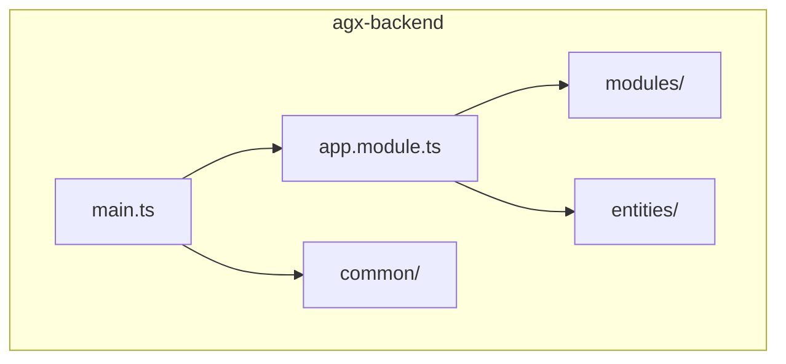
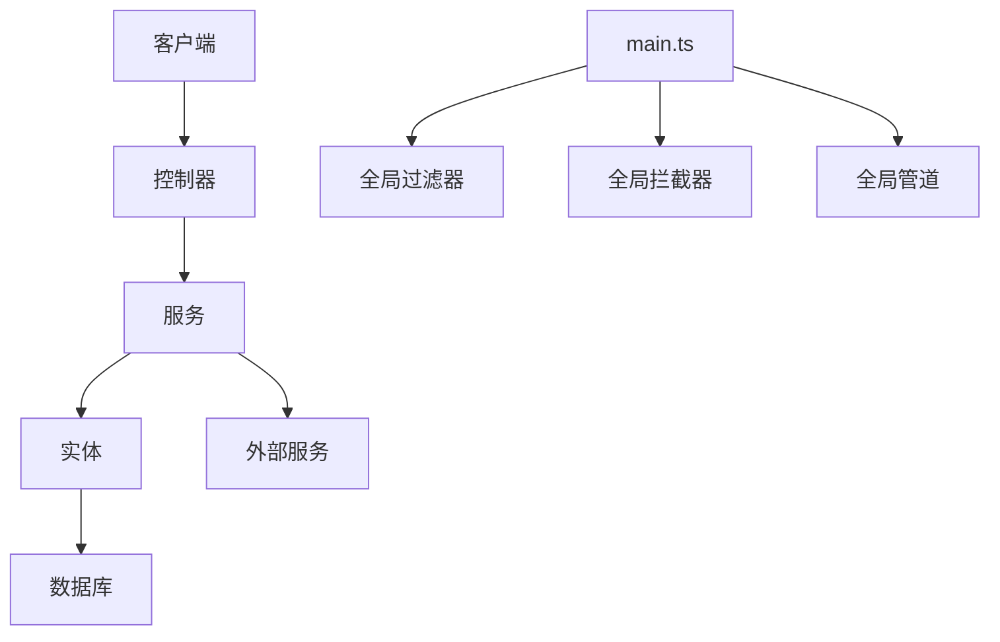
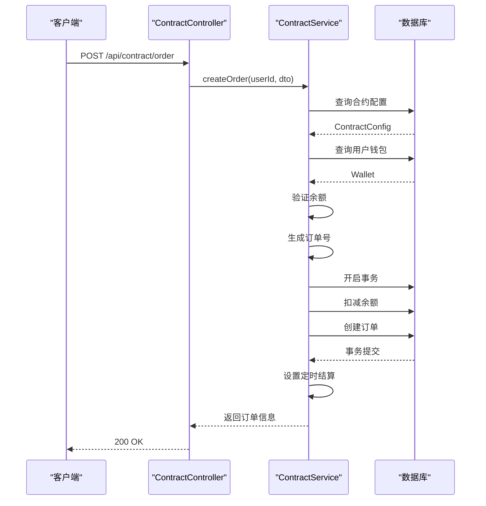
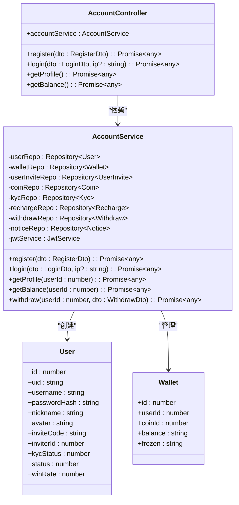
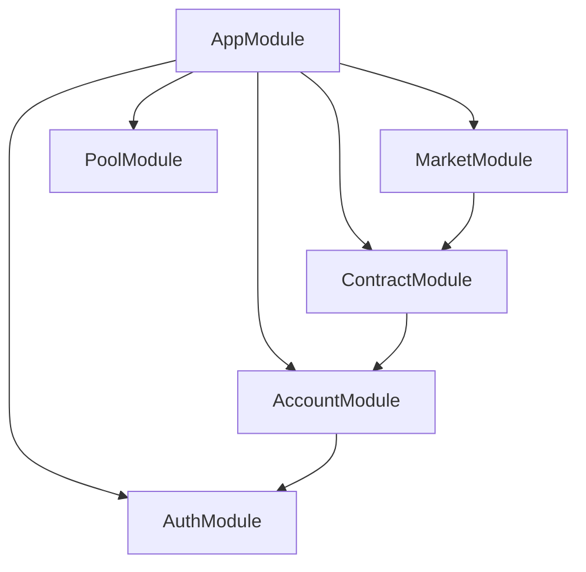

# 后端架构

<cite>
**本文档引用的文件**   
- [app.module.ts](file://agx-backend/src/app.module.ts)
- [main.ts](file://agx-backend/src/main.ts)
- [app.controller.ts](file://agx-backend/src/app.controller.ts)
- [app.service.ts](file://agx-backend/src/app.service.ts)
- [contract.module.ts](file://agx-backend/src/modules/contract/contract.module.ts)
- [contract.controller.ts](file://agx-backend/src/modules/contract/contract.controller.ts)
- [contract.service.ts](file://agx-backend/src/modules/contract/contract.service.ts)
- [account.module.ts](file://agx-backend/src/modules/account/account.module.ts)
- [account.service.ts](file://agx-backend/src/modules/account/account.service.ts)
- [contract-order.entity.ts](file://agx-backend/src/entities/contract-order.entity.ts)
- [user.entity.ts](file://agx-backend/src/entities/user.entity.ts)
- [current-user.decorator.ts](file://agx-backend/src/common/decorators/current-user.decorator.ts)
</cite>

## 目录
1. [简介](#简介)
2. [项目结构](#项目结构)
3. [核心组件](#核心组件)
4. [架构概述](#架构概述)
5. [详细组件分析](#详细组件分析)
6. [依赖分析](#依赖分析)
7. [性能考虑](#性能考虑)
8. [故障排除指南](#故障排除指南)
9. [结论](#结论)

## 简介
本文档详细描述了agx-backend服务的NestJS微服务风格模块化设计。文档聚焦于NestJS的模块（Module）、控制器（Controller）、服务（Service）和实体（Entity）之间的分层架构和依赖注入机制。通过分析app.module.ts如何集成各个业务模块（account, contract, market等），以及main.ts如何配置应用启动，为初学者解释NestJS的基本概念，同时为经验丰富的开发者提供模块扩展、性能调优和错误处理的最佳实践。

## 项目结构
agx-backend项目采用NestJS框架构建，遵循模块化设计原则。项目主要分为以下几个部分：
- **src/common**: 包含通用的装饰器、DTO、过滤器和拦截器
- **src/entities**: TypeORM实体模型，与数据库表一一对应
- **src/modules**: 业务模块，每个模块包含控制器、服务和DTO
- **src/app.module.ts**: 根模块，集成所有业务模块
- **src/main.ts**: 应用入口，配置全局设置



**图表来源**
- [app.module.ts](file://agx-backend/src/app.module.ts#L1-L130)
- [main.ts](file://agx-backend/src/main.ts#L1-L39)

**章节来源**
- [app.module.ts](file://agx-backend/src/app.module.ts#L1-L130)
- [main.ts](file://agx-backend/src/main.ts#L1-L39)

## 核心组件
本节分析NestJS的核心组件：模块、控制器、服务和实体。通过依赖注入机制，这些组件协同工作，实现业务逻辑。

**章节来源**
- [app.module.ts](file://agx-backend/src/app.module.ts#L1-L130)
- [contract.module.ts](file://agx-backend/src/modules/contract/contract.module.ts#L1-L16)

## 架构概述
agx-backend采用分层架构，各层职责分明，通过依赖注入实现松耦合。



**图表来源**
- [main.ts](file://agx-backend/src/main.ts#L1-L39)
- [app.module.ts](file://agx-backend/src/app.module.ts#L1-L130)

## 详细组件分析
本节详细分析关键组件的实现和交互。

### 合约模块分析
合约模块处理秒合约订单的创建、查询和结算。

#### 类图
```mermaid
classDiagram
class ContractController {
+contractService : ContractService
+getConfigs() : Promise~any~
+createOrder(user : {id : number}, dto : CreateOrderDto) : Promise~any~
+getOrders(user : {id : number}, status? : string) : Promise~any~
}
class ContractService {
-configRepo : Repository~ContractConfig~
-orderRepo : Repository~ContractOrder~
-walletRepo : Repository~Wallet~
-coinRepo : Repository~Coin~
-dataSource : DataSource
+getConfigs() : Promise~any~
+createOrder(userId : number, dto : CreateOrderDto) : Promise~any~
+getOrders(userId : number, status? : number) : Promise~any~
+settleOrder(orderId : number) : Promise~void~
}
class ContractConfig {
+id : number
+symbol : string
+name : string
+duration : number
+profitRate : string
+minAmount : string
+maxAmount : string
+status : number
}
class ContractOrder {
+id : number
+orderNo : string
+userId : number
+configId : number
+symbol : string
+duration : number
+direction : number
+amount : string
+openPrice : string
+closePrice : string
+profitRate : string
+profitLoss : string
+result : number
+status : number
+openAt : Date
+closeAt : Date
}
ContractController --> ContractService : "依赖"
ContractService --> ContractConfig : "使用"
ContractService --> ContractOrder : "创建"
```

**图表来源**
- [contract.controller.ts](file://agx-backend/src/modules/contract/contract.controller.ts#L1-L44)
- [contract.service.ts](file://agx-backend/src/modules/contract/contract.service.ts#L1-L282)
- [contract-config.entity.ts](file://agx-backend/src/entities/contract-config.entity.ts)
- [contract-order.entity.ts](file://agx-backend/src/entities/contract-order.entity.ts)

#### 序列图


**图表来源**
- [contract.controller.ts](file://agx-backend/src/modules/contract/contract.controller.ts#L1-L44)
- [contract.service.ts](file://agx-backend/src/modules/contract/contract.service.ts#L1-L282)

**章节来源**
- [contract.module.ts](file://agx-backend/src/modules/contract/contract.module.ts#L1-L16)
- [contract.controller.ts](file://agx-backend/src/modules/contract/contract.controller.ts#L1-L44)
- [contract.service.ts](file://agx-backend/src/modules/contract/contract.service.ts#L1-L282)

### 账户模块分析
账户模块处理用户注册、登录、KYC认证和资金管理。

#### 类图


**图表来源**
- [account.controller.ts](file://agx-backend/src/modules/account/account.controller.ts)
- [account.service.ts](file://agx-backend/src/modules/account/account.service.ts#L1-L606)
- [user.entity.ts](file://agx-backend/src/entities/user.entity.ts#L1-L118)
- [wallet.entity.ts](file://agx-backend/src/entities/wallet.entity.ts)

**章节来源**
- [account.module.ts](file://agx-backend/src/modules/account/account.module.ts#L1-L18)
- [account.service.ts](file://agx-backend/src/modules/account/account.service.ts#L1-L606)

## 依赖分析
分析各模块之间的依赖关系。



**图表来源**
- [app.module.ts](file://agx-backend/src/app.module.ts#L1-L130)

**章节来源**
- [app.module.ts](file://agx-backend/src/app.module.ts#L1-L130)

## 性能考虑
- 使用TypeORM的QueryBuilder进行复杂查询优化
- 通过@Index装饰器为常用查询字段创建数据库索引
- 使用事务确保数据一致性
- 采用定时任务处理订单结算，避免阻塞主线程

## 故障排除指南
常见问题及解决方案：
- **数据库连接失败**: 检查.env文件中的数据库配置
- **JWT验证失败**: 确保token未过期且格式正确
- **余额不足**: 检查钱包余额和冻结金额
- **并发问题**: 使用数据库事务和锁机制

**章节来源**
- [all-exceptions.filter.ts](file://agx-backend/src/common/filters/all-exceptions.filter.ts)
- [business.exception.ts](file://agx-backend/src/common/filters/business.exception.ts)

## 结论
agx-backend通过NestJS的模块化设计和依赖注入机制，实现了清晰的分层架构。各业务模块独立开发、测试和部署，提高了代码的可维护性和可扩展性。TypeORM实体模型与数据库表的映射关系清晰，服务层集中处理业务逻辑，确保了数据的一致性和完整性。对于初学者，NestJS提供了清晰的开发模式；对于经验丰富的开发者，提供了丰富的扩展点和优化空间。