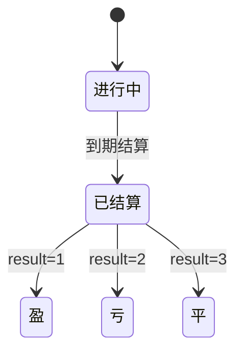
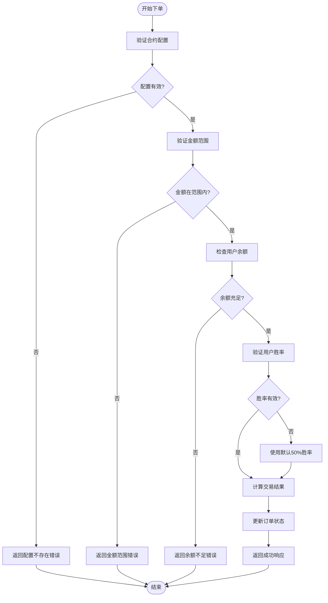
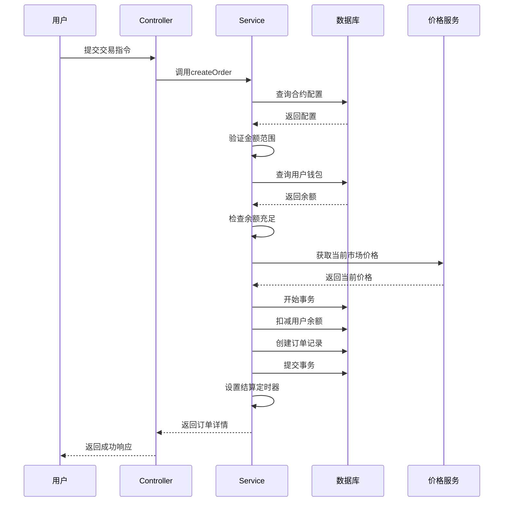
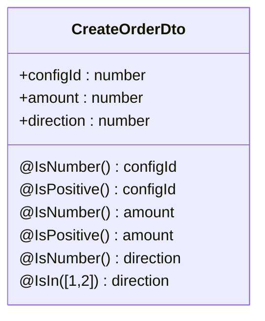
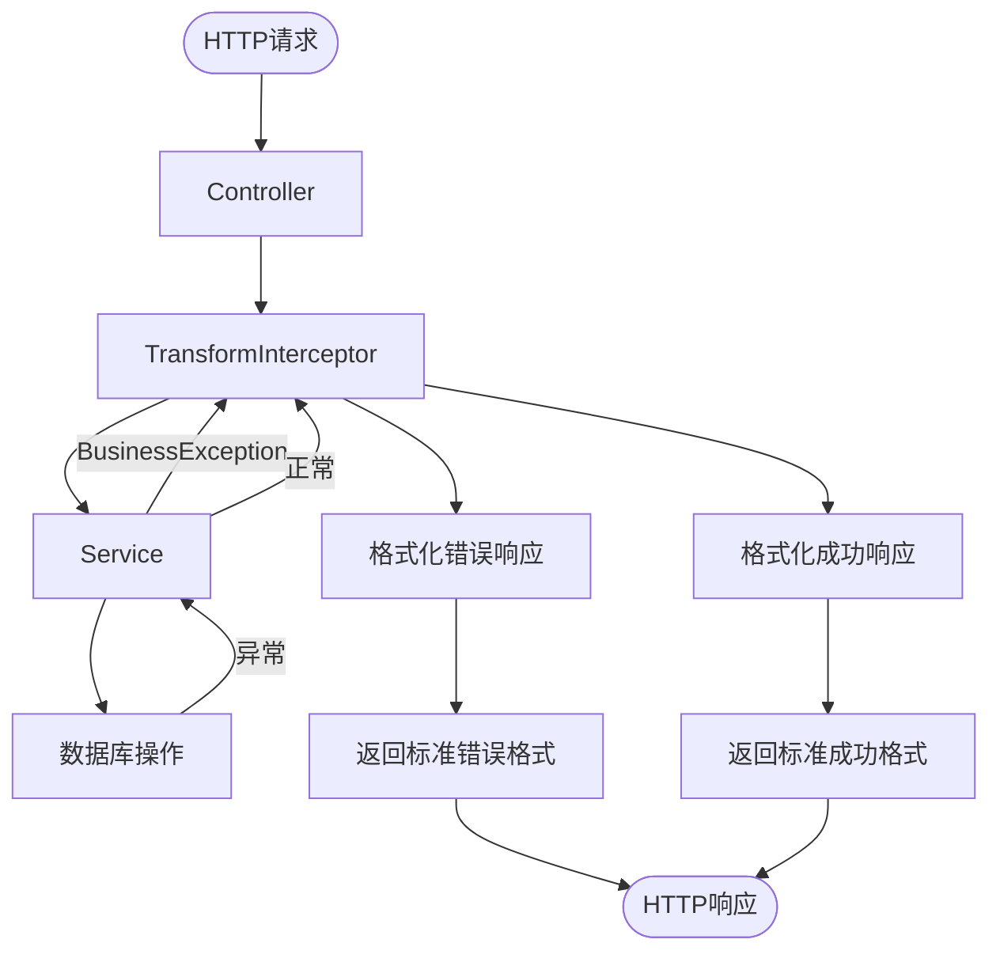

# 合约模块

<cite>
**本文档引用文件**  
- [contract.controller.ts](file://agx-backend/src/modules/contract/contract.controller.ts)
- [contract.service.ts](file://agx-backend/src/modules/contract/contract.service.ts)
- [contract.dto.ts](file://agx-backend/src/modules/contract/contract.dto.ts)
- [contract-config.entity.ts](file://agx-backend/src/entities/contract-config.entity.ts)
- [contract-order.entity.ts](file://agx-backend/src/entities/contract-order.entity.ts)
- [schema.sql](file://agx-backend/schema.sql)
- [business.exception.ts](file://agx-backend/src/common/filters/business.exception.ts)
- [api-response.dto.ts](file://agx-backend/src/common/dto/api-response.dto.ts)
- [transform.interceptor.ts](file://agx-backend/src/common/interceptors/transform.interceptor.ts)
</cite>

## 目录
1. [简介](#简介)
2. [核心组件](#核心组件)
3. [合约订单状态机设计](#合约订单状态机设计)
4. [风险控制算法说明](#风险控制算法说明)
5. [价格触发机制实现](#价格触发机制实现)
6. [DTO对象与参数校验](#dto对象与参数校验)
7. [交易流程时序图](#交易流程时序图)
8. [高并发性能调优建议](#高并发性能调优建议)
9. [异常处理策略](#异常处理策略)
10. [结论](#结论)

## 简介
本模块实现了数字资产合约交易的完整流程，包括开仓、平仓、保证金计算等核心功能。系统基于NestJS框架构建，采用TypeORM进行数据持久化，通过JWT进行身份认证。合约交易支持多种交易对（如XAU/USD、XAG/USD），提供灵活的配置选项，包括不同周期（30秒、60秒等）和收益率设置。

合约服务通过`ContractService`处理核心业务逻辑，`ContractController`接收并响应交易指令。系统采用事务机制确保资金扣减与订单创建的原子性，并通过定时结算机制实现合约到期自动结算。整个流程注重风险控制，包含余额检查、金额范围验证等多重安全机制。

## 核心组件

### ContractController
`ContractController`是合约模块的API入口，负责接收HTTP请求并调用`ContractService`处理业务逻辑。控制器提供了三个主要端点：
- `GET /api/contract/configs`：获取可用的合约配置列表
- `POST /api/contract/order`：创建新的合约订单
- `GET /api/contract/orders`：获取用户订单历史

控制器使用`JwtAuthGuard`进行身份验证，确保只有认证用户才能执行交易操作。所有响应通过`TransformInterceptor`统一包装为标准格式。

### ContractService
`ContractService`是合约模块的核心服务，实现了开仓、平仓、保证金计算等关键逻辑。服务通过依赖注入获取必要的仓库实例，包括合约配置、订单、钱包和币种实体。

服务的主要功能包括：
- **合约配置管理**：获取激活状态的合约配置，包含交易对、周期、收益率等信息
- **订单创建**：验证用户输入、检查余额、创建订单并扣减保证金
- **订单结算**：根据用户胜率和随机算法决定交易结果，更新订单状态并返还资金
- **订单查询**：获取用户的历史订单记录

**核心组件来源**
- [contract.controller.ts](file://agx-backend/src/modules/contract/contract.controller.ts#L1-L44)
- [contract.service.ts](file://agx-backend/src/modules/contract/contract.service.ts#L1-L282)

## 合约订单状态机设计



**图示来源**
- [contract-order.entity.ts](file://agx-backend/src/entities/contract-order.entity.ts#L62-L67)

合约订单的状态机设计基于`status`和`result`两个字段：
- `status`字段表示订单的生命周期状态：0=进行中，1=已结算
- `result`字段表示交易结果：1=盈，2=亏，3=平

订单创建时状态为"进行中"，系统通过`setTimeout`在合约到期后自动调用`settleOrder`方法进行结算。结算完成后状态变为"已结算"，并根据交易结果更新`result`字段。这种设计确保了订单状态的清晰转换和可追溯性。

## 风险控制算法说明



**图示来源**
- [contract.service.ts](file://agx-backend/src/modules/contract/contract.service.ts#L68-L281)

风险控制算法是合约模块的核心安全机制，包含以下关键环节：

### 1. 输入验证
系统首先验证合约配置是否存在且处于激活状态。通过`configId`查询数据库，确保用户选择的合约配置有效。

### 2. 金额验证
使用`decimal.js`库进行精确的金额计算和比较，避免浮点数精度问题。系统验证下单金额是否在配置的最小和最大金额范围内。

### 3. 余额检查
查询用户钱包余额，确保有足够的AGX代币作为保证金。余额检查与订单创建在同一个数据库事务中执行，防止并发问题导致的超卖。

### 4. 胜率控制
系统根据用户的胜率（winRate）控制交易结果，实现风险平衡。胜率较高的用户获得盈利的概率较低，反之亦然。这种机制有助于维持平台的长期可持续性。

**风险控制来源**
- [contract.service.ts](file://agx-backend/src/modules/contract/contract.service.ts#L73-L108)
- [business.exception.ts](file://agx-backend/src/common/filters/business.exception.ts#L1-L60)

## 价格触发机制实现



**图示来源**
- [contract.service.ts](file://agx-backend/src/modules/contract/contract.service.ts#L105-L138)
- [contract.controller.ts](file://agx-backend/src/modules/contract/contract.controller.ts#L24-L28)

价格触发机制的实现包含以下关键步骤：

### 1. 价格获取
系统通过`getMockPrice`方法获取当前市场价格。在生产环境中，此方法应从外部API获取实时市场价格。当前实现使用预设的基准价格（如XAU/USD为2050）并添加±0.5%的随机波动来模拟市场价格变化。

### 2. 价格锁定
在订单创建时，系统将当前价格锁定为开仓价（`openPrice`），确保交易条件的确定性。这个价格在合约周期内保持不变。

### 3. 结算价格生成
在合约到期结算时，系统根据交易结果生成合理的结算价格：
- **盈利情况**：价格向有利方向变动（看涨则上涨，看跌则下跌）
- **亏损情况**：价格向不利方向变动（看涨则下跌，看跌则上涨）
- **平局情况**：价格基本保持不变

这种设计确保了价格变动的合理性，避免了明显的操纵痕迹。

## DTO对象与参数校验



**图示来源**
- [contract.dto.ts](file://agx-backend/src/modules/contract/contract.dto.ts#L1-L16)

DTO（Data Transfer Object）对象在参数校验中扮演着关键角色。`CreateOrderDto`类定义了创建订单所需的参数及其验证规则：

### 1. 数据类型验证
使用`@IsNumber()`装饰器确保`configId`、`amount`和`direction`字段为数字类型。这防止了字符串或其他类型的数据被错误地传递。

### 2. 数值范围验证
- `@IsPositive()`确保`configId`和`amount`为正数，防止负数或零值的输入
- `@IsIn([1,2])`限制`direction`字段只能为1（看涨）或2（看跌），确保交易方向的合法性

### 3. 自动验证流程
NestJS框架在请求到达控制器方法前自动验证DTO对象。如果验证失败，框架会自动返回400错误响应，无需在业务逻辑中手动检查。这种声明式的验证方式提高了代码的可读性和可靠性。

**DTO来源**
- [contract.dto.ts](file://agx-backend/src/modules/contract/contract.dto.ts#L1-L16)
- [contract.controller.ts](file://agx-backend/src/modules/contract/contract.controller.ts#L26-L28)

## 交易流程时序图

```mermaid
sequenceDiagram
participant 用户
participant Controller
participant Service
participant 数据库
participant 钱包服务
用户->>Controller : 发送创建订单请求
Controller->>Service : 调用createOrder(userId, dto)
Service->>数据库 : 查询合约配置
数据库-->>Service : 返回配置信息
alt 配置无效
Service-->>Controller : 抛出配置不存在异常
Controller-->>用户 : 返回错误响应
stop
end
Service->>Service : 验证金额范围
alt 金额超出范围
Service-->>Controller : 抛出金额范围异常
Controller-->>用户 : 返回错误响应
stop
end
Service->>数据库 : 查询用户钱包
数据库-->>Service : 返回钱包信息
alt 余额不足
Service-->>Controller : 抛出余额不足异常
Controller-->>用户 : 返回错误响应
stop
end
Service->>Service : 获取当前市场价格
Service->>数据库 : 创建查询运行器
Service->>数据库 : 开始事务
Service->>数据库 : 扣减用户余额
Service->>数据库 : 创建订单记录
Service->>数据库 : 提交事务
Service->>Service : 设置结算定时器
Service-->>Controller : 返回订单详情
Controller-->>用户 : 返回成功响应
Note over Service,数据库 : 30/60/120/300秒后
Service->>Service : 执行settleOrder(orderId)
Service->>数据库 : 查询订单状态
alt 订单已结算
stop
end
Service->>数据库 : 查询用户胜率
Service->>Service : 根据胜率决定结果
Service->>Service : 计算盈亏金额
Service->>Service : 生成结算价格
Service->>数据库 : 更新订单状态
alt 用户盈利
Service->>数据库 : 查询用户钱包
Service->>数据库 : 增加用户余额(本金+收益)
end
Service->>数据库 : 提交结算
```

**图示来源**
- [contract.service.ts](file://agx-backend/src/modules/contract/contract.service.ts#L68-L281)
- [contract.controller.ts](file://agx-backend/src/modules/contract/contract.controller.ts#L24-L28)

## 高并发性能调优建议

### 1. 数据库优化
```sql
-- 确保关键字段有适当的索引
CREATE INDEX IF NOT EXISTS idx_order_user ON agx_contract_order(user_id);
CREATE INDEX IF NOT EXISTS idx_order_status ON agx_contract_order(status);
CREATE INDEX IF NOT EXISTS idx_config_symbol ON agx_contract_config(symbol);
CREATE INDEX IF NOT EXISTS idx_config_duration ON agx_contract_config(duration);
```

### 2. 缓存策略
- **合约配置缓存**：使用Redis缓存合约配置，减少数据库查询
- **用户余额缓存**：缓存用户钱包余额，提高读取性能
- **热点数据预加载**：在高峰期前预加载常用数据到内存

### 3. 异步处理
将订单结算从同步`setTimeout`改为消息队列（如RabbitMQ或Kafka），避免大量定时器占用内存和CPU资源。

### 4. 连接池优化
配置适当的数据库连接池大小，平衡并发性能和资源消耗。

### 5. 批量操作
对于批量查询订单，使用分页和批量获取，避免单次查询过多数据。

**性能优化来源**
- [schema.sql](file://agx-backend/schema.sql#L204-L205)
- [contract.service.ts](file://agx-backend/src/modules/contract/contract.service.ts#L242-L246)

## 异常处理策略



**图示来源**
- [transform.interceptor.ts](file://agx-backend/src/common/interceptors/transform.interceptor.ts#L1-L26)
- [api-response.dto.ts](file://agx-backend/src/common/dto/api-response.dto.ts#L1-L68)

系统采用分层的异常处理策略：

### 1. 统一响应格式
通过`TransformInterceptor`拦截器，将所有响应统一包装为`ApiResponse`格式，包含`code`、`msg`和`data`三个字段，确保API响应的一致性。

### 2. 业务异常分类
定义了清晰的错误码体系，包括：
- 4001：合约配置不存在
- 4002：金额低于最小下单金额
- 4003：金额超过最大下单金额
- 4004：AGX币种未配置
- 4005：AGX余额不足

### 3. 异常传播机制
业务逻辑中抛出`BusinessException`，由NestJS框架自动捕获并传递给拦截器，最终转换为HTTP响应。这种机制分离了业务逻辑和错误处理，提高了代码的可维护性。

### 4. 事务回滚
在订单创建过程中，任何异常都会触发数据库事务回滚，确保资金和订单状态的一致性。

**异常处理来源**
- [business.exception.ts](file://agx-backend/src/common/filters/business.exception.ts#L1-L60)
- [api-response.dto.ts](file://agx-backend/src/common/dto/api-response.dto.ts#L1-L68)
- [transform.interceptor.ts](file://agx-backend/src/common/interceptors/transform.interceptor.ts#L1-L26)

## 结论
合约模块实现了完整的数字资产交易流程，具有良好的架构设计和风险控制机制。通过清晰的分层架构，将API接口、业务逻辑和数据访问分离，提高了代码的可维护性。系统采用事务保证数据一致性，通过DTO实现自动参数验证，使用统一的异常处理机制提升API的可靠性。

对于生产环境部署，建议进一步优化性能，包括引入消息队列处理结算任务、使用Redis缓存热点数据、优化数据库索引等。同时，应将价格获取改为连接真实的市场数据源，确保交易的公平性和准确性。