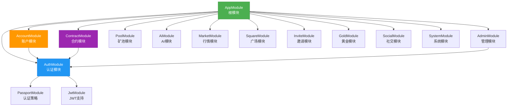
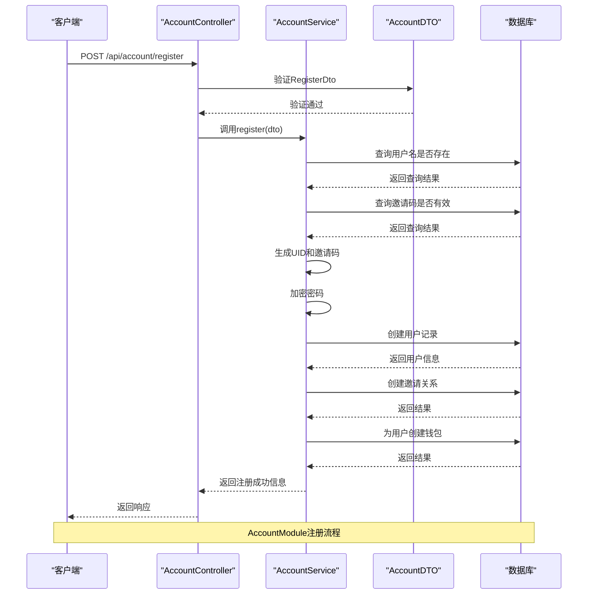
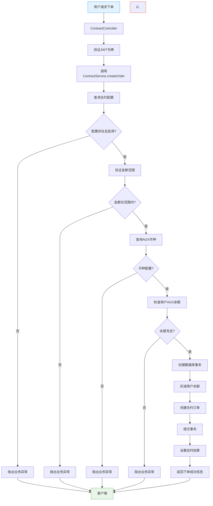
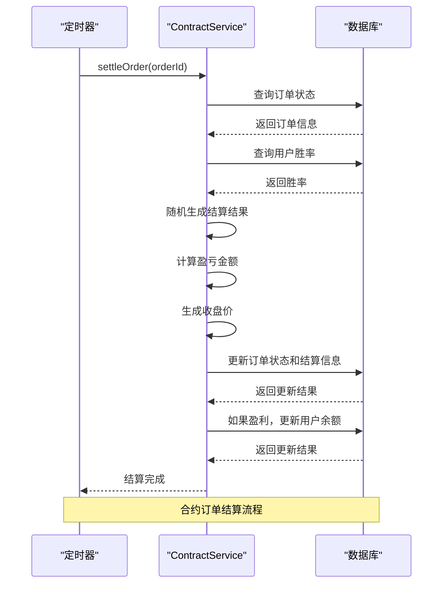
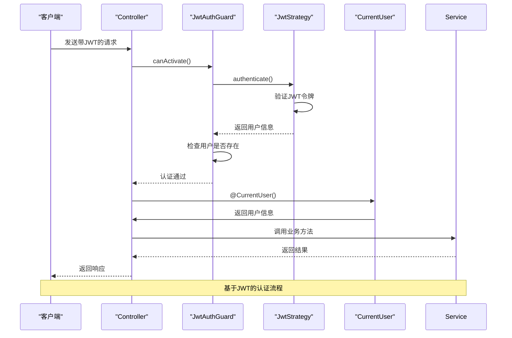
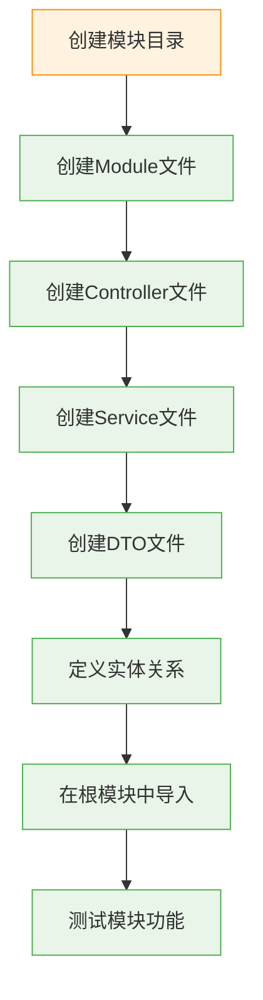

# 后端模块体系

<cite>
**本文档引用的文件**   
- [app.module.ts](file://agx-backend/src/app.module.ts)
- [account.module.ts](file://agx-backend/src/modules/account/account.module.ts)
- [contract.module.ts](file://agx-backend/src/modules/contract/contract.module.ts)
- [auth.module.ts](file://agx-backend/src/modules/auth/auth.module.ts)
- [admin.module.ts](file://agx-backend/src/modules/admin/admin.module.ts)
- [account.controller.ts](file://agx-backend/src/modules/account/account.controller.ts)
- [account.service.ts](file://agx-backend/src/modules/account/account.service.ts)
- [account.dto.ts](file://agx-backend/src/modules/account/account.dto.ts)
- [contract.controller.ts](file://agx-backend/src/modules/contract/contract.controller.ts)
- [contract.service.ts](file://agx-backend/src/modules/contract/contract.service.ts)
- [contract.dto.ts](file://agx-backend/src/modules/contract/contract.dto.ts)
- [current-user.decorator.ts](file://agx-backend/src/common/decorators/current-user.decorator.ts)
- [jwt-auth.guard.ts](file://agx-backend/src/modules/auth/jwt-auth.guard.ts)
- [entities/index.ts](file://agx-backend/src/entities/index.ts)
</cite>

## 目录
1. [项目结构](#项目结构)
2. [核心模块架构](#核心模块架构)
3. [模块依赖关系图](#模块依赖关系图)
4. [AccountModule详解](#accountmodule详解)
5. [ContractModule业务流程](#contractmodule业务流程)
6. [模块通信机制](#模块通信机制)
7. [模块创建指南](#模块创建指南)
8. [高级最佳实践](#高级最佳实践)

## 项目结构

本项目采用NestJS的模块化架构设计，后端代码位于`agx-backend`目录下，主要结构如下：

```
agx-backend/
├── src/
│   ├── common/           # 通用组件（装饰器、过滤器、拦截器）
│   ├── entities/         # 数据库实体定义
│   ├── modules/          # 业务模块
│   │   ├── account/      # 账户模块
│   │   ├── auth/         # 认证模块
│   │   ├── contract/     # 合约模块
│   │   └── ...           # 其他业务模块
│   ├── app.module.ts     # 根模块
│   ├── main.ts           # 应用入口
│   └── ...
```

**Diagram sources**
- [app.module.ts](file://agx-backend/src/app.module.ts#L1-L130)

**本节来源**
- [app.module.ts](file://agx-backend/src/app.module.ts#L1-L130)

## 核心模块架构

在NestJS应用中，`app.module.ts`作为根模块，通过`imports`属性集成所有业务模块，形成完整的应用架构。这种模块化设计实现了关注点分离，使代码更易于维护和扩展。



**Diagram sources**
- [app.module.ts](file://agx-backend/src/app.module.ts#L1-L130)

**本节来源**
- [app.module.ts](file://agx-backend/src/app.module.ts#L1-L130)

## 模块依赖关系图

NestJS的模块化架构通过依赖注入实现模块间的松耦合通信。以下图表展示了主要模块之间的依赖关系：

```mermaid
classDiagram
class AppModule {
+imports : AuthModule, AccountModule, ContractModule, ...
+controllers : AppController
+providers : AppService
}
class AuthModule {
+imports : PassportModule, JwtModule, ConfigModule
+providers : JwtStrategy
+exports : JwtModule, PassportModule
}
class AccountModule {
+imports : TypeOrmModule[User, Wallet, ...], AuthModule
+controllers : AccountController
+providers : AccountService
+exports : AccountService
}
class ContractModule {
+imports : TypeOrmModule[ContractConfig, ContractOrder, ...]
+controllers : ContractController
+providers : ContractService
+exports : ContractService
}
class AdminModule {
+imports : TypeOrmModule[Admin, User, ...], AuthModule
+controllers : AdminController
+providers : AdminService
+exports : AdminService
}
AppModule --> AuthModule : "集成"
AppModule --> AccountModule : "集成"
AppModule --> ContractModule : "集成"
AppModule --> AdminModule : "集成"
AccountModule --> AuthModule : "依赖"
ContractModule --> AuthModule : "依赖"
AdminModule --> AuthModule : "依赖"
AccountModule --> TypeOrmModule : "数据访问"
ContractModule --> TypeOrmModule : "数据访问"
AdminModule --> TypeOrmModule : "数据访问"
note right of AuthModule
提供JWT认证功能
被其他需要认证的模块依赖
end note
note right of AccountModule
处理用户账户相关业务
包括注册、登录、KYC等
end note
note right of ContractModule
处理合约交易业务
实现秒合约下单和结算
end note
```

**Diagram sources**
- [app.module.ts](file://agx-backend/src/app.module.ts#L1-L130)
- [account.module.ts](file://agx-backend/src/modules/account/account.module.ts#L1-L18)
- [contract.module.ts](file://agx-backend/src/modules/contract/contract.module.ts#L1-L16)
- [auth.module.ts](file://agx-backend/src/modules/auth/auth.module.ts#L1-L25)
- [admin.module.ts](file://agx-backend/src/modules/admin/admin.module.ts#L1-L25)

**本节来源**
- [app.module.ts](file://agx-backend/src/app.module.ts#L1-L130)
- [account.module.ts](file://agx-backend/src/modules/account/account.module.ts#L1-L18)
- [contract.module.ts](file://agx-backend/src/modules/contract/contract.module.ts#L1-L16)

## AccountModule详解

AccountModule是处理用户账户相关业务的核心模块，其内部由Controller、Service和DTO三部分组成，遵循典型的NestJS分层架构。

### Controller-Service-DTO协作机制



#### AccountModule结构分析

```mermaid
classDiagram
class AccountController {
+register(dto : RegisterDto)
+login(dto : LoginDto, req : Request)
+getProfile(userId : number)
+getBalance(userId : number)
+changePassword(userId : number, dto : ChangePasswordDto)
+updateProfile(userId : number, dto : UpdateProfileDto)
+submitKyc(userId : number, dto : SubmitKycDto)
+getKycStatus(userId : number)
+getDepositAddress(userId : number, dto : GetDepositAddressDto)
+getDepositHistory(userId : number, query : any)
+withdraw(userId : number, dto : WithdrawDto)
+getWithdrawHistory(userId : number, query : any)
+getInviteList(userId : number, query : any)
+getInviteStats(userId : number)
+getActiveNotices()
}
class AccountService {
-userRepo : Repository~User~
-walletRepo : Repository~Wallet~
-userInviteRepo : Repository~UserInvite~
-coinRepo : Repository~Coin~
-kycRepo : Repository~Kyc~
-rechargeRepo : Repository~Recharge~
-withdrawRepo : Repository~Withdraw~
-noticeRepo : Repository~Notice~
-jwtService : JwtService
+register(dto : RegisterDto)
+login(dto : LoginDto, ip? : string)
+getProfile(userId : number)
+getBalance(userId : number)
+changePassword(userId : number, dto : ChangePasswordDto)
+updateProfile(userId : number, dto : UpdateProfileDto)
+submitKyc(userId : number, dto : SubmitKycDto)
+getKycStatus(userId : number)
+getDepositAddress(userId : number, dto : GetDepositAddressDto)
+getDepositHistory(userId : number, query : any)
+withdraw(userId : number, dto : WithdrawDto)
+getWithdrawHistory(userId : number, query : any)
+getInviteList(userId : number, query : any)
+getInviteStats(userId : number)
+getActiveNotices()
}
class RegisterDto {
+username : string
+password : string
+inviteCode : string
}
class LoginDto {
+username : string
+password : string
}
class ChangePasswordDto {
+oldPassword : string
+newPassword : string
}
AccountController --> AccountService : "依赖"
AccountController --> RegisterDto : "使用"
AccountController --> LoginDto : "使用"
AccountController --> ChangePasswordDto : "使用"
AccountService --> User : "实体"
AccountService --> Wallet : "实体"
AccountService --> UserInvite : "实体"
AccountService --> Coin : "实体"
AccountService --> Kyc : "实体"
AccountService --> Recharge : "实体"
AccountService --> Withdraw : "实体"
AccountService --> Notice : "实体"
note right of AccountController
处理HTTP请求
调用Service方法
返回响应
end note
note right of AccountService
实现业务逻辑
处理数据验证
与数据库交互
end note
note right of RegisterDto
定义注册接口的数据传输对象
包含字段验证规则
end note
```

**Diagram sources**
- [account.module.ts](file://agx-backend/src/modules/account/account.module.ts#L1-L18)
- [account.controller.ts](file://agx-backend/src/modules/account/account.controller.ts#L1-L160)
- [account.service.ts](file://agx-backend/src/modules/account/account.service.ts#L1-L606)
- [account.dto.ts](file://agx-backend/src/modules/account/account.dto.ts#L1-L98)

**本节来源**
- [account.module.ts](file://agx-backend/src/modules/account/account.module.ts#L1-L18)
- [account.controller.ts](file://agx-backend/src/modules/account/account.controller.ts#L1-L160)
- [account.service.ts](file://agx-backend/src/modules/account/account.service.ts#L1-L606)
- [account.dto.ts](file://agx-backend/src/modules/account/account.dto.ts#L1-L98)

## ContractModule业务流程

ContractModule负责处理合约交易业务，实现了秒合约的下单、结算等核心功能。该模块展示了复杂的业务流程和事务处理。

### 合约交易实现流程



#### 合约结算流程



**Diagram sources**
- [contract.module.ts](file://agx-backend/src/modules/contract/contract.module.ts#L1-L16)
- [contract.controller.ts](file://agx-backend/src/modules/contract/contract.controller.ts#L1-L44)
- [contract.service.ts](file://agx-backend/src/modules/contract/contract.service.ts#L1-L282)
- [contract.dto.ts](file://agx-backend/src/modules/contract/contract.dto.ts#L1-L16)

**本节来源**
- [contract.module.ts](file://agx-backend/src/modules/contract/contract.module.ts#L1-L16)
- [contract.controller.ts](file://agx-backend/src/modules/contract/contract.controller.ts#L1-L44)
- [contract.service.ts](file://agx-backend/src/modules/contract/contract.service.ts#L1-L282)

## 模块通信机制

NestJS通过依赖注入（Dependency Injection）实现模块间的通信，确保了松耦合和高内聚的设计原则。

### 服务注入模式

```mermaid
classDiagram
class AppModule {
+imports : [AuthModule, AccountModule, ContractModule, ...]
+controllers : [AppController]
+providers : [AppService]
}
class AuthModule {
+imports : [PassportModule, JwtModule, ConfigModule]
+providers : [JwtStrategy]
+exports : [JwtModule, PassportModule]
}
class AccountModule {
+imports : [TypeOrmModule, AuthModule]
+controllers : [AccountController]
+providers : [AccountService]
+exports : [AccountService]
}
class ContractModule {
+imports : [TypeOrmModule]
+controllers : [ContractController]
+providers : [ContractService]
+exports : [ContractService]
}
class AccountController {
-accountService : AccountService
-jwtAuthGuard : JwtAuthGuard
-currentUser : CurrentUser
}
class ContractController {
-contractService : ContractService
-jwtAuthGuard : JwtAuthGuard
-currentUser : CurrentUser
}
class AccountService {
-userRepo : Repository~User~
-walletRepo : Repository~Wallet~
-jwtService : JwtService
}
class ContractService {
-configRepo : Repository~ContractConfig~
-orderRepo : Repository~ContractOrder~
-walletRepo : Repository~Wallet~
-coinRepo : Repository~Coin~
}
AccountController --> AccountService : "@Inject()"
ContractController --> ContractService : "@Inject()"
AccountController --> JwtAuthGuard : "@UseGuards()"
ContractController --> JwtAuthGuard : "@UseGuards()"
AccountController --> CurrentUser : "@CurrentUser()"
ContractController --> CurrentUser : "@CurrentUser()"
AccountService --> User : "@Entity()"
AccountService --> Wallet : "@Entity()"
ContractService --> ContractConfig : "@Entity()"
ContractService --> ContractOrder : "@Entity()"
ContractService --> Wallet : "@Entity()"
ContractService --> Coin : "@Entity()"
note right of AccountController
通过构造函数注入AccountService
使用JwtAuthGuard进行认证保护
使用CurrentUser装饰器获取用户信息
end note
note right of AccountService
通过@InjectRepository注入Repository
实现账户业务逻辑
end note
```

### 认证守卫和用户装饰器



**Diagram sources**
- [auth.module.ts](file://agx-backend/src/modules/auth/auth.module.ts#L1-L25)
- [jwt-auth.guard.ts](file://agx-backend/src/modules/auth/jwt-auth.guard.ts#L1-L38)
- [current-user.decorator.ts](file://agx-backend/src/common/decorators/current-user.decorator.ts#L1-L17)
- [account.controller.ts](file://agx-backend/src/modules/account/account.controller.ts#L1-L160)
- [contract.controller.ts](file://agx-backend/src/modules/contract/contract.controller.ts#L1-L44)

**本节来源**
- [auth.module.ts](file://agx-backend/src/modules/auth/auth.module.ts#L1-L25)
- [jwt-auth.guard.ts](file://agx-backend/src/modules/auth/jwt-auth.guard.ts#L1-L38)
- [current-user.decorator.ts](file://agx-backend/src/common/decorators/current-user.decorator.ts#L1-L17)

## 模块创建指南

为初学者提供创建NestJS模块的完整指南，遵循最佳实践。

### 基础模块创建步骤



### 模块文件模板

```typescript
// user.module.ts
import { Module } from '@nestjs/common';
import { TypeOrmModule } from '@nestjs/typeorm';
import { UserController } from './user.controller';
import { UserService } from './user.service';
import { User, Profile } from '../../entities';
import { AuthModule } from '../auth/auth.module';

@Module({
  imports: [
    TypeOrmModule.forFeature([User, Profile]),
    AuthModule,
  ],
  controllers: [UserController],
  providers: [UserService],
  exports: [UserService],
})
export class UserModule {}
```

```typescript
// user.controller.ts
import { Controller, Get, Post, Body, UseGuards } from '@nestjs/common';
import { UserService } from './user.service';
import { CreateUserDto } from './user.dto';
import { JwtAuthGuard } from '../auth/jwt-auth.guard';
import { CurrentUser } from '../../common';

@Controller('api/user')
export class UserController {
  constructor(private readonly userService: UserService) {}

  @Post()
  @UseGuards(JwtAuthGuard)
  async createUser(@CurrentUser() user: { id: number }, @Body() dto: CreateUserDto) {
    return this.userService.createUser(user.id, dto);
  }

  @Get()
  @UseGuards(JwtAuthGuard)
  async getUsers(@CurrentUser() user: { id: number }) {
    return this.userService.getUsers(user.id);
  }
}
```

**本节来源**
- [account.module.ts](file://agx-backend/src/modules/account/account.module.ts#L1-L18)
- [account.controller.ts](file://agx-backend/src/modules/account/account.controller.ts#L1-L160)
- [account.service.ts](file://agx-backend/src/modules/account/account.service.ts#L1-L606)

## 高级最佳实践

为高级开发者提供模块解耦、懒加载和动态模块配置的最佳实践。

### 模块解耦策略

```mermaid
graph TD
A["业务模块"] --> B["共享模块"]
C["功能模块"] --> B
D["管理模块"] --> B
E["API模块"] --> B
B --> F["数据库模块"]
B --> G["认证模块"]
B --> H["配置模块"]
B --> I["日志模块"]
subgraph "共享模块"
B
F
G
H
I
end
style B fill:#FFCDD2,stroke:#D32F2F,color:black
style F fill:#BBDEFB,stroke:#1976D2,color:black
style G fill:#BBDEFB,stroke:#1976D2,color:black
style H fill:#BBDEFB,stroke:#1976D2,color:black
style I fill:#BBDEFB,stroke:#1976D2,color:black
note right of B
共享模块包含可复用的
服务、实体和工具
end note
```

### 懒加载模块配置

```typescript
// app.module.ts
@Module({
  imports: [
    // 同步导入的模块
    ConfigModule.forRoot({
      isGlobal: true,
      envFilePath: '.env',
    }),
    TypeOrmModule.forRootAsync({
      imports: [ConfigModule],
      useFactory: (configService: ConfigService) => ({
        // 数据库配置
      }),
      inject: [ConfigService],
    }),
    
    // 懒加载模块
    AccountModule,
    ContractModule,
    AdminModule,
    // ... 其他业务模块
  ],
  controllers: [AppController],
  providers: [AppService],
})
export class AppModule {}
```

### 动态模块配置

```typescript
// database.module.ts
@Module({})
export class DatabaseModule {
  static forRoot(options: DatabaseOptions): DynamicModule {
    return {
      module: DatabaseModule,
      imports: [
        TypeOrmModule.forRoot({
          type: options.type,
          host: options.host,
          port: options.port,
          username: options.username,
          password: options.password,
          database: options.database,
          entities: options.entities,
          synchronize: options.synchronize,
        }),
      ],
      providers: [DatabaseService],
      exports: [DatabaseService],
    };
  }
}
```

### 循环依赖解决方案

```mermaid
graph LR
A["ModuleA"] -- "forwardRef(() => ModuleB)" --> B["ModuleB"]
B -- "forwardRef(() => ModuleA)" --> A
style A fill:#F3E5F5,stroke:#9C27B0
style B fill:#F3E5F5,stroke:#9C27B0
note right of A
使用forwardRef解决
循环依赖问题
end note
```

**本节来源**
- [app.module.ts](file://agx-backend/src/app.module.ts#L1-L130)
- [account.module.ts](file://agx-backend/src/modules/account/account.module.ts#L1-L18)
- [contract.module.ts](file://agx-backend/src/modules/contract/contract.module.ts#L1-L16)