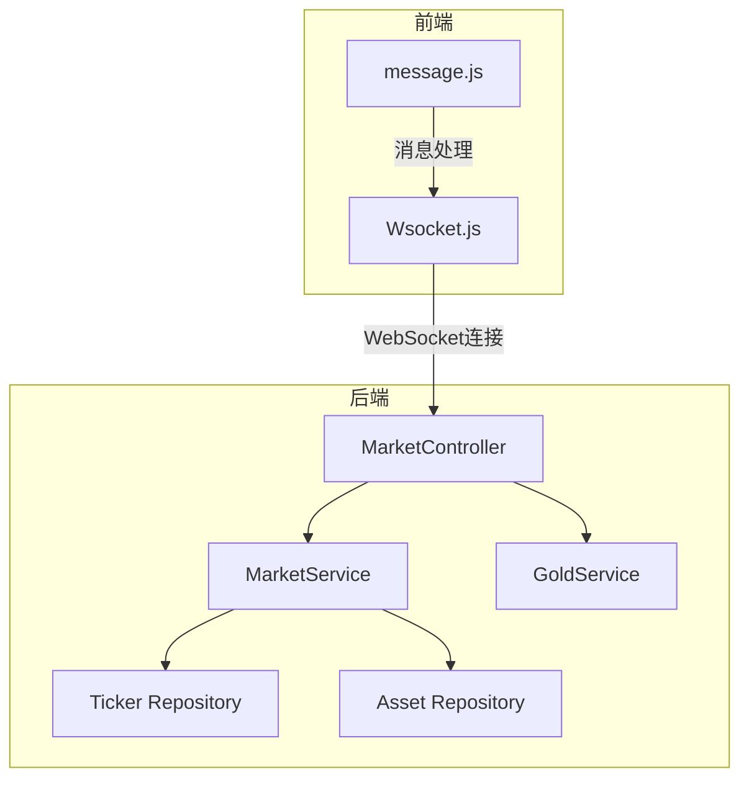
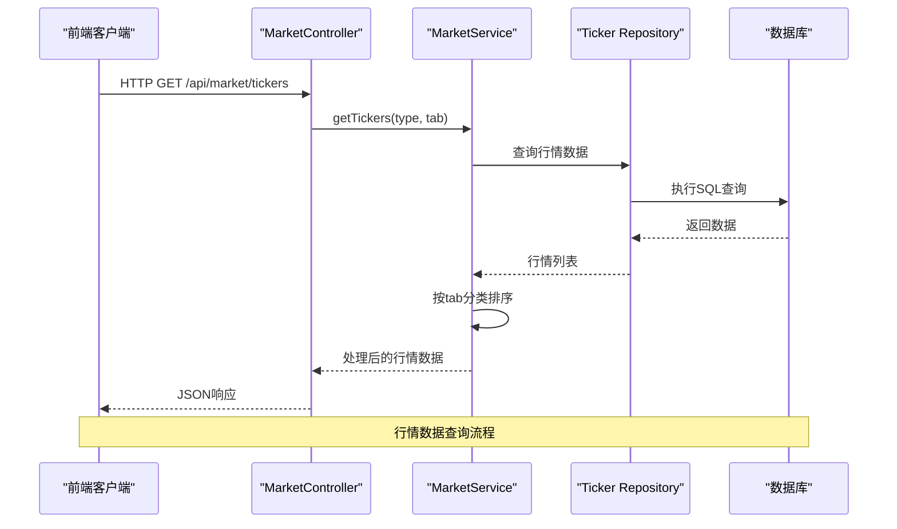
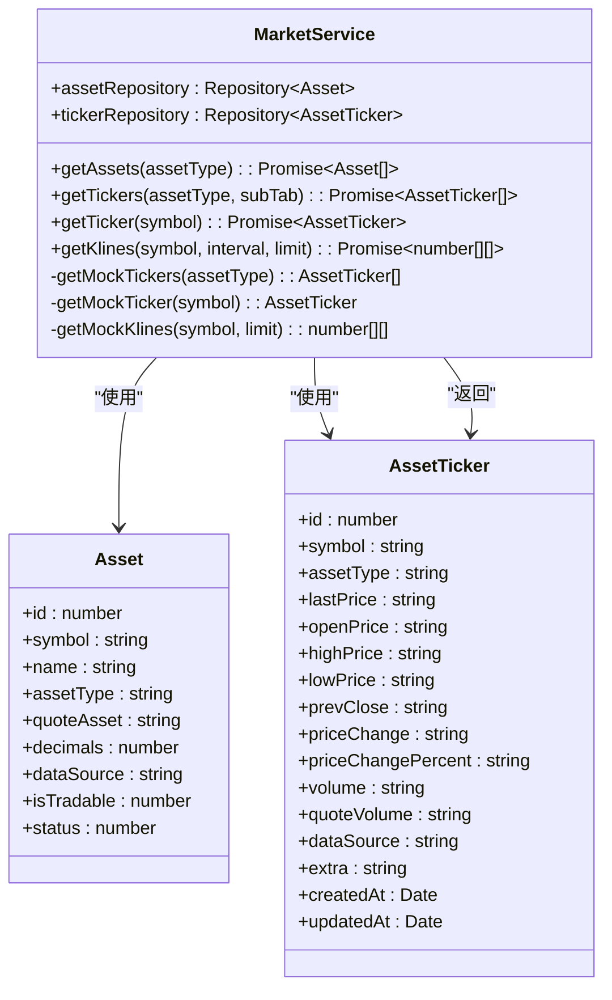
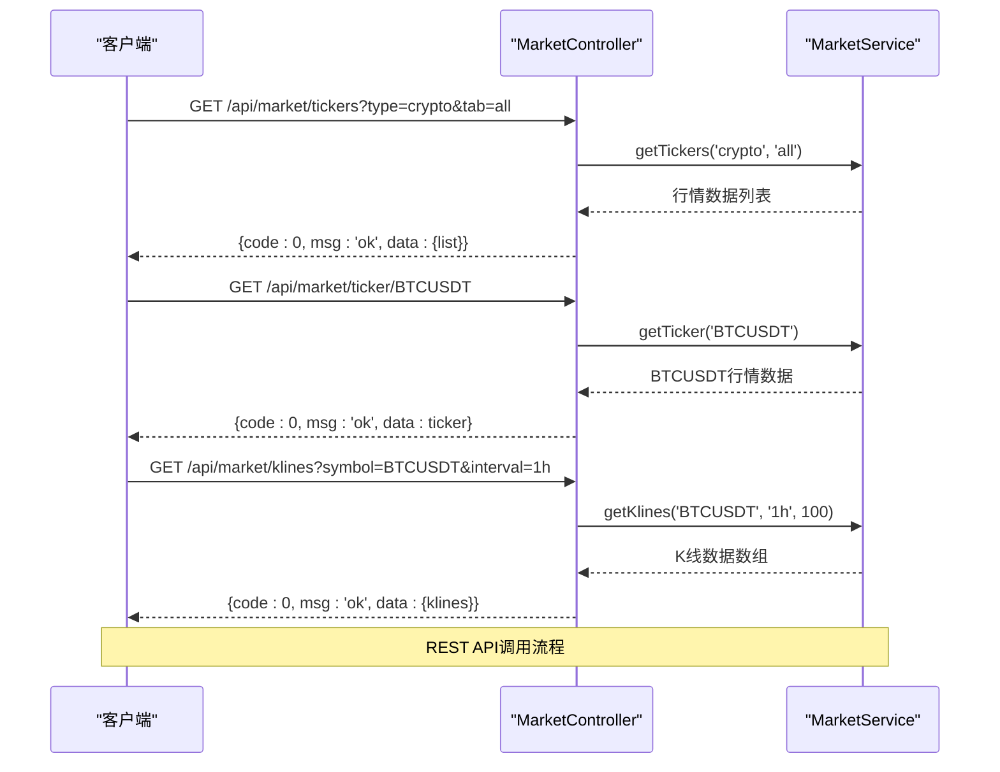
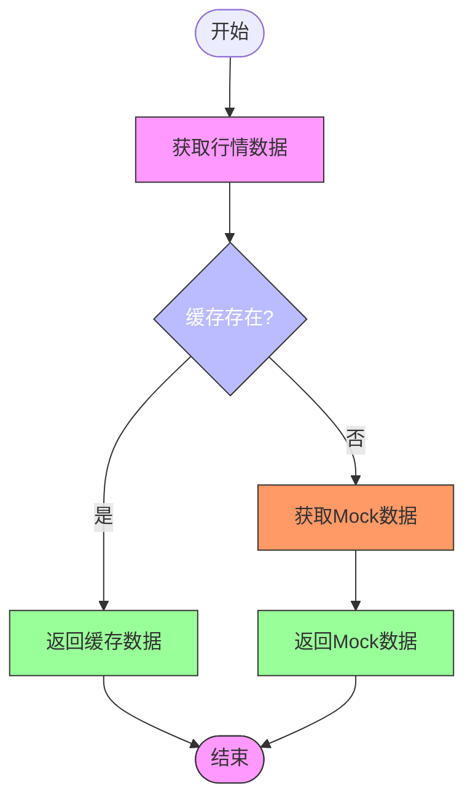
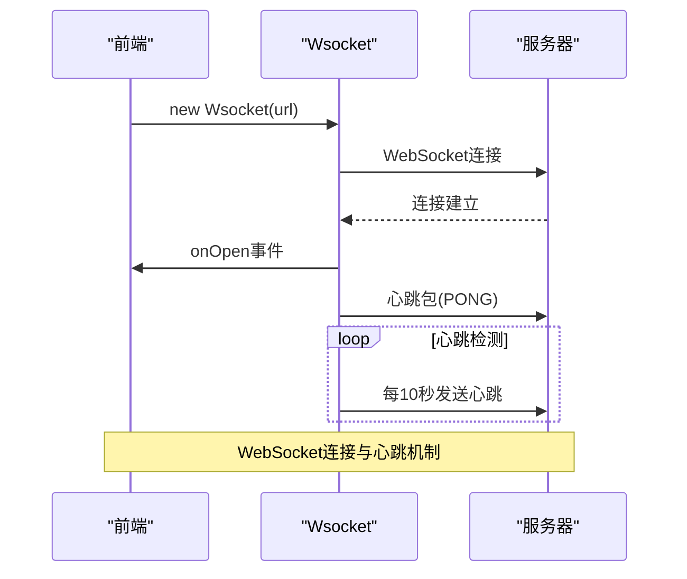
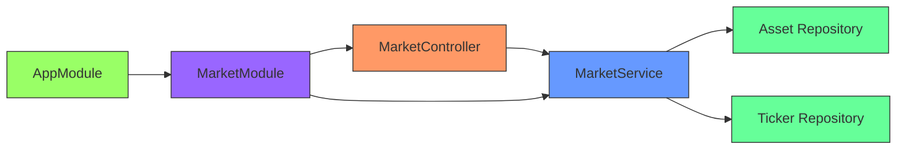

# 市场行情模块

<cite>
**本文档引用文件**  
- [market.controller.ts](file://agx-backend/src/modules/market/market.controller.ts)
- [market.service.ts](file://agx-backend/src/modules/market/market.service.ts)
- [asset-ticker.entity.ts](file://agx-backend/src/entities/asset-ticker.entity.ts)
- [asset.entity.ts](file://agx-backend/src/entities/asset.entity.ts)
- [gold.service.ts](file://agx-backend/src/modules/gold/gold.service.ts)
- [Wsocket.js](file://agx-admin/src/utils/Wsocket.js)
- [message.js](file://agx-admin/src/ws-serve/message.js)
</cite>

## 目录
1. [简介](#简介)
2. [项目结构](#项目结构)
3. [核心组件](#核心组件)
4. [架构概述](#架构概述)
5. [详细组件分析](#详细组件分析)
6. [依赖分析](#依赖分析)
7. [性能考虑](#性能考虑)
8. [故障排除指南](#故障排除指南)
9. [结论](#结论)

## 简介
市场行情模块是系统中负责提供实时金融数据的核心组件，支持数字货币、外汇、股票、贵金属等多种资产类型的行情展示与计算。该模块通过RESTful API对外提供行情查询服务，并结合WebSocket实现客户端的实时数据推送。模块采用缓存机制优化高频数据访问性能，同时设计了灵活的价格聚合算法和数据更新频率控制策略。本模块还特别集成了黄金、白银等贵金属行情服务，支持现货、合约、理财等多种金融产品形态。

## 项目结构
市场行情模块主要分布在后端服务的`market`和`gold`模块中，前端通过WebSocket连接接收实时数据更新。模块采用分层架构设计，包括数据访问层、服务层和控制器层。

**图表来源**  
- [market.controller.ts](file://agx-backend/src/modules/market/market.controller.ts)
- [market.service.ts](file://agx-backend/src/modules/market/market.service.ts)
- [gold.service.ts](file://agx-backend/src/modules/gold/gold.service.ts)
- [Wsocket.js](file://agx-admin/src/utils/Wsocket.js)
- [message.js](file://agx-admin/src/ws-serve/message.js)

**本节来源**  
- [market.controller.ts](file://agx-backend/src/modules/market/market.controller.ts)
- [market.service.ts](file://agx-backend/src/modules/market/market.service.ts)
- [gold.service.ts](file://agx-backend/src/modules/gold/gold.service.ts)

## 核心组件
市场行情模块的核心组件包括MarketService、MarketController、AssetTicker实体和WebSocket集成服务。MarketService负责从数据库或外部数据源获取行情数据，执行价格计算和聚合算法；MarketController提供RESTful API接口供客户端查询；AssetTicker实体定义了行情数据的存储结构；WebSocket服务实现服务器到客户端的实时数据推送。

**本节来源**  
- [market.service.ts](file://agx-backend/src/modules/market/market.service.ts)
- [market.controller.ts](file://agx-backend/src/modules/market/market.controller.ts)
- [asset-ticker.entity.ts](file://agx-backend/src/entities/asset-ticker.entity.ts)
- [Wsocket.js](file://agx-admin/src/utils/Wsocket.js)

## 架构概述
市场行情模块采用微服务架构，通过NestJS框架实现分层设计。数据流从外部数据源或数据库开始，经过服务层处理后，通过REST API或WebSocket两种方式提供给前端客户端。

**图表来源**  
- [market.controller.ts](file://agx-backend/src/modules/market/market.controller.ts)
- [market.service.ts](file://agx-backend/src/modules/market/market.service.ts)
- [asset-ticker.entity.ts](file://agx-backend/src/entities/asset-ticker.entity.ts)

## 详细组件分析

### MarketService分析
MarketService是市场行情模块的核心服务类，负责获取和处理多市场数据。服务通过依赖注入获取资产和行情数据的Repository实例，实现数据访问的解耦。

**图表来源**  
- [market.service.ts](file://agx-backend/src/modules/market/market.service.ts)
- [asset.entity.ts](file://agx-backend/src/entities/asset.entity.ts)
- [asset-ticker.entity.ts](file://agx-backend/src/entities/asset-ticker.entity.ts)

**本节来源**  
- [market.service.ts](file://agx-backend/src/modules/market/market.service.ts)
- [asset.entity.ts](file://agx-backend/src/entities/asset.entity.ts)
- [asset-ticker.entity.ts](file://agx-backend/src/entities/asset-ticker.entity.ts)

### MarketController分析
MarketController提供RESTful API接口，将MarketService的功能暴露给外部系统。控制器采用NestJS的装饰器模式，定义了清晰的路由和参数映射。

**图表来源**  
- [market.controller.ts](file://agx-backend/src/modules/market/market.controller.ts)
- [market.service.ts](file://agx-backend/src/modules/market/market.service.ts)

**本节来源**  
- [market.controller.ts](file://agx-backend/src/modules/market/market.controller.ts)

### 行情数据流分析
市场行情模块的数据流设计考虑了实时性、性能和容错性。系统通过缓存机制减少数据库压力，同时准备了Mock数据作为容错方案。

**图表来源**  
- [market.service.ts](file://agx-backend/src/modules/market/market.service.ts)

**本节来源**  
- [market.service.ts](file://agx-backend/src/modules/market/market.service.ts)

### WebSocket集成分析
前端通过Wsocket.js封装WebSocket连接，实现与服务器的实时通信。消息服务负责管理连接生命周期和心跳机制。

**图表来源**  
- [Wsocket.js](file://agx-admin/src/utils/Wsocket.js)
- [message.js](file://agx-admin/src/ws-serve/message.js)

**本节来源**  
- [Wsocket.js](file://agx-admin/src/utils/Wsocket.js)
- [message.js](file://agx-admin/src/ws-serve/message.js)

## 依赖分析
市场行情模块的依赖关系清晰，遵循了依赖倒置原则。上层组件依赖于抽象而非具体实现，提高了系统的可测试性和可维护性。

**图表来源**  
- [market.module.ts](file://agx-backend/src/modules/market/market.module.ts)
- [market.controller.ts](file://agx-backend/src/modules/market/market.controller.ts)
- [market.service.ts](file://agx-backend/src/modules/market/market.service.ts)

**本节来源**  
- [market.module.ts](file://agx-backend/src/modules/market/market.module.ts)

## 性能考虑
市场行情模块在设计时充分考虑了高频率数据处理的性能需求。通过数据库索引优化查询性能，使用缓存减少重复计算，采用分页和过滤机制控制数据传输量。对于实时性要求高的场景，系统采用WebSocket推送而非轮询，大大降低了网络开销和服务器负载。

**本节来源**  
- [market.service.ts](file://agx-backend/src/modules/market/market.service.ts)
- [asset-ticker.entity.ts](file://agx-backend/src/entities/asset-ticker.entity.ts)

## 故障排除指南
当市场行情模块出现问题时，可按照以下步骤进行排查：首先检查数据库连接是否正常，确认asset_ticker表中是否有数据；其次验证API端点是否可访问，检查请求参数是否正确；然后确认WebSocket连接状态，查看心跳机制是否正常工作；最后检查Mock数据逻辑，确保在数据源失效时系统能优雅降级。

**本节来源**  
- [market.service.ts](file://agx-backend/src/modules/market/market.service.ts)
- [Wsocket.js](file://agx-admin/src/utils/Wsocket.js)

## 结论
市场行情模块通过清晰的分层架构和合理的组件设计，实现了多市场金融数据的高效管理和实时推送。模块采用RESTful API和WebSocket双通道通信，满足了不同场景下的数据访问需求。缓存机制和Mock数据策略确保了系统的高可用性，而灵活的分类和排序功能为前端展示提供了强大支持。未来可进一步优化数据更新频率控制算法，引入更复杂的价格聚合模型，提升系统的性能和准确性。