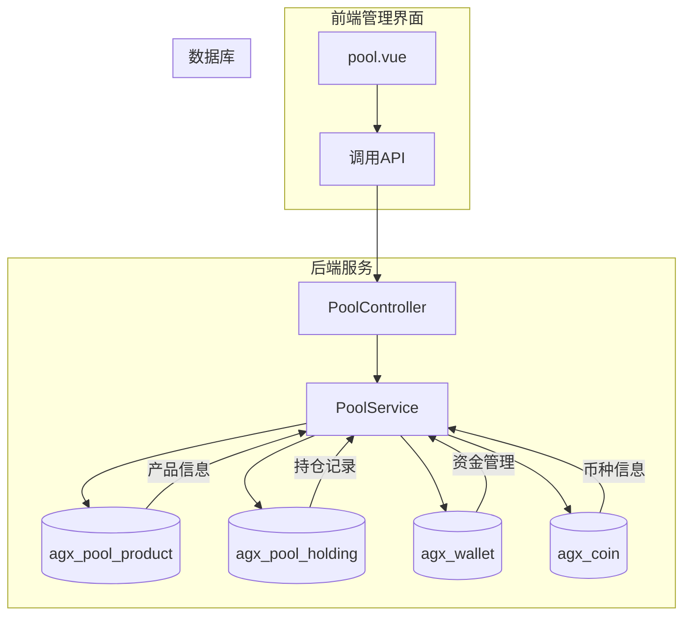
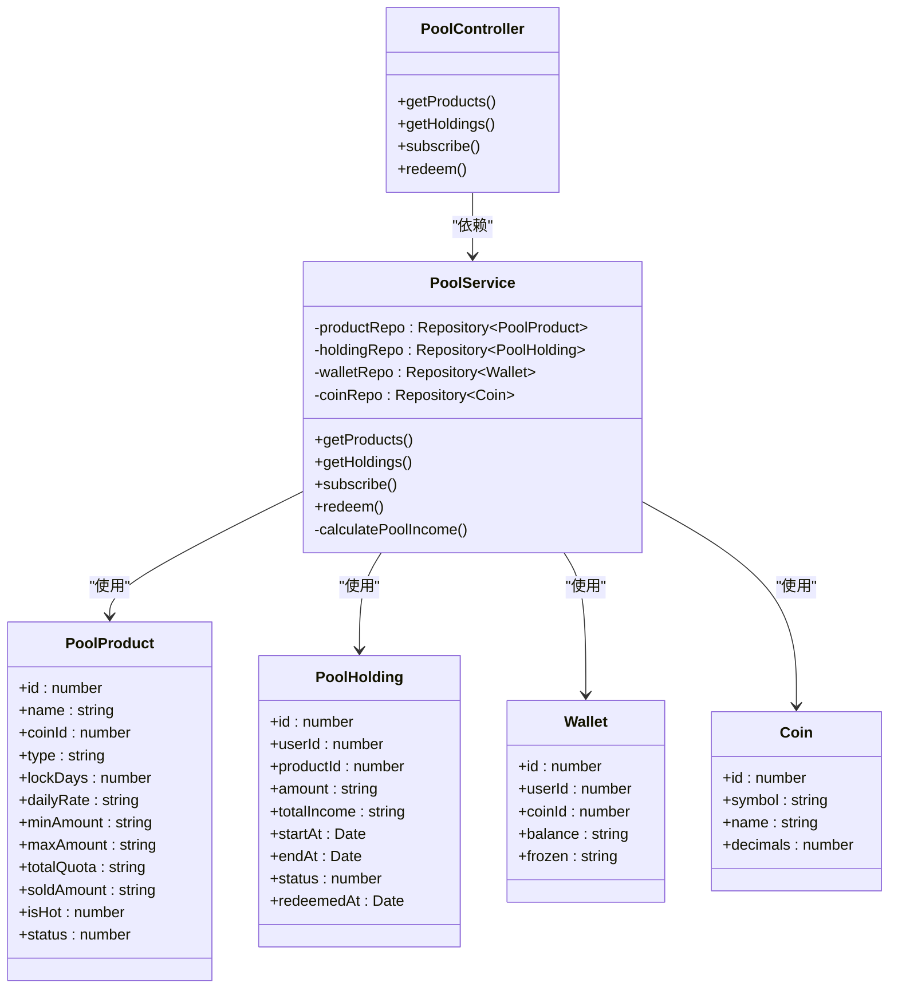
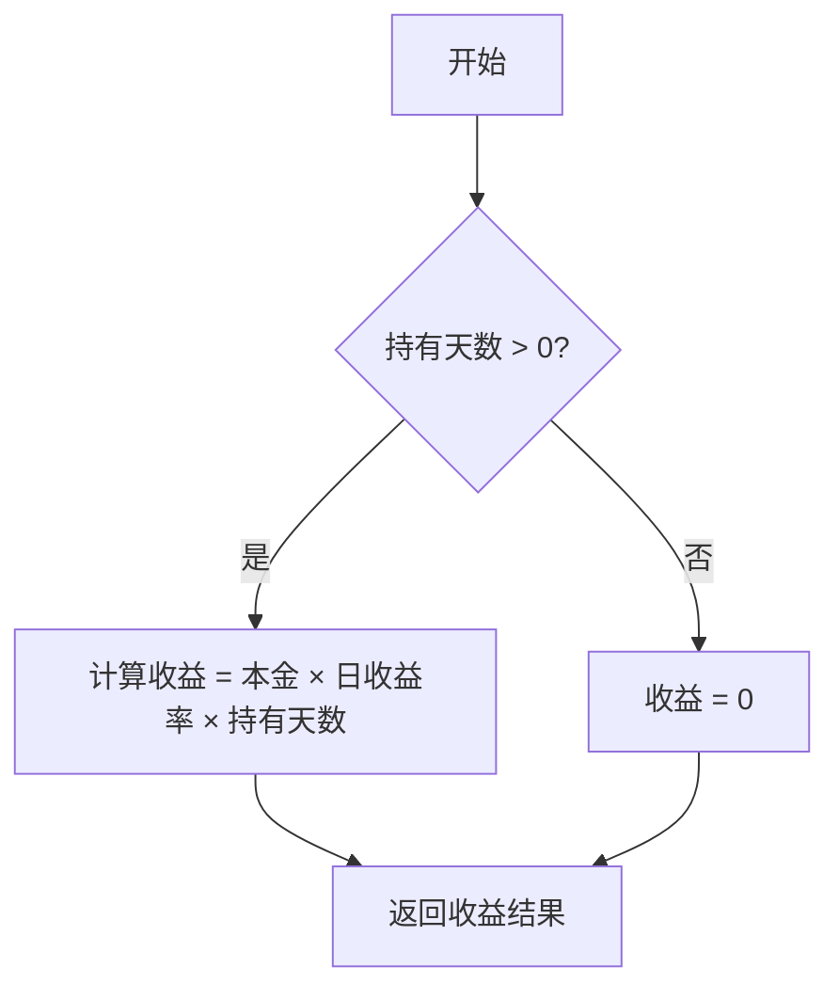
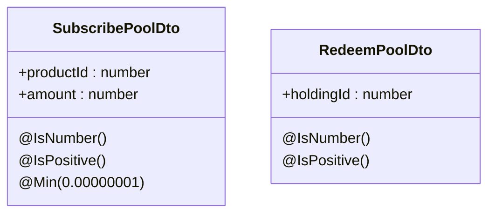
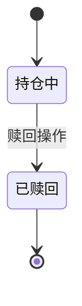
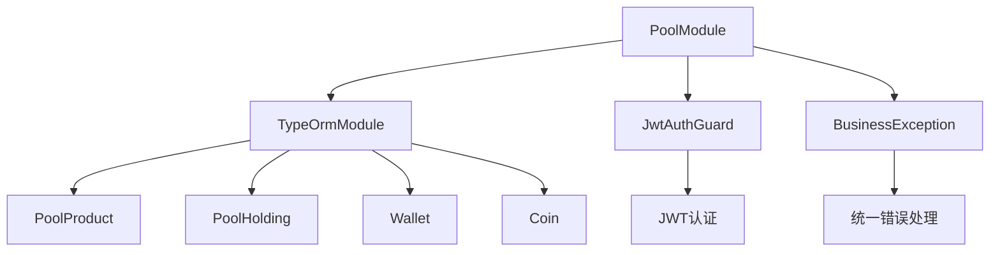

# 矿池投资模块

<cite>
**本文档引用文件**  
- [pool.controller.ts](file://agx-backend/src/modules/pool/pool.controller.ts)
- [pool.service.ts](file://agx-backend/src/modules/pool/pool.service.ts)
- [pool.dto.ts](file://agx-backend/src/modules/pool/pool.dto.ts)
- [pool-product.entity.ts](file://agx-backend/src/entities/pool-product.entity.ts)
- [pool-holding.entity.ts](file://agx-backend/src/entities/pool-holding.entity.ts)
- [wallet.entity.ts](file://agx-backend/src/entities/wallet.entity.ts)
- [business.exception.ts](file://agx-backend/src/common/filters/business.exception.ts)
- [api-response.dto.ts](file://agx-backend/src/common/dto/api-response.dto.ts)
- [pool.module.ts](file://agx-backend/src/modules/pool/pool.module.ts)
- [app.module.ts](file://agx-backend/src/app.module.ts)
- [pool.vue](file://agx-admin/src/views/agx/pool.vue)
</cite>

## 目录
1. [项目结构](#项目结构)
2. [核心组件](#核心组件)
3. [架构概述](#架构概述)
4. [详细组件分析](#详细组件分析)
5. [依赖分析](#依赖分析)
6. [性能考虑](#性能考虑)
7. [故障排除指南](#故障排除指南)

## 项目结构

矿池投资模块位于后端服务的 `agx-backend/src/modules/pool` 目录下，包含控制器、服务、数据传输对象（DTO）和模块定义。前端管理界面位于 `agx-admin/src/views/agx/pool.vue`，用于矿池产品的配置和管理。

**图示来源**  
- [pool.vue](file://agx-admin/src/views/agx/pool.vue)
- [pool.controller.ts](file://agx-backend/src/modules/pool/pool.controller.ts)
- [pool.service.ts](file://agx-backend/src/modules/pool/pool.service.ts)
- [pool-product.entity.ts](file://agx-backend/src/entities/pool-product.entity.ts)
- [pool-holding.entity.ts](file://agx-backend/src/entities/pool-holding.entity.ts)

## 核心组件

矿池投资模块的核心功能由 `PoolService` 实现，负责处理用户参与矿池、收益计算、持仓管理等逻辑。`PoolController` 暴露 RESTful API 接口，供前端调用。DTO 类用于参数校验，确保输入数据的合法性。

**组件来源**  
- [pool.service.ts](file://agx-backend/src/modules/pool/pool.service.ts)
- [pool.controller.ts](file://agx-backend/src/modules/pool/pool.controller.ts)
- [pool.dto.ts](file://agx-backend/src/modules/pool/pool.dto.ts)

## 架构概述

矿池投资模块采用典型的 NestJS 分层架构，包含控制器层、服务层和数据访问层。通过 TypeORM 与数据库交互，使用事务确保资金操作的原子性。模块通过 JWT 认证保护敏感接口，确保只有认证用户才能进行投资操作。

**图示来源**  
- [pool.controller.ts](file://agx-backend/src/modules/pool/pool.controller.ts)
- [pool.service.ts](file://agx-backend/src/modules/pool/pool.service.ts)
- [pool-product.entity.ts](file://agx-backend/src/entities/pool-product.entity.ts)
- [pool-holding.entity.ts](file://agx-backend/src/entities/pool-holding.entity.ts)
- [wallet.entity.ts](file://agx-backend/src/entities/wallet.entity.ts)
- [coin.entity.ts](file://agx-backend/src/entities/coin.entity.ts)

## 详细组件分析

### 矿池服务分析

`PoolService` 是矿池投资模块的核心业务逻辑实现，包含产品查询、持仓管理、申购和赎回等功能。

#### 产品配置机制
矿池产品通过 `PoolProduct` 实体进行配置，支持活期和定期两种类型。产品配置包括收益率、锁定期、额度限制等参数，管理员可通过前端界面进行管理。

**组件来源**  
- [pool-product.entity.ts](file://agx-backend/src/entities/pool-product.entity.ts)
- [pool.vue](file://agx-admin/src/views/agx/pool.vue)

#### 收益计算公式
收益计算采用简单的线性模型：`收益 = 本金 × 日收益率 × 持有天数`。系统使用 `decimal.js` 库进行高精度计算，避免浮点数精度问题。

**图示来源**  
- [pool.service.ts](file://agx-backend/src/modules/pool/pool.service.ts#L99-L103)

#### 自动分红流程
系统未实现自动分红，收益在赎回时一次性结算。持有期间的收益为预期值，实际收益在赎回时根据实际持有天数重新计算。

**组件来源**  
- [pool.service.ts](file://agx-backend/src/modules/pool/pool.service.ts#L214-L221)

#### DTO参数校验
使用 `class-validator` 库对输入参数进行校验，确保数据的合法性和安全性。`SubscribePoolDto` 和 `RedeemPoolDto` 分别用于申购和赎回操作的参数验证。

**图示来源**  
- [pool.dto.ts](file://agx-backend/src/modules/pool/pool.dto.ts)

#### 矿池状态转换
矿池持仓的状态转换遵循严格的业务规则，确保资金安全。

**图示来源**  
- [pool-holding.entity.ts](file://agx-backend/src/entities/pool-holding.entity.ts#L47-L49)
- [pool.service.ts](file://agx-backend/src/modules/pool/pool.service.ts#L239-L244)

## 依赖分析

矿池投资模块依赖多个核心组件和外部服务，形成完整的投资管理生态系统。

**图示来源**  
- [pool.module.ts](file://agx-backend/src/modules/pool/pool.module.ts)
- [jwt-auth.guard.ts](file://agx-backend/src/modules/auth/jwt-auth.guard.ts)
- [business.exception.ts](file://agx-backend/src/common/filters/business.exception.ts)

## 性能考虑

### 大规模用户持仓数据处理优化建议
1. **数据库索引优化**：确保 `userId`、`productId`、`status` 字段有适当的索引
2. **分页查询**：对持仓列表查询实现分页，避免一次性加载大量数据
3. **缓存机制**：对热门矿池产品信息进行缓存，减少数据库查询压力
4. **批量操作**：在必要时实现批量申购和赎回功能，减少事务开销

### 资金安全防护措施
1. **事务保护**：所有资金操作都在数据库事务中执行，确保原子性
2. **余额校验**：在扣款前检查用户余额，防止超额扣款
3. **额度控制**：严格校验产品额度限制，防止超额申购
4. **异常处理**：完善的异常捕获和回滚机制，确保资金操作的完整性

**组件来源**  
- [pool.service.ts](file://agx-backend/src/modules/pool/pool.service.ts#L146-L193)
- [pool.service.ts](file://agx-backend/src/modules/pool/pool.service.ts#L223-L264)

## 故障排除指南

### 常见错误码
| 错误码 | 含义 | 解决方案 |
|-------|------|---------|
| 3001 | 矿池产品不存在或已下架 | 检查产品ID和状态 |
| 3002 | 低于最低申购金额 | 确保申购金额满足最小要求 |
| 3003 | 超过最高申购金额 | 确保申购金额不超过最大限制 |
| 3004 | 剩余额度不足 | 检查产品剩余额度 |
| 3005 | 余额不足 | 充值或减少申购金额 |
| 3006 | 持仓不存在 | 检查持仓ID和用户身份 |
| 3007 | 定期产品未到期，无法赎回 | 等待到期或选择其他产品 |

**组件来源**  
- [business.exception.ts](file://agx-backend/src/common/filters/business.exception.ts)
- [pool.service.ts](file://agx-backend/src/modules/pool/pool.service.ts)