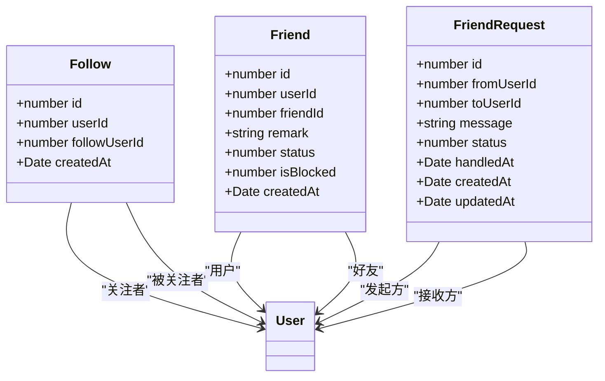
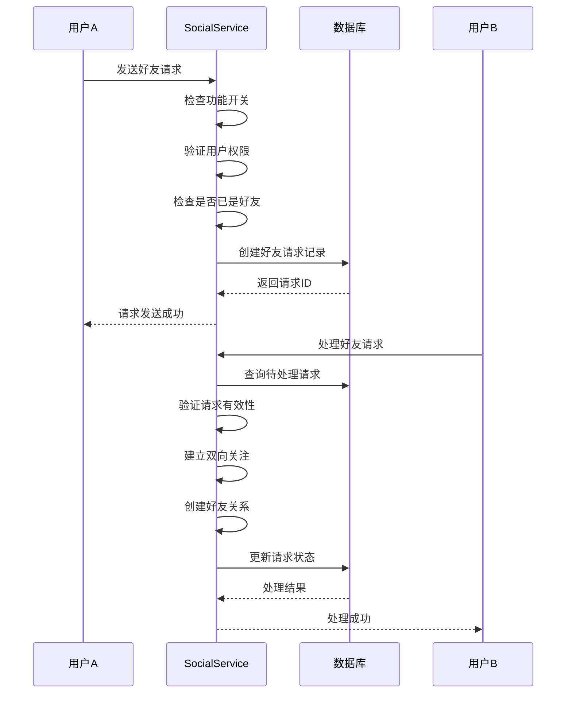
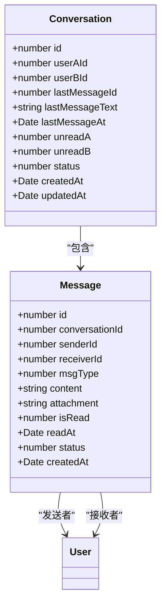
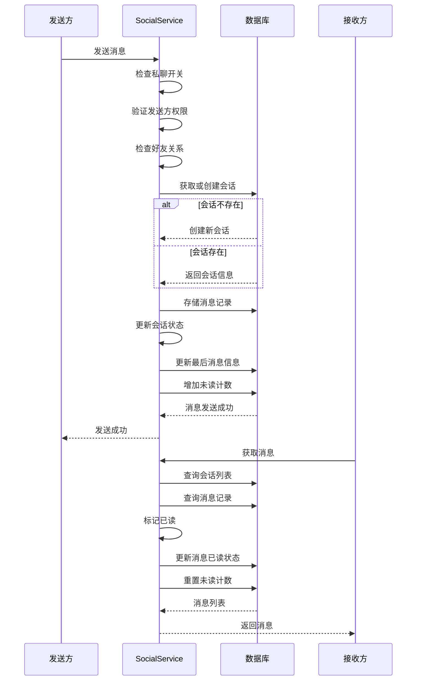
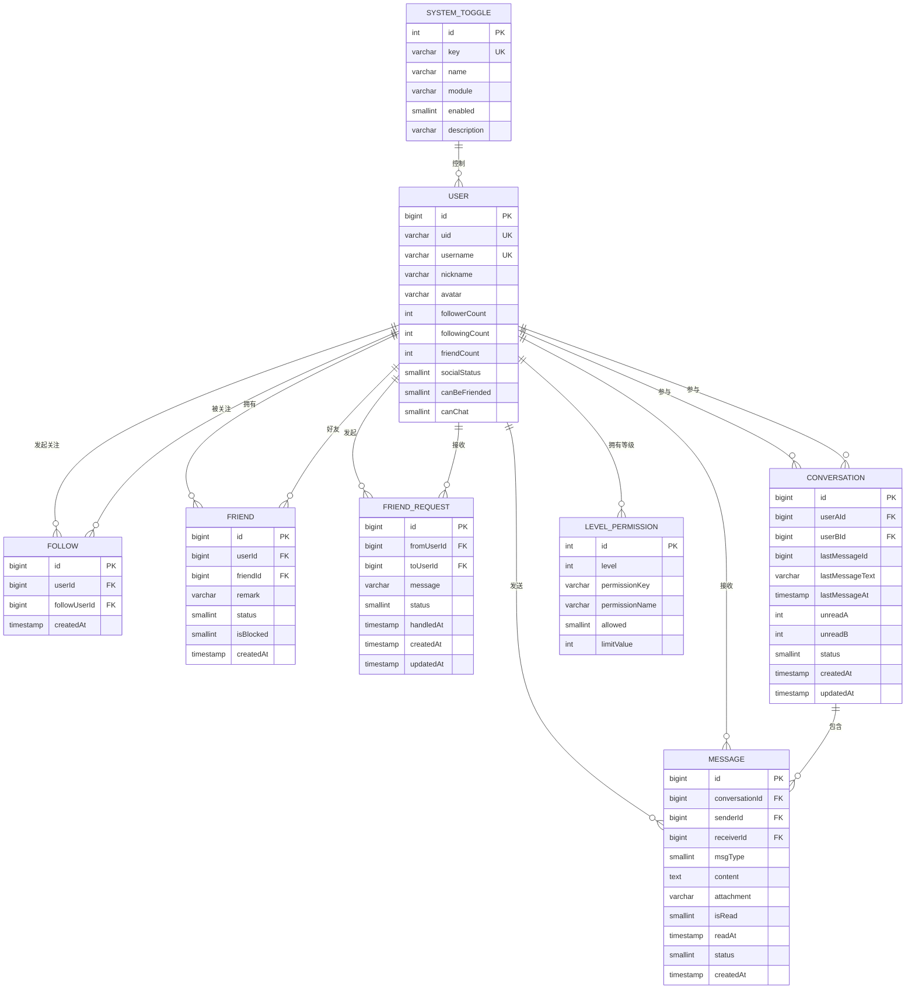
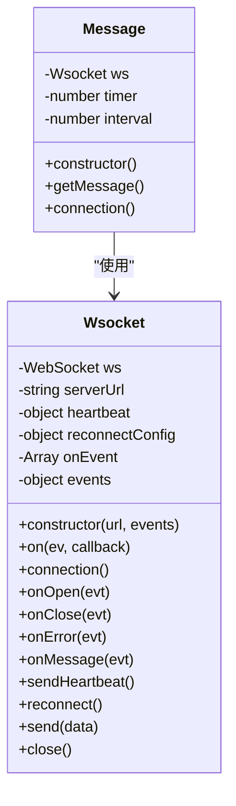
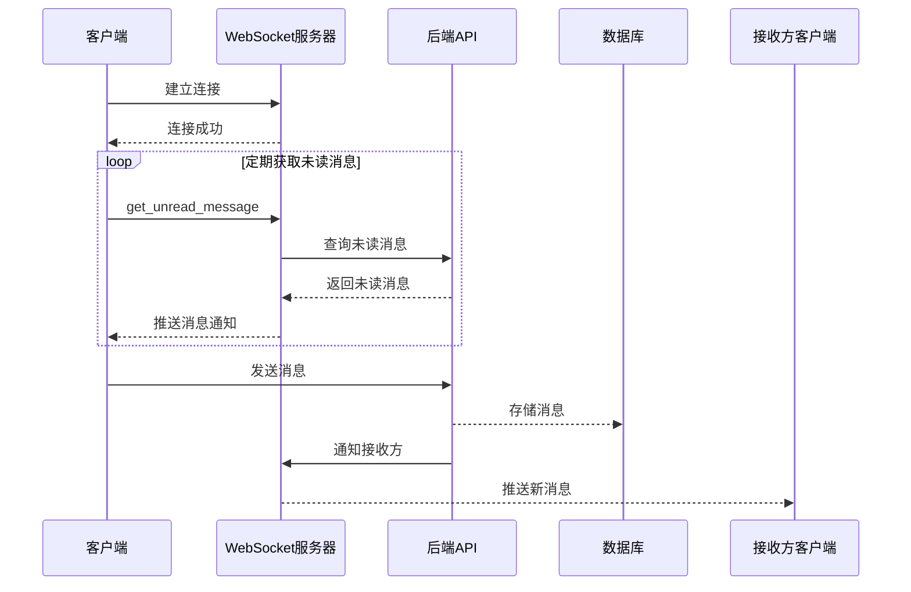
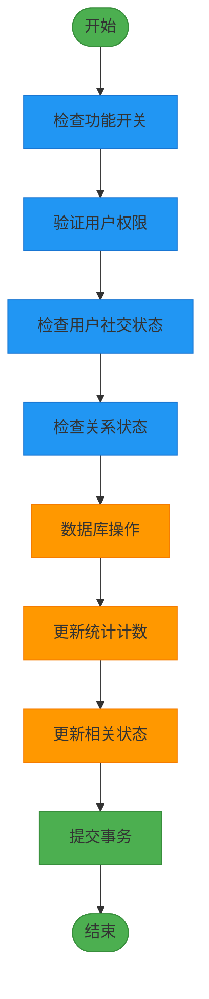
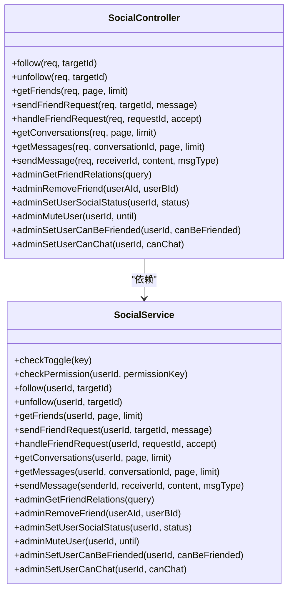

# 社交功能模块

<cite>
**本文档引用文件**  
- [social.controller.ts](file://agx-backend/src/modules/social/social.controller.ts)
- [social.service.ts](file://agx-backend/src/modules/social/social.service.ts)
- [friend.entity.ts](file://agx-backend/src/entities/friend.entity.ts)
- [friend-request.entity.ts](file://agx-backend/src/entities/friend-request.entity.ts)
- [conversation.entity.ts](file://agx-backend/src/entities/conversation.entity.ts)
- [message.entity.ts](file://agx-backend/src/entities/message.entity.ts)
- [follow.entity.ts](file://agx-backend/src/entities/follow.entity.ts)
- [user.entity.ts](file://agx-backend/src/entities/user.entity.ts)
- [system-toggle.entity.ts](file://agx-backend/src/entities/system-toggle.entity.ts)
- [level-permission.entity.ts](file://agx-backend/src/entities/level-permission.entity.ts)
- [social.module.ts](file://agx-backend/src/modules/social/social.module.ts)
- [message.js](file://agx-admin/src/ws-serve/message.js)
- [Wsocket.js](file://agx-admin/src/utils/Wsocket.js)
- [social-migration.sql](file://agx-backend/social-migration.sql)
</cite>

## 目录
1. [简介](#简介)
2. [核心组件](#核心组件)
3. [社交关系管理](#社交关系管理)
4. [实时消息推送与会话管理](#实时消息推送与会话管理)
5. [社交网络数据模型](#社交网络数据模型)
6. [WebSocket集成机制](#websocket集成机制)
7. [性能优化与数据一致性](#性能优化与数据一致性)
8. [管理端功能](#管理端功能)

## 简介
本模块实现了完整的用户社交互动系统，包括关注、好友请求、私聊消息等核心功能。系统采用NestJS框架构建，通过TypeORM进行数据持久化，支持高并发场景下的实时消息处理。社交功能通过功能开关和权限矩阵实现精细化控制，确保系统的灵活性和安全性。

## 核心组件

社交功能模块由控制器、服务、实体和数据访问层组成，采用分层架构设计。SocialController提供RESTful API接口，SocialService处理业务逻辑，实体类定义数据模型，Repository进行数据库操作。

**本节引用**  
- [social.controller.ts](file://agx-backend/src/modules/social/social.controller.ts#L1-L123)
- [social.service.ts](file://agx-backend/src/modules/social/social.service.ts#L1-L421)
- [social.module.ts](file://agx-backend/src/modules/social/social.module.ts#L1-L34)

## 社交关系管理

### 关注与好友系统
系统通过关注机制实现社交关系的建立。当用户A关注用户B时，创建关注记录。当双方互相关注时，自动建立好友关系。好友关系的建立和解除会同步更新用户的关注数、粉丝数和好友数统计。

**图表来源**  
- [follow.entity.ts](file://agx-backend/src/entities/follow.entity.ts#L1-L30)
- [friend.entity.ts](file://agx-backend/src/entities/friend.entity.ts#L1-L39)
- [friend-request.entity.ts](file://agx-backend/src/entities/friend-request.entity.ts#L1-L43)

**本节引用**  
- [social.service.ts](file://agx-backend/src/modules/social/social.service.ts#L56-L103)
- [social.controller.ts](file://agx-backend/src/modules/social/social.controller.ts#L13-L23)

### 好友请求流程
好友请求流程包含请求发送、处理和状态更新。系统检查功能开关、用户权限和社交状态，确保请求的合法性。当请求被接受时，系统自动建立双向关注关系并创建好友记录。

**图表来源**  
- [social.service.ts](file://agx-backend/src/modules/social/social.service.ts#L171-L242)
- [social.controller.ts](file://agx-backend/src/modules/social/social.controller.ts#L31-L49)

## 实时消息推送与会话管理

### 会话与消息模型
系统采用会话-消息模型管理私聊通信。每个好友对之间只有一个会话记录，会话表包含最后消息内容和未读计数等冗余字段，以提高查询性能。消息表存储具体的消息内容，支持文本、图片、语音等多种类型。

**图表来源**  
- [conversation.entity.ts](file://agx-backend/src/entities/conversation.entity.ts#L1-L52)
- [message.entity.ts](file://agx-backend/src/entities/message.entity.ts#L1-L51)

**本节引用**  
- [social.service.ts](file://agx-backend/src/modules/social/social.service.ts#L244-L373)

### 消息发送与接收流程
消息发送流程包含权限验证、会话创建、消息存储和状态更新。系统检查全局开关、用户权限和好友关系，确保消息的合法性。接收到消息后，系统更新会话的最后消息信息和未读计数。

**图表来源**  
- [social.service.ts](file://agx-backend/src/modules/social/social.service.ts#L320-L373)
- [social.controller.ts](file://agx-backend/src/modules/social/social.controller.ts#L68-L77)

## 社交网络数据模型

### 数据模型关系
社交功能模块包含多个实体，通过外键和索引建立关系。系统采用规范化设计，同时在关键字段上使用冗余数据以提高查询性能。

**图表来源**  
- [user.entity.ts](file://agx-backend/src/entities/user.entity.ts#L1-L118)
- [follow.entity.ts](file://agx-backend/src/entities/follow.entity.ts#L1-L30)
- [friend.entity.ts](file://agx-backend/src/entities/friend.entity.ts#L1-L39)
- [friend-request.entity.ts](file://agx-backend/src/entities/friend-request.entity.ts#L1-L43)
- [conversation.entity.ts](file://agx-backend/src/entities/conversation.entity.ts#L1-L52)
- [message.entity.ts](file://agx-backend/src/entities/message.entity.ts#L1-L51)
- [system-toggle.entity.ts](file://agx-backend/src/entities/system-toggle.entity.ts#L1-L48)
- [level-permission.entity.ts](file://agx-backend/src/entities/level-permission.entity.ts#L1-L46)

## WebSocket集成机制

### 客户端WebSocket实现
前端通过Wsocket封装类实现WebSocket连接管理，包括连接、重连、心跳和消息处理。Message类负责与消息服务器通信，定期获取未读消息。

**图表来源**  
- [Wsocket.js](file://agx-admin/src/utils/Wsocket.js#L1-L195)
- [message.js](file://agx-admin/src/ws-serve/message.js#L1-L42)

**本节引用**  
- [message.js](file://agx-admin/src/ws-serve/message.js#L1-L42)
- [Wsocket.js](file://agx-admin/src/utils/Wsocket.js#L1-L195)

### 实时消息推送流程
系统通过WebSocket实现消息的实时推送。客户端建立连接后，定期向服务器请求未读消息，服务器返回最新的消息通知。

**本节引用**  
- [message.js](file://agx-admin/src/ws-serve/message.js#L30-L33)
- [Wsocket.js](file://agx-admin/src/utils/Wsocket.js#L176-L183)

## 性能优化与数据一致性

### 高并发消息处理策略
系统采用多种策略应对高并发消息处理场景：

1. **数据库索引优化**：在关键查询字段上创建索引，如用户ID、会话ID等
2. **冗余数据设计**：在会话表中存储最后消息内容和未读计数，减少关联查询
3. **批量操作**：使用TypeORM的批量操作方法提高数据处理效率
4. **缓存机制**：考虑引入Redis缓存热门会话和用户信息

### 数据一致性保障方案
系统通过以下机制确保数据一致性：

1. **事务管理**：在关键操作中使用数据库事务，确保数据的原子性
2. **外键约束**：通过数据库外键约束维护数据完整性
3. **状态同步**：在修改关系数据时，同步更新相关统计字段
4. **唯一索引**：使用唯一索引防止重复记录的产生

**本节引用**  
- [social.service.ts](file://agx-backend/src/modules/social/social.service.ts#L36-L54)
- [social.service.ts](file://agx-backend/src/modules/social/social.service.ts#L71-L73)
- [social.service.ts](file://agx-backend/src/modules/social/social.service.ts#L120-L122)

## 管理端功能

管理端提供社交关系的管理和用户状态控制功能，包括查看好友关系、移除好友、设置用户社交状态等。

**图表来源**  
- [social.controller.ts](file://agx-backend/src/modules/social/social.controller.ts#L1-L123)
- [social.service.ts](file://agx-backend/src/modules/social/social.service.ts#L1-L421)

**本节引用**  
- [social.controller.ts](file://agx-backend/src/modules/social/social.controller.ts#L81-L122)
- [social.service.ts](file://agx-backend/src/modules/social/social.service.ts#L375-L419)