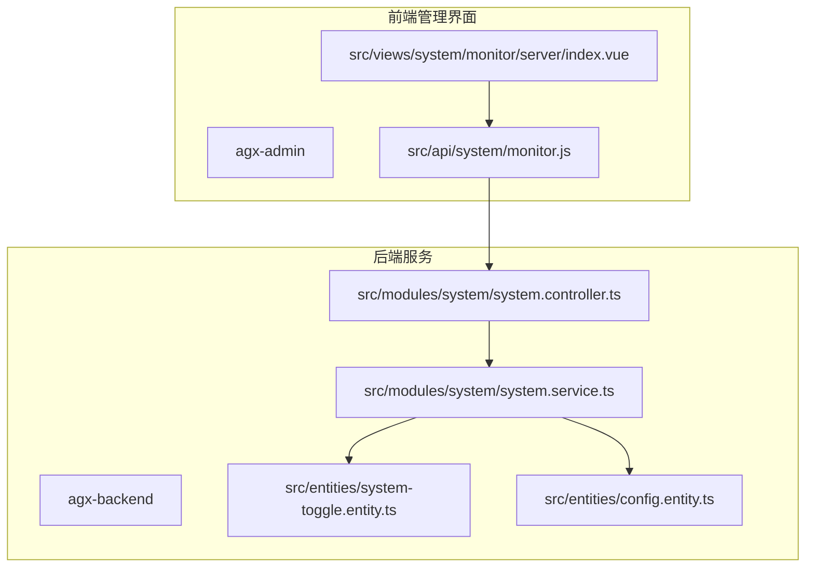
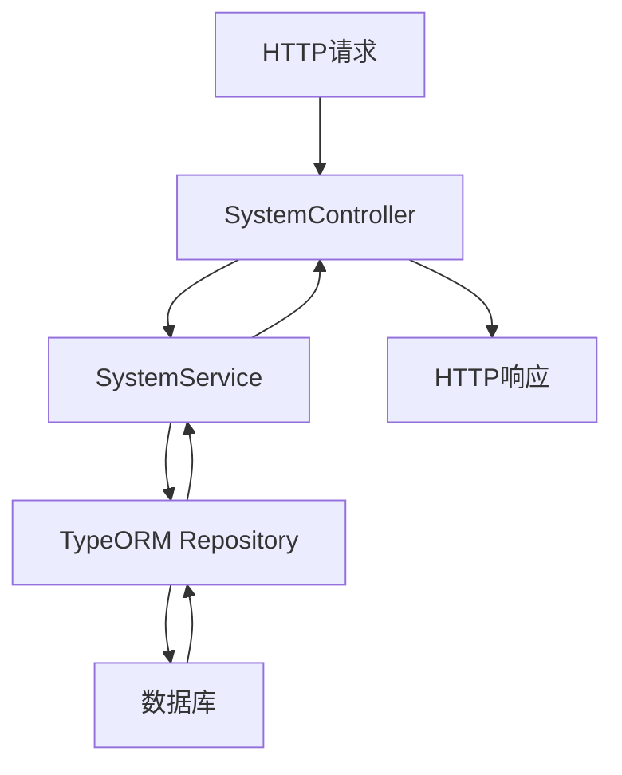
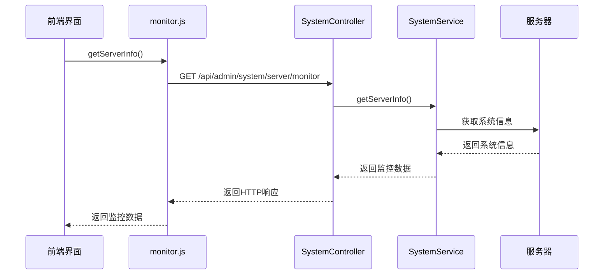
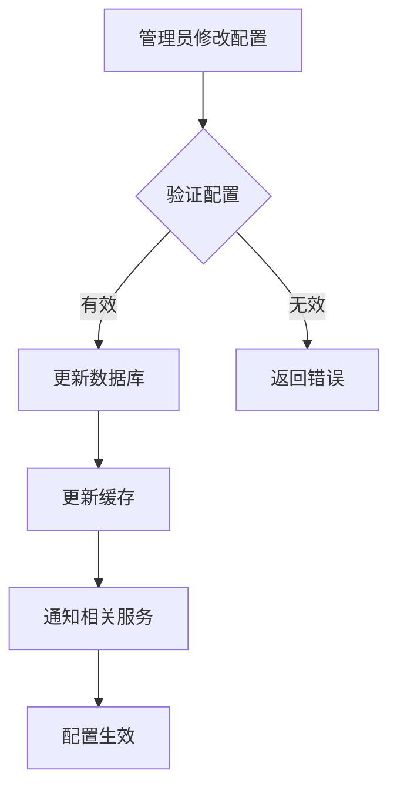
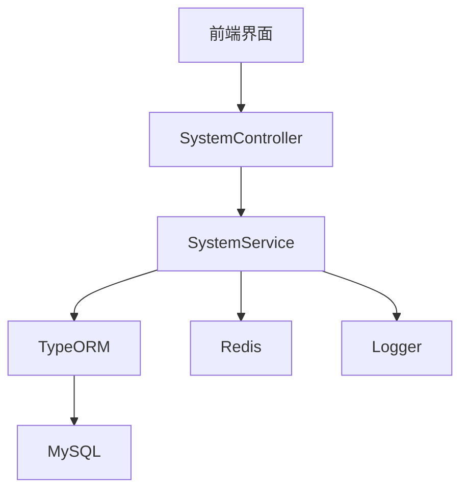
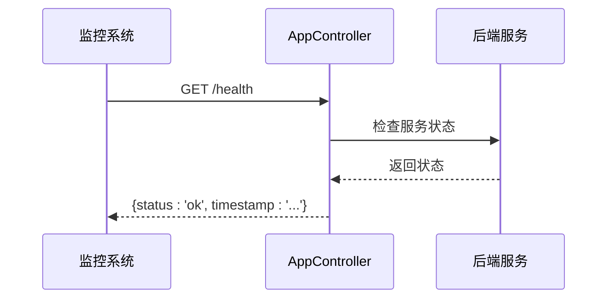

# 系统管理模块

<cite>
**本文档引用文件**  
- [system.controller.ts](file://agx-backend/src/modules/system/system.controller.ts)
- [system.service.ts](file://agx-backend/src/modules/system/system.service.ts)
- [system.module.ts](file://agx-backend/src/modules/system/system.module.ts)
- [system-toggle.entity.ts](file://agx-backend/src/entities/system-toggle.entity.ts)
- [config.entity.ts](file://agx-backend/src/entities/config.entity.ts)
- [level-permission.entity.ts](file://agx-backend/src/entities/level-permission.entity.ts)
- [app.controller.ts](file://agx-backend/src/app.controller.ts)
- [monitor.js](file://agx-admin/src/api/system/monitor.js)
- [server/index.vue](file://agx-admin/src/views/system/monitor/server/index.vue)
</cite>

## 目录
1. [简介](#简介)
2. [项目结构](#项目结构)
3. [核心组件](#核心组件)
4. [架构概述](#架构概述)
5. [详细组件分析](#详细组件分析)
6. [依赖分析](#依赖分析)
7. [性能考虑](#性能考虑)
8. [故障排除指南](#故障排除指南)
9. [结论](#结论)

## 简介
本文档详细说明了系统管理模块的实现，重点介绍后台系统配置与监控功能。文档涵盖 SystemService 如何处理系统参数配置、日志管理、服务监控等核心任务，以及 SystemController 如何暴露管理接口。同时详细描述了配置热更新机制、系统健康检查、性能指标采集等内容，并提供系统监控数据流图和典型管理场景示例。为开发者提供高可用性保障方案和系统安全加固建议。

## 项目结构
系统管理模块主要由后端服务和前端管理界面组成。后端采用 NestJS 框架实现 RESTful API 接口，前端使用 Vue.js 构建管理界面。



**图示来源**  
- [monitor.js](file://agx-admin/src/api/system/monitor.js)
- [system.controller.ts](file://agx-backend/src/modules/system/system.controller.ts)
- [system.service.ts](file://agx-backend/src/modules/system/system.service.ts)

**本节来源**  
- [system.controller.ts](file://agx-backend/src/modules/system/system.controller.ts)
- [monitor.js](file://agx-admin/src/api/system/monitor.js)

## 核心组件
系统管理模块的核心组件包括 SystemController、SystemService、SystemToggle 实体和 Config 实体。SystemController 负责暴露 RESTful API 接口，SystemService 实现业务逻辑，SystemToggle 实体管理功能开关，Config 实体管理配置参数。

**本节来源**  
- [system.controller.ts](file://agx-backend/src/modules/system/system.controller.ts)
- [system.service.ts](file://agx-backend/src/modules/system/system.service.ts)
- [system-toggle.entity.ts](file://agx-backend/src/entities/system-toggle.entity.ts)
- [config.entity.ts](file://agx-backend/src/entities/config.entity.ts)

## 架构概述
系统管理模块采用典型的分层架构，包括控制器层、服务层和数据访问层。控制器层处理 HTTP 请求，服务层实现业务逻辑，数据访问层通过 TypeORM 操作数据库。



**图示来源**  
- [system.controller.ts](file://agx-backend/src/modules/system/system.controller.ts)
- [system.service.ts](file://agx-backend/src/modules/system/system.service.ts)

## 详细组件分析

### SystemController 分析
SystemController 是系统管理模块的入口，负责暴露 RESTful API 接口，处理系统配置和监控相关的 HTTP 请求。

```mermaid
classDiagram
class SystemController {
+systemService : SystemService
+getToggles(module : string) : Promise~SystemToggle[]~
+updateToggle(key : string, enabled : number) : Promise~any~
+batchUpdateToggles(toggles : {key : string, enabled : number}[]) : Promise~any~
+createToggle(data : any) : Promise~SystemToggle~
+deleteToggle(key : string) : Promise~any~
+initDefaultToggles() : Promise~any~
+getPermissions(level : number) : Promise~LevelPermission[]~
+getPermissionMatrix() : Promise~any~
+updatePermission(level : number, permissionKey : string, allowed : number, limitValue : number) : Promise~any~
+batchUpdatePermissions(permissions : any[]) : Promise~any~
+initDefaultPermissions() : Promise~any~
}
SystemController --> SystemService : "依赖"
```

**图示来源**  
- [system.controller.ts](file://agx-backend/src/modules/system/system.controller.ts)

**本节来源**  
- [system.controller.ts](file://agx-backend/src/modules/system/system.controller.ts)

### SystemService 分析
SystemService 实现系统管理的核心业务逻辑，包括功能开关管理、权限矩阵管理、配置管理等。

```mermaid
classDiagram
class SystemService {
-toggleRepo : Repository~SystemToggle~
-permissionRepo : Repository~LevelPermission~
-configRepo : Repository~Config~
+getToggles(module : string) : Promise~SystemToggle[]~
+updateToggle(key : string, enabled : number) : Promise~any~
+batchUpdateToggles(toggles : {key : string, enabled : number}[]) : Promise~any~
+createToggle(data : Partial~SystemToggle~) : Promise~SystemToggle~
+deleteToggle(key : string) : Promise~any~
+getPermissions(level : number) : Promise~LevelPermission[]~
+getPermissionMatrix() : Promise~any~
+updatePermission(level : number, permissionKey : string, data : Partial~LevelPermission~) : Promise~any~
+batchUpdatePermissions(permissions : {level : number, permissionKey : string, allowed : number, limitValue : number}[]) : Promise~any~
+initDefaultToggles() : Promise~any~
+initDefaultPermissions() : Promise~any~
}
SystemService --> Repository : "使用"
Repository --> SystemToggle : "操作"
Repository --> LevelPermission : "操作"
Repository --> Config : "操作"
```

**图示来源**  
- [system.service.ts](file://agx-backend/src/modules/system/system.service.ts)
- [system-toggle.entity.ts](file://agx-backend/src/entities/system-toggle.entity.ts)
- [level-permission.entity.ts](file://agx-backend/src/entities/level-permission.entity.ts)
- [config.entity.ts](file://agx-backend/src/entities/config.entity.ts)

**本节来源**  
- [system.service.ts](file://agx-backend/src/modules/system/system.service.ts)

### 系统监控分析
系统监控功能通过前端界面调用后端 API 获取服务器状态信息，包括 CPU 使用率、内存使用率、磁盘使用情况等。



**图示来源**  
- [monitor.js](file://agx-admin/src/api/system/monitor.js)
- [server/index.vue](file://agx-admin/src/views/system/monitor/server/index.vue)

**本节来源**  
- [monitor.js](file://agx-admin/src/api/system/monitor.js)
- [server/index.vue](file://agx-admin/src/views/system/monitor/server/index.vue)

### 配置热更新机制
系统支持配置热更新，无需重启服务即可生效。当管理员修改配置时，系统会立即更新数据库中的配置值，并通过缓存机制确保配置的实时性。



**本节来源**  
- [system.service.ts](file://agx-backend/src/modules/system/system.service.ts)
- [config.entity.ts](file://agx-backend/src/entities/config.entity.ts)

## 依赖分析
系统管理模块依赖于多个核心组件和外部服务，包括数据库、缓存服务和日志服务。



**图示来源**  
- [system.controller.ts](file://agx-backend/src/modules/system/system.controller.ts)
- [system.service.ts](file://agx-backend/src/modules/system/system.service.ts)
- [system.module.ts](file://agx-backend/src/modules/system/system.module.ts)

**本节来源**  
- [system.module.ts](file://agx-backend/src/modules/system/system.module.ts)

## 性能考虑
系统管理模块在设计时充分考虑了性能因素，采用缓存机制减少数据库访问，使用批量操作提高效率，通过异步处理避免阻塞。

- **缓存策略**：常用配置和开关状态缓存在 Redis 中，减少数据库查询
- **批量操作**：支持批量更新功能开关和权限设置，减少网络往返
- **异步处理**：非关键操作采用异步方式执行，提高响应速度
- **索引优化**：在关键字段上创建索引，提高查询效率

**本节来源**  
- [system.service.ts](file://agx-backend/src/modules/system/system.service.ts)
- [system-toggle.entity.ts](file://agx-backend/src/entities/system-toggle.entity.ts)

## 故障排除指南
### 常见问题及解决方案
- **配置未生效**：检查缓存是否正确更新，确认配置键名是否正确
- **监控数据不准确**：验证服务器信息采集脚本是否正常运行
- **权限设置无效**：检查权限矩阵初始化是否完成，确认用户等级是否正确
- **功能开关无法修改**：检查数据库连接是否正常，确认用户权限是否足够

### 系统健康检查
系统提供健康检查接口，可用于监控服务状态：



**图示来源**  
- [app.controller.ts](file://agx-backend/src/app.controller.ts)

**本节来源**  
- [app.controller.ts](file://agx-backend/src/app.controller.ts)

## 结论
系统管理模块提供了完整的后台系统配置与监控功能，通过清晰的分层架构和模块化设计，实现了功能开关管理、权限矩阵管理、系统监控等核心功能。配置热更新机制确保了系统的灵活性，完善的监控体系保障了服务的稳定性。建议在生产环境中启用详细的日志记录，并定期进行性能优化，以确保系统的高可用性和安全性。