# 认证模块

<cite>
**本文档引用的文件**  
- [auth.module.ts](file://agx-backend/src/modules/auth/auth.module.ts)
- [jwt.strategy.ts](file://agx-backend/src/modules/auth/jwt.strategy.ts)
- [jwt-auth.guard.ts](file://agx-backend/src/modules/auth/jwt-auth.guard.ts)
- [current-user.decorator.ts](file://agx-backend/src/common/decorators/current-user.decorator.ts)
- [account.controller.ts](file://agx-backend/src/modules/account/account.controller.ts)
- [account.service.ts](file://agx-backend/src/modules/account/account.service.ts)
- [admin.controller.ts](file://agx-backend/src/modules/admin/admin.controller.ts)
- [admin.service.ts](file://agx-backend/src/modules/admin/admin.service.ts)
</cite>

## 目录
1. [简介](#简介)
2. [认证模块架构](#认证模块架构)
3. [JWT身份验证机制](#jwt身份验证机制)
4. [用户登录流程](#用户登录流程)
5. [令牌签发与验证逻辑](#令牌签发与验证逻辑)
6. [权限守卫实现](#权限守卫实现)
7. [拦截器与守卫的协作机制](#拦截器与守卫的协作机制)
8. [自定义装饰器@CurrentUser](#自定义装饰器currentuser)
9. [安全加固建议](#安全加固建议)
10. [性能优化方案](#性能优化方案)

## 简介
本文档详细介绍了系统中认证模块的实现机制，重点聚焦于JWT身份验证系统。文档涵盖了从用户登录、令牌签发、验证到路由保护的完整流程，为开发者提供了深入的技术细节和最佳实践建议。

## 认证模块架构

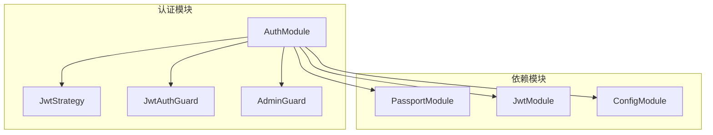

**图表来源**
- [auth.module.ts](file://agx-backend/src/modules/auth/auth.module.ts#L7-L24)
- [jwt.strategy.ts](file://agx-backend/src/modules/auth/jwt.strategy.ts#L13-L31)
- [jwt-auth.guard.ts](file://agx-backend/src/modules/auth/jwt-auth.guard.ts#L5-L37)

## JWT身份验证机制

### JWT策略实现

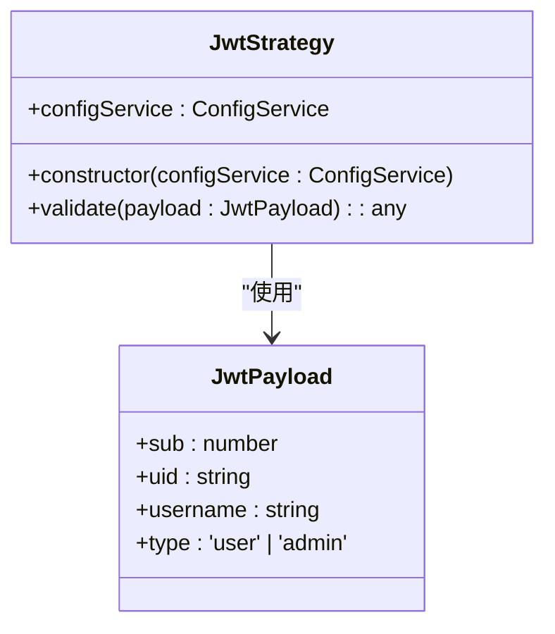

**图表来源**
- [jwt.strategy.ts](file://agx-backend/src/modules/auth/jwt.strategy.ts#L6-L31)

### JWT守卫实现

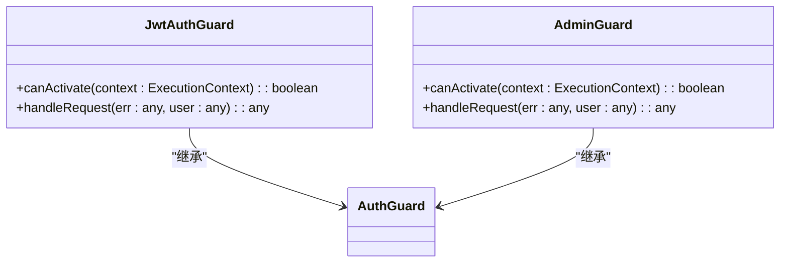

**图表来源**
- [jwt-auth.guard.ts](file://agx-backend/src/modules/auth/jwt-auth.guard.ts#L5-L37)

## 用户登录流程

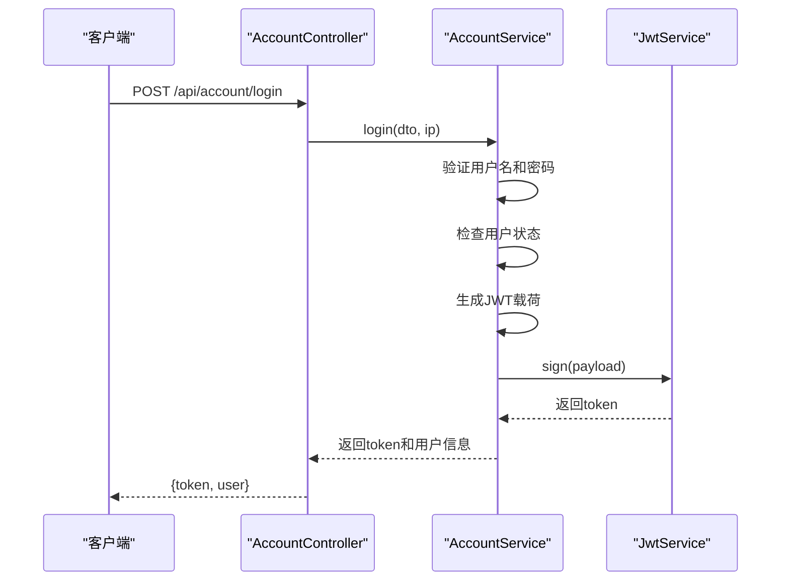

**图表来源**
- [account.controller.ts](file://agx-backend/src/modules/account/account.controller.ts#L25-L29)
- [account.service.ts](file://agx-backend/src/modules/account/account.service.ts#L156-L198)

## 令牌签发与验证逻辑

### 令牌签发流程

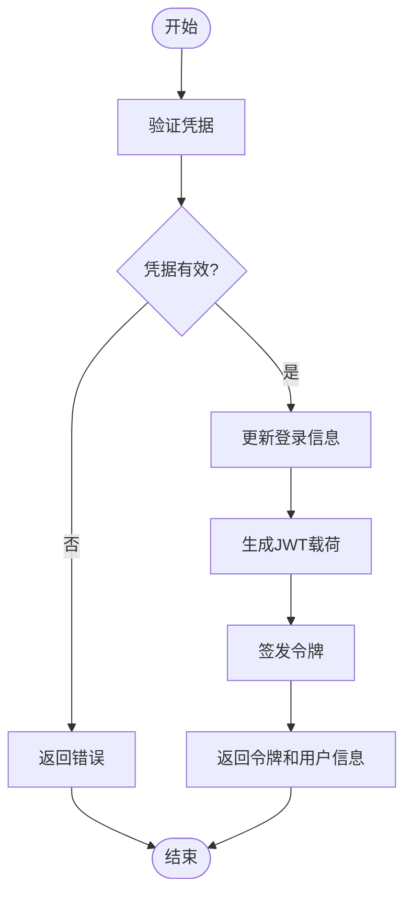

**图表来源**
- [account.service.ts](file://agx-backend/src/modules/account/account.service.ts#L156-L198)
- [admin.service.ts](file://agx-backend/src/modules/admin/admin.service.ts#L78-L118)

### 令牌验证流程

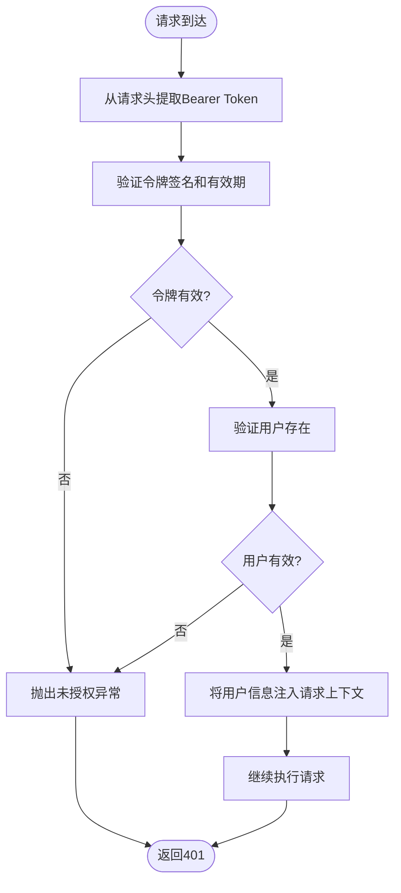

**图表来源**
- [jwt.strategy.ts](file://agx-backend/src/modules/auth/jwt.strategy.ts#L23-L31)
- [jwt-auth.guard.ts](file://agx-backend/src/modules/auth/jwt-auth.guard.ts#L11-L15)

## 权限守卫实现

### 守卫执行顺序

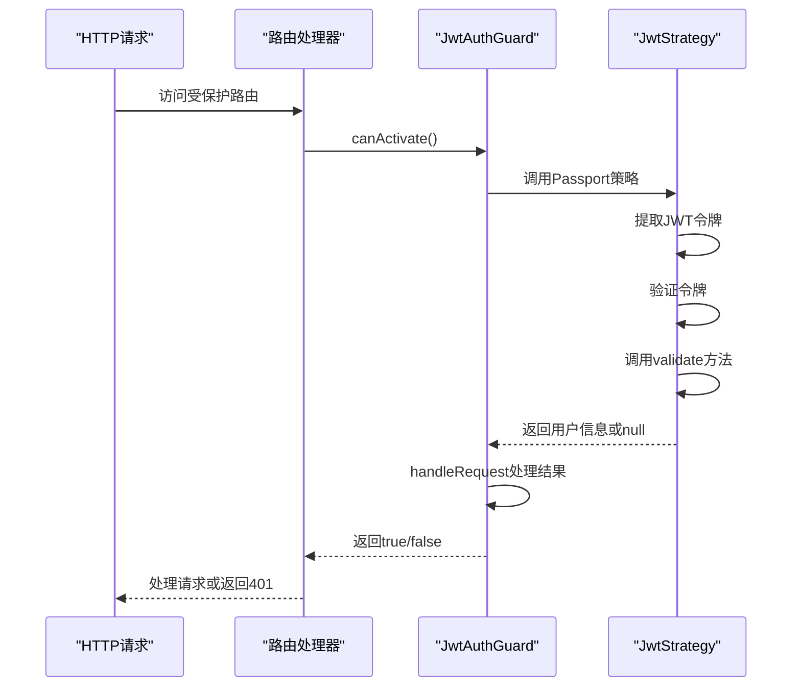

**图表来源**
- [jwt-auth.guard.ts](file://agx-backend/src/modules/auth/jwt-auth.guard.ts#L7-L15)
- [jwt.strategy.ts](file://agx-backend/src/modules/auth/jwt.strategy.ts#L23-L31)

### 管理员权限守卫

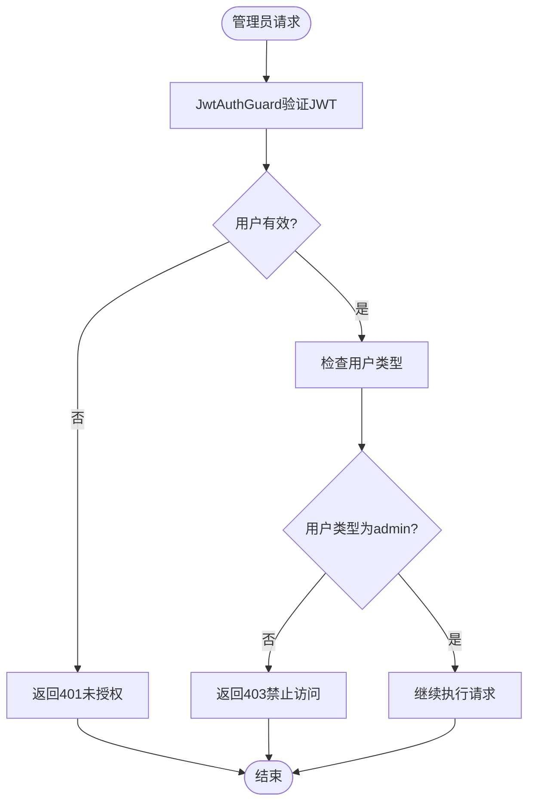

**图表来源**
- [jwt-auth.guard.ts](file://agx-backend/src/modules/auth/jwt-auth.guard.ts#L22-L37)
- [admin.controller.ts](file://agx-backend/src/modules/admin/admin.controller.ts#L30)

## 拦截器与守卫的协作机制

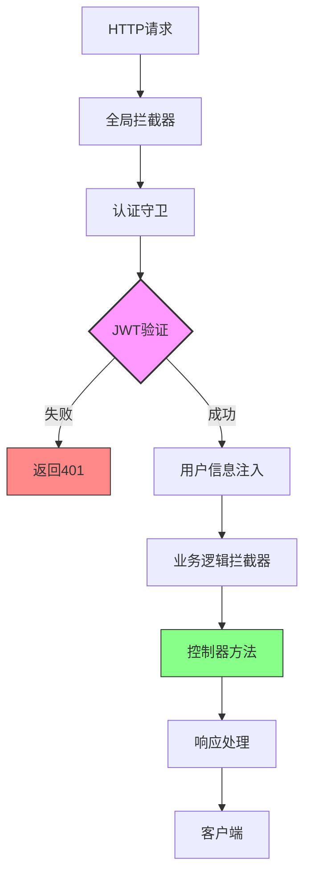

**图表来源**
- [jwt-auth.guard.ts](file://agx-backend/src/modules/auth/jwt-auth.guard.ts)
- [account.controller.ts](file://agx-backend/src/modules/account/account.controller.ts)

## 自定义装饰器@CurrentUser

### 装饰器实现原理

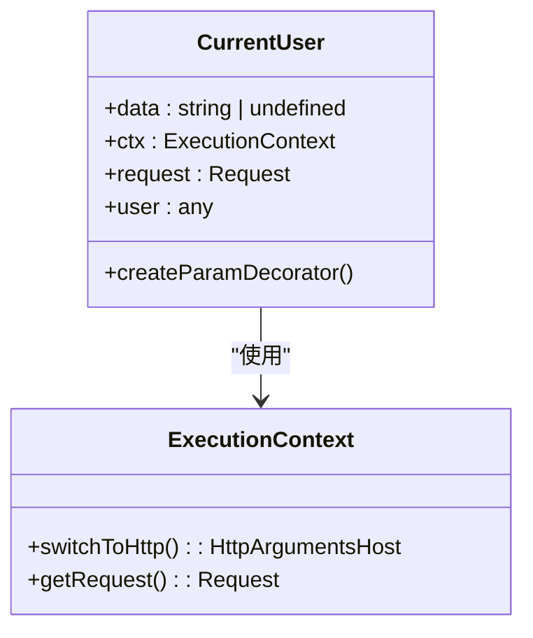

**图表来源**
- [current-user.decorator.ts](file://agx-backend/src/common/decorators/current-user.decorator.ts#L6-L15)

### 装饰器使用示例

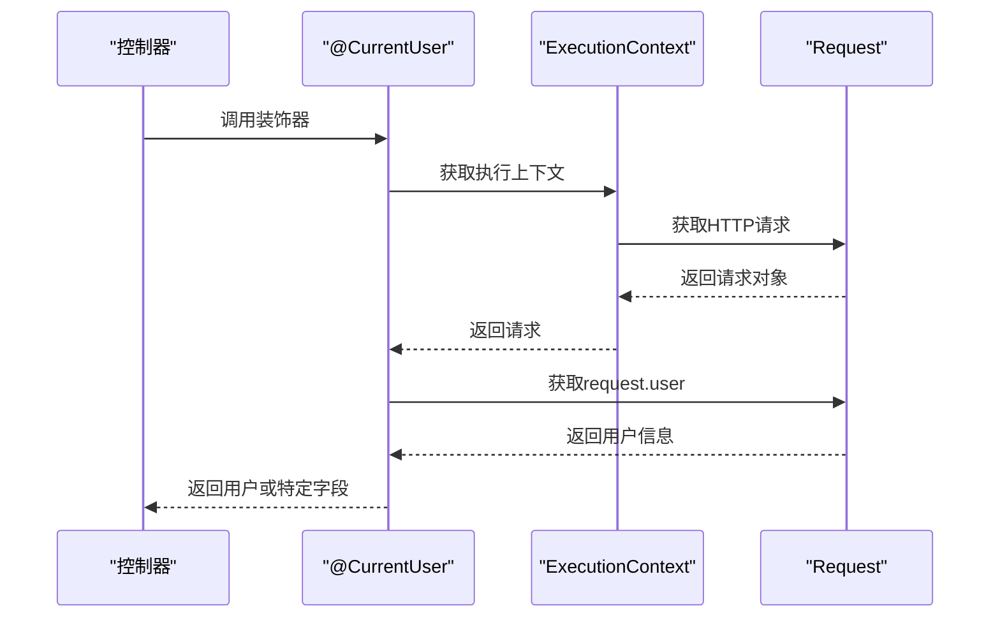

**图表来源**
- [current-user.decorator.ts](file://agx-backend/src/common/decorators/current-user.decorator.ts)
- [account.controller.ts](file://agx-backend/src/modules/account/account.controller.ts#L37)

## 安全加固建议

### 令牌刷新策略

建议实现令牌刷新机制，使用短期访问令牌和长期刷新令牌的组合：

```mermaid
flowchart LR
A[登录] --> B[签发短期访问令牌<br>(15分钟)]
A --> C[签发长期刷新令牌<br>(7天)]
B --> D[访问API]
D --> E{访问令牌是否过期?}
E --> |是| F[使用刷新令牌获取新访问令牌]
E --> |否| G[正常访问]
F --> H[验证刷新令牌]
H --> I{刷新令牌有效?}
I --> |是| J[签发新访问令牌]
I --> |否| K[要求重新登录]
```

### 黑名单机制

实现JWT黑名单机制，用于处理令牌撤销：

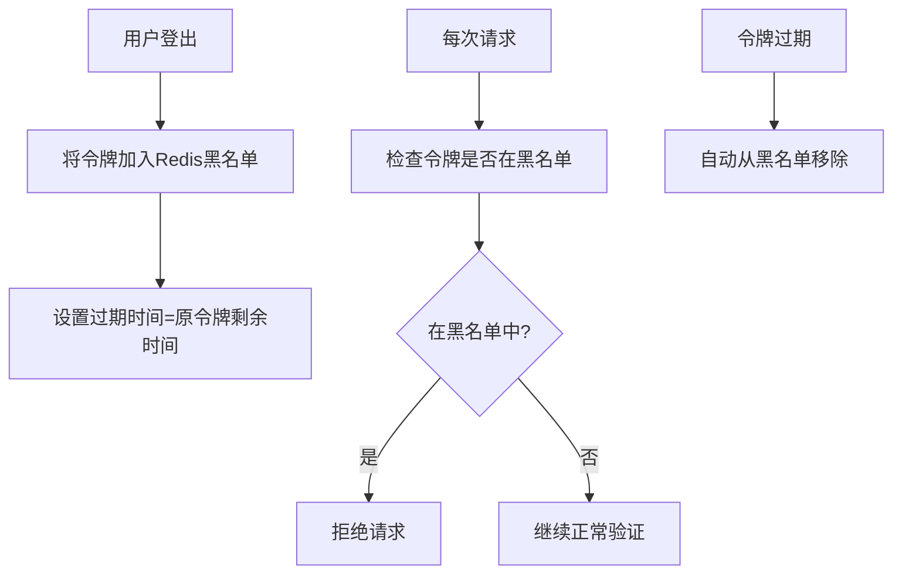

## 性能优化方案

### 缓存策略

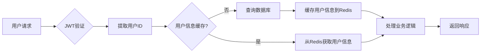

### 并发控制

建议使用以下性能优化措施：
- 使用Redis集群提高令牌验证性能
- 实现JWT签名验证的本地缓存
- 采用连接池管理数据库连接
- 对频繁访问的用户信息进行内存缓存

**本节来源**
- [account.service.ts](file://agx-backend/src/modules/account/account.service.ts)
- [admin.service.ts](file://agx-backend/src/modules/admin/admin.service.ts)