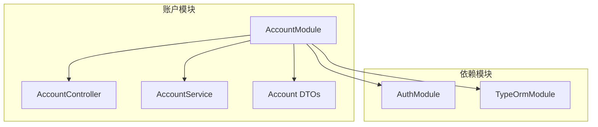
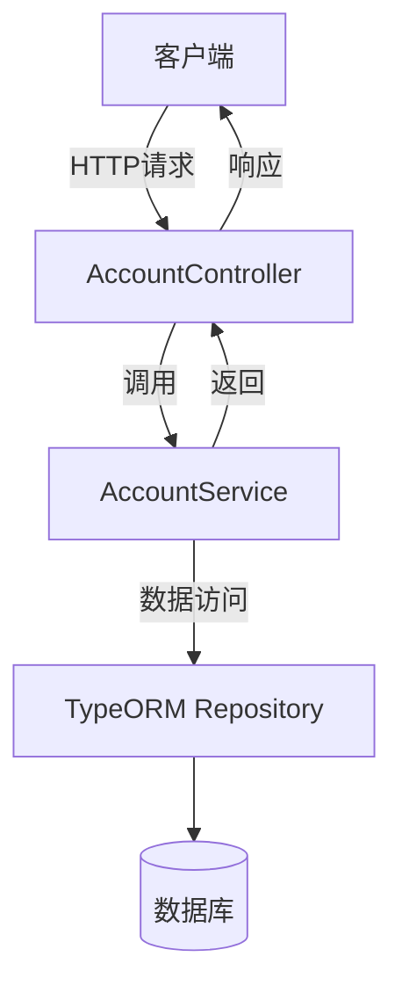
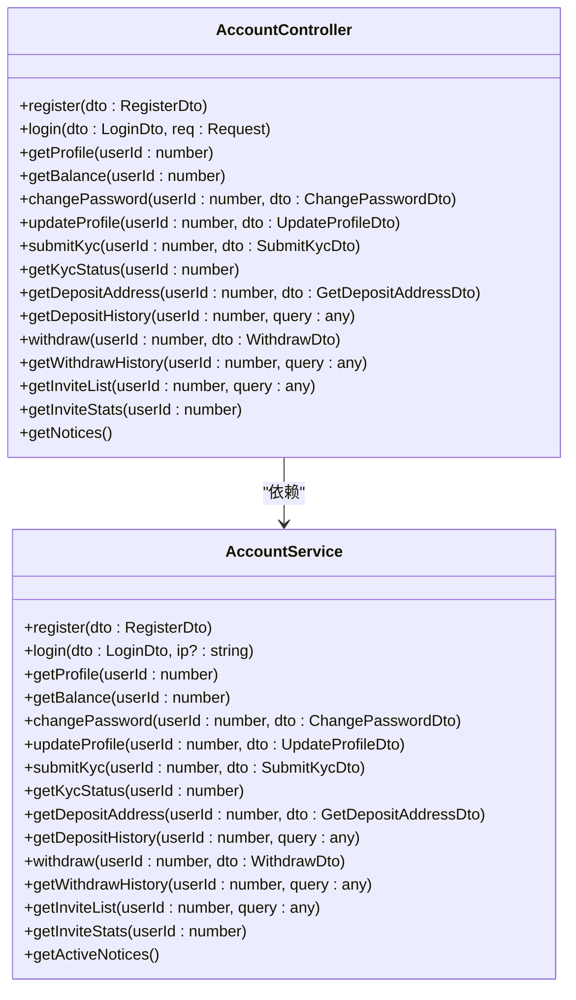
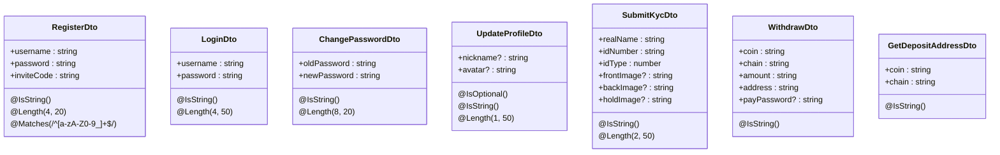
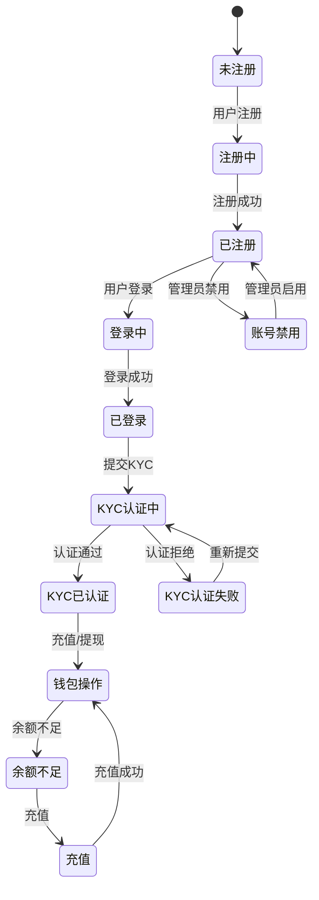
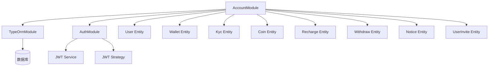
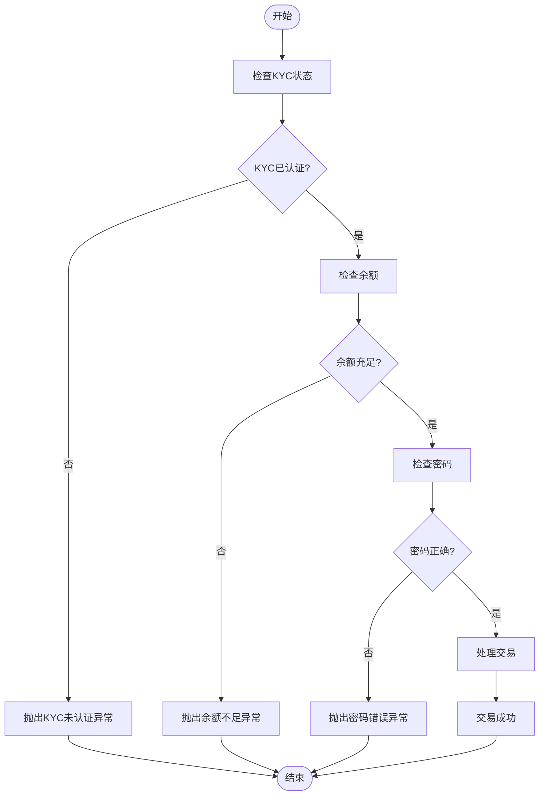

# 账户模块

<cite>
**本文档引用的文件**   
- [account.module.ts](file://agx-backend/src/modules/account/account.module.ts)
- [account.service.ts](file://agx-backend/src/modules/account/account.service.ts)
- [account.controller.ts](file://agx-backend/src/modules/account/account.controller.ts)
- [account.dto.ts](file://agx-backend/src/modules/account/account.dto.ts)
- [user.entity.ts](file://agx-backend/src/entities/user.entity.ts)
- [wallet.entity.ts](file://agx-backend/src/entities/wallet.entity.ts)
- [kyc.entity.ts](file://agx-backend/src/entities/kyc.entity.ts)
- [coin.entity.ts](file://agx-backend/src/entities/coin.entity.ts)
- [recharge.entity.ts](file://agx-backend/src/entities/recharge.entity.ts)
- [withdraw.entity.ts](file://agx-backend/src/entities/withdraw.entity.ts)
- [business.exception.ts](file://agx-backend/src/common/filters/business.exception.ts)
- [jwt-auth.guard.ts](file://agx-backend/src/modules/auth/jwt-auth.guard.ts)
- [current-user.decorator.ts](file://agx-backend/src/common/decorators/current-user.decorator.ts)
</cite>

## 目录
1. [项目结构](#项目结构)
2. [核心组件](#核心组件)
3. [架构概述](#架构概述)
4. [详细组件分析](#详细组件分析)
5. [依赖分析](#依赖分析)
6. [性能考虑](#性能考虑)
7. [故障排除指南](#故障排除指南)

## 项目结构

账户模块位于 `agx-backend/src/modules/account` 目录下，遵循 NestJS 模块化架构。该模块包含控制器、服务、DTO 和模块定义文件，与其他模块（如认证模块）保持松耦合。

**图表来源**
- [account.module.ts](file://agx-backend/src/modules/account/account.module.ts#L1-L18)

**本节来源**
- [account.module.ts](file://agx-backend/src/modules/account/account.module.ts#L1-L18)

## 核心组件

账户模块包含服务层和控制器层的协作，处理用户信息管理、钱包操作和 KYC 认证等核心业务逻辑。服务层封装业务逻辑，控制器层暴露 RESTful 接口。

**本节来源**
- [account.service.ts](file://agx-backend/src/modules/account/account.service.ts#L1-L606)
- [account.controller.ts](file://agx-backend/src/modules/account/account.controller.ts#L1-L160)

## 架构概述

账户模块采用 NestJS 的典型分层架构，包含控制器、服务和数据传输对象（DTO）。控制器处理 HTTP 请求，服务处理业务逻辑，DTO 定义数据传输结构。

**图表来源**
- [account.controller.ts](file://agx-backend/src/modules/account/account.controller.ts#L1-L160)
- [account.service.ts](file://agx-backend/src/modules/account/account.service.ts#L1-L606)

## 详细组件分析

### 服务与控制器协作模式

账户模块的服务层与控制器通过依赖注入机制协作。控制器注入服务实例，调用服务方法处理业务逻辑。

#### 服务层分析

**图表来源**
- [account.service.ts](file://agx-backend/src/modules/account/account.service.ts#L1-L606)
- [account.controller.ts](file://agx-backend/src/modules/account/account.controller.ts#L1-L160)

**本节来源**
- [account.service.ts](file://agx-backend/src/modules/account/account.service.ts#L1-L606)
- [account.controller.ts](file://agx-backend/src/modules/account/account.controller.ts#L1-L160)

### DTO 数据传输对象设计

DTO 定义了接口的数据传输结构和验证规则，确保数据的完整性和安全性。

**图表来源**
- [account.dto.ts](file://agx-backend/src/modules/account/account.dto.ts#L1-L98)

**本节来源**
- [account.dto.ts](file://agx-backend/src/modules/account/account.dto.ts#L1-L98)

### 账户状态管理流程

账户状态管理涉及用户注册、登录、KYC 认证等多个环节，形成完整的用户生命周期管理。

**图表来源**
- [account.service.ts](file://agx-backend/src/modules/account/account.service.ts#L65-L151)
- [account.service.ts](file://agx-backend/src/modules/account/account.service.ts#L156-L199)
- [account.service.ts](file://agx-backend/src/modules/account/account.service.ts#L295-L341)

**本节来源**
- [account.service.ts](file://agx-backend/src/modules/account/account.service.ts#L65-L341)

## 依赖分析

账户模块依赖于多个外部模块和实体，通过依赖注入机制实现松耦合。

**图表来源**
- [account.module.ts](file://agx-backend/src/modules/account/account.module.ts#L1-L18)
- [auth.module.ts](file://agx-backend/src/modules/auth/auth.module.ts#L1-L25)

**本节来源**
- [account.module.ts](file://agx-backend/src/modules/account/account.module.ts#L1-L18)
- [auth.module.ts](file://agx-backend/src/modules/auth/auth.module.ts#L1-L25)

## 性能考虑

### 缓存策略

账户模块可以通过缓存用户信息、钱包余额等频繁访问的数据来提高性能。建议使用 Redis 等内存数据库作为缓存层。

### 数据库索引优化

数据库表已定义多个索引以提高查询性能：
- 用户表：uid、username、invite_code 唯一索引
- 钱包表：userId 和 coinId 联合唯一索引
- 充值记录表：按创建时间倒序索引
- 提现记录表：按创建时间倒序索引

### 查询优化建议

1. 对于分页查询，使用 TypeORM QueryBuilder 进行优化
2. 对于关联查询，使用 relations 选项一次性加载关联数据
3. 对于复杂查询，使用原生 SQL 或 QueryBuilder 构建高效查询

**本节来源**
- [user.entity.ts](file://agx-backend/src/entities/user.entity.ts#L1-L118)
- [wallet.entity.ts](file://agx-backend/src/entities/wallet.entity.ts#L1-L42)
- [account.service.ts](file://agx-backend/src/modules/account/account.service.ts#L399-L413)
- [account.service.ts](file://agx-backend/src/modules/account/account.service.ts#L498-L511)

## 故障排除指南

### 常见异常处理场景

**图表来源**
- [account.service.ts](file://agx-backend/src/modules/account/account.service.ts#L439-L461)
- [business.exception.ts](file://agx-backend/src/common/filters/business.exception.ts#L1-L60)

**本节来源**
- [account.service.ts](file://agx-backend/src/modules/account/account.service.ts#L439-L461)
- [business.exception.ts](file://agx-backend/src/common/filters/business.exception.ts#L1-L60)