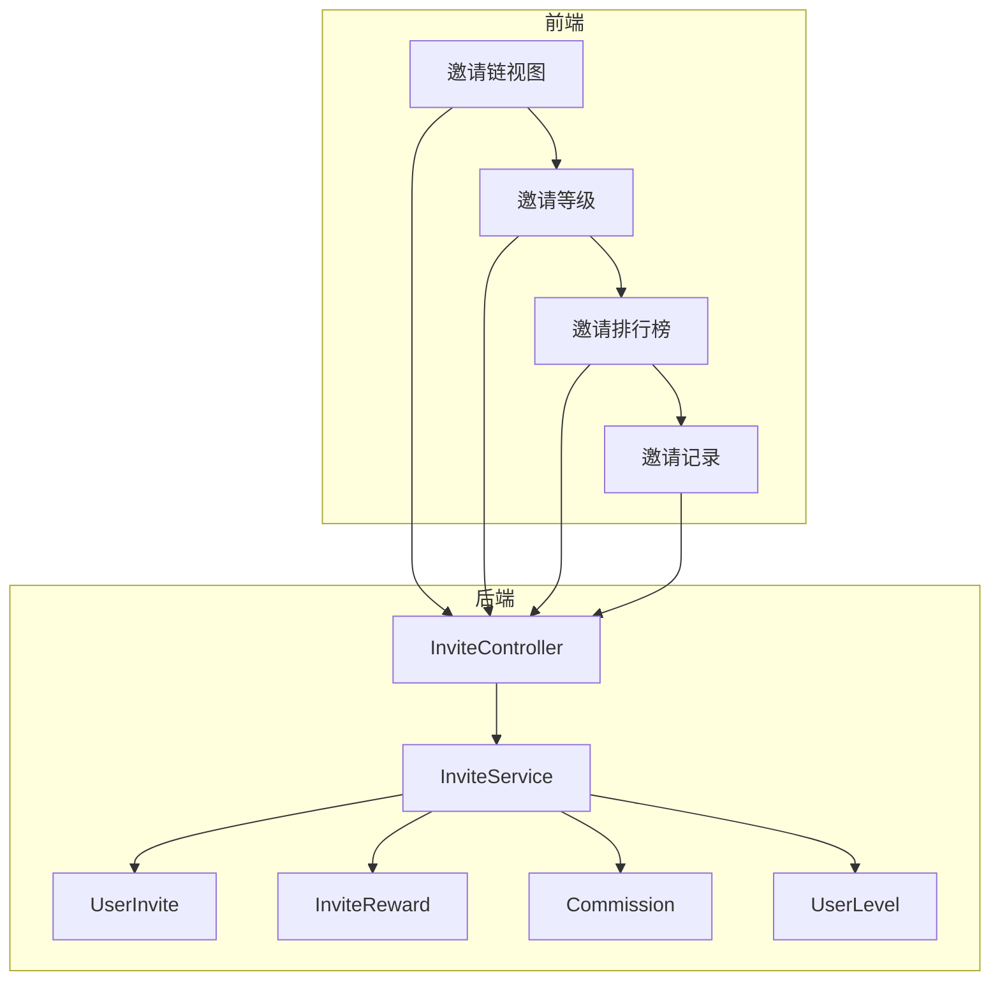
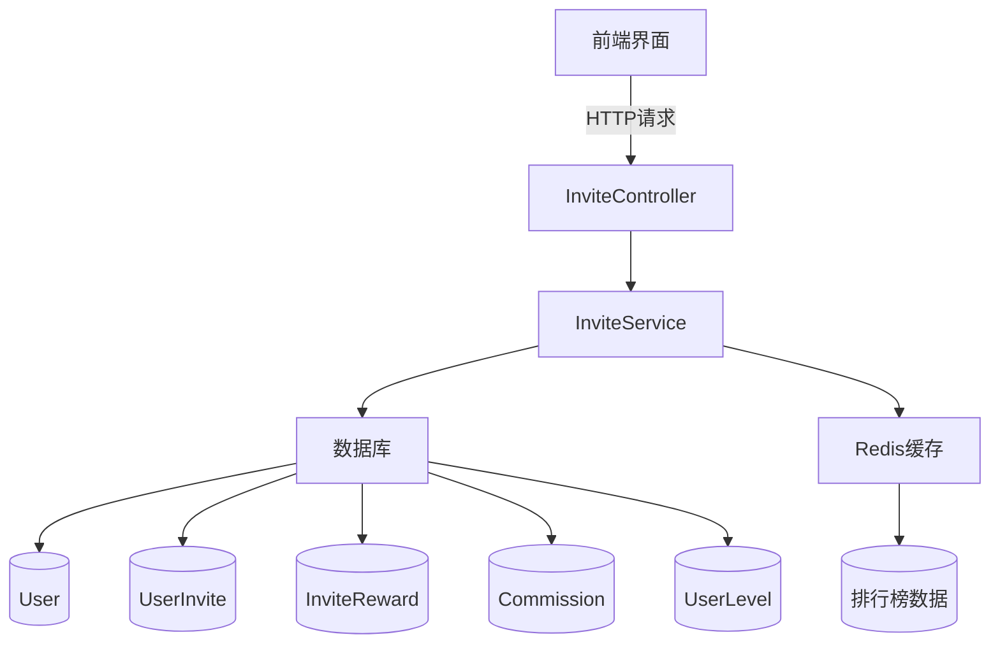
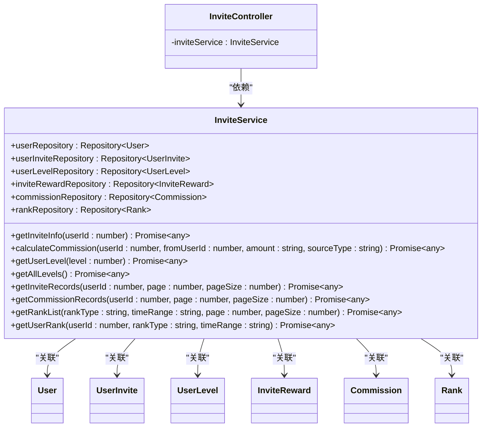
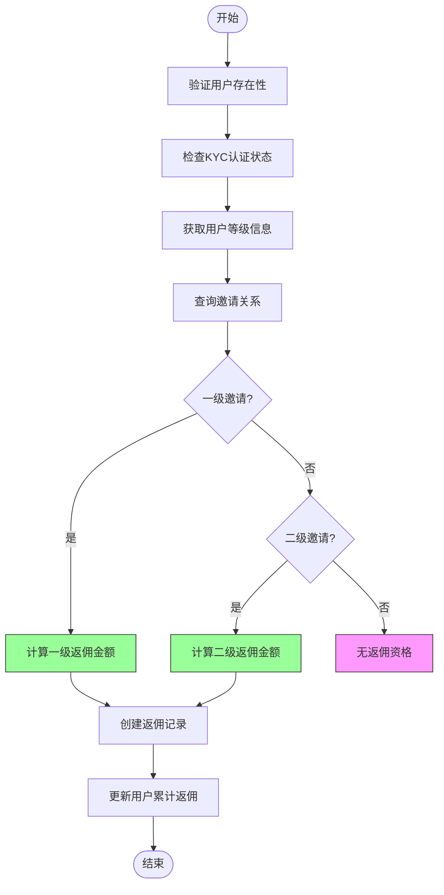
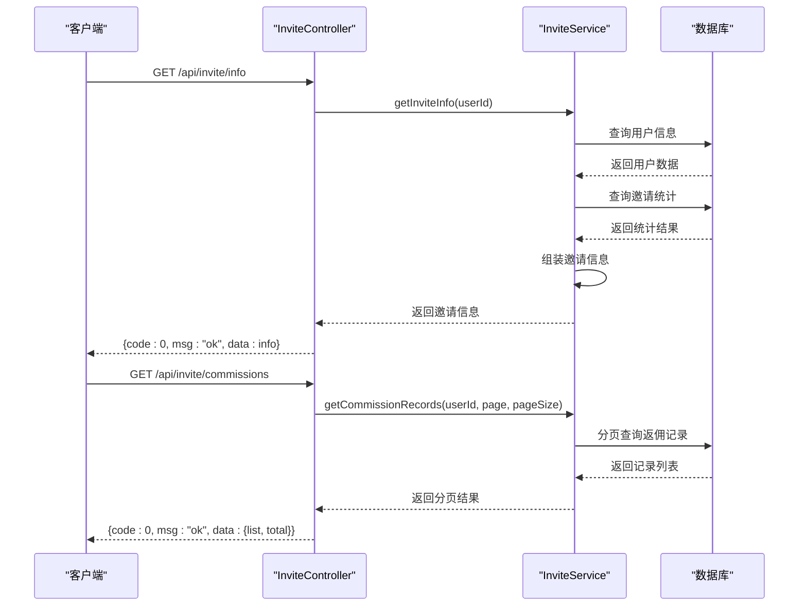
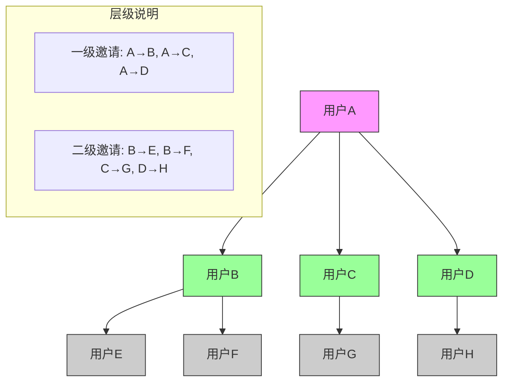
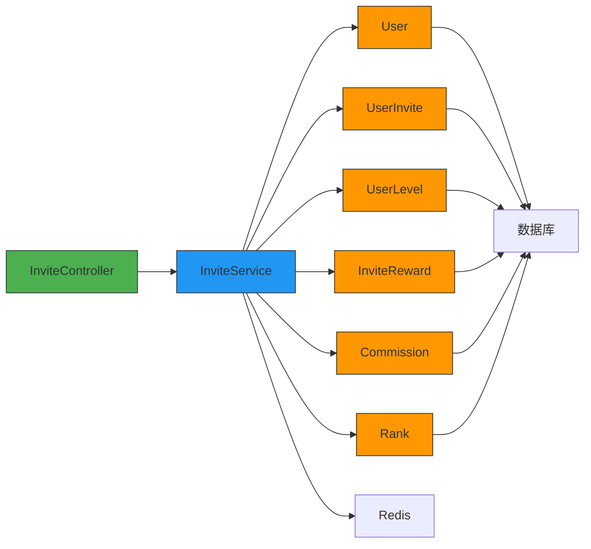

# 邀请奖励模块

<cite>
**本文档引用文件**  
- [invite.controller.ts](file://agx-backend/src/modules/invite/invite.controller.ts)
- [invite.service.ts](file://agx-backend/src/modules/invite/invite.service.ts)
- [user-invite.entity.ts](file://agx-backend/src/entities/user-invite.entity.ts)
- [invite-reward.entity.ts](file://agx-backend/src/entities/invite-reward.entity.ts)
- [user.entity.ts](file://agx-backend/src/entities/user.entity.ts)
- [user-level.entity.ts](file://agx-backend/src/entities/user-level.entity.ts)
- [commission.entity.ts](file://agx-backend/src/entities/commission.entity.ts)
- [rank.entity.ts](file://agx-backend/src/entities/rank.entity.ts)
- [invite.module.ts](file://agx-backend/src/modules/invite/invite.module.ts)
</cite>

## 目录
1. [简介](#简介)
2. [项目结构](#项目结构)
3. [核心组件](#核心组件)
4. [架构概览](#架构概览)
5. [详细组件分析](#详细组件分析)
6. [依赖分析](#依赖分析)
7. [性能考虑](#性能考虑)
8. [故障排除指南](#故障排除指南)
9. [结论](#结论)

## 简介
本文档详细阐述了邀请奖励模块的实现机制，聚焦于用户邀请体系的核心逻辑。文档涵盖InviteService如何处理邀请关系建立、奖励发放、层级计算等关键功能，以及InviteController如何暴露相关API接口。内容包括多级邀请架构设计、奖励触发条件、防作弊机制、邀请码生成与验证流程，并提供邀请关系树形结构示意图。同时为开发者提供大规模邀请数据处理的性能优化建议和事务一致性保障方案。

## 项目结构
邀请奖励模块主要由后端NestJS服务和前端Vue组件构成。后端模块位于`agx-backend/src/modules/invite/`目录下，包含控制器、服务和相关实体。前端界面位于`agx-admin/src/views/agx/`目录下，提供邀请链、等级、排行榜等可视化功能。

**图示来源**  
- [invite.controller.ts](file://agx-backend/src/modules/invite/invite.controller.ts#L7-L104)
- [invite.service.ts](file://agx-backend/src/modules/invite/invite.service.ts#L11-L315)

**本节来源**  
- [agx-backend/src/modules/invite/](file://agx-backend/src/modules/invite/)
- [agx-admin/src/views/agx/](file://agx-admin/src/views/agx/)

## 核心组件
邀请奖励模块的核心组件包括InviteService（处理业务逻辑）、InviteController（暴露API接口）、UserInvite实体（存储邀请关系）、InviteReward实体（记录奖励发放）、Commission实体（管理返佣）和UserLevel实体（定义等级权益）。这些组件协同工作，实现完整的邀请奖励体系。

**本节来源**  
- [invite.service.ts](file://agx-backend/src/modules/invite/invite.service.ts#L11-L315)
- [invite.controller.ts](file://agx-backend/src/modules/invite/invite.controller.ts#L8-L104)

## 架构概览
系统采用分层架构设计，前端通过HTTP请求调用后端API，后端服务处理业务逻辑并与数据库交互。邀请关系采用两级直推模式，支持终身返佣机制。系统通过Redis缓存排行榜数据，确保高并发访问性能。

**图示来源**  
- [invite.controller.ts](file://agx-backend/src/modules/invite/invite.controller.ts#L7-L104)
- [invite.service.ts](file://agx-backend/src/modules/invite/invite.service.ts#L11-L315)
- [rank.entity.ts](file://agx-backend/src/entities/rank.entity.ts#L1-L50)

## 详细组件分析

### InviteService分析
InviteService是邀请奖励模块的核心服务类，负责处理所有业务逻辑，包括邀请信息获取、返佣计算、等级管理、记录查询等功能。

#### 服务类结构

**图示来源**  
- [invite.service.ts](file://agx-backend/src/modules/invite/invite.service.ts#L11-L315)
- [invite.controller.ts](file://agx-backend/src/modules/invite/invite.controller.ts#L9-L104)

#### 返佣计算流程

**图示来源**  
- [invite.service.ts](file://agx-backend/src/modules/invite/invite.service.ts#L67-L131)
- [commission.entity.ts](file://agx-backend/src/entities/commission.entity.ts#L1-L54)

### InviteController分析
InviteController负责暴露RESTful API接口，处理HTTP请求并返回相应数据。控制器采用NestJS框架的装饰器模式，清晰定义路由和请求处理方法。

#### API调用流程

**图示来源**  
- [invite.controller.ts](file://agx-backend/src/modules/invite/invite.controller.ts#L15-L104)
- [invite.service.ts](file://agx-backend/src/modules/invite/invite.service.ts#L163-L208)

### 邀请关系树形结构
系统采用两级邀请关系模型，支持无限级团队发展，但返佣仅限两级直推。

**图示来源**  
- [user-invite.entity.ts](file://agx-backend/src/entities/user-invite.entity.ts#L1-L39)
- [user.entity.ts](file://agx-backend/src/entities/user.entity.ts#L60-L65)

**本节来源**  
- [invite.service.ts](file://agx-backend/src/modules/invite/invite.service.ts#L11-L315)
- [invite.controller.ts](file://agx-backend/src/modules/invite/invite.controller.ts#L8-L104)
- [user-invite.entity.ts](file://agx-backend/src/entities/user-invite.entity.ts#L1-L39)

## 依赖分析
邀请奖励模块依赖多个核心实体和外部服务，形成完整的业务闭环。

**图示来源**  
- [invite.module.ts](file://agx-backend/src/modules/invite/invite.module.ts#L8-L12)
- [app.module.ts](file://agx-backend/src/app.module.ts#L121-L122)

**本节来源**  
- [invite.module.ts](file://agx-backend/src/modules/invite/invite.module.ts#L1-L14)
- [app.module.ts](file://agx-backend/src/app.module.ts#L110-L130)

## 性能考虑
针对大规模邀请数据处理，系统采用多种性能优化策略：

1. **数据库索引优化**：在关键字段上创建索引，如`user_id`、`inviter_id`、`rank_type`等
2. **分页查询**：所有列表接口均支持分页，避免全表扫描
3. **缓存机制**：排行榜数据缓存在Redis中，减少数据库压力
4. **批量操作**：支持批量处理邀请关系和奖励发放
5. **异步处理**：非关键操作采用消息队列异步处理

**本节来源**  
- [invite.service.ts](file://agx-backend/src/modules/invite/invite.service.ts#L164-L169)
- [rank.entity.ts](file://agx-backend/src/entities/rank.entity.ts#L20-L25)

## 故障排除指南
常见问题及解决方案：

1. **邀请码无效**：检查用户是否已注册，邀请码是否正确
2. **返佣未到账**：确认被邀请人已完成KYC认证，交易已结算
3. **等级未更新**：检查资产和邀请人数是否达到等级要求
4. **排行榜数据延迟**：排行榜数据为定时更新，可能存在几分钟延迟

**本节来源**  
- [invite.service.ts](file://agx-backend/src/modules/invite/invite.service.ts#L73-L76)
- [user-level.entity.ts](file://agx-backend/src/entities/user-level.entity.ts#L34-L38)

## 结论
邀请奖励模块通过清晰的架构设计和完善的业务逻辑，实现了高效的用户邀请体系。系统支持多级邀请、灵活的奖励机制和实时的排行榜功能，为平台增长提供了强有力的支持。通过合理的性能优化和事务管理，确保了系统在高并发场景下的稳定性和数据一致性。