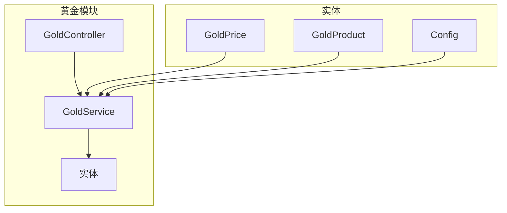
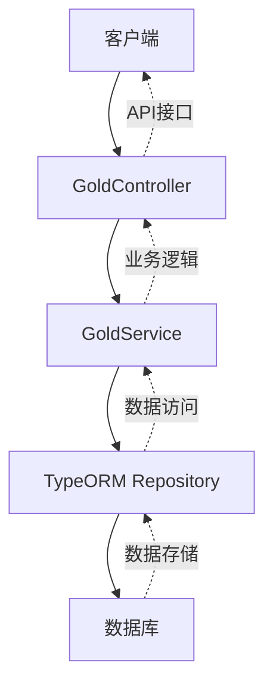
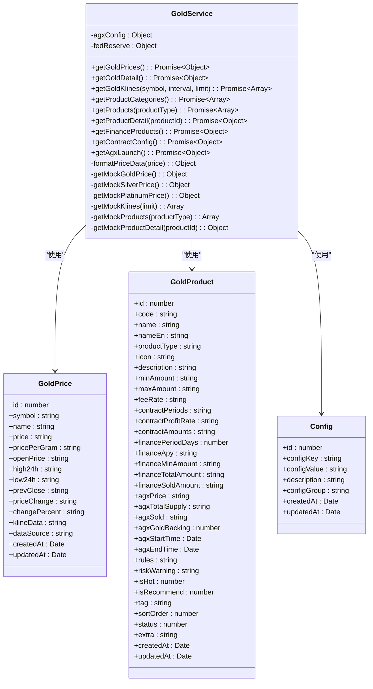
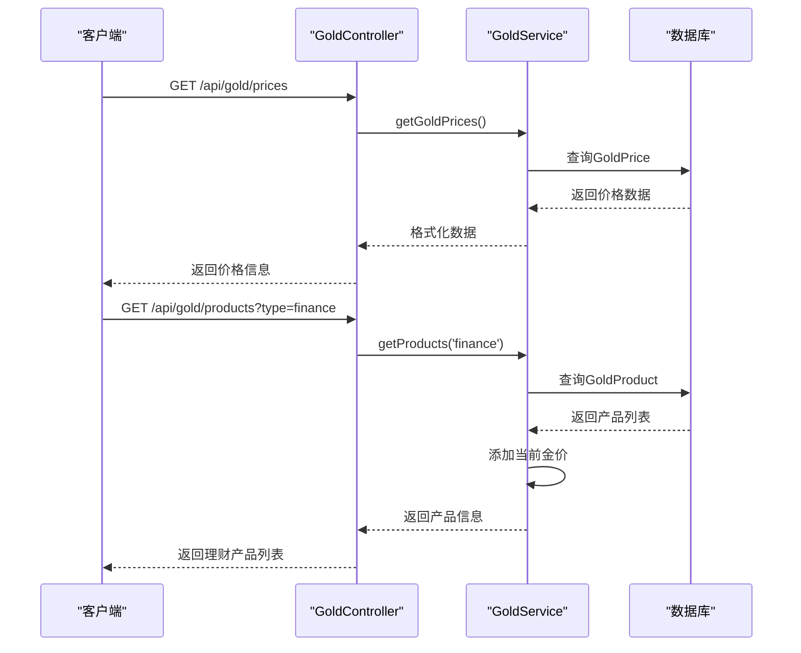
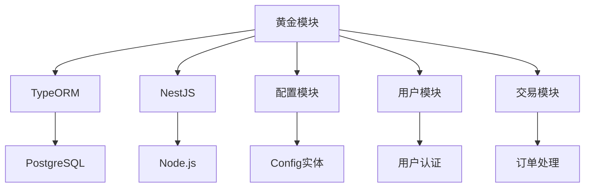

# 黄金产品模块

<cite>
**本文档引用文件**  
- [gold.service.ts](file://agx-backend/src/modules/gold/gold.service.ts)
- [gold.controller.ts](file://agx-backend/src/modules/gold/gold.controller.ts)
- [gold-price.entity.ts](file://agx-backend/src/entities/gold-price.entity.ts)
- [gold-product.entity.ts](file://agx-backend/src/entities/gold-product.entity.ts)
- [config.entity.ts](file://agx-backend/src/entities/config.entity.ts)
- [contract-order.entity.ts](file://agx-backend/src/entities/contract-order.entity.ts)
- [app.module.ts](file://agx-backend/src/app.module.ts)
</cite>

## 目录
1. [简介](#简介)
2. [项目结构](#项目结构)
3. [核心组件](#核心组件)
4. [架构概览](#架构概览)
5. [详细组件分析](#详细组件分析)
6. [依赖分析](#依赖分析)
7. [性能考虑](#性能考虑)
8. [故障排除指南](#故障排除指南)
9. [结论](#结论)

## 简介
黄金产品模块是AGX数字资产平台的核心金融功能模块，负责管理实物黄金与数字黄金产品的全生命周期。该模块提供黄金价格管理、产品配置、交易处理等核心业务逻辑，支持现货黄金、黄金秒合约、黄金理财和AGX首发四种黄金玩法。系统通过GoldService实现黄金定价策略、库存管理和交易结算流程，并通过GoldController对外提供标准化API接口。模块设计注重金融级数据一致性，采用高精度金额计算方案，确保金融交易的准确性和可靠性。

## 项目结构
黄金产品模块采用NestJS框架的模块化架构，遵循清晰的分层设计原则。模块包含控制器、服务、实体三个核心层次，通过TypeORM实现数据持久化。



**图表来源**  
- [gold.controller.ts](file://agx-backend/src/modules/gold/gold.controller.ts)
- [gold.service.ts](file://agx-backend/src/modules/gold/gold.service.ts)
- [gold-price.entity.ts](file://agx-backend/src/entities/gold-price.entity.ts)
- [gold-product.entity.ts](file://agx-backend/src/entities/gold-product.entity.ts)
- [config.entity.ts](file://agx-backend/src/entities/config.entity.ts)

**章节来源**
- [gold.controller.ts](file://agx-backend/src/modules/gold/gold.controller.ts)
- [gold.service.ts](file://agx-backend/src/modules/gold/gold.service.ts)

## 核心组件
黄金产品模块的核心组件包括GoldService、GoldController以及相关的实体类。GoldService负责处理所有业务逻辑，包括黄金价格获取、产品配置管理、交易处理等。GoldController提供RESTful API接口，作为外部系统与黄金业务逻辑的交互入口。实体类定义了黄金价格、黄金产品等核心数据结构，通过TypeORM与数据库进行映射。

**章节来源**
- [gold.service.ts](file://agx-backend/src/modules/gold/gold.service.ts)
- [gold.controller.ts](file://agx-backend/src/modules/gold/gold.controller.ts)
- [gold-price.entity.ts](file://agx-backend/src/entities/gold-price.entity.ts)
- [gold-product.entity.ts](file://agx-backend/src/entities/gold-product.entity.ts)

## 架构概览
黄金产品模块采用典型的三层架构设计，包括表现层、业务逻辑层和数据访问层。表现层由GoldController构成，负责接收HTTP请求并返回响应。业务逻辑层由GoldService实现，封装了黄金产品管理的核心业务规则。数据访问层通过TypeORM Repository实现，负责与数据库进行交互。



**图表来源**  
- [gold.controller.ts](file://agx-backend/src/modules/gold/gold.controller.ts)
- [gold.service.ts](file://agx-backend/src/modules/gold/gold.service.ts)
- [app.module.ts](file://agx-backend/src/app.module.ts)

## 详细组件分析

### GoldService分析
GoldService是黄金产品模块的核心业务逻辑处理器，负责管理黄金产品配置、价格更新和交易处理等关键功能。

#### 服务类图


**图表来源**  
- [gold.service.ts](file://agx-backend/src/modules/gold/gold.service.ts)
- [gold-price.entity.ts](file://agx-backend/src/entities/gold-price.entity.ts)
- [gold-product.entity.ts](file://agx-backend/src/entities/gold-product.entity.ts)
- [config.entity.ts](file://agx-backend/src/entities/config.entity.ts)

### GoldController分析
GoldController提供黄金产品模块的API接口，作为外部系统与业务逻辑的交互入口。

#### API调用序列图


**图表来源**  
- [gold.controller.ts](file://agx-backend/src/modules/gold/gold.controller.ts)
- [gold.service.ts](file://agx-backend/src/modules/gold/gold.service.ts)
- [gold-product.entity.ts](file://agx-backend/src/entities/gold-product.entity.ts)

### 黄金产品生命周期分析
黄金产品从创建到退市的完整生命周期管理流程。

```mermaid
flowchart TD
A[产品创建] --> B[配置产品参数]
B --> C[设置产品类型]
C --> D[现货黄金|秒合约|理财|AGX首发]
D --> E[设置价格和库存]
E --> F[产品上线]
F --> G{产品状态}
G --> |运行中| H[处理交易请求]
G --> |已结束| I[产品结算]
H --> J[更新库存和交易记录]
J --> K{产品到期?}
K --> |是| I
K --> |否| H
I --> L[生成结算报告]
L --> M[产品归档]
```

**图表来源**  
- [gold.service.ts](file://agx-backend/src/modules/gold/gold.service.ts)
- [gold-product.entity.ts](file://agx-backend/src/entities/gold-product.entity.ts)

**章节来源**
- [gold.service.ts](file://agx-backend/src/modules/gold/gold.service.ts)
- [gold-product.entity.ts](file://agx-backend/src/entities/gold-product.entity.ts)

## 依赖分析
黄金产品模块与其他系统模块存在明确的依赖关系，确保了系统的模块化和可维护性。



**图表来源**  
- [app.module.ts](file://agx-backend/src/app.module.ts)
- [gold.module.ts](file://agx-backend/src/modules/gold/gold.module.ts)

**章节来源**
- [app.module.ts](file://agx-backend/src/app.module.ts)
- [gold.module.ts](file://agx-backend/src/modules/gold/gold.module.ts)

## 性能考虑
黄金产品模块在设计时充分考虑了性能优化，特别是在高并发场景下的响应速度和数据一致性。

### 高精度金额计算最佳实践
在金融系统中，金额计算必须保证高精度，避免浮点数计算带来的精度损失。

1. **使用字符串存储金额**：所有金额字段均使用字符串类型存储，避免JavaScript浮点数精度问题。
2. **精确计算库**：在需要进行金额计算时，使用专门的高精度计算库。
3. **数据库精度设置**：数据库字段使用decimal类型，设置合适的precision和scale。

```typescript
// 示例：高精度金额计算
const amount1 = '100.01'; // 字符串表示金额
const amount2 = '200.02';
// 使用高精度计算库进行加法运算
const result = preciseAdd(amount1, amount2); // '300.03'
```

### 金融级数据一致性保障方案
为确保金融交易的数据一致性，系统采用以下措施：

1. **数据库事务**：关键操作使用数据库事务，确保原子性。
2. **乐观锁**：在更新库存等关键数据时使用乐观锁机制。
3. **幂等性设计**：API接口设计为幂等，防止重复提交造成数据异常。
4. **操作日志**：记录所有关键操作日志，便于审计和问题追踪。

**章节来源**
- [gold.service.ts](file://agx-backend/src/modules/gold/gold.service.ts)
- [contract-order.entity.ts](file://agx-backend/src/entities/contract-order.entity.ts)

## 故障排除指南
本节提供黄金产品模块常见问题的排查方法和解决方案。

### 常见问题及解决方案
1. **黄金价格未更新**
   - 检查数据源是否正常
   - 验证定时任务是否运行
   - 查看错误日志

2. **产品无法购买**
   - 检查产品状态是否为启用
   - 验证用户权限
   - 确认库存是否充足

3. **交易结算延迟**
   - 检查结算任务队列
   - 验证系统负载
   - 查看数据库性能

**章节来源**
- [gold.service.ts](file://agx-backend/src/modules/gold/gold.service.ts)
- [gold.controller.ts](file://agx-backend/src/modules/gold/gold.controller.ts)

## 结论
黄金产品模块通过清晰的架构设计和严谨的业务逻辑实现，为平台提供了稳定可靠的黄金产品管理功能。模块支持多种黄金玩法，包括现货交易、秒合约、理财和AGX首发，满足不同用户的需求。系统采用高精度金额计算和金融级数据一致性保障方案，确保了金融交易的安全性和准确性。通过合理的API设计和模块化架构，系统具有良好的可扩展性和可维护性，为未来的功能扩展奠定了坚实基础。