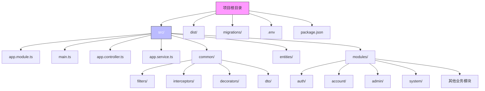
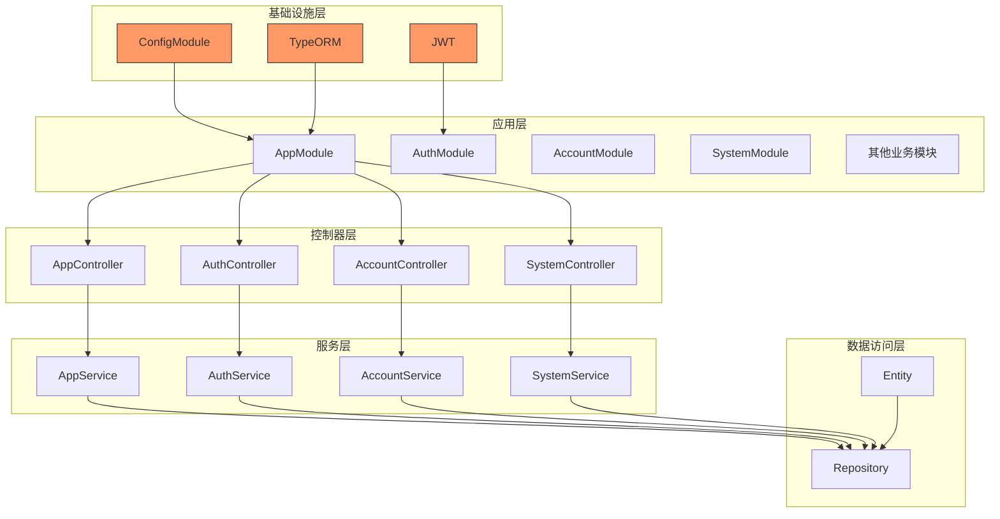
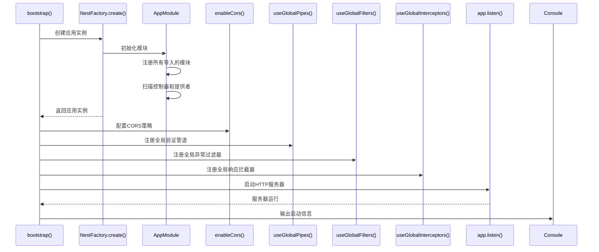
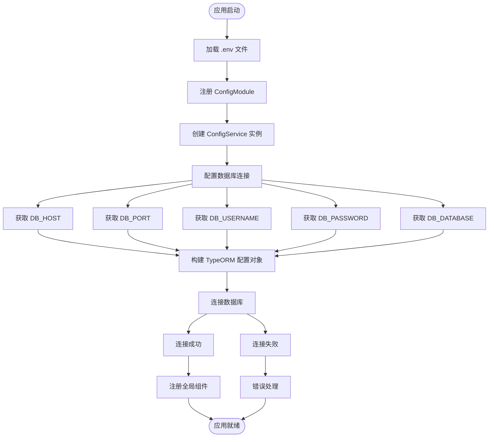
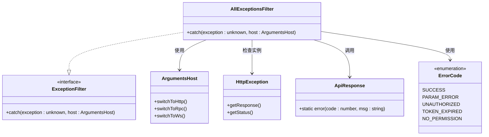
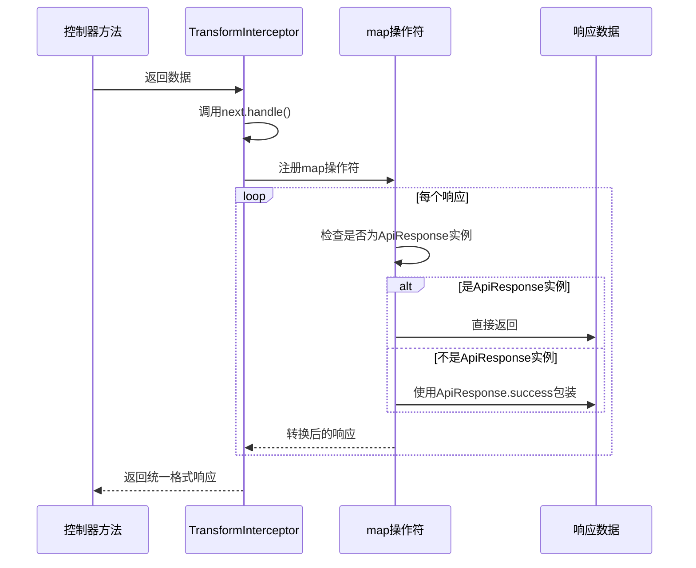

# 应用生命周期与配置

<cite>
**本文档引用的文件**
- [main.ts](file://agx-backend/src/main.ts)
- [app.module.ts](file://agx-backend/src/app.module.ts)
- [app.controller.ts](file://agx-backend/src/app.controller.ts)
- [.env](file://agx-backend/.env)
- [common/filters/all-exceptions.filter.ts](file://agx-backend/src/common/filters/all-exceptions.filter.ts)
- [common/interceptors/transform.interceptor.ts](file://agx-backend/src/common/interceptors/transform.interceptor.ts)
- [common/dto/api-response.dto.ts](file://agx-backend/src/common/dto/api-response.dto.ts)
- [entities/index.ts](file://agx-backend/src/entities/index.ts)
- [modules/system/system.module.ts](file://agx-backend/src/modules/system/system.module.ts)
</cite>

## 目录
1. [简介](#简介)
2. [项目结构](#项目结构)
3. [核心组件](#核心组件)
4. [架构概述](#架构概述)
5. [详细组件分析](#详细组件分析)
6. [依赖分析](#依赖分析)
7. [性能考虑](#性能考虑)
8. [故障排除指南](#故障排除指南)
9. [结论](#结论)

## 简介
本文档详细解析基于NestJS框架的AGX后端应用的生命周期与配置机制。重点分析应用启动流程、环境配置管理、全局中间件注册以及模块化架构设计。文档涵盖从main.ts入口文件到各核心模块的完整执行路径，为开发者提供从初学者到高级开发者的完整指导，包括开发/生产环境切换、性能监控和健康检查等关键功能的实现方式。

## 项目结构
AGX后端项目采用标准的NestJS项目结构，遵循模块化设计原则。项目根目录包含配置文件、源代码目录和构建输出目录。源代码位于`src/`目录下，采用功能模块划分的方式组织代码，包括app模块、业务模块和通用功能模块。项目通过TypeORM实现数据库访问，使用NestJS ConfigModule管理环境配置，通过JWT实现身份验证。



**图示来源**
- [main.ts](file://agx-backend/src/main.ts#L1-L39)
- [app.module.ts](file://agx-backend/src/app.module.ts#L1-L130)

**本节来源**
- [main.ts](file://agx-backend/src/main.ts#L1-L39)
- [app.module.ts](file://agx-backend/src/app.module.ts#L1-L130)

## 核心组件
AGX后端应用的核心组件包括应用入口、主模块、全局异常处理、响应拦截器和数据库配置。这些组件共同构成了应用的基础架构，确保了系统的稳定性、安全性和可维护性。应用通过NestFactory.create方法创建应用实例，注册全局中间件，并通过ConfigModule加载环境变量，实现灵活的配置管理。

**本节来源**
- [main.ts](file://agx-backend/src/main.ts#L1-L39)
- [app.module.ts](file://agx-backend/src/app.module.ts#L1-L130)
- [common/filters/all-exceptions.filter.ts](file://agx-backend/src/common/filters/all-exceptions.filter.ts#L1-L46)

## 架构概述
AGX后端应用采用分层架构设计，包括控制器层、服务层、数据访问层和基础设施层。应用启动时，NestJS框架负责模块的初始化、依赖注入和控制器路由的注册。全局异常过滤器、拦截器和管道在应用级别注册，确保所有请求都经过统一的处理流程。数据库连接通过TypeORM的forRootAsync方法异步配置，利用ConfigService动态读取环境变量。



**图示来源**
- [app.module.ts](file://agx-backend/src/app.module.ts#L1-L130)
- [modules/system/system.module.ts](file://agx-backend/src/modules/system/system.module.ts#L1-L14)

## 详细组件分析

### 应用启动流程分析
AGX后端应用的启动流程从main.ts文件的bootstrap函数开始。该函数使用NestFactory.create方法创建AppModule的应用实例，然后配置CORS、全局管道、过滤器和拦截器，最后监听指定端口。整个启动过程是异步的，确保所有异步操作完成后再启动服务器。



**图示来源**
- [main.ts](file://agx-backend/src/main.ts#L6-L38)

**本节来源**
- [main.ts](file://agx-backend/src/main.ts#L1-L39)

### 配置管理分析
AGX后端应用使用NestJS的ConfigModule来管理环境配置。ConfigModule在AppModule中全局注册，通过.env文件加载环境变量。数据库连接配置使用forRootAsync方法，允许在应用启动时动态读取环境变量，实现不同环境下的灵活配置。JWT配置也在AuthModule中通过ConfigService异步获取。



**图示来源**
- [app.module.ts](file://agx-backend/src/app.module.ts#L72-L110)
- [.env](file://agx-backend/.env#L1-L14)

**本节来源**
- [app.module.ts](file://agx-backend/src/app.module.ts#L1-L130)
- [.env](file://agx-backend/.env#L1-L14)

### 全局异常处理分析
AGX后端应用实现了统一的全局异常处理机制。AllExceptionsFilter类捕获所有未处理的异常，将其转换为标准化的响应格式。该过滤器能够区分HTTP异常和其他错误，提取错误码和消息，并通过ApiResponse.error方法返回统一格式的错误响应。异常信息会被记录到控制台，便于调试和监控。



**图示来源**
- [common/filters/all-exceptions.filter.ts](file://agx-backend/src/common/filters/all-exceptions.filter.ts#L1-L46)
- [common/dto/api-response.dto.ts](file://agx-backend/src/common/dto/api-response.dto.ts#L1-L68)

**本节来源**
- [common/filters/all-exceptions.filter.ts](file://agx-backend/src/common/filters/all-exceptions.filter.ts#L1-L46)
- [common/dto/api-response.dto.ts](file://agx-backend/src/common/dto/api-response.dto.ts#L1-L68)

### 响应拦截器分析
AGX后端应用使用TransformInterceptor实现统一的响应格式化。该拦截器在所有控制器方法执行后被调用，将返回数据包装成标准化的ApiResponse格式。如果响应已经是ApiResponse实例，则直接返回；否则使用ApiResponse.success方法包装数据。这确保了所有API端点返回一致的响应结构，便于前端处理。



**图示来源**
- [common/interceptors/transform.interceptor.ts](file://agx-backend/src/common/interceptors/transform.interceptor.ts#L1-L26)
- [common/dto/api-response.dto.ts](file://agx-backend/src/common/dto/api-response.dto.ts#L1-L68)

**本节来源**
- [common/interceptors/transform.interceptor.ts](file://agx-backend/src/common/interceptors/transform.interceptor.ts#L1-L26)
- [common/dto/api-response.dto.ts](file://agx-backend/src/common/dto/api-response.dto.ts#L1-L68)

## 依赖分析
AGX后端应用的依赖关系清晰，采用模块化设计降低了组件间的耦合度。AppModule作为根模块导入所有业务模块和基础设施模块，形成依赖注入容器的根节点。ConfigModule被标记为全局模块，使其提供的ConfigService可以在任何模块中注入使用。TypeORM模块通过forRootAsync方法异步配置，依赖于ConfigModule提供的配置服务。

```mermaid
graph LR
A[AppModule] --> B[ConfigModule]
A --> C[TypeOrmModule]
A --> D[AuthModule]
A --> E[AccountModule]
A --> F[AdminModule]
A --> G[SystemModule]
A --> H[其他业务模块]
B --> I[ConfigService]
C --> J[数据库连接]
D --> K[JWT模块]
D --> L[Passport模块]
D --> I
E --> I
F --> I
G --> I
H --> I
I -.-> D : 注入
I -.-> E : 注入
I -.-> F : 注入
I -.-> G : 注入
I -.-> H : 注入
style A fill:#f96,stroke:#333,color:#fff
style B fill:#69f,stroke:#333
style C fill:#69f,stroke:#333
style D fill:#69f,stroke:#333
style E fill:#69f,stroke:#333
style F fill:#69f,stroke:#333
style G fill:#69f,stroke:#333
style H fill:#69f,stroke:#333
```

**图示来源**
- [app.module.ts](file://agx-backend/src/app.module.ts#L69-L129)
- [modules/auth/auth.module.ts](file://agx-backend/src/modules/auth/auth.module.ts#L1-L25)

**本节来源**
- [app.module.ts](file://agx-backend/src/app.module.ts#L1-L130)
- [modules/auth/auth.module.ts](file://agx-backend/src/modules/auth/auth.module.ts#L1-L25)

## 性能考虑
AGX后端应用在性能方面进行了多项优化。数据库配置中，synchronize选项设置为false，避免生产环境下的自动模式同步，提高性能和安全性。日志记录根据NODE_ENV环境变量动态开启或关闭，在生产环境中减少不必要的日志输出。应用使用异步方法进行数据库连接配置，确保启动过程的灵活性和可靠性。全局拦截器和过滤器采用轻量级实现，最小化对请求处理性能的影响。

## 故障排除指南
当AGX后端应用出现问题时，可以按照以下步骤进行排查：

1. **检查环境变量**：确保.env文件中的配置正确，特别是数据库连接信息和JWT密钥。
2. **查看启动日志**：应用启动时会输出服务器运行信息，检查是否有错误或警告。
3. **验证数据库连接**：确认数据库服务正在运行，且网络连接正常。
4. **检查端口占用**：确保应用监听的端口没有被其他进程占用。
5. **审查异常日志**：全局异常过滤器会记录未处理的异常，查看控制台输出以获取详细错误信息。

**本节来源**
- [main.ts](file://agx-backend/src/main.ts#L36-L37)
- [common/filters/all-exceptions.filter.ts](file://agx-backend/src/common/filters/all-exceptions.filter.ts#L40-L41)
- [.env](file://agx-backend/.env#L1-L14)

## 结论
AGX后端应用通过NestJS框架实现了清晰的生命周期管理和灵活的配置机制。应用启动流程规范，从模块初始化到服务启动都有明确的执行顺序。配置管理采用环境变量驱动的方式，支持开发、测试和生产环境的无缝切换。全局异常处理、响应拦截器和验证管道确保了API的一致性和健壮性。模块化设计提高了代码的可维护性和可扩展性，为系统的长期发展奠定了良好基础。