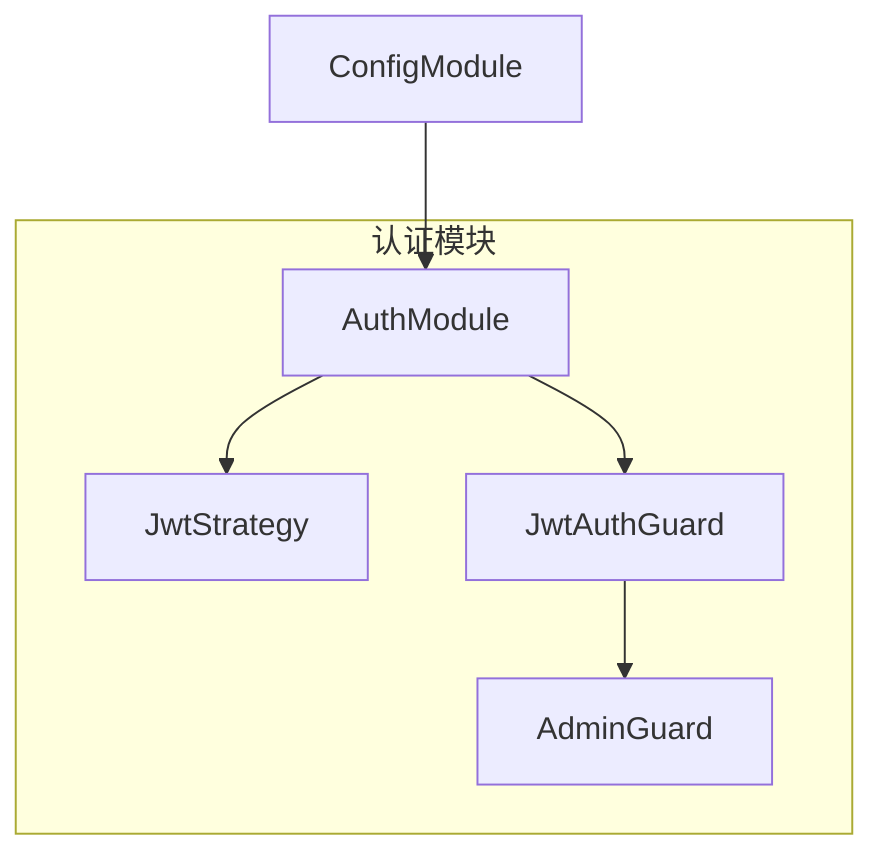
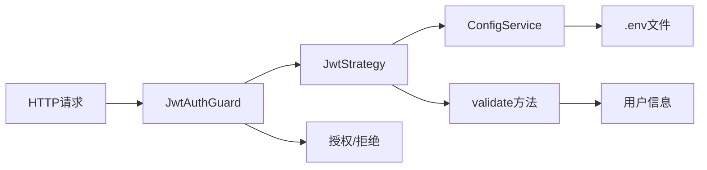
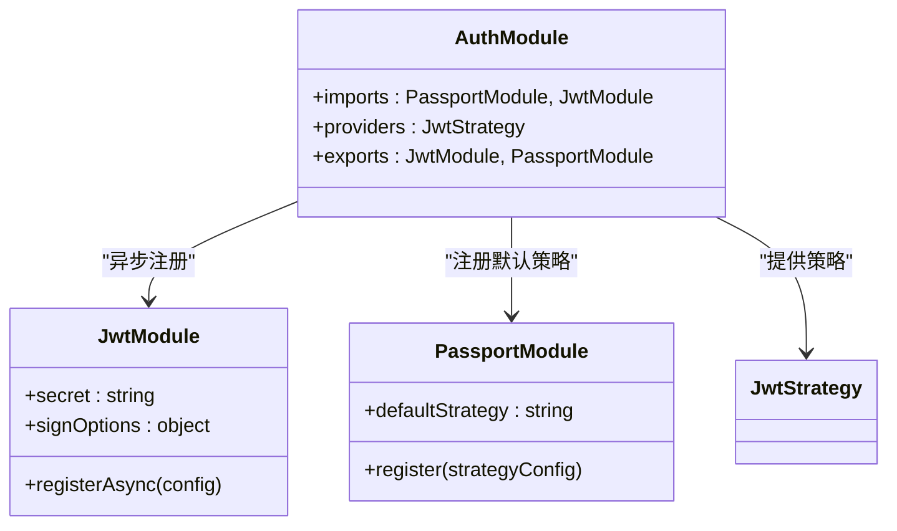
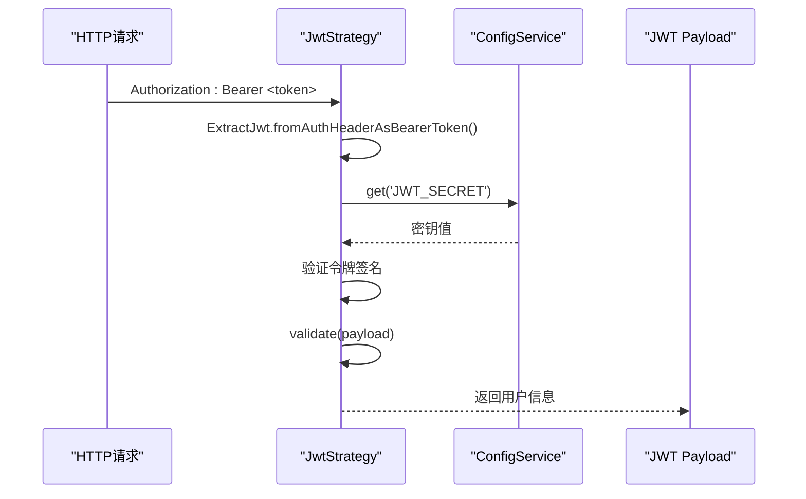
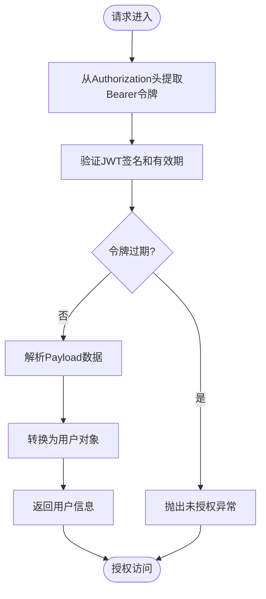
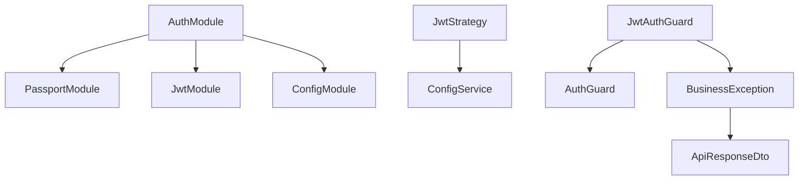

# JWT身份验证实现

<cite>
**本文档引用文件**  
- [auth.module.ts](file://agx-backend/src/modules/auth/auth.module.ts)
- [jwt.strategy.ts](file://agx-backend/src/modules/auth/jwt.strategy.ts)
- [jwt-auth.guard.ts](file://agx-backend/src/modules/auth/jwt-auth.guard.ts)
- [app.module.ts](file://agx-backend/src/app.module.ts)
- [.env](file://agx-backend/.env)
- [business.exception.ts](file://agx-backend/src/common/filters/business.exception.ts)
</cite>

## 目录
1. [简介](#简介)
2. [项目结构](#项目结构)
3. [核心组件](#核心组件)
4. [架构概述](#架构概述)
5. [详细组件分析](#详细组件分析)
6. [依赖分析](#依赖分析)
7. [性能考虑](#性能考虑)
8. [故障排除指南](#故障排除指南)
9. [结论](#结论)

## 简介
本文档详细说明了基于NestJS的JWT身份验证实现，重点分析`AuthModule`和`JwtStrategy`之间的协同工作机制。文档涵盖模块配置、策略实现、令牌解析、异常处理等关键环节，并为初学者和高级开发者提供相应的指导。

## 项目结构
JWT身份验证相关代码位于`agx-backend/src/modules/auth/`目录下，主要包含认证模块、JWT策略和守卫组件。该模块通过NestJS的依赖注入系统与配置模块集成，实现灵活的安全控制。



**图表来源**
- [auth.module.ts](file://agx-backend/src/modules/auth/auth.module.ts#L1-L24)
- [jwt.strategy.ts](file://agx-backend/src/modules/auth/jwt.strategy.ts#L1-L31)
- [jwt-auth.guard.ts](file://agx-backend/src/modules/auth/jwt-auth.guard.ts#L1-L37)

**章节来源**
- [auth.module.ts](file://agx-backend/src/modules/auth/auth.module.ts#L1-L24)
- [app.module.ts](file://agx-backend/src/app.module.ts#L8-L9)

## 核心组件
本系统的核心身份验证组件包括`AuthModule`、`JwtStrategy`和`JwtAuthGuard`。这些组件协同工作，实现了基于JWT的无状态认证机制，通过Passport框架集成到NestJS应用中。

**章节来源**
- [auth.module.ts](file://agx-backend/src/modules/auth/auth.module.ts#L1-L24)
- [jwt.strategy.ts](file://agx-backend/src/modules/auth/jwt.strategy.ts#L1-L31)

## 架构概述
系统采用分层安全架构，`AuthModule`负责配置JWT模块和注册策略，`JwtStrategy`处理令牌验证逻辑，`JwtAuthGuard`作为守卫控制路由访问。整个流程依赖于`ConfigService`注入环境配置。



**图表来源**
- [auth.module.ts](file://agx-backend/src/modules/auth/auth.module.ts#L7-L24)
- [jwt.strategy.ts](file://agx-backend/src/modules/auth/jwt.strategy.ts#L13-L31)
- [jwt-auth.guard.ts](file://agx-backend/src/modules/auth/jwt-auth.guard.ts#L6-L17)

## 详细组件分析

### AuthModule分析
`AuthModule`是JWT认证的配置中心，通过`PassportModule`和`JwtModule`的异步注册实现灵活配置。模块从配置服务中获取JWT密钥和过期时间，确保敏感信息不硬编码。



**图表来源**
- [auth.module.ts](file://agx-backend/src/modules/auth/auth.module.ts#L7-L24)
- [jwt.strategy.ts](file://agx-backend/src/modules/auth/jwt.strategy.ts#L13-L14)

**章节来源**
- [auth.module.ts](file://agx-backend/src/modules/auth/auth.module.ts#L1-L24)

### JwtStrategy分析
`JwtStrategy`是JWT验证的核心实现，负责从请求头提取Bearer令牌，使用配置的密钥进行解码验证，并通过`validate`方法解析用户信息。



**图表来源**
- [jwt.strategy.ts](file://agx-backend/src/modules/auth/jwt.strategy.ts#L17-L20)
- [auth.module.ts](file://agx-backend/src/modules/auth/auth.module.ts#L13-L14)

**章节来源**
- [jwt.strategy.ts](file://agx-backend/src/modules/auth/jwt.strategy.ts#L1-L31)

### 认证流程分析
完整的JWT认证流程包括令牌提取、验证、用户信息解析和访问控制决策。



**图表来源**
- [jwt.strategy.ts](file://agx-backend/src/modules/auth/jwt.strategy.ts#L17-L31)
- [jwt-auth.guard.ts](file://agx-backend/src/modules/auth/jwt-auth.guard.ts#L11-L16)

## 依赖分析
JWT认证模块依赖于多个核心服务和配置，形成清晰的依赖链。



**图表来源**
- [auth.module.ts](file://agx-backend/src/modules/auth/auth.module.ts#L4-L5)
- [jwt.strategy.ts](file://agx-backend/src/modules/auth/jwt.strategy.ts#L4)
- [jwt-auth.guard.ts](file://agx-backend/src/modules/auth/jwt-auth.guard.ts#L3)
- [business.exception.ts](file://agx-backend/src/common/filters/business.exception.ts#L2)

**章节来源**
- [auth.module.ts](file://agx-backend/src/modules/auth/auth.module.ts#L1-L24)
- [app.module.ts](file://agx-backend/src/app.module.ts#L72-L75)
- [.env](file://agx-backend/.env#L11-L13)

## 性能考虑
JWT认证机制具有良好的性能特性，因为验证过程是无状态的，不需要查询数据库。密钥通过`ConfigService`缓存，避免重复读取环境变量。异步模块注册确保配置在应用启动时完成加载。

## 故障排除指南
当JWT认证出现问题时，应检查以下常见情况：

**章节来源**
- [jwt-auth.guard.ts](file://agx-backend/src/modules/auth/jwt-auth.guard.ts#L11-L16)
- [business.exception.ts](file://agx-backend/src/common/filters/business.exception.ts#L24-L26)

### 令牌无效或过期
当令牌无效或过期时，系统会抛出`BusinessException.unauthorized()`异常。检查：
- 令牌是否包含在`Authorization`头中，格式为`Bearer <token>`
- 令牌是否已过期（默认7天）
- JWT密钥是否匹配（`.env`文件中的`JWT_SECRET`）

### 配置问题
确保`.env`文件包含正确的JWT配置：
```env
JWT_SECRET=agx-jwt-secret-2025
JWT_EXPIRES_IN=7d
```

### 管理员权限问题
`AdminGuard`会额外检查用户类型，只有`type: 'admin'`的用户才能通过验证。普通用户访问管理员接口会收到"需要管理员权限"的错误提示。

## 结论
本文档详细解析了JWT身份验证的实现机制，展示了`AuthModule`和`JwtStrategy`如何协同工作。系统通过环境变量配置密钥和过期时间，实现了安全灵活的认证方案。异常处理机制确保了清晰的错误反馈，为开发和运维提供了便利。