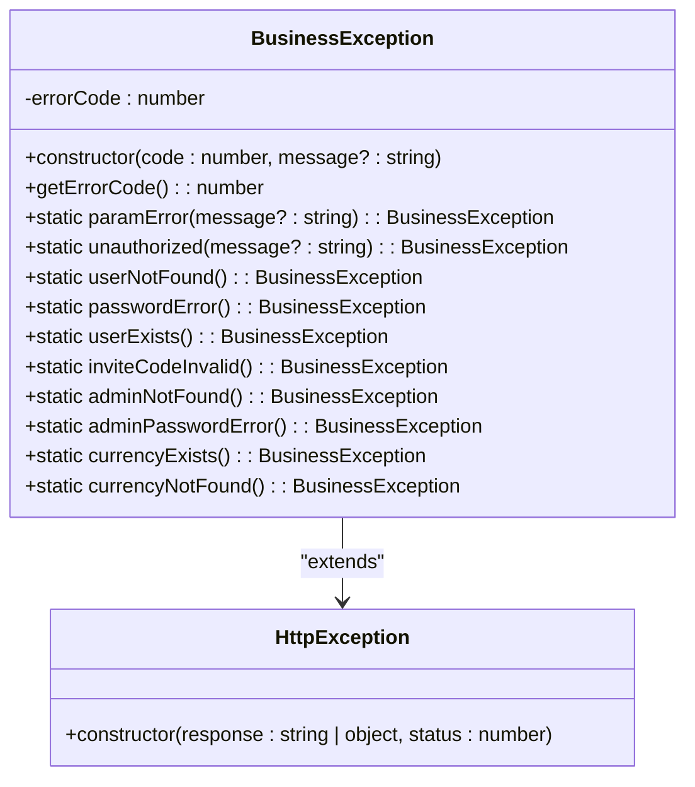
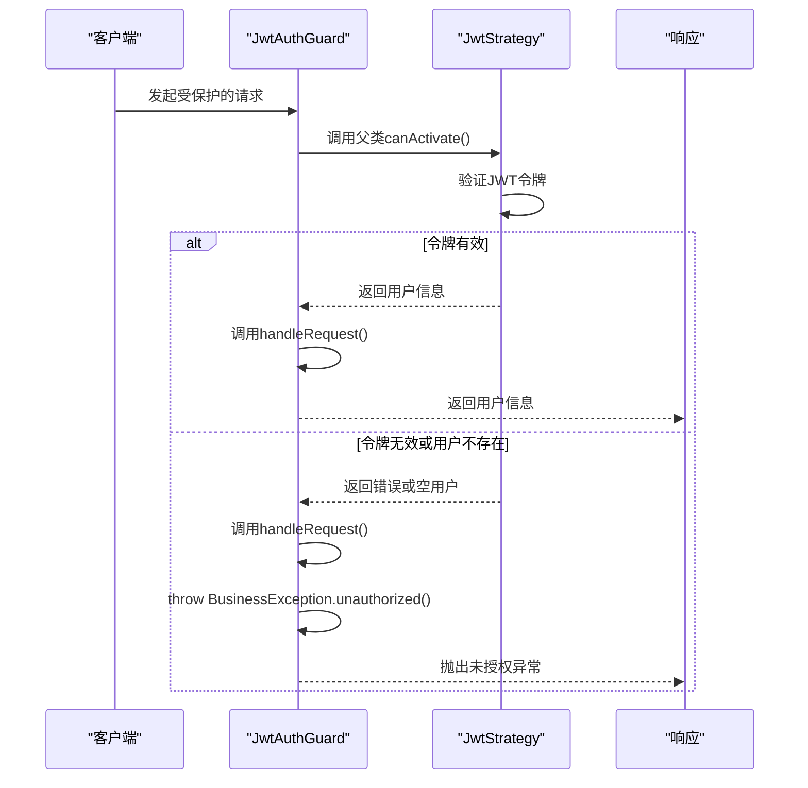
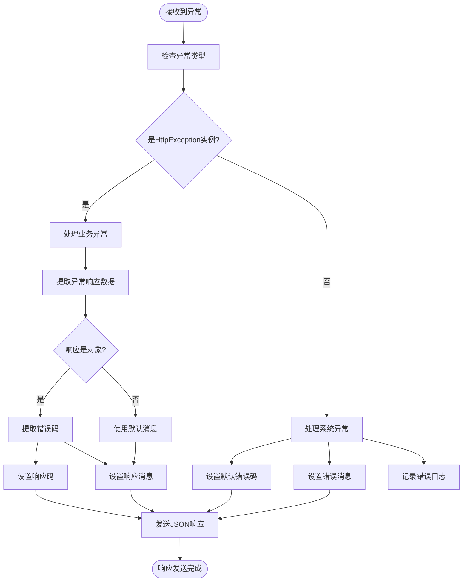
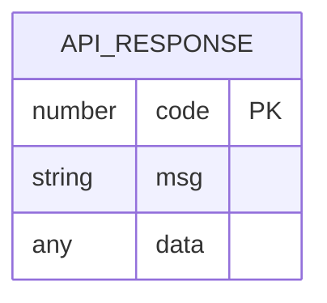

# 全局异常处理

<cite>
**本文档引用的文件**   
- [business.exception.ts](file://agx-backend/src/common/filters/business.exception.ts)
- [all-exceptions.filter.ts](file://agx-backend/src/common/filters/all-exceptions.filter.ts)
- [jwt-auth.guard.ts](file://agx-backend/src/modules/auth/jwt-auth.guard.ts)
- [api-response.dto.ts](file://agx-backend/src/common/dto/api-response.dto.ts)
- [jwt.strategy.ts](file://agx-backend/src/modules/auth/jwt.strategy.ts)
- [auth.module.ts](file://agx-backend/src/modules/auth/auth.module.ts)
</cite>

## 目录
1. [简介](#简介)
2. [BusinessException设计模式](#businessexception设计模式)
3. [认证流程中的异常处理](#认证流程中的异常处理)
4. [全局异常过滤器](#全局异常过滤器)
5. [自定义业务异常扩展](#自定义业务异常扩展)
6. [错误响应格式](#错误响应格式)
7. [最佳实践](#最佳实践)

## 简介
本文档详细描述了系统中全局异常处理机制的设计与实现，重点关注`BusinessException`在认证流程中的应用。系统采用统一的异常处理策略，确保所有API接口返回标准化的错误响应格式。通过`BusinessException`类和`AllExceptionsFilter`异常过滤器的配合，实现了业务异常的统一捕获和响应处理。

**Section sources**
- [business.exception.ts](file://agx-backend/src/common/filters/business.exception.ts)
- [all-exceptions.filter.ts](file://agx-backend/src/common/filters/all-exceptions.filter.ts)

## BusinessException设计模式

`BusinessException`是系统中业务异常的核心实现，继承自NestJS的`HttpException`，采用静态工厂方法模式提供预定义的异常类型。

### 类结构与继承关系


**Diagram sources**
- [business.exception.ts](file://agx-backend/src/common/filters/business.exception.ts)

### 静态工厂方法
`BusinessException`提供了多个静态工厂方法来创建预定义的业务异常：

- `BusinessException.paramError()`: 参数错误异常
- `BusinessException.unauthorized()`: 未授权异常
- `BusinessException.userNotFound()`: 用户不存在异常
- `BusinessException.passwordError()`: 密码错误异常
- `BusinessException.userExists()`: 用户已存在异常
- `BusinessException.inviteCodeInvalid()`: 邀请码无效异常
- `BusinessException.adminNotFound()`: 管理员不存在异常
- `BusinessException.adminPasswordError()`: 管理员密码错误异常
- `BusinessException.currencyExists()`: 币种已存在异常
- `BusinessException.currencyNotFound()`: 币种不存在异常

这些静态方法通过`ErrorCode`枚举获取对应的错误码，并结合`ErrorMessage`映射获取默认的错误消息。

**Section sources**
- [business.exception.ts](file://agx-backend/src/common/filters/business.exception.ts)
- [api-response.dto.ts](file://agx-backend/src/common/dto/api-response.dto.ts)

## 认证流程中的异常处理

在认证流程中，`jwt-auth.guard.ts`通过`throw BusinessException.unauthorized()`统一处理认证失败场景。

### JWT认证守卫实现


**Diagram sources**
- [jwt-auth.guard.ts](file://agx-backend/src/modules/auth/jwt-auth.guard.ts)
- [jwt.strategy.ts](file://agx-backend/src/modules/auth/jwt.strategy.ts)

### 认证失败处理流程
当JWT令牌验证失败时，`JwtAuthGuard`的`handleRequest`方法会捕获错误并抛出`BusinessException.unauthorized()`：

```typescript
handleRequest(err: any, user: any) {
  if (err || !user) {
    throw BusinessException.unauthorized();
  }
  return user;
}
```

对于管理员专用的`AdminGuard`，还会额外检查用户类型：

```typescript
handleRequest(err: any, user: any) {
  if (err || !user) {
    throw BusinessException.unauthorized();
  }
  if (user.type !== 'admin') {
    throw BusinessException.unauthorized('需要管理员权限');
  }
  return user;
}
```

这种设计确保了所有认证失败场景都通过统一的异常机制处理，返回标准化的错误响应。

**Section sources**
- [jwt-auth.guard.ts](file://agx-backend/src/modules/auth/jwt-auth.guard.ts)

## 全局异常过滤器

`AllExceptionsFilter`是系统的全局异常过滤器，负责捕获所有异常并转换为HTTP响应。

### 异常过滤器工作流程


**Diagram sources**
- [all-exceptions.filter.ts](file://agx-backend/src/common/filters/all-exceptions.filter.ts)

### 过滤器实现细节
`AllExceptionsFilter`的实现确保了所有异常都被正确处理：

1. 对于`HttpException`实例，提取其响应数据中的`code`和`msg`字段
2. 对于普通`Error`实例，使用错误消息并记录到日志
3. 所有业务错误都返回HTTP状态码200，确保API响应格式统一
4. 使用`ApiResponse.error()`方法生成标准化的错误响应

```typescript
@Catch()
export class AllExceptionsFilter implements ExceptionFilter {
  catch(exception: unknown, host: ArgumentsHost) {
    const ctx = host.switchToHttp();
    const response = ctx.getResponse<Response>();

    let code = ErrorCode.PARAM_ERROR;
    let msg = '服务器内部错误';
    let httpStatus = HttpStatus.OK;

    if (exception instanceof HttpException) {
      const exceptionResponse = exception.getResponse();
      httpStatus = HttpStatus.OK; // 业务错误也返回 200

      if (typeof exceptionResponse === 'object' && exceptionResponse !== null) {
        const resp = exceptionResponse as Record<string, unknown>;
        if (typeof resp['code'] === 'number') {
          code = resp['code'];
          msg = (resp['msg'] as string) || msg;
        } else if (typeof resp['message'] === 'string') {
          msg = resp['message'];
        } else if (Array.isArray(resp['message'])) {
          msg = resp['message'].join(', ');
        }
      } else if (typeof exceptionResponse === 'string') {
        msg = exceptionResponse;
      }
    } else if (exception instanceof Error) {
      msg = exception.message;
      console.error('Unhandled exception:', exception);
    }

    response.status(httpStatus).json(ApiResponse.error(code, msg));
  }
}
```

**Section sources**
- [all-exceptions.filter.ts](file://agx-backend/src/common/filters/all-exceptions.filter.ts)

## 自定义业务异常扩展

开发者可以轻松扩展`BusinessException`以支持新的认证场景。

### 添加新的异常类型
要添加新的业务异常类型，需要在`business.exception.ts`中添加相应的静态方法：

```typescript
static tokenRefreshFailed(message?: string): BusinessException {
  return new BusinessException(ErrorCode.TOKEN_REFRESH_FAILED, message);
}

static mfaRequired(message?: string): BusinessException {
  return new BusinessException(ErrorCode.MFA_REQUIRED, message);
}

static tokenExpired(message?: string): BusinessException {
  return new BusinessException(ErrorCode.TOKEN_EXPIRED, message);
}
```

### 定义新的错误码
在`api-response.dto.ts`中定义相应的错误码和消息：

```typescript
export enum ErrorCode {
  // ... existing codes
  TOKEN_REFRESH_FAILED = 1005,
  MFA_REQUIRED = 1006,
  TOKEN_EXPIRED = 1003,
}

export const ErrorMessage: Record<number, string> = {
  // ... existing messages
  [ErrorCode.TOKEN_REFRESH_FAILED]: '令牌刷新失败',
  [ErrorCode.MFA_REQUIRED]: '需要多因素认证',
  [ErrorCode.TOKEN_EXPIRED]: 'Token 过期',
};
```

### 在认证服务中使用
在认证服务中，可以根据具体场景抛出相应的异常：

```typescript
async refreshToken(refreshToken: string): Promise<string> {
  try {
    const payload = this.jwtService.verify(refreshToken);
    return this.generateAccessToken(payload);
  } catch (error) {
    throw BusinessException.tokenRefreshFailed();
  }
}

async loginWithMfa(credentials: LoginDto): Promise<User> {
  const user = await this.validateUser(credentials);
  if (user.mfaEnabled) {
    throw BusinessException.mfaRequired('需要多因素认证');
  }
  return user;
}
```

由于这些自定义异常都继承自`BusinessException`，它们会被`AllExceptionsFilter`自动捕获并转换为标准化的错误响应。

**Section sources**
- [business.exception.ts](file://agx-backend/src/common/filters/business.exception.ts)
- [api-response.dto.ts](file://agx-backend/src/common/dto/api-response.dto.ts)

## 错误响应格式

系统采用统一的API响应格式，确保前后端交互的一致性。

### 响应数据模型


**Diagram sources**
- [api-response.dto.ts](file://agx-backend/src/common/dto/api-response.dto.ts)

### 标准化响应结构
所有API响应都遵循以下格式：

```json
{
  "code": 1002,
  "msg": "未登录",
  "data": null
}
```

其中：
- `code`: 错误码，对应`ErrorCode`枚举中的值
- `msg`: 错误消息，对应`ErrorMessage`映射中的值
- `data`: 数据，业务异常时为`null`

### 常见认证相关错误码
| 错误码 | 枚举值 | 错误消息 | 说明 |
|-------|--------|---------|------|
| 1002 | UNAUTHORIZED | 未登录 | 认证失败，令牌无效或缺失 |
| 1003 | TOKEN_EXPIRED | Token 过期 | JWT令牌已过期 |
| 1004 | NO_PERMISSION | 无权限 | 用户权限不足 |
| 1005 | TOKEN_REFRESH_FAILED | 令牌刷新失败 | 刷新令牌操作失败 |
| 1006 | MFA_REQUIRED | 需要多因素认证 | 需要额外的认证步骤 |

**Section sources**
- [api-response.dto.ts](file://agx-backend/src/common/dto/api-response.dto.ts)

## 最佳实践

### 异常处理原则
1. **统一异常处理**: 所有业务异常都应通过`BusinessException`抛出
2. **明确错误码**: 为每种业务场景定义清晰的错误码
3. **用户友好消息**: 错误消息应简洁明了，便于前端展示
4. **日志记录**: 系统异常应记录详细日志，便于排查问题

### 认证异常处理建议
1. **认证失败**: 使用`BusinessException.unauthorized()`处理所有认证失败场景
2. **权限不足**: 使用`BusinessException.unauthorized('需要管理员权限')`处理权限不足情况
3. **令牌过期**: 使用`BusinessException.unauthorized('Token 过期')`处理过期令牌
4. **多因素认证**: 扩展`BusinessException`支持`mfaRequired`等新场景

### 扩展性考虑
1. **模块化设计**: 将异常定义按功能模块组织
2. **国际化支持**: 考虑错误消息的多语言支持
3. **监控集成**: 将异常信息与监控系统集成
4. **文档同步**: 更新异常类型时同步更新API文档

通过遵循这些最佳实践，可以确保系统的异常处理机制既健壮又易于维护。

**Section sources**
- [business.exception.ts](file://agx-backend/src/common/filters/business.exception.ts)
- [all-exceptions.filter.ts](file://agx-backend/src/common/filters/all-exceptions.filter.ts)