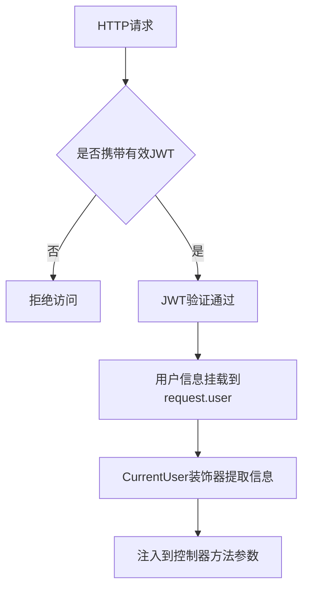

# 用户信息提取

<cite>
**本文档引用的文件**  
- [current-user.decorator.ts](file://agx-backend/src/common/decorators/current-user.decorator.ts)
- [account.controller.ts](file://agx-backend/src/modules/account/account.controller.ts)
- [contract.controller.ts](file://agx-backend/src/modules/contract/contract.controller.ts)
- [pool.controller.ts](file://agx-backend/src/modules/pool/pool.controller.ts)
- [jwt.strategy.ts](file://agx-backend/src/modules/auth/jwt.strategy.ts)
- [jwt-auth.guard.ts](file://agx-backend/src/modules/auth/jwt-auth.guard.ts)
</cite>

## 目录
1. [简介](#简介)
2. [CurrentUser装饰器设计原理](#currentuser装饰器设计原理)
3. [核心实现机制](#核心实现机制)
4. [使用方式与场景](#使用方式与场景)
5. [实际应用示例](#实际应用示例)
6. [自定义参数装饰器开发指南](#自定义参数装饰器开发指南)
7. [最佳实践与注意事项](#最佳实践与注意事项)
8. [总结](#总结)

## 简介
`CurrentUser` 是一个基于 NestJS 框架的自定义参数装饰器，用于在控制器方法中便捷地提取当前登录用户的信息。该装饰器通过 `createParamDecorator` 工厂函数创建，能够从执行上下文（ExecutionContext）中获取 HTTP 请求对象，并从中提取经过 JWT 验证后挂载在 `request.user` 上的用户数据。

此装饰器支持可选参数 `data`，允许开发者直接访问用户对象的特定属性（如 `CurrentUser('id')`），极大简化了用户信息获取流程，在用户个人中心、权限校验、资产操作等场景中广泛应用。

**本文档来源**
- [current-user.decorator.ts](file://agx-backend/src/common/decorators/current-user.decorator.ts)
- [jwt.strategy.ts](file://agx-backend/src/modules/auth/jwt.strategy.ts)

## CurrentUser装饰器设计原理
`CurrentUser` 装饰器的设计基于 NestJS 的依赖注入和元数据系统，利用 `createParamDecorator` 创建可复用的参数级装饰器。其核心目标是将认证后的用户信息从请求上下文中安全、高效地注入到控制器方法的参数中。

该装饰器位于 `agx-backend/src/common/decorators/current-user.decorator.ts` 文件中，通过模块导出供整个应用使用。它与 JWT 认证策略和守卫协同工作，确保只有通过身份验证的请求才能访问受保护的路由。



**图示来源**
- [current-user.decorator.ts](file://agx-backend/src/common/decorators/current-user.decorator.ts)
- [jwt.strategy.ts](file://agx-backend/src/modules/auth/jwt.strategy.ts)

## 核心实现机制
`CurrentUser` 装饰器的核心逻辑在于从 `ExecutionContext` 中提取 HTTP 请求对象，并访问其 `user` 属性。该属性由 JWT 认证策略在验证成功后自动挂载。

装饰器接受一个可选字符串参数 `data`，用于指定要提取的用户属性。若提供该参数，则返回 `user[data]`；否则返回完整的用户对象。这种设计既保证了灵活性，又避免了不必要的数据暴露。

```typescript
export const CurrentUser = createParamDecorator(
  (data: string | undefined, ctx: ExecutionContext) => {
    const request = ctx.switchToHttp().getRequest();
    const user = request.user;

    if (data) {
      return user?.[data];
    }
    return user;
  },
);
```

**代码来源**
- [current-user.decorator.ts](file://agx-backend/src/common/decorators/current-user.decorator.ts)

## 使用方式与场景
`CurrentUser` 装饰器主要用于需要获取当前登录用户信息的控制器方法中。常见使用场景包括：

- **用户个人中心**：获取用户资料、余额、KYC状态等
- **权限校验**：基于用户身份或角色进行访问控制
- **资产操作**：提现、充值、交易等需绑定用户ID的操作
- **数据关联**：创建记录时自动关联当前用户

装饰器支持两种使用方式：
1. `@CurrentUser()`：获取完整用户对象
2. `@CurrentUser('id')`：直接获取用户ID等特定字段

## 实际应用示例
以下是 `CurrentUser` 装饰器在不同模块中的实际应用示例：

### 账户模块中的使用
在账户服务中，几乎所有操作都需要基于当前用户进行：

```typescript
@Get('profile')
@UseGuards(JwtAuthGuard)
async getProfile(@CurrentUser('id') userId: number) {
  return this.accountService.getProfile(userId);
}
```

### 合约模块中的使用
在合约交易中，订单创建和查询均需绑定用户身份：

```typescript
@Post('order')
@UseGuards(JwtAuthGuard)
async createOrder(
  @CurrentUser() user: { id: number },
  @Body() dto: CreateOrderDto,
) {
  return this.contractService.createOrder(user.id, dto);
}
```

### 矿池模块中的使用
在矿池产品订阅中，用户持仓和操作均需验证身份：

```typescript
@Get('holdings')
@UseGuards(JwtAuthGuard)
async getHoldings(@CurrentUser() user: { id: number }) {
  return this.poolService.getHoldings(user.id);
}
```

**代码来源**
- [account.controller.ts](file://agx-backend/src/modules/account/account.controller.ts)
- [contract.controller.ts](file://agx-backend/src/modules/contract/contract.controller.ts)
- [pool.controller.ts](file://agx-backend/src/modules/pool/pool.controller.ts)

## 自定义参数装饰器开发指南
开发类似 `CurrentUser` 的自定义参数装饰器应遵循以下步骤：

### 1. 使用 createParamDecorator 创建装饰器
```typescript
import { createParamDecorator, ExecutionContext } from '@nestjs/common';

export const CustomDecorator = createParamDecorator(
  (data: string, ctx: ExecutionContext) => {
    // 自定义逻辑
  },
);
```

### 2. 从 ExecutionContext 提取所需信息
通过 `ctx.switchToHttp().getRequest()` 获取请求对象，可从中提取 headers、query、body 或已挂载的用户信息。

### 3. 实现类型安全
为装饰器返回值定义接口或类型，确保 TypeScript 类型检查：

```typescript
export interface UserPayload {
  id: number;
  uid: string;
  username: string;
  type: 'user' | 'admin';
}
```

### 4. 处理错误边界
建议添加空值检查和异常处理，防止运行时错误：

```typescript
if (!user) {
  throw new UnauthorizedException();
}
```

**代码来源**
- [current-user.decorator.ts](file://agx-backend/src/common/decorators/current-user.decorator.ts)
- [jwt-auth.guard.ts](file://agx-backend/src/modules/auth/jwt-auth.guard.ts)

## 最佳实践与注意事项
### 最佳实践
- **优先使用属性提取**：对于只需用户ID的场景，使用 `@CurrentUser('id')` 减少数据传输
- **结合守卫使用**：始终与 `JwtAuthGuard` 配合，确保请求已认证
- **类型注解明确**：为装饰器参数添加清晰的类型定义
- **集中管理装饰器**：将通用装饰器统一放在 `common/decorators` 目录下

### 注意事项
- 确保 JWT 策略正确挂载 `user` 对象
- 避免在未认证路由中使用该装饰器
- 注意 `user?.[data]` 的可选链使用，防止空指针异常
- 在微服务架构中需确保用户信息跨服务传递的一致性

**代码来源**
- [current-user.decorator.ts](file://agx-backend/src/common/decorators/current-user.decorator.ts)
- [jwt.strategy.ts](file://agx-backend/src/modules/auth/jwt.strategy.ts)

## 总结
`CurrentUser` 装饰器是本系统中实现用户上下文注入的关键组件，它通过简洁的 API 设计大幅提升了开发效率。该装饰器与 JWT 认证体系深度集成，实现了安全、灵活的用户信息提取机制。

通过分析其设计原理和实际应用，开发者可以借鉴此模式创建更多自定义装饰器，如 `@CurrentAdmin`、`@IpAddress` 等，进一步提升代码的可读性和可维护性。同时，该装饰器的实现也体现了 NestJS 框架在元编程和依赖注入方面的强大能力。

**代码来源**
- [current-user.decorator.ts](file://agx-backend/src/common/decorators/current-user.decorator.ts)
- [account.controller.ts](file://agx-backend/src/modules/account/account.controller.ts)