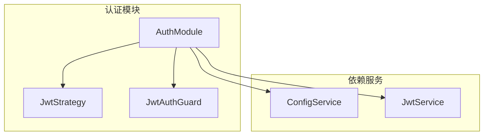
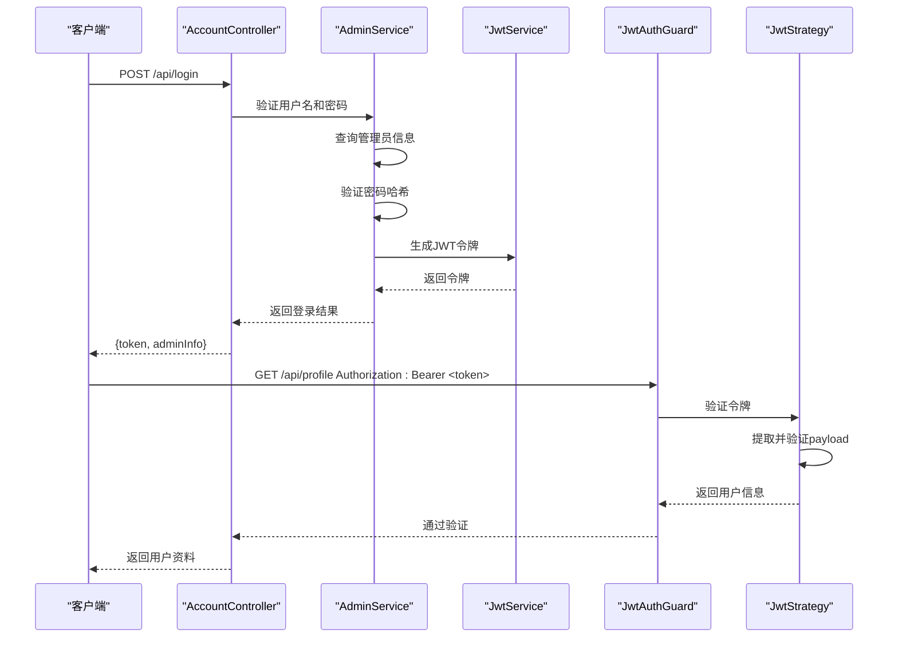
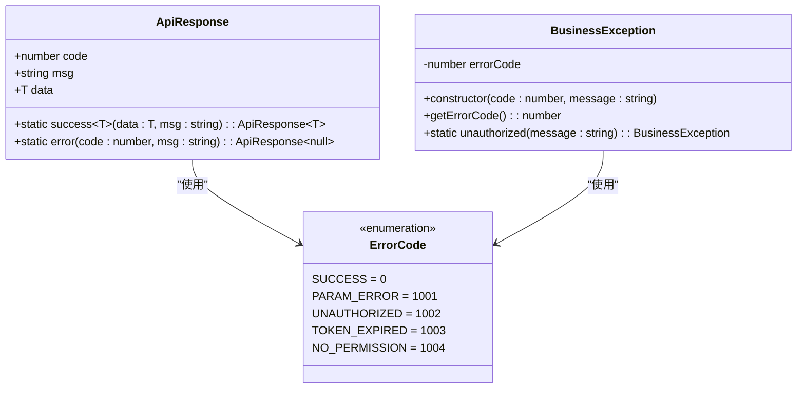

# 认证与授权机制

<cite>
**本文档引用的文件**
- [jwt.strategy.ts](file://agx-backend/src/modules/auth/jwt.strategy.ts)
- [jwt-auth.guard.ts](file://agx-backend/src/modules/auth/jwt-auth.guard.ts)
- [auth.module.ts](file://agx-backend/src/modules/auth/auth.module.ts)
- [current-user.decorator.ts](file://agx-backend/src/common/decorators/current-user.decorator.ts)
- [all-exceptions.filter.ts](file://agx-backend/src/common/filters/all-exceptions.filter.ts)
- [transform.interceptor.ts](file://agx-backend/src/common/interceptors/transform.interceptor.ts)
- [api-response.dto.ts](file://agx-backend/src/common/dto/api-response.dto.ts)
- [business.exception.ts](file://agx-backend/src/common/filters/business.exception.ts)
- [admin.service.ts](file://agx-backend/src/modules/admin/admin.service.ts)
- [account.controller.ts](file://agx-backend/src/modules/account/account.controller.ts)
</cite>

## 目录
1. [简介](#简介)
2. [JWT基础概念](#jwt基础概念)
3. [认证模块架构](#认证模块架构)
4. [核心组件分析](#核心组件分析)
5. [认证流程时序图](#认证流程时序图)
6. [全局异常处理与响应格式化](#全局异常处理与响应格式化)
7. [安全加固建议](#安全加固建议)
8. [自定义守卫开发指南](#自定义守卫开发指南)
9. [结论](#结论)

## 简介
本文档详细阐述了系统中基于JWT的认证与授权机制实现。文档聚焦于AuthModule如何通过JwtStrategy进行令牌验证，JwtAuthGuard如何实现路由保护，以及currentUser装饰器如何从请求中提取用户信息。同时，文档解释了AllExceptionsFilter和TransformInterceptor在全局异常处理和响应格式化中的作用。为初学者提供JWT基本概念讲解，为高级开发者提供安全加固建议和自定义守卫的开发指南。

## JWT基础概念
JSON Web Token (JWT) 是一种开放标准 (RFC 7519)，用于在各方之间安全地传输信息作为JSON对象。JWT通常用于身份验证和信息交换场景。一个JWT由三部分组成：头部(Header)、载荷(Payload)和签名(Signature)，格式为`xxx.yyy.zzz`。

在本系统中，JWT用于用户和管理员的身份验证。当用户成功登录后，服务器生成一个包含用户信息的JWT并返回给客户端。客户端在后续请求中将JWT放在Authorization头中（Bearer模式），服务器通过验证JWT的有效性来确认用户身份。

**Section sources**
- [jwt.strategy.ts](file://agx-backend/src/modules/auth/jwt.strategy.ts#L1-L32)

## 认证模块架构
认证模块（AuthModule）是系统安全的核心组件，负责JWT的生成、验证和路由保护。该模块基于NestJS的Passport库实现，通过依赖注入的方式与其他模块集成。

AuthModule的主要职责包括：
- 配置JWT模块的异步工厂，从配置服务中获取密钥和过期时间
- 注册JwtStrategy作为验证策略
- 导出PassportModule和JwtModule供其他模块使用

模块通过ConfigService从环境变量中读取JWT_SECRET和JWT_EXPIRES_IN配置，确保了配置的灵活性和安全性。



**Diagram sources**
- [auth.module.ts](file://agx-backend/src/modules/auth/auth.module.ts#L1-L25)

**Section sources**
- [auth.module.ts](file://agx-backend/src/modules/auth/auth.module.ts#L1-L25)

## 核心组件分析

### JwtStrategy - JWT验证策略
JwtStrategy是JWT验证的核心实现，继承自PassportStrategy(Strategy)。它负责从请求头中提取JWT令牌，并验证其有效性。

关键配置：
- `jwtFromRequest`: 使用`ExtractJwt.fromAuthHeaderAsBearerToken()`从Authorization头中提取Bearer令牌
- `ignoreExpiration`: 设置为false，表示需要检查令牌是否过期
- `secretOrKey`: 从ConfigService获取JWT_SECRET配置

验证流程中，`validate`方法接收解码后的payload，并返回用户信息对象。系统定义了JwtPayload接口，包含用户ID(sub)、用户唯一标识(uid)、用户名(username)和用户类型(type)。

**Section sources**
- [jwt.strategy.ts](file://agx-backend/src/modules/auth/jwt.strategy.ts#L1-L32)

### JwtAuthGuard - JWT路由守卫
JwtAuthGuard是基于Passport的认证守卫，用于保护需要身份验证的路由。它继承自AuthGuard('jwt')，并重写了`handleRequest`方法以提供自定义的错误处理。

当验证失败或用户不存在时，守卫会抛出BusinessException.unauthorized()异常，而不是默认的401错误。这种设计确保了所有错误都通过统一的异常处理机制进行处理，保持了API响应格式的一致性。

系统还提供了AdminGuard，它在JwtAuthGuard的基础上增加了管理员权限检查，确保只有管理员类型用户才能访问特定路由。

**Section sources**
- [jwt-auth.guard.ts](file://agx-backend/src/modules/auth/jwt-auth.guard.ts#L1-L38)

### currentUser装饰器 - 用户信息提取
currentUser装饰器是一个自定义参数装饰器，用于从请求上下文中提取当前登录用户的信息。它通过createParamDecorator创建，可以从request.user对象中获取完整的用户信息或指定的属性。

使用示例：
```typescript
@Get('profile')
@UseGuards(JwtAuthGuard)
getProfile(@CurrentUser('id') userId: number) {
  return this.accountService.getProfile(userId);
}
```

该装饰器极大地简化了控制器中获取用户信息的代码，避免了重复的请求对象访问逻辑。

**Section sources**
- [current-user.decorator.ts](file://agx-backend/src/common/decorators/current-user.decorator.ts#L1-L17)

## 认证流程时序图
以下时序图展示了完整的认证流程，包括登录、令牌发放和请求验证过程：



**Diagram sources**
- [account.controller.ts](file://agx-backend/src/modules/account/account.controller.ts#L81-L87)
- [admin.service.ts](file://agx-backend/src/modules/admin/admin.service.ts#L51-L75)
- [jwt-auth.guard.ts](file://agx-backend/src/modules/auth/jwt-auth.guard.ts#L6-L17)
- [jwt.strategy.ts](file://agx-backend/src/modules/auth/jwt.strategy.ts#L23-L30)

## 全局异常处理与响应格式化

### AllExceptionsFilter - 全局异常过滤器
AllExceptionsFilter是系统的全局异常处理器，捕获所有未处理的异常并返回统一格式的响应。它处理两种主要类型的异常：

1. **HttpException**: 包括业务异常和HTTP标准异常，提取错误码和消息
2. **Error**: 未预期的运行时错误，记录错误日志并返回通用错误消息

过滤器的关键特性是将所有业务错误的HTTP状态码设置为200，通过响应体中的code字段表示业务状态。这种设计避免了跨域问题，同时保持了API的稳定性。

**Section sources**
- [all-exceptions.filter.ts](file://agx-backend/src/common/filters/all-exceptions.filter.ts#L1-L46)

### TransformInterceptor - 响应转换拦截器
TransformInterceptor是响应转换拦截器，负责将所有成功的响应包装成统一的格式。它通过map操作符拦截响应流，将数据包装在ApiResponse对象中。

拦截器的智能之处在于它会检查响应是否已经是ApiResponse格式，如果是则直接返回，避免了重复包装。对于普通数据，它会调用ApiResponse.success()方法创建标准响应。

**Section sources**
- [transform.interceptor.ts](file://agx-backend/src/common/interceptors/transform.interceptor.ts#L1-L26)

### ApiResponse DTO - 统一响应数据传输对象
ApiResponse是系统统一的响应格式，包含code、msg和data三个字段。系统定义了ErrorCode枚举和ErrorMessage映射，确保了错误码的标准化和可维护性。



**Diagram sources**
- [api-response.dto.ts](file://agx-backend/src/common/dto/api-response.dto.ts#L1-L68)
- [business.exception.ts](file://agx-backend/src/common/filters/business.exception.ts#L1-L60)

## 安全加固建议

### 令牌刷新机制
虽然当前系统未实现，但建议添加令牌刷新机制。可以创建refresh token，存储在安全的HTTP-only cookie中，有效期长于access token。当access token过期时，客户端使用refresh token获取新的access token，提升用户体验和安全性。

### 黑名单机制
为支持令牌撤销功能，建议实现JWT黑名单机制。可以使用Redis存储已注销的令牌，验证时检查令牌是否在黑名单中。对于短期令牌，也可以考虑使用短期有效期+刷新机制替代黑名单。

### 安全配置
- JWT_SECRET应使用足够长度的随机字符串，避免使用简单密码
- JWT_EXPIRES_IN应根据业务需求设置合理值，建议不超过7天
- 生产环境中应启用HTTPS，防止令牌在传输过程中被窃取
- 敏感接口应增加额外的安全措施，如IP限制、请求频率限制等

## 自定义守卫开发指南
开发自定义守卫的步骤：

1. **创建守卫类**：继承AuthGuard或实现CanActivate接口
2. **添加Injectable装饰器**：使守卫可被依赖注入
3. **重写验证逻辑**：根据业务需求实现canActivate方法
4. **集成到控制器**：使用@UseGuards装饰器应用守卫

示例：创建角色守卫
```typescript
@Injectable()
export class RolesGuard extends AuthGuard('jwt') {
  constructor(private readonly roles: string[]) {
    super();
  }
  
  handleRequest(err: any, user: any) {
    if (err || !user) {
      throw new UnauthorizedException();
    }
    if (!this.roles.includes(user.role)) {
      throw new ForbiddenException();
    }
    return user;
  }
}
```

**Section sources**
- [jwt-auth.guard.ts](file://agx-backend/src/modules/auth/jwt-auth.guard.ts#L1-L38)

## 结论
本系统实现了基于JWT的完整认证与授权机制，通过AuthModule、JwtStrategy、JwtAuthGuard和currentUser装饰器的协同工作，提供了安全可靠的用户身份验证功能。全局异常处理和响应格式化机制确保了API的一致性和健壮性。建议未来实现令牌刷新和黑名单机制以进一步提升安全性，同时可以基于现有架构开发更多自定义守卫以满足复杂的业务需求。