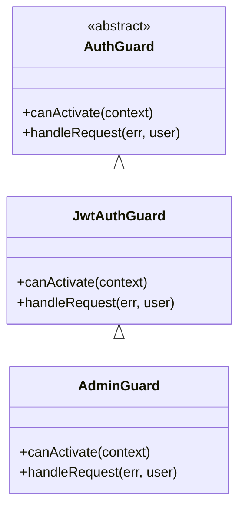
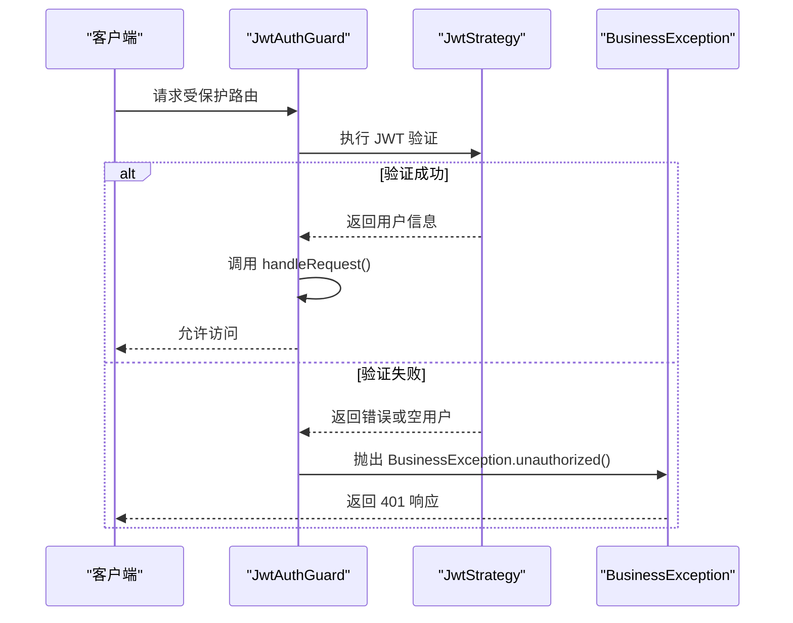
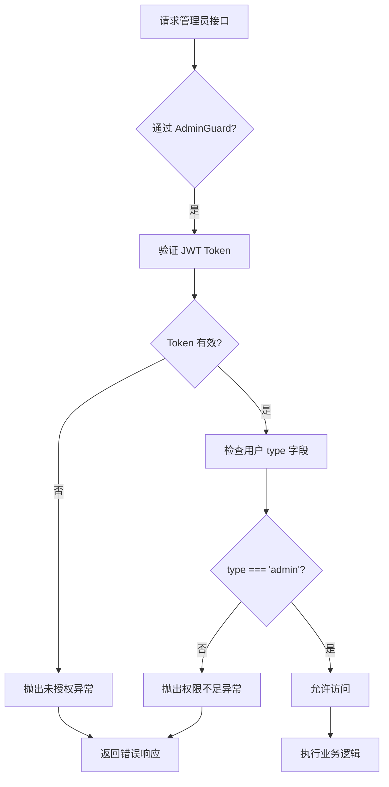
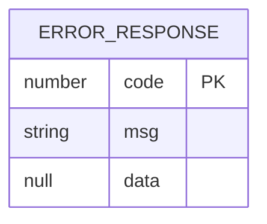

# 路由保护机制

<cite>
**本文档引用文件**  
- [jwt-auth.guard.ts](file://agx-backend/src/modules/auth/jwt-auth.guard.ts)
- [auth.module.ts](file://agx-backend/src/modules/auth/auth.module.ts)
- [admin.controller.ts](file://agx-backend/src/modules/admin/admin.controller.ts)
- [account.controller.ts](file://agx-backend/src/modules/account/account.controller.ts)
- [business.exception.ts](file://agx-backend/src/common/filters/business.exception.ts)
- [jwt.strategy.ts](file://agx-backend/src/modules/auth/jwt.strategy.ts)
- [api-response.dto.ts](file://agx-backend/src/common/dto/api-response.dto.ts)
- [current-user.decorator.ts](file://agx-backend/src/common/decorators/current-user.decorator.ts)
</cite>

## 目录
1. [引言](#引言)
2. [核心守卫实现](#核心守卫实现)
3. [JwtAuthGuard 详细解析](#jwtauthguard-详细解析)
4. [AdminGuard 权限控制机制](#adminguard-权限控制机制)
5. [守卫在控制器中的实际应用](#守卫在控制器中的实际应用)
6. [自定义守卫开发指南](#自定义守卫开发指南)
7. [异常处理与响应机制](#异常处理与响应机制)
8. [总结](#总结)

## 引言
本系统采用基于 JWT 的路由保护机制，通过 NestJS 的守卫（Guard）体系实现对受保护路由的访问控制。核心机制包括 `JwtAuthGuard` 和 `AdminGuard` 两种守卫类，分别用于普通用户和管理员用户的权限验证。该机制结合 Passport 框架、JWT 策略和自定义异常处理，构建了安全可靠的认证体系。

## 核心守卫实现

系统中的路由保护主要依赖于 `JwtAuthGuard` 和 `AdminGuard` 两个守卫类，它们均继承自 NestJS Passport 模块的 `AuthGuard`，并根据业务需求重写了关键方法。



**图示来源**  
- [jwt-auth.guard.ts](file://agx-backend/src/modules/auth/jwt-auth.guard.ts)

**本节来源**  
- [jwt-auth.guard.ts](file://agx-backend/src/modules/auth/jwt-auth.guard.ts)

## JwtAuthGuard 详细解析

`JwtAuthGuard` 是系统中最基础的身份验证守卫，继承自 `@nestjs/passport` 的 `AuthGuard('jwt')`，其核心功能是验证 JWT Token 的有效性。

### 继承与方法重写
该守卫通过继承 `AuthGuard` 并重写 `canActivate` 和 `handleRequest` 方法来实现定制化逻辑：

- `canActivate()` 方法直接调用父类实现，触发 Passport 的 JWT 验证流程
- `handleRequest()` 方法用于处理验证后的用户信息，并在验证失败时抛出异常

### 验证失败处理
当 JWT 验证失败或用户信息无效时，`handleRequest` 方法会抛出自定义的 `BusinessException.unauthorized()` 异常，返回统一的未授权响应。



**图示来源**  
- [jwt-auth.guard.ts](file://agx-backend/src/modules/auth/jwt-auth.guard.ts)
- [business.exception.ts](file://agx-backend/src/common/filters/business.exception.ts)

**本节来源**  
- [jwt-auth.guard.ts](file://agx-backend/src/modules/auth/jwt-auth.guard.ts)
- [business.exception.ts](file://agx-backend/src/common/filters/business.exception.ts)

## AdminGuard 权限控制机制

`AdminGuard` 继承自 `JwtAuthGuard`，在基础身份验证之上增加了管理员权限的分级控制。

### 权限检查逻辑
该守卫的核心在于 `handleRequest` 方法中对用户类型（type）的检查：

```typescript
if (user.type !== 'admin') {
  throw BusinessException.unauthorized('需要管理员权限');
}
```

### 分级控制实现
系统通过用户 JWT Payload 中的 `type` 字段实现权限分级：
- 普通用户：`type = 'user'`
- 管理员：`type = 'admin'`

只有当用户类型为 `admin` 时，才能访问被 `AdminGuard` 保护的路由。



**图示来源**  
- [jwt-auth.guard.ts](file://agx-backend/src/modules/auth/jwt-auth.guard.ts)
- [jwt.strategy.ts](file://agx-backend/src/modules/auth/jwt.strategy.ts)

**本节来源**  
- [jwt-auth.guard.ts](file://agx-backend/src/modules/auth/jwt-auth.guard.ts)
- [jwt.strategy.ts](file://agx-backend/src/modules/auth/jwt.strategy.ts)

## 守卫在控制器中的实际应用

通过 `@UseGuards()` 装饰器，可以将守卫应用到控制器或具体路由方法上。

### 普通用户路由保护
在 `AccountController` 中，多个用户相关接口使用了 `JwtAuthGuard`：

```typescript
@Get('profile')
@UseGuards(JwtAuthGuard)
async getProfile(@CurrentUser('id') userId: number) {
  return this.accountService.getProfile(userId);
}
```

### 管理员路由保护
在 `AdminController` 中，所有管理功能接口均使用 `AdminGuard`：

```typescript
@Get('currency/list')
@UseGuards(AdminGuard)
async getCurrencyList(@Query() dto: CurrencyListDto) {
  return this.adminService.getCurrencyList(dto);
}
```

### 多守卫组合
系统支持多个守卫的组合使用，虽然当前实现中未使用此特性，但框架支持如下语法：

```typescript
@UseGuards(JwtAuthGuard, RoleGuard)
```

**本节来源**  
- [account.controller.ts](file://agx-backend/src/modules/account/account.controller.ts)
- [admin.controller.ts](file://agx-backend/src/modules/admin/admin.controller.ts)

## 自定义守卫开发指南

开发者可以参考现有守卫的实现模式创建新的自定义守卫。

### 创建步骤
1. **继承基础守卫**：通常继承 `AuthGuard('jwt')`
2. **重写 handleRequest**：实现自定义的用户验证逻辑
3. **添加依赖注入**：使用 `@Injectable()` 装饰器
4. **抛出自定义异常**：使用 `BusinessException` 统一异常处理

### 示例模板
```typescript
@Injectable()
export class CustomGuard extends AuthGuard('jwt') {
  canActivate(context: ExecutionContext) {
    return super.canActivate(context);
  }

  handleRequest(err: any, user: any) {
    if (err || !user) {
      throw BusinessException.unauthorized();
    }
    // 自定义权限判断逻辑
    if (!this.hasCustomPermission(user)) {
      throw BusinessException.unauthorized('权限不足');
    }
    return user;
  }

  private hasCustomPermission(user: any): boolean {
    // 实现具体的权限判断逻辑
    return true;
  }
}
```

### 执行上下文处理
通过 `ExecutionContext` 可以获取请求上下文信息，用于更复杂的权限判断：

```typescript
handleRequest(err: any, user: any, info: any, context: ExecutionContext) {
  const request = context.switchToHttp().getRequest();
  // 可以基于请求路径、方法、参数等进行更精细的控制
}
```

**本节来源**  
- [jwt-auth.guard.ts](file://agx-backend/src/modules/auth/jwt-auth.guard.ts)
- [current-user.decorator.ts](file://agx-backend/src/common/decorators/current-user.decorator.ts)

## 异常处理与响应机制

系统采用统一的异常处理机制，确保所有错误响应格式一致。

### BusinessException 设计
`BusinessException` 继承自 `HttpException`，封装了业务错误码和消息：

- `ErrorCode.UNAUTHORIZED = 1002`
- `ErrorMessage[1002] = '未登录'`

### 异常抛出模式
守卫中统一使用静态工厂方法抛出异常：

```typescript
throw BusinessException.unauthorized();
throw BusinessException.unauthorized('需要管理员权限');
```

### 响应格式
所有异常响应遵循统一格式：
```json
{
  "code": 1002,
  "msg": "未登录",
  "data": null
}
```



**图示来源**  
- [api-response.dto.ts](file://agx-backend/src/common/dto/api-response.dto.ts)
- [business.exception.ts](file://agx-backend/src/common/filters/business.exception.ts)

**本节来源**  
- [business.exception.ts](file://agx-backend/src/common/filters/business.exception.ts)
- [api-response.dto.ts](file://agx-backend/src/common/dto/api-response.dto.ts)

## 总结
本系统的路由保护机制通过 `JwtAuthGuard` 和 `AdminGuard` 实现了分层的访问控制体系。基于 Passport 框架的 JWT 验证，结合自定义的异常处理和权限判断，构建了安全可靠的认证授权机制。开发者可以基于现有模式轻松创建新的守卫，满足不同场景的权限控制需求。