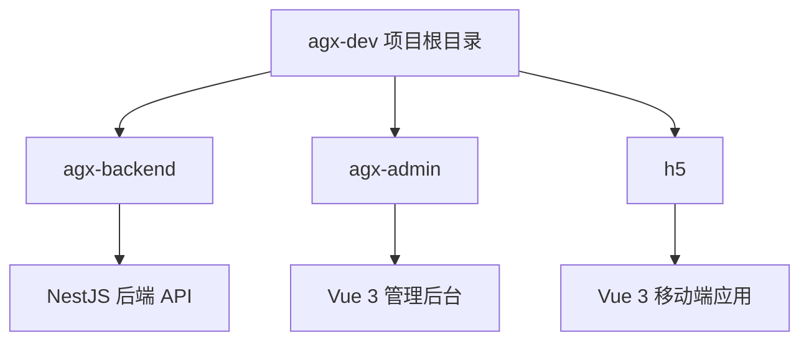

# 快速入门

<cite>
**本文档中引用的文件**  
- [agx-admin/package.json](file://agx-admin/package.json)
- [agx-backend/package.json](file://agx-backend/package.json)
- [h5/package.json](file://h5/package.json)
- [agx-admin/.env.example](file://agx-admin/.env.example)
- [agx-backend/.env](file://agx-backend/.env)
- [h5/.env](file://h5/.env)
- [agx-admin/vite.config.js](file://agx-admin/vite.config.js)
- [agx-backend/src/main.ts](file://agx-backend/src/main.ts)
- [h5/vite.config.js](file://h5/vite.config.js)
- [agx-admin/index.html](file://agx-admin/index.html)
- [h5/index.html](file://h5/index.html)
- [agx-admin/src/main.js](file://agx-admin/src/main.js)
- [h5/src/main.js](file://h5/src/main.js)
- [agx-backend/src/app.module.ts](file://agx-backend/src/app.module.ts)
</cite>

## 目录
1. [简介](#简介)
2. [项目结构](#项目结构)
3. [环境准备](#环境准备)
4. [克隆项目](#克隆项目)
5. [安装依赖](#安装依赖)
6. [配置环境变量](#配置环境变量)
7. [启动后端服务](#启动后端服务)
8. [启动管理后台](#启动管理后台)
9. [启动移动端应用](#启动移动端应用)
10. [验证安装](#验证安装)
11. [常见问题](#常见问题)

## 简介
本指南为新开发者提供从零开始搭建和运行 agx-dev 项目的完整分步指导。agx-dev 是一个包含后端 API、管理后台和移动端 H5 应用的完整交易所系统。本指南将引导您完成所有必要的步骤，确保您能在 30 分钟内成功运行整个项目。

## 项目结构
agx-dev 项目由三个主要子项目组成，分别位于不同的目录中：

- `agx-backend/`：基于 NestJS 的后端服务，提供所有 API 接口。
- `agx-admin/`：基于 Vue 3 的管理后台，用于系统管理和数据监控。
- `h5/`：基于 Vue 3 的移动端 H5 应用，提供用户端功能。

每个子项目都是一个独立的前端或后端应用，拥有自己的 `package.json` 文件和依赖项。



**Diagram sources**
- [agx-backend/package.json](file://agx-backend/package.json)
- [agx-admin/package.json](file://agx-admin/package.json)
- [h5/package.json](file://h5/package.json)

**Section sources**
- [agx-backend/package.json](file://agx-backend/package.json)
- [agx-admin/package.json](file://agx-admin/package.json)
- [h5/package.json](file://h5/package.json)

## 环境准备
在开始之前，请确保您的开发环境已安装以下工具：

- **Git**：用于克隆项目代码。
- **Node.js** (v16 或更高版本)：项目依赖 Node.js 运行。
- **npm 或 yarn**：用于安装项目依赖。
- **PostgreSQL**：后端服务使用 PostgreSQL 作为数据库。

您可以通过以下命令检查环境是否已正确安装：
```bash
node --version
npm --version
git --version
```

## 克隆项目
使用 Git 命令将 agx-dev 项目克隆到您的本地机器：

```bash
git clone https://github.com/your-repo/agx-dev.git
cd agx-dev
```

此命令会将整个项目仓库下载到本地，并进入项目根目录。

## 安装依赖
项目包含三个独立的子项目，您需要分别为每个子项目安装依赖。

在项目根目录下，依次执行以下命令：

```bash
# 安装后端服务依赖
cd agx-backend && npm install
cd ..

# 安装管理后台依赖
cd agx-admin && npm install
cd ..

# 安装移动端应用依赖
cd h5 && npm install
cd ..
```

**注意**：每个 `npm install` 命令都必须在对应的子项目目录中执行。

**Section sources**
- [agx-backend/package.json](file://agx-backend/package.json)
- [agx-admin/package.json](file://agx-admin/package.json)
- [h5/package.json](file://h5/package.json)

## 配置环境变量
每个子项目都有自己的环境变量配置文件，用于设置运行时参数。

### 配置后端服务
后端服务的环境变量位于 `agx-backend/.env` 文件中。该文件已包含默认配置，通常无需修改即可运行。

关键配置项：
- `PORT=3000`：后端服务监听的端口。
- `DB_HOST`, `DB_PORT`, `DB_USERNAME`, `DB_PASSWORD`, `DB_DATABASE`：PostgreSQL 数据库连接信息。

```bash
# 查看后端环境配置
cat agx-backend/.env
```

### 配置管理后台
管理后台的环境变量基于 `agx-admin/.env.example` 文件。您需要复制此文件并根据需要进行修改。

```bash
# 复制示例配置文件
cp agx-admin/.env.example agx-admin/.env

# 查看配置内容
cat agx-admin/.env
```

关键配置项：
- `VITE_APP_PORT = 2888`：管理后台开发服务器的端口。
- `VITE_APP_BASE = /`：应用的根路径。
- `VITE_APP_OPEN_PROXY = true`：是否开启代理，用于解决跨域问题。

### 配置移动端应用
移动端应用的环境变量位于 `h5/.env` 文件中。

```bash
# 查看移动端环境配置
cat h5/.env
```

关键配置项：
- `VITE_API_BASE_URL`：API 服务器地址。
- `VITE_WS_BASE_URL`：WebSocket 服务器地址。

**Section sources**
- [agx-backend/.env](file://agx-backend/.env)
- [agx-admin/.env.example](file://agx-admin/.env.example)
- [h5/.env](file://h5/.env)

## 启动后端服务
后端服务必须首先启动，因为管理后台和移动端应用都依赖于它提供的 API。

1. 确保 PostgreSQL 数据库正在运行。
2. 在 `agx-backend` 目录中启动开发服务器：

```bash
cd agx-backend
npm run dev
```

如果启动成功，您将在终端看到类似以下的输出：
```
🚀 AGX Backend running on: http://0.0.0.0:3000
```

这表示后端服务已在 `http://localhost:3000` 上成功启动。

**Section sources**
- [agx-backend/package.json](file://agx-backend/package.json)
- [agx-backend/src/main.ts](file://agx-backend/src/main.ts)

## 启动管理后台
在后端服务运行后，您可以启动管理后台。

1. 打开一个新的终端窗口或标签页。
2. 进入 `agx-admin` 目录并启动开发服务器：

```bash
cd agx-admin
npm run dev
```

如果启动成功，您将看到类似以下的输出：
```
  VITE v5.1.4  ready in 2250 ms
  ➜  Local:   http://localhost:2888/
  ➜  Network: use --host to expose
```

## 启动移动端应用
最后，启动移动端 H5 应用。

1. 再打开一个新的终端窗口或标签页。
2. 进入 `h5` 目录并启动开发服务器：

```bash
cd h5
npm run dev
```

如果启动成功，您将看到类似以下的输出：
```
  VITE v7.0.0  ready in 1500 ms
  ➜  Local:   http://localhost:5173/
  ➜  Network: use --host to expose
```

## 验证安装
现在，您可以通过访问以下 URL 来验证所有服务是否正常运行：

1. **管理后台**：打开浏览器并访问 `http://localhost:2888`。您应该能看到 AGX Admin 的登录页面。
2. **后端 API**：访问 `http://localhost:3000`。如果后端正常运行，您可能会看到一个简单的欢迎信息或路由未找到的提示（这表示服务已启动）。
3. **移动端应用**：访问 `http://localhost:5173`。您应该能看到移动端应用的首页。

如果所有三个 URL 都能正常访问，则说明您的安装和配置已成功完成。

## 常见问题
- **问题**：启动后端时出现数据库连接错误。
  **解决方案**：请确保 PostgreSQL 服务正在运行，并检查 `agx-backend/.env` 文件中的数据库配置是否正确。

- **问题**：管理后台无法访问 API。
  **解决方案**：确保后端服务已启动，并且 `agx-admin/vite.config.js` 中的代理配置正确。

- **问题**：安装依赖时出现网络错误。
  **解决方案**：尝试使用国内镜像源，例如 `npm config set registry https://registry.npmmirror.com`。