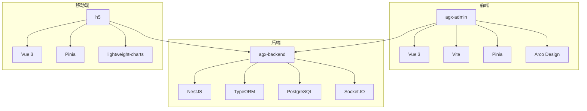
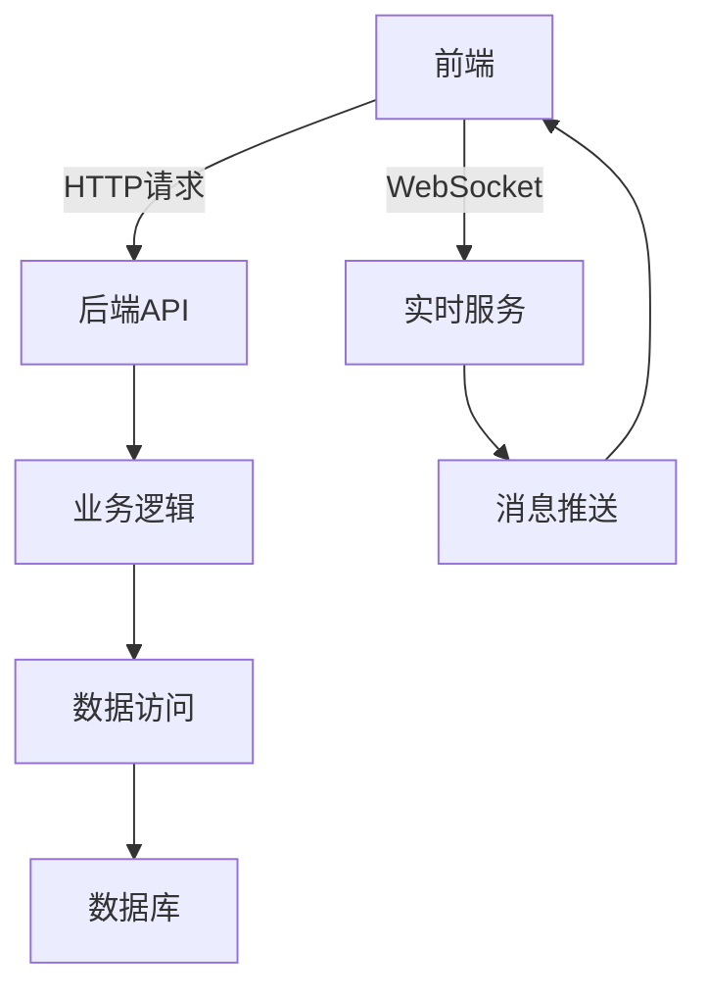
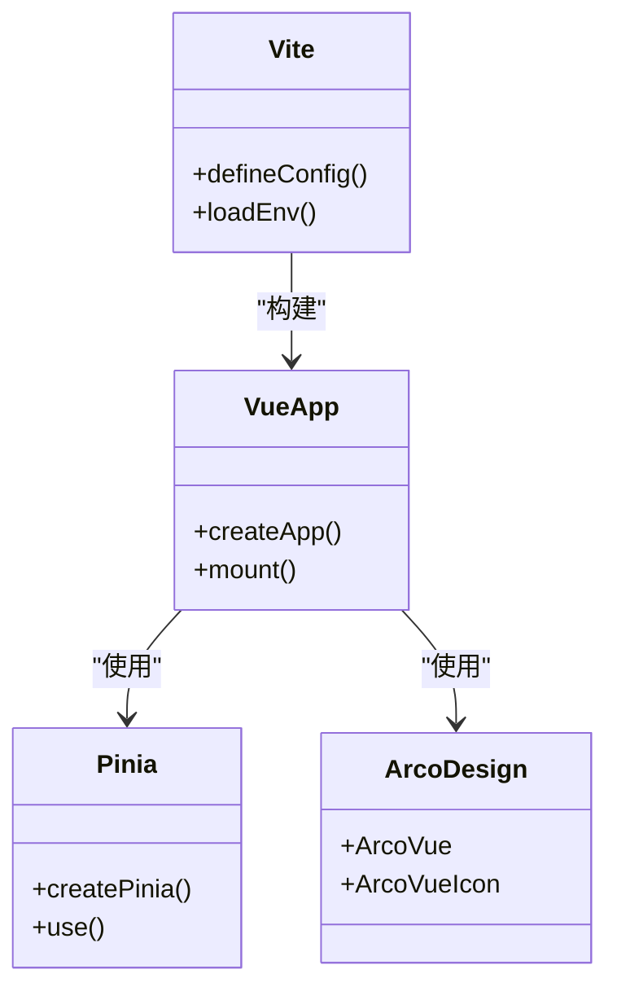
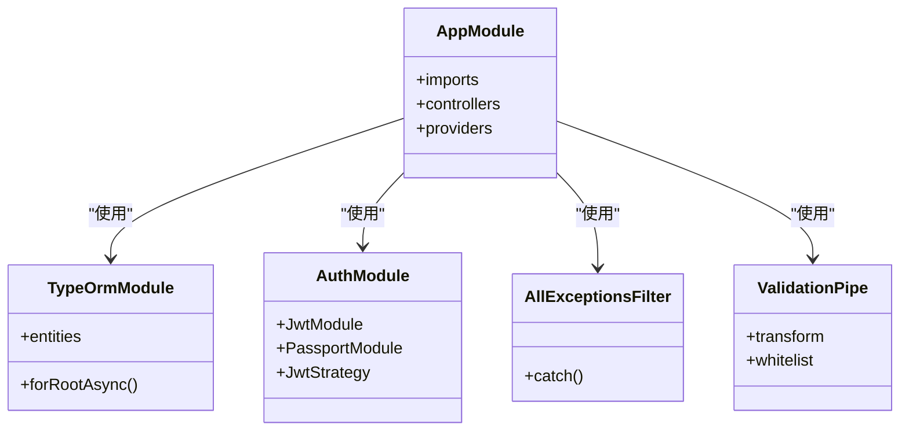
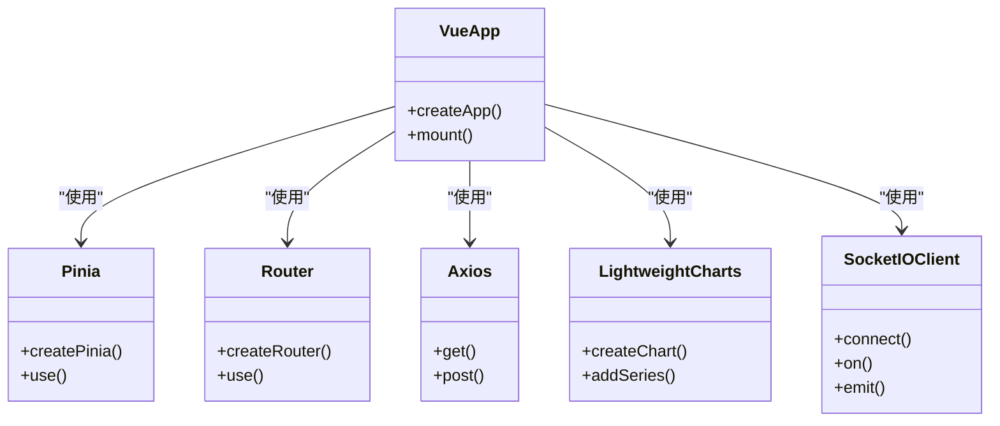
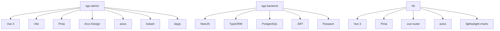

# 技术栈

<cite>
**本文档中引用的文件**  
- [agx-admin/package.json](file://agx-admin/package.json)
- [agx-backend/package.json](file://agx-backend/package.json)
- [h5/package.json](file://h5/package.json)
- [agx-admin/vite.config.js](file://agx-admin/vite.config.js)
- [agx-backend/src/main.ts](file://agx-backend/src/main.ts)
- [agx-backend/src/app.module.ts](file://agx-backend/src/app.module.ts)
- [agx-admin/src/main.js](file://agx-admin/src/main.js)
- [agx-admin/src/store/index.js](file://agx-admin/src/store/index.js)
- [agx-admin/src/style/skin.less](file://agx-admin/src/style/skin.less)
- [agx-admin/src/utils/request.js](file://agx-admin/src/utils/request.js)
- [agx-admin/src/utils/Wsocket.js](file://agx-admin/src/utils/Wsocket.js)
- [agx-backend/nest-cli.json](file://agx-backend/nest-cli.json)
- [h5/src/main.js](file://h5/src/main.js)
- [agx-admin/src/ws-serve/message.js](file://agx-admin/src/ws-serve/message.js)
- [h5/src/views/Orders.vue](file://h5/src/views/Orders.vue)
</cite>

## 目录
1. [简介](#简介)
2. [项目结构](#项目结构)
3. [核心组件](#核心组件)
4. [架构概述](#架构概述)
5. [详细组件分析](#详细组件分析)
6. [依赖分析](#依赖分析)
7. [性能考虑](#性能考虑)
8. [故障排除指南](#故障排除指南)
9. [结论](#结论)

## 简介
agx-dev项目是一个完整的数字资产交易平台，包含管理后台（agx-admin）、后端服务（agx-backend）和移动端应用（h5）。该项目采用现代化的技术栈，从前端到后端再到移动端，均使用了当前主流的框架和库。前端管理后台基于Vue 3和Vite构建，使用Pinia进行状态管理，并采用Arco Design作为UI组件库。后端服务采用NestJS框架，结合TypeORM和PostgreSQL实现数据持久化，并通过Socket.IO提供实时通信功能。移动端应用同样基于Vue 3技术栈，使用lightweight-charts库实现轻量级金融图表展示。本文档将详细介绍各部分的技术选型、依赖管理、配置方式以及最佳实践。

## 项目结构
agx-dev项目采用多包结构，包含三个主要子项目：agx-admin（管理后台）、agx-backend（后端API服务）和h5（移动端应用）。每个子项目都有独立的package.json文件，实现了技术栈的分离和职责的清晰划分。agx-admin使用Vite作为构建工具，提供快速的开发服务器和高效的生产构建。agx-backend基于NestJS框架，采用TypeScript编写，提供了模块化、可扩展的后端架构。h5项目是面向移动端的轻量级应用，专注于提供流畅的移动用户体验。这种结构使得各部分可以独立开发、测试和部署，同时通过API接口进行通信，实现了前后端分离和移动端独立的架构模式。

**图源**
- [agx-admin/package.json](file://agx-admin/package.json)
- [agx-backend/package.json](file://agx-backend/package.json)
- [h5/package.json](file://h5/package.json)

**本节来源**
- [agx-admin/package.json](file://agx-admin/package.json)
- [agx-backend/package.json](file://agx-backend/package.json)
- [h5/package.json](file://h5/package.json)

## 核心组件
项目的核心组件包括前端的Vue 3应用、后端的NestJS服务和移动端的Vue 3应用。前端管理后台（agx-admin）使用Vue 3的Composition API组织代码，通过Pinia进行全局状态管理，并利用Arco Design提供丰富的UI组件。后端服务（agx-backend）采用NestJS的模块化架构，将不同业务功能划分为独立的模块，如AuthModule、AccountModule、PoolModule等，每个模块负责特定的业务逻辑。移动端应用（h5）则专注于提供简洁高效的移动界面，使用lightweight-charts库实现金融数据的可视化展示。这些核心组件通过RESTful API和WebSocket进行通信，构成了完整的应用生态系统。

**本节来源**
- [agx-admin/package.json](file://agx-admin/package.json)
- [agx-backend/package.json](file://agx-backend/package.json)
- [h5/package.json](file://h5/package.json)

## 架构概述
agx-dev项目采用分层架构设计，从前端到后端形成了清晰的调用链路。前端应用通过HTTP请求与后端API交互，获取数据并展示给用户。后端服务采用NestJS的模块化架构，将业务逻辑分解为多个独立的模块，每个模块包含控制器、服务和实体。数据访问层使用TypeORM与PostgreSQL数据库交互，实现了数据的持久化存储。实时通信功能通过Socket.IO实现，前端通过WebSocket连接到后端，接收实时消息和数据更新。这种架构设计提高了代码的可维护性和可扩展性，使得新功能的添加和现有功能的修改变得更加容易。

**图源**
- [agx-backend/src/main.ts](file://agx-backend/src/main.ts)
- [agx-backend/src/app.module.ts](file://agx-backend/src/app.module.ts)
- [agx-admin/src/utils/Wsocket.js](file://agx-admin/src/utils/Wsocket.js)

**本节来源**
- [agx-backend/src/main.ts](file://agx-backend/src/main.ts)
- [agx-backend/src/app.module.ts](file://agx-backend/src/app.module.ts)

## 详细组件分析

### 前端组件分析
agx-admin项目使用Vue 3作为核心框架，利用其Composition API提供了更好的代码组织方式。Vite作为构建工具，提供了快速的冷启动和热模块替换功能，极大地提升了开发体验。Pinia作为状态管理库，相比Vuex更加简洁和类型安全，通过createPinia()创建store实例，并在main.js中注册。Arco Design作为UI组件库，提供了丰富的预设组件和主题定制能力，通过@arco-design/web-vue包引入，并在main.js中通过app.use()注册。项目还使用了Tailwind CSS进行原子化样式设计，通过tailwind.config.cjs配置文件进行定制。

**图源**
- [agx-admin/src/main.js](file://agx-admin/src/main.js)
- [agx-admin/src/store/index.js](file://agx-admin/src/store/index.js)
- [agx-admin/vite.config.js](file://agx-admin/vite.config.js)

**本节来源**
- [agx-admin/src/main.js](file://agx-admin/src/main.js)
- [agx-admin/src/store/index.js](file://agx-admin/src/store/index.js)
- [agx-admin/vite.config.js](file://agx-admin/vite.config.js)

### 后端组件分析
agx-backend项目基于NestJS框架构建，采用了典型的模块化架构。AppModule作为根模块，导入了ConfigModule、TypeOrmModule和其他业务模块。TypeOrmModule通过forRootAsync配置数据库连接，从环境变量中读取数据库连接信息，实现了配置的外部化。业务模块如AuthModule、AccountModule等，各自封装了特定的业务逻辑，通过依赖注入机制相互协作。项目使用JWT进行身份验证，通过Passport和JwtStrategy实现认证流程。异常处理通过AllExceptionsFilter全局过滤器实现，统一了错误响应格式。请求验证通过ValidationPipe实现，确保了输入数据的有效性。

**图源**
- [agx-backend/src/app.module.ts](file://agx-backend/src/app.module.ts)
- [agx-backend/src/main.ts](file://agx-backend/src/main.ts)
- [agx-backend/src/modules/auth/auth.module.ts](file://agx-backend/src/modules/auth/auth.module.ts)

**本节来源**
- [agx-backend/src/app.module.ts](file://agx-backend/src/app.module.ts)
- [agx-backend/src/main.ts](file://agx-backend/src/main.ts)
- [agx-backend/src/modules/auth/auth.module.ts](file://agx-backend/src/modules/auth/auth.module.ts)

### 移动端组件分析
h5项目是面向移动端的轻量级应用，同样基于Vue 3技术栈构建。项目使用Pinia进行状态管理，通过createPinia()创建store实例，并在main.js中注册。路由系统使用vue-router，实现了页面间的导航。网络请求通过axios库实现，与后端API进行数据交互。图表展示使用lightweight-charts库，这是一个专为金融图表设计的轻量级库，提供了高性能的K线图、折线图等金融可视化组件。Socket.IO客户端用于实现实时数据更新，如订单状态变化、价格波动等。项目结构简洁，专注于提供流畅的移动用户体验。

**图源**
- [h5/src/main.js](file://h5/src/main.js)
- [h5/src/views/Orders.vue](file://h5/src/views/Orders.vue)
- [h5/package.json](file://h5/package.json)

**本节来源**
- [h5/src/main.js](file://h5/src/main.js)
- [h5/src/views/Orders.vue](file://h5/src/views/Orders.vue)

## 依赖分析
项目依赖管理清晰，各子项目通过package.json文件管理各自的依赖。agx-admin的依赖主要包括Vue 3、Vite、Pinia、Arco Design等前端框架和库，以及axios、lodash、dayjs等工具库。agx-backend的依赖主要包括NestJS核心包、TypeORM、PostgreSQL驱动、JWT认证相关包等。h5的依赖相对精简，主要包括Vue 3、Pinia、vue-router、axios和lightweight-charts。所有项目都使用TypeScript，通过devDependencies管理开发依赖。版本管理采用语义化版本控制，确保了依赖的稳定性和兼容性。

**图源**
- [agx-admin/package.json](file://agx-admin/package.json)
- [agx-backend/package.json](file://agx-backend/package.json)
- [h5/package.json](file://h5/package.json)

**本节来源**
- [agx-admin/package.json](file://agx-admin/package.json)
- [agx-backend/package.json](file://agx-backend/package.json)
- [h5/package.json](file://h5/package.json)

## 性能考虑
项目在性能方面做了多方面的优化。前端使用Vite作为构建工具，利用ES模块的原生支持，实现了快速的冷启动和按需编译，显著提升了开发效率。生产构建通过配置chunkSizeWarningLimit进行代码分割优化，减少了初始加载时间。后端通过NestJS的依赖注入系统和模块化架构，实现了高效的请求处理和资源管理。数据库查询通过TypeORM的查询构建器和关系映射，优化了数据访问性能。实时通信通过WebSocket实现，减少了HTTP轮询的开销，提高了消息传递的效率。移动端使用lightweight-charts库，该库专为性能优化设计，能够高效处理大量金融数据的渲染。

## 故障排除指南
常见问题包括前端构建失败、后端连接数据库失败、移动端图表不显示等。前端构建问题通常与Vite配置或依赖版本有关，可通过检查vite.config.js和package.json解决。后端数据库连接问题多由环境变量配置错误引起，需检查.env文件中的DB_HOST、DB_PORT等配置。实时通信问题可能与WebSocket连接或认证有关，可通过检查Wsocket.js中的连接逻辑和认证令牌解决。移动端图表问题通常与lightweight-charts的初始化或数据格式有关，需确保数据格式正确并正确调用API。

**本节来源**
- [agx-admin/vite.config.js](file://agx-admin/vite.config.js)
- [agx-backend/src/app.module.ts](file://agx-backend/src/app.module.ts)
- [agx-admin/src/utils/Wsocket.js](file://agx-admin/src/utils/Wsocket.js)
- [h5/src/views/Orders.vue](file://h5/src/views/Orders.vue)

## 结论
agx-dev项目采用了一套现代化、高效的技术栈，从前端到后端再到移动端，均使用了当前主流的框架和库。Vue 3的Composition API提供了更好的代码组织方式，NestJS的模块化架构支持业务的灵活扩展，TypeORM简化了数据库操作，Socket.IO实现了高效的实时通信。各部分技术选型合理，依赖管理清晰，为项目的长期维护和发展奠定了坚实的基础。对于初学者，建议从Vue 3和NestJS的基础知识入手，逐步掌握各组件的使用方法。对于开发者，应遵循项目约定，合理使用Pinia进行状态管理，充分利用Arco Design的组件和主题定制能力，按照NestJS的最佳实践进行模块设计和代码组织。