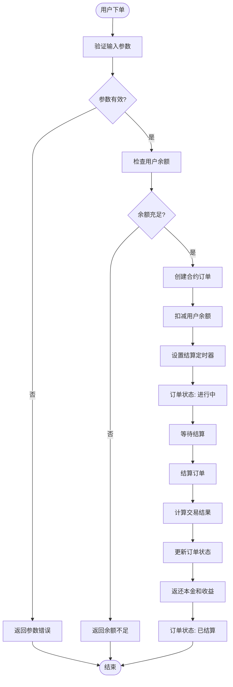
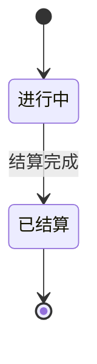
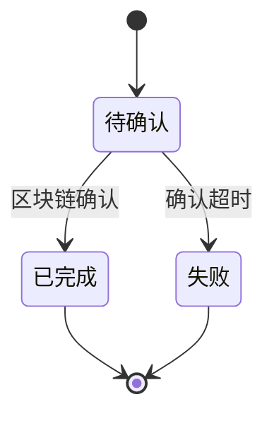
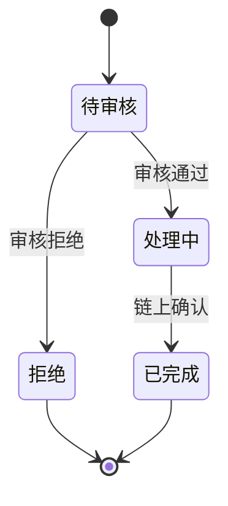
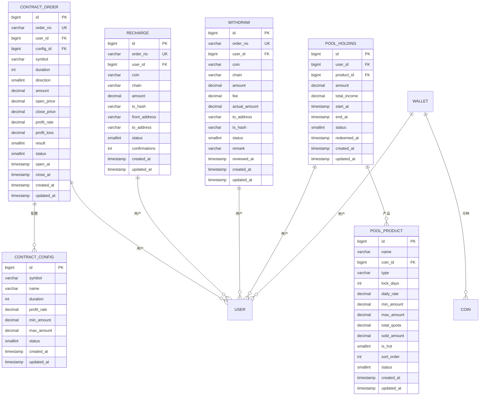
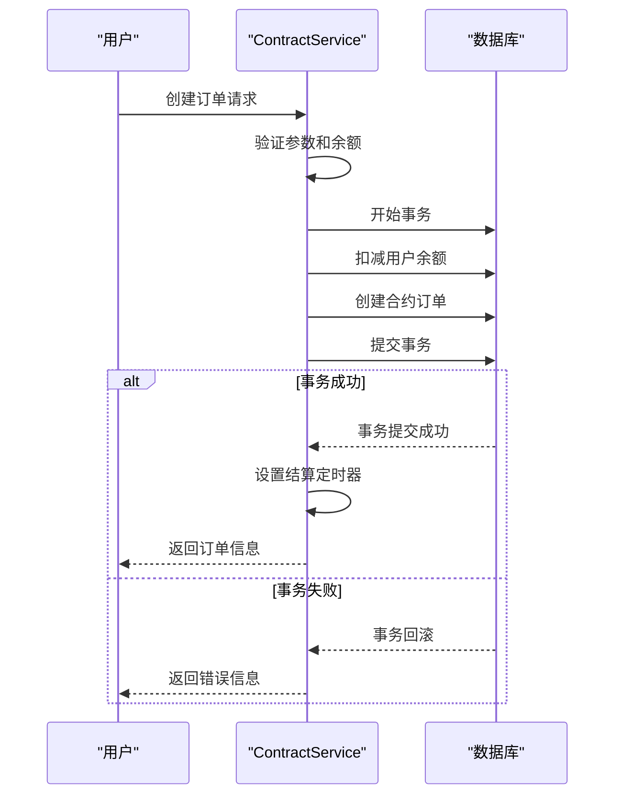
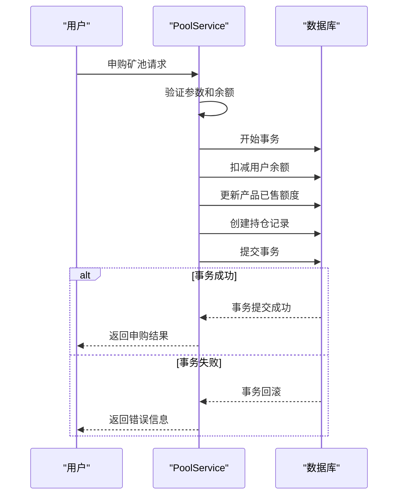
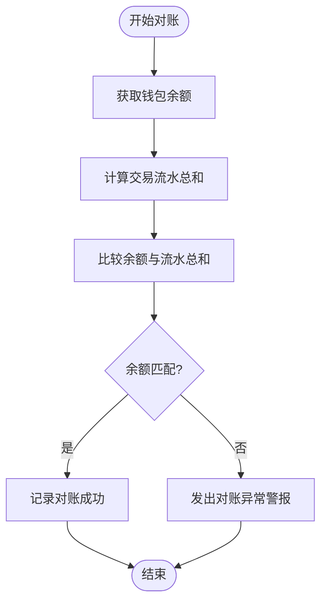
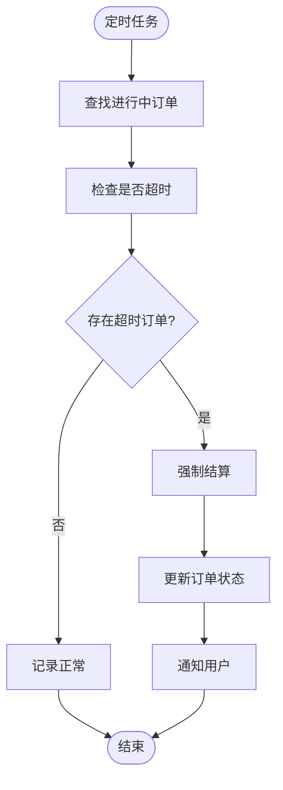
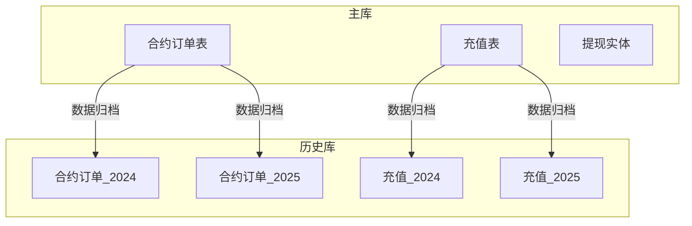

# 交易模型

<cite>
**本文档引用文件**   
- [contract-order.entity.ts](file://agx-backend/src/entities/contract-order.entity.ts)
- [contract-config.entity.ts](file://agx-backend/src/entities/contract-config.entity.ts)
- [recharge.entity.ts](file://agx-backend/src/entities/recharge.entity.ts)
- [withdraw.entity.ts](file://agx-backend/src/entities/withdraw.entity.ts)
- [pool-product.entity.ts](file://agx-backend/src/entities/pool-product.entity.ts)
- [pool-holding.entity.ts](file://agx-backend/src/entities/pool-holding.entity.ts)
- [contract.service.ts](file://agx-backend/src/modules/contract/contract.service.ts)
- [pool.service.ts](file://agx-backend/src/modules/pool/pool.service.ts)
- [account.service.ts](file://agx-backend/src/modules/account/account.service.ts)
- [schema.sql](file://agx-backend/schema.sql)
</cite>

## 目录
1. [引言](#引言)
2. [核心交易实体](#核心交易实体)
3. [合约订单生命周期](#合约订单生命周期)
4. [交易状态机](#交易状态机)
5. [实体关系模型](#实体关系模型)
6. [交易事务处理](#交易事务处理)
7. [交易对账机制](#交易对账机制)
8. [查询性能优化](#查询性能优化)
9. [结论](#结论)

## 引言

本交易模型文档详细阐述了AGX平台的交易数据架构，重点关注合约交易、充值提现和矿池投资三大核心交易场景。系统采用TypeORM作为ORM框架，PostgreSQL作为数据库，实现了高可靠性的交易数据管理。文档深入分析了ContractOrder等核心实体的字段定义、数据类型、状态转换逻辑，以及各交易实体之间的关联关系。通过本模型，平台能够确保交易数据的一致性、完整性和可追溯性，为用户提供安全可靠的交易服务。

## 核心交易实体

### 合约订单实体 (ContractOrder)

ContractOrder实体是秒合约交易的核心数据结构，记录了用户每笔合约交易的完整信息。

**字段定义与数据类型：**
- `id`: bigint - 主键，自增ID
- `orderNo`: varchar(32) - 订单号，全局唯一
- `userId`: bigint - 用户ID，关联用户表
- `configId`: bigint - 合约配置ID，关联合约配置表
- `symbol`: varchar(20) - 交易对（如XAU/USD）
- `duration`: int - 交易周期（秒数）
- `direction`: smallint - 交易方向（1:看涨, 2:看跌）
- `amount`: decimal(20,8) - 交易金额
- `openPrice`: decimal(20,8) - 开仓价格
- `closePrice`: decimal(20,8) - 平仓价格（可为空）
- `profitRate`: decimal(10,4) - 盈利率
- `profitLoss`: decimal(20,8) - 盈亏金额（可为空）
- `result`: smallint - 交易结果（1:盈, 2:亏, 3:平）
- `status`: smallint - 订单状态（0:进行中, 1:已结算）
- `openAt`: timestamp - 开仓时间
- `closeAt`: timestamp - 平仓时间（可为空）
- `createdAt`: timestamp - 创建时间
- `updatedAt`: timestamp - 更新时间

**Section sources**
- [contract-order.entity.ts](file://agx-backend/src/entities/contract-order.entity.ts#L1-L81)

### 合约配置实体 (ContractConfig)

ContractConfig实体定义了不同交易对的合约规则和参数。

**字段定义与数据类型：**
- `id`: bigint - 主键，自增ID
- `symbol`: varchar(20) - 交易对
- `name`: varchar(50) - 名称
- `duration`: int - 周期秒数
- `profitRate`: decimal(10,4) - 盈利收益率
- `minAmount`: decimal(20,8) - 最小下单金额
- `maxAmount`: decimal(20,8) - 最大下单金额
- `payCurrencies`: varchar(50) - 支付币种
- `status`: smallint - 状态（0:下架, 1:上架）
- `createdAt`: timestamp - 创建时间
- `updatedAt`: timestamp - 更新时间

**Section sources**
- [contract-config.entity.ts](file://agx-backend/src/entities/contract-config.entity.ts#L1-L47)

### 充值实体 (Recharge)

Recharge实体记录了用户的充值交易信息。

**字段定义与数据类型：**
- `id`: bigint - 主键，自增ID
- `orderNo`: varchar(32) - 订单号，全局唯一
- `userId`: bigint - 用户ID
- `coin`: varchar(20) - 币种
- `chain`: varchar(20) - 链网络
- `amount`: decimal(30,8) - 充值金额
- `txHash`: varchar(128) - 交易哈希
- `fromAddress`: varchar(128) - 来源地址
- `toAddress`: varchar(128) - 目标地址
- `status`: smallint - 状态（0:待确认, 1:已完成, 2:失败）
- `confirmations`: int - 确认数
- `createdAt`: timestamp - 创建时间
- `updatedAt`: timestamp - 更新时间

**Section sources**
- [recharge.entity.ts](file://agx-backend/src/entities/recharge.entity.ts#L1-L57)

### 提现实体 (Withdraw)

Withdraw实体记录了用户的提现交易信息。

**字段定义与数据类型：**
- `id`: bigint - 主键，自增ID
- `orderNo`: varchar(32) - 订单号，全局唯一
- `userId`: bigint - 用户ID
- `coin`: varchar(20) - 币种
- `chain`: varchar(20) - 链网络
- `amount`: decimal(30,8) - 提现金额
- `fee`: decimal(30,8) - 手续费
- `actualAmount`: decimal(30,8) - 实际到账金额
- `toAddress`: varchar(128) - 提现地址
- `txHash`: varchar(128) - 交易哈希
- `status`: smallint - 状态（0:待审核, 1:处理中, 2:已完成, 3:拒绝）
- `remark`: varchar(255) - 审核备注
- `reviewedAt`: timestamp - 审核时间
- `createdAt`: timestamp - 创建时间
- `updatedAt`: timestamp - 更新时间

**Section sources**
- [withdraw.entity.ts](file://agx-backend/src/entities/withdraw.entity.ts#L1-L63)

### 矿池产品实体 (PoolProduct)

PoolProduct实体定义了矿池投资产品的配置信息。

**字段定义与数据类型：**
- `id`: bigint - 主键，自增ID
- `name`: varchar(100) - 产品名称
- `coinId`: bigint - 投入币种ID
- `type`: varchar(20) - 类型（flexible:活期, fixed:定期）
- `lockDays`: int - 锁定天数
- `dailyRate`: decimal(10,6) - 日收益率
- `minAmount`: decimal(20,8) - 最低申购金额
- `maxAmount`: decimal(20,8) - 最高申购金额
- `totalQuota`: decimal(20,8) - 总额度
- `soldAmount`: decimal(20,8) - 已售额度
- `isHot`: smallint - 是否热门
- `sortOrder`: int - 排序
- `payCurrencies`: varchar(50) - 支付币种
- `status`: smallint - 状态（0:下架, 1:上架）
- `createdAt`: timestamp - 创建时间
- `updatedAt`: timestamp - 更新时间

**Section sources**
- [pool-product.entity.ts](file://agx-backend/src/entities/pool-product.entity.ts#L1-L62)

### 矿池持仓实体 (PoolHolding)

PoolHolding实体记录了用户的矿池投资持仓信息。

**字段定义与数据类型：**
- `id`: bigint - 主键，自增ID
- `userId`: bigint - 用户ID
- `productId`: bigint - 产品ID
- `amount`: decimal(20,8) - 持仓数量
- `totalIncome`: decimal(20,8) - 累计收益
- `startAt`: timestamp - 开始计息时间
- `endAt`: timestamp - 到期时间（可为空）
- `status`: smallint - 状态（0:已赎回, 1:持仓中）
- `redeemedAt`: timestamp - 赎回时间（可为空）
- `createdAt`: timestamp - 创建时间
- `updatedAt`: timestamp - 更新时间

**Section sources**
- [pool-holding.entity.ts](file://agx-backend/src/entities/pool-holding.entity.ts#L1-L60)

## 合约订单生命周期

合约订单的生命周期从用户下单开始，到订单结算结束，整个过程严格遵循预定义的状态转换规则。



**Diagram sources**
- [contract.service.ts](file://agx-backend/src/modules/contract/contract.service.ts#L68-L159)

## 交易状态机

### 合约订单状态机

合约订单的状态转换遵循严格的规则，确保交易过程的正确性和一致性。



**状态说明：**
- **进行中 (0)**: 订单已创建，等待结算
- **已结算 (1)**: 订单已完成结算，结果已确定

**Section sources**
- [contract-order.entity.ts](file://agx-backend/src/entities/contract-order.entity.ts#L65-L67)

### 充值状态机

充值交易的状态转换反映了区块链确认的过程。



**状态说明：**
- **待确认 (0)**: 充值交易已提交，等待区块链确认
- **已完成 (1)**: 充值已确认，资金已到账
- **失败 (2)**: 充值确认超时或失败

**Section sources**
- [recharge.entity.ts](file://agx-backend/src/entities/recharge.entity.ts#L45-L46)

### 提现状态机

提现交易的状态转换体现了后台审核和处理的流程。



**状态说明：**
- **待审核 (0)**: 提现申请已提交，等待审核
- **处理中 (1)**: 提现已审核通过，正在处理
- **已完成 (2)**: 提现已成功，资金已发出
- **拒绝 (3)**: 提现申请被拒绝

**Section sources**
- [withdraw.entity.ts](file://agx-backend/src/entities/withdraw.entity.ts#L48-L49)

## 实体关系模型

交易系统中的各个实体通过外键和关联关系紧密连接，形成了完整的交易数据模型。



**Diagram sources**
- [schema.sql](file://agx-backend/schema.sql#L183-L203)
- [contract-order.entity.ts](file://agx-backend/src/entities/contract-order.entity.ts#L1-L81)

## 交易事务处理

交易事务处理是确保数据一致性的关键。系统采用数据库事务来保证交易操作的原子性。

### 合约下单事务流程

当用户创建合约订单时，系统执行以下事务操作：



**关键代码路径：**
- 事务开始: `queryRunner.startTransaction()`
- 余额扣减: `await queryRunner.manager.update(Wallet, wallet.id, { balance: newBalance })`
- 订单创建: `await queryRunner.manager.save(order)`
- 事务提交: `await queryRunner.commitTransaction()`
- 事务回滚: `await queryRunner.rollbackTransaction()`

**Section sources**
- [contract.service.ts](file://agx-backend/src/modules/contract/contract.service.ts#L105-L157)

### 矿池申购事务流程

当用户申购矿池产品时，系统执行以下事务操作：



**Section sources**
- [pool.service.ts](file://agx-backend/src/modules/pool/pool.service.ts#L147-L177)

## 交易对账机制

交易对账机制确保了交易数据的准确性和一致性。系统通过以下方式实现对账：

### 余额对账

系统定期核对用户钱包余额与交易流水的累计值，确保两者一致。



### 订单状态对账

系统定期检查所有"进行中"的合约订单，确保没有超时未结算的订单。



**Section sources**
- [contract.service.ts](file://agx-backend/src/modules/contract/contract.service.ts#L164-L231)

## 查询性能优化

为应对大量交易数据的查询需求，系统采用了多种性能优化策略。

### 分库分表设计

随着交易数据的增长，系统采用分库分表策略来分散数据压力。



### 索引优化

为提高查询效率，系统在关键字段上创建了索引。

```sql
-- 合约订单表索引
CREATE INDEX idx_order_user ON agx_contract_order(user_id);
CREATE INDEX idx_order_status ON agx_contract_order(status);
CREATE INDEX idx_order_no ON agx_contract_order(order_no);

-- 充值表索引
CREATE INDEX idx_recharge_user ON agx_recharge(user_id);
CREATE INDEX idx_recharge_status ON agx_recharge(status);

-- 提现表索引
CREATE INDEX idx_withdraw_user ON agx_withdraw(user_id);
CREATE INDEX idx_withdraw_status ON agx_withdraw(status);
```

**Section sources**
- [schema.sql](file://agx-backend/schema.sql#L204-L205)

## 结论

本交易模型文档全面阐述了AGX平台的交易数据架构，涵盖了合约交易、充值提现和矿池投资等核心交易场景。通过详细的实体定义、状态机设计、事务处理和性能优化策略，系统确保了交易数据的一致性、完整性和高性能。未来可进一步优化的方向包括引入消息队列解耦结算逻辑、实现更精细的分库分表策略，以及增强对账系统的自动化程度。