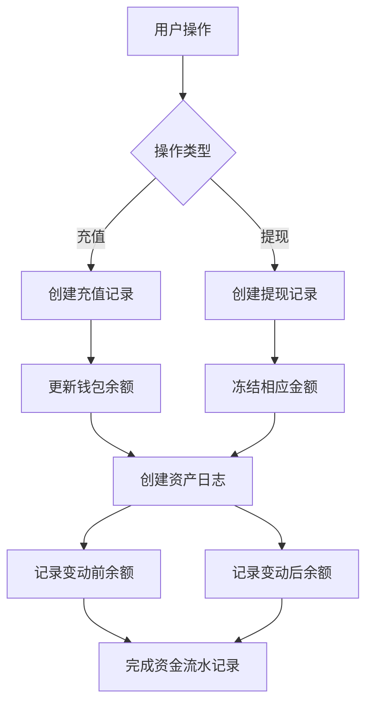
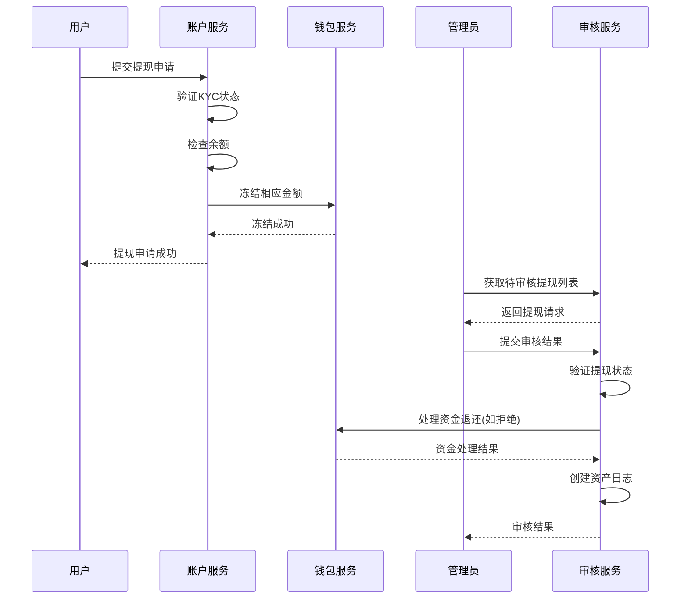
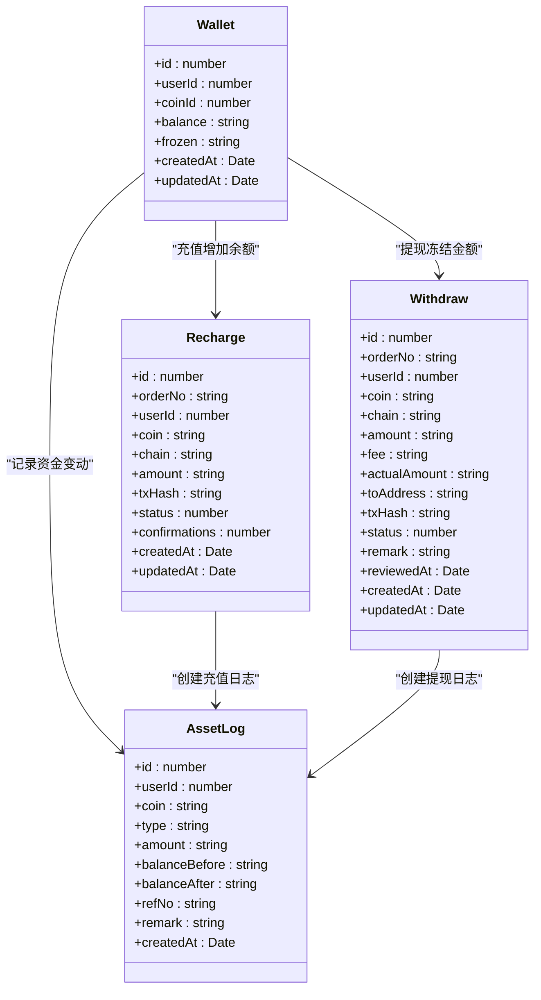

# 充值提现

<cite>
**本文档引用的文件**  
- [recharge.entity.ts](file://agx-backend/src/entities/recharge.entity.ts)
- [withdraw.entity.ts](file://agx-backend/src/entities/withdraw.entity.ts)
- [wallet.entity.ts](file://agx-backend/src/entities/wallet.entity.ts)
- [asset-log.entity.ts](file://agx-backend/src/entities/asset-log.entity.ts)
- [account.service.ts](file://agx-backend/src/modules/account/account.service.ts)
- [admin.service.ts](file://agx-backend/src/modules/admin/admin.service.ts)
</cite>

## 目录
1. [介绍](#介绍)
2. [充值实体模型](#充值实体模型)
3. [提现实体模型](#提现实体模型)
4. [资金流水对账机制](#资金流水对账机制)
5. [风控审核流程](#风控审核流程)
6. [资金安全处理与事务一致性](#资金安全处理与事务一致性)
7. [性能优化策略](#性能优化策略)

## 介绍
本文档详细描述了系统的充值提现模型，重点关注Recharge和Withdraw实体的设计与实现。文档涵盖了实体字段定义、状态转换流程、资金流水对账机制、风控审核流程以及资金安全处理等核心内容。通过分析相关实体和业务逻辑，为开发人员和系统维护者提供全面的技术参考。

## 充值实体模型

充值实体（Recharge）用于记录用户的充值交易信息，包含以下关键字段：

- **rechargeId**: 充值记录的唯一标识符，对应数据库中的`id`字段，类型为`bigint`，自动生成
- **orderNo**: 订单号，唯一标识一次充值交易，类型为`varchar(32)`
- **userId**: 用户ID，关联到用户实体，类型为`bigint`
- **amount**: 充值金额，使用`decimal(30,8)`类型确保高精度计算
- **currency**: 币种，存储在`coin`字段中，类型为`varchar(20)`
- **status**: 状态字段，表示充值的处理状态
- **transactionHash**: 交易哈希，对应`txHash`字段，用于区块链交易追踪

状态转换流程如下：
- **0 - 待确认**: 充值订单创建后的初始状态，等待区块链网络确认
- **1 - 已完成**: 区块链交易已确认，资金已成功入账
- **2 - 已失败**: 充值过程中出现错误，交易失败

此外，实体还包含`chain`字段表示链网络，`fromAddress`和`toAddress`分别记录交易的来源和目标地址，以及`confirmations`字段记录区块链确认数。

**Section sources**
- [recharge.entity.ts](file://agx-backend/src/entities/recharge.entity.ts#L1-L56)

## 提现实体模型

提现实体（Withdraw）用于记录用户的提现请求和处理过程，包含以下关键字段：

- **withdrawId**: 提现记录的唯一标识符，对应数据库中的`id`字段，类型为`bigint`，自动生成
- **userId**: 用户ID，关联到用户实体，类型为`bigint`
- **amount**: 提现金额，使用`decimal(30,8)`类型确保高精度计算
- **address**: 提现地址，对应`toAddress`字段，类型为`varchar(128)`
- **fee**: 手续费，使用`decimal(30,8)`类型存储
- **status**: 状态字段，表示提现的处理状态

状态转换流程如下：
- **0 - 待审核**: 提现请求创建后的初始状态，等待管理员审核
- **1 - 处理中**: 审核通过，正在处理提现
- **2 - 已完成**: 提现已完成，资金已转出
- **3 - 拒绝**: 提现请求被拒绝

实体还包含`actualAmount`字段表示实际到账金额（提现金额减去手续费），`txHash`字段记录链上交易哈希，以及`remark`字段用于存储审核备注。

**Section sources**
- [withdraw.entity.ts](file://agx-backend/src/entities/withdraw.entity.ts#L1-L62)

## 资金流水对账机制

系统通过资产日志实体（AssetLog）实现完整的资金流水对账机制。该机制记录所有资金变动，确保账务的可追溯性和一致性。

资产日志实体包含以下关键字段：
- **userId**: 用户ID，标识资金变动的主体
- **coin**: 币种，记录变动的资产类型
- **type**: 变动类型，包括`recharge`（充值）、`withdraw`（提现）等
- **amount**: 变动金额，正值表示增加，负值表示减少
- **balanceBefore**: 变动前余额
- **balanceAfter**: 变动后余额
- **refNo**: 关联单号，链接到具体的充值或提现订单
- **createdAt**: 变动时间

当用户进行充值时，系统会创建相应的资产日志记录，类型为`recharge`；当用户申请提现时，会创建类型为`withdraw`的日志记录。在提现被拒绝时，系统会创建`withdraw_refund`类型的日志记录，记录资金退还过程。

**Diagram sources**
- [asset-log.entity.ts](file://agx-backend/src/entities/asset-log.entity.ts#L1-L48)
- [wallet.entity.ts](file://agx-backend/src/entities/wallet.entity.ts#L1-L41)

**Section sources**
- [asset-log.entity.ts](file://agx-backend/src/entities/asset-log.entity.ts#L1-L48)

## 风控审核流程

系统的风控审核流程主要针对提现操作，确保资金安全和合规性。流程包括以下几个关键步骤：

1. **KYC验证**: 用户必须完成实名认证（KYC）才能进行提现操作
2. **余额检查**: 验证用户钱包余额是否足够覆盖提现金额
3. **管理员审核**: 提现请求需要管理员审核才能继续处理
4. **拒绝处理**: 如果提现被拒绝，系统会自动解冻并退还资金

在`account.service.ts`中，`withdraw`方法实现了提现申请的业务逻辑，包括KYC状态检查和余额验证。在`admin.service.ts`中，`reviewWithdraw`方法处理管理员的审核操作。

当管理员拒绝提现请求时，系统会执行以下操作：
- 更新提现记录状态为"拒绝"
- 解冻用户钱包中相应的冻结金额
- 将资金退还到用户可用余额
- 创建资产日志记录退款过程

**Diagram sources**
- [account.service.ts](file://agx-backend/src/modules/account/account.service.ts#L433-L492)
- [admin.service.ts](file://agx-backend/src/modules/admin/admin.service.ts#L945-L1006)

**Section sources**
- [account.service.ts](file://agx-backend/src/modules/account/account.service.ts#L433-L492)
- [admin.service.ts](file://agx-backend/src/modules/admin/admin.service.ts#L945-L1006)

## 资金安全处理与事务一致性

系统通过多种机制确保资金处理的安全性和数据一致性。核心机制包括：

1. **钱包余额管理**: 使用`wallet`实体管理用户资产，包含`balance`（可用余额）和`frozen`（冻结余额）两个关键字段
2. **原子性操作**: 在处理资金变动时，确保余额更新和日志记录的原子性
3. **精度控制**: 使用`decimal`类型存储金额，避免浮点数计算误差

在提现申请过程中，系统会立即冻结相应金额，防止用户重复提现。当提现被拒绝时，系统会解冻并退还资金，确保用户资产安全。

代码示例展示了如何通过精确的金额计算和状态管理来保证资金一致性：

**Diagram sources**
- [wallet.entity.ts](file://agx-backend/src/entities/wallet.entity.ts#L1-L41)
- [recharge.entity.ts](file://agx-backend/src/entities/recharge.entity.ts#L1-L56)
- [withdraw.entity.ts](file://agx-backend/src/entities/withdraw.entity.ts#L1-L62)
- [asset-log.entity.ts](file://agx-backend/src/entities/asset-log.entity.ts#L1-L48)

**Section sources**
- [wallet.entity.ts](file://agx-backend/src/entities/wallet.entity.ts#L1-L41)

## 性能优化策略

系统采用了多种性能优化策略来提高充值提现功能的处理效率：

1. **异步处理队列**: 对于需要外部系统确认的充值操作，使用异步队列进行处理，避免阻塞主线程
2. **批量确认机制**: 支持批量处理充值确认，提高处理效率
3. **数据库索引优化**: 在关键字段上创建索引，如`userId`和`orderNo`，提高查询性能
4. **分页查询**: 对充值和提现记录列表采用分页查询，避免一次性加载大量数据

在`admin.service.ts`中，`getRechargeList`和`getWithdrawList`方法实现了分页查询功能，支持按状态、关键词和用户ID进行过滤。这些方法使用TypeORM的查询构建器来优化数据库查询性能。

此外，系统还实现了手动充值功能，允许管理员在特殊情况下快速处理充值请求，这在处理异常情况时提供了灵活性。

**Section sources**
- [admin.service.ts](file://agx-backend/src/modules/admin/admin.service.ts#L619-L736)