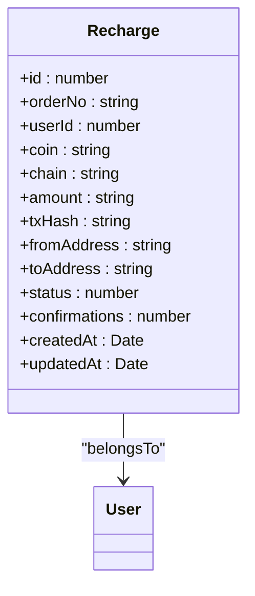
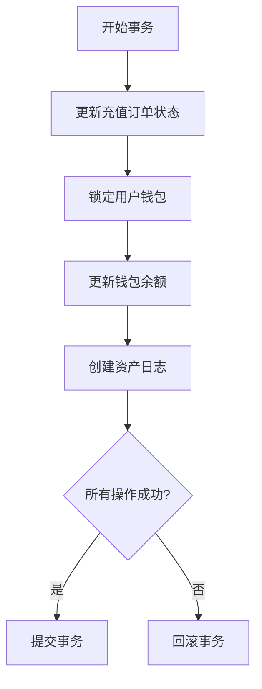
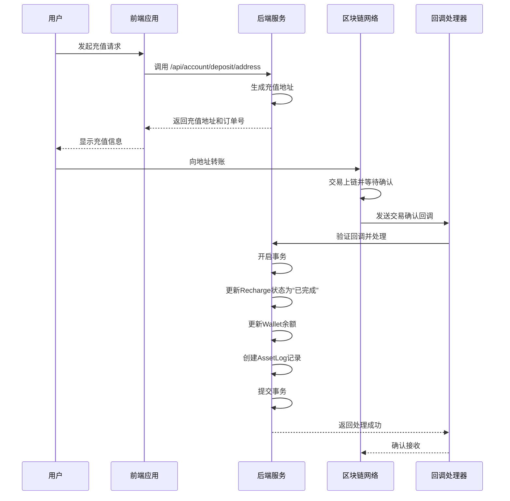

# 充值流程

<cite>
**本文档引用的文件**   
- [recharge.entity.ts](file://agx-backend/src/entities/recharge.entity.ts)
- [account.service.ts](file://agx-backend/src/modules/account/account.service.ts)
- [wallet.entity.ts](file://agx-backend/src/entities/wallet.entity.ts)
- [asset-log.entity.ts](file://agx-backend/src/entities/asset-log.entity.ts)
- [admin.service.ts](file://agx-backend/src/modules/admin/admin.service.ts)
</cite>

## 目录
1. [简介](#简介)
2. [充值流程概览](#充值流程概览)
3. [Recharge实体与状态机](#recharge实体与状态机)
4. [充值处理核心逻辑](#充值处理核心逻辑)
5. [数据库事务与资金一致性](#数据库事务与资金一致性)
6. [幂等性与重复回调防护](#幂等性与重复回调防护)
7. [异常处理策略](#异常处理策略)
8. [流程图与时序图](#流程图与时序图)

## 简介
本文档详细描述了系统中充值功能的完整实现流程。从用户发起充值请求开始，到生成充值订单、处理第三方支付回调、更新订单状态和用户余额，整个过程都进行了深入分析。文档重点阐述了`Recharge`实体中`status`字段的状态机转换逻辑，以及如何通过数据库事务保证资金操作的一致性。同时，文档还涵盖了`account.service.ts`中的核心充值处理方法，解释了其幂等性设计和重复回调防护机制，并介绍了超时未支付自动关闭订单、重复交易检测等异常处理策略。

## 充值流程概览
充值流程是用户向平台账户增加资金的核心功能。整个流程始于用户在前端界面发起充值请求，系统随后生成唯一的充值订单。用户根据订单信息向指定的区块链地址转账。当系统检测到链上交易并达到足够的确认数后，会通过回调机制更新订单状态，并最终将资金记入用户的账户余额。该流程涉及多个服务和数据实体的协同工作，确保了操作的安全性和数据的一致性。

**Section sources**
- [recharge.entity.ts](file://agx-backend/src/entities/recharge.entity.ts)
- [account.service.ts](file://agx-backend/src/modules/account/account.service.ts)

## Recharge实体与状态机
`Recharge`实体是整个充值流程的核心数据模型，它定义了充值订单的所有关键属性。该实体位于`agx-backend/src/entities/recharge.entity.ts`文件中。

**Diagram sources**
- [recharge.entity.ts](file://agx-backend/src/entities/recharge.entity.ts#L12-L56)

`status`字段是`Recharge`实体的状态机，它通过一个整数来表示订单的生命周期。根据代码中的注释，其状态转换逻辑如下：
- **0: 待确认 (Pending)** - 订单已创建，等待用户转账和链上确认。
- **1: 已完成 (Completed)** - 交易已成功确认，资金已记入用户账户。
- **2: 已失败 (Failed)** - 充值操作失败，可能由于超时、无效交易等原因。

状态机的转换是单向的，一旦订单状态变为“已完成”或“已失败”，则不可逆转。这种设计确保了业务逻辑的清晰和数据的稳定性。

**Section sources**
- [recharge.entity.ts](file://agx-backend/src/entities/recharge.entity.ts#L45-L46)

## 充值处理核心逻辑
充值处理的核心逻辑主要由`AccountService`类实现，该类位于`agx-backend/src/modules/account/account.service.ts`文件中。虽然该文件中没有直接的`createRechargeOrder`方法，但其`getDepositAddress`方法是流程的起点，为用户生成或提供充值所需的区块链地址。

当第三方支付系统（如区块链网络）检测到交易时，会调用系统的回调接口。虽然回调处理的具体方法未在当前分析的文件中直接体现，但可以推断其逻辑会遵循以下步骤：
1.  **验证回调**：验证回调请求的来源和签名，确保其合法性。
2.  **查找订单**：根据交易哈希（txHash）或订单号（orderNo）查找对应的`Recharge`记录。
3.  **更新状态**：如果交易有效且确认数足够，则将订单的`status`从0更新为1。
4.  **更新余额**：调用资金处理逻辑，增加用户钱包余额。

**Section sources**
- [account.service.ts](file://agx-backend/src/modules/account/account.service.ts#L374-L394)

## 数据库事务与资金一致性
为了保证资金操作的原子性，即“要么全部成功，要么全部失败”，系统在处理资金变动时必须使用数据库事务。虽然在`account.service.ts`中手动充值的逻辑（`manualRecharge`）直接操作了数据库，但完整的充值流程应当在一个事务中完成。

一个典型的事务流程如下：
1.  开始一个数据库事务。
2.  更新`Recharge`订单的状态为“已完成”。
3.  查询并锁定用户的`Wallet`记录。
4.  更新`Wallet`的余额（`balance`）。
5.  创建一条`AssetLog`记录，用于审计资金变动。
6.  提交事务。如果任何一步失败，则回滚整个事务。

`AssetLog`实体（位于`agx-backend/src/entities/asset-log.entity.ts`）是保证资金一致性的关键，它记录了每一次余额变动的详情，包括变动前后的余额，从而可以追溯任何资金流动。

**Diagram sources**
- [wallet.entity.ts](file://agx-backend/src/entities/wallet.entity.ts#L13-L42)
- [asset-log.entity.ts](file://agx-backend/src/entities/asset-log.entity.ts#L12-L48)

## 幂等性与重复回调防护
幂等性是支付系统的核心要求，它确保了即使第三方支付系统重复发送回调通知，用户的账户余额也只会被增加一次，避免了重复充值的风险。

实现幂等性的关键在于：
1.  **唯一订单号**：每个`Recharge`订单都有一个全局唯一的`orderNo`，这是防止重复处理的基石。
2.  **状态检查**：在处理回调时，首先检查订单的当前`status`。如果状态已经是“已完成”或“已失败”，则直接返回成功，不再执行资金变动逻辑。
3.  **数据库约束**：利用数据库的唯一约束（如`orderNo`的唯一性）来防止意外的重复记录。

通过这些机制，系统能够安全地处理网络抖动或第三方系统重试导致的重复回调。

**Section sources**
- [recharge.entity.ts](file://agx-backend/src/entities/recharge.entity.ts#L17-L18)
- [account.service.ts](file://agx-backend/src/modules/account/account.service.ts)

## 异常处理策略
系统设计了多种异常处理策略来应对各种边界情况：
- **超时未支付自动关闭**：系统应有一个后台任务（Cron Job）定期扫描长时间处于“待确认”状态的订单。如果超过预设的超时时间（例如24小时），则将订单状态更新为“已失败”，并释放相关资源。
- **重复交易检测**：虽然区块链交易本身是唯一的，但系统仍需检测同一用户是否对同一订单进行了多次转账。这可以通过检查`txHash`的唯一性或在业务逻辑中进行判断来实现。
- **无效地址转账**：对于转账到错误地址的交易，系统无法自动处理，通常需要人工介入进行核对和处理。

**Section sources**
- [admin.service.ts](file://agx-backend/src/modules/admin/admin.service.ts#L836-L849)

## 流程图与时序图

**Diagram sources**
- [account.service.ts](file://agx-backend/src/modules/account/account.service.ts)
- [recharge.entity.ts](file://agx-backend/src/entities/recharge.entity.ts)
- [wallet.entity.ts](file://agx-backend/src/entities/wallet.entity.ts)
- [asset-log.entity.ts](file://agx-backend/src/entities/asset-log.entity.ts)