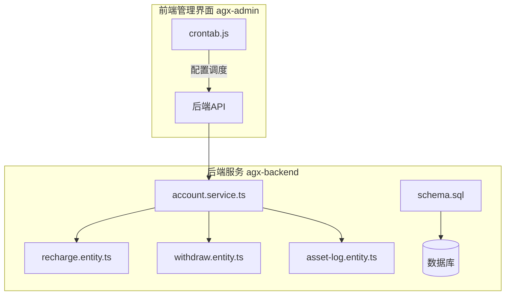
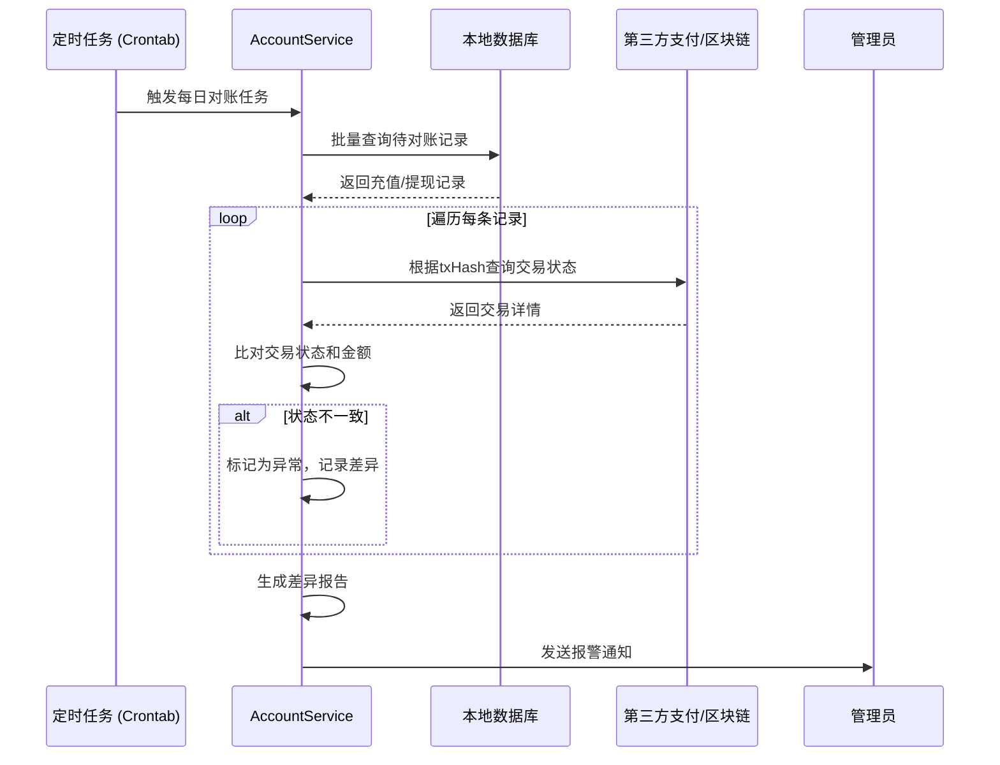
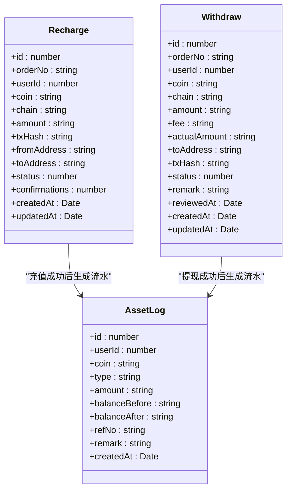
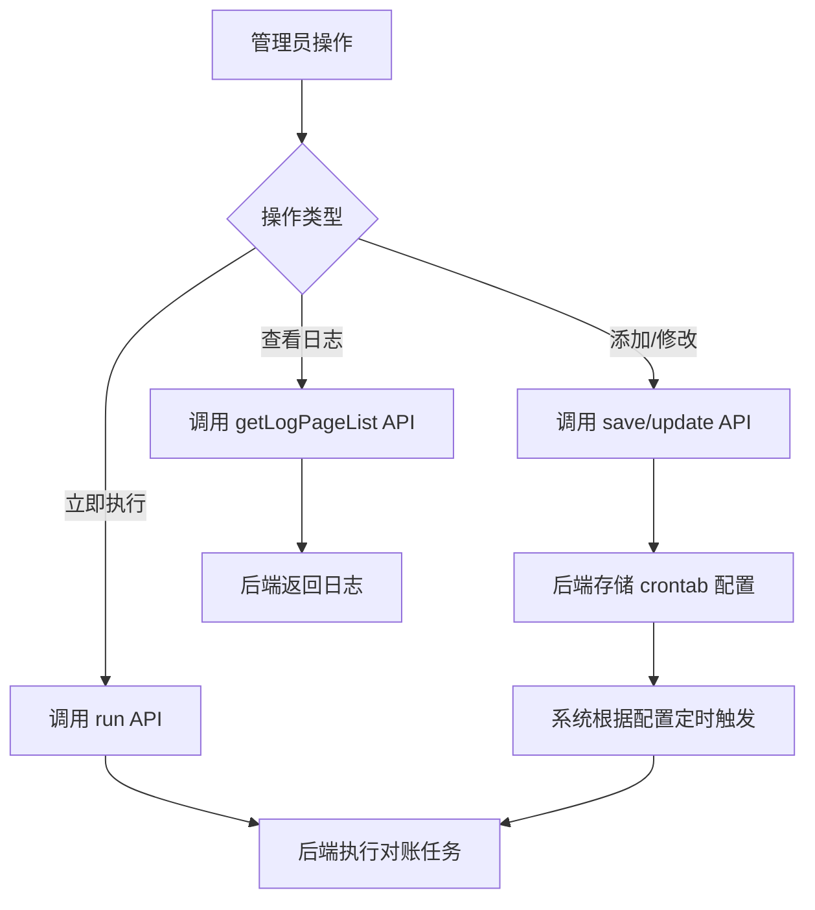
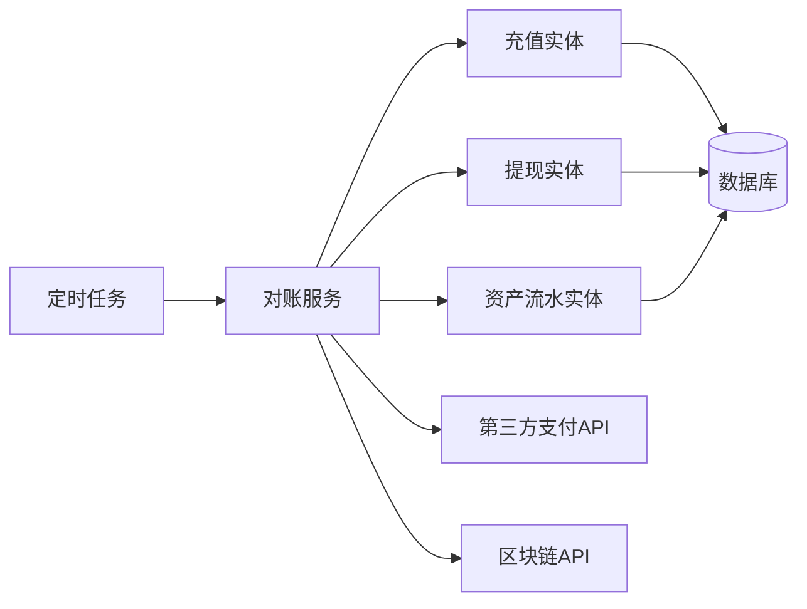

# 对账机制

<cite>
**本文档引用的文件**  
- [account.service.ts](file://agx-backend/src/modules/account/account.service.ts)
- [recharge.entity.ts](file://agx-backend/src/entities/recharge.entity.ts)
- [withdraw.entity.ts](file://agx-backend/src/entities/withdraw.entity.ts)
- [asset-log.entity.ts](file://agx-backend/src/entities/asset-log.entity.ts)
- [crontab.js](file://agx-admin/src/api/setting/crontab.js)
- [schema.sql](file://agx-backend/schema.sql)
</cite>

## 目录
1. [引言](#引言)
2. [项目结构](#项目结构)
3. [核心组件](#核心组件)
4. [架构概述](#架构概述)
5. [详细组件分析](#详细组件分析)
6. [依赖分析](#依赖分析)
7. [性能考虑](#性能考虑)
8. [故障排除指南](#故障排除指南)
9. [结论](#结论)

## 引言
本技术文档详细阐述了系统中的对账机制，重点聚焦于资金流水的完整性校验和差异处理。文档解释了系统如何通过 transactionHash 与第三方支付平台或区块链网络进行每日对账，识别挂起交易和异常订单。同时，描述了对账任务的定时调度实现，以及如何标记不一致的记录供人工干预。

## 项目结构
该对账机制主要分布在后端服务（agx-backend）中，核心逻辑位于 `account` 模块。相关的数据实体定义在 `entities` 目录下，而定时任务的配置和管理则通过前端管理界面（agx-admin）的设置模块进行。

**Diagram sources**
- [account.service.ts](file://agx-backend/src/modules/account/account.service.ts)
- [recharge.entity.ts](file://agx-backend/src/entities/recharge.entity.ts)
- [withdraw.entity.ts](file://agx-backend/src/entities/withdraw.entity.ts)
- [asset-log.entity.ts](file://agx-backend/src/entities/asset-log.entity.ts)
- [crontab.js](file://agx-admin/src/api/setting/crontab.js)
- [schema.sql](file://agx-backend/schema.sql)

**Section sources**
- [account.service.ts](file://agx-backend/src/modules/account/account.service.ts)
- [crontab.js](file://agx-admin/src/api/setting/crontab.js)
- [schema.sql](file://agx-backend/schema.sql)

## 核心组件
对账机制的核心组件包括：
- **Recharge Entity (充值实体)**: 存储用户充值记录，包含交易哈希(txHash)、金额、状态等关键信息。
- **Withdraw Entity (提现实体)**: 存储用户提现记录，同样包含交易哈希(txHash)用于对账。
- **AssetLog Entity (资产流水实体)**: 记录所有资产变动的明细，是核对账目一致性的关键依据。
- **AccountService (账户服务)**: 包含对账逻辑的核心实现，负责与外部系统交互、比对数据和处理差异。
- **Crontab (定时任务)**: 负责调度每日对账任务的执行。

**Section sources**
- [recharge.entity.ts](file://agx-backend/src/entities/recharge.entity.ts#L1-L56)
- [withdraw.entity.ts](file://agx-backend/src/entities/withdraw.entity.ts#L1-L63)
- [asset-log.entity.ts](file://agx-backend/src/entities/asset-log.entity.ts#L1-L49)
- [account.service.ts](file://agx-backend/src/modules/account/account.service.ts#L1-L606)
- [crontab.js](file://agx-admin/src/api/setting/crontab.js#L1-L100)

## 架构概述
系统的对账流程是一个定时驱动的批处理过程。每日，系统会通过定时任务触发对账服务，该服务会批量查询本地数据库中的充值和提现记录，并与第三方支付平台或区块链网络上的交易数据进行哈希比对。任何状态不一致或缺少交易哈希的记录都会被标记为异常，并生成差异报告。

**Diagram sources**
- [account.service.ts](file://agx-backend/src/modules/account/account.service.ts)
- [recharge.entity.ts](file://agx-backend/src/entities/recharge.entity.ts)
- [withdraw.entity.ts](file://agx-backend/src/entities/withdraw.entity.ts)

## 详细组件分析

### 对账核心逻辑分析
`account.service.ts` 文件中的服务负责实现对账的核心逻辑。虽然文件中未直接展示对账方法，但其数据结构和相关操作为对账提供了基础。

#### 对账数据实体

**Diagram sources**
- [recharge.entity.ts](file://agx-backend/src/entities/recharge.entity.ts#L12-L56)
- [withdraw.entity.ts](file://agx-backend/src/entities/withdraw.entity.ts#L12-L63)
- [asset-log.entity.ts](file://agx-backend/src/entities/asset-log.entity.ts#L12-L49)

**Section sources**
- [recharge.entity.ts](file://agx-backend/src/entities/recharge.entity.ts#L1-L56)
- [withdraw.entity.ts](file://agx-backend/src/entities/withdraw.entity.ts#L1-L63)
- [asset-log.entity.ts](file://agx-backend/src/entities/asset-log.entity.ts#L1-L49)

### 定时任务调度分析
对账任务的调度是通过前端管理界面的 crontab 模块进行配置的。`crontab.js` 文件定义了与后端交互的 API，允许管理员添加、删除、修改和执行定时任务。

**Diagram sources**
- [crontab.js](file://agx-admin/src/api/setting/crontab.js)

**Section sources**
- [crontab.js](file://agx-admin/src/api/setting/crontab.js#L1-L100)

## 依赖分析
对账机制依赖于多个组件和外部系统：
- **内部依赖**: `account.service.ts` 依赖于 `recharge.entity.ts`、`withdraw.entity.ts` 和 `asset-log.entity.ts` 来获取和操作数据。
- **外部依赖**: 对账服务需要依赖第三方支付平台或区块链网络的 API 来查询交易状态。
- **基础设施依赖**: 依赖数据库存储所有交易和流水记录，依赖定时任务调度器（如 crontab）来触发对账流程。

**Diagram sources**
- [account.service.ts](file://agx-backend/src/modules/account/account.service.ts)
- [recharge.entity.ts](file://agx-backend/src/entities/recharge.entity.ts)
- [withdraw.entity.ts](file://agx-backend/src/entities/withdraw.entity.ts)
- [asset-log.entity.ts](file://agx-backend/src/entities/asset-log.entity.ts)

**Section sources**
- [account.service.ts](file://agx-backend/src/modules/account/account.service.ts#L1-L606)
- [recharge.entity.ts](file://agx-backend/src/entities/recharge.entity.ts#L1-L56)
- [withdraw.entity.ts](file://agx-backend/src/entities/withdraw.entity.ts#L1-L63)
- [asset-log.entity.ts](file://agx-backend/src/entities/asset-log.entity.ts#L1-L49)

## 性能考虑
- **批量处理**: 对账应采用批量查询和处理的方式，避免对每条记录都进行单独的数据库和网络请求，以提高效率。
- **索引优化**: 数据库表（如 `agx_recharge`, `agx_withdraw`）应为 `txHash`、`status` 和 `createdAt` 等常用查询字段建立索引。
- **重试策略**: 对于网络请求失败的情况，应实现指数退避等重试策略，避免因短暂故障导致对账失败。
- **异步处理**: 对账任务本身应设计为异步任务，避免阻塞主应用流程。

## 故障排除指南
当对账失败或出现差异时，可按以下步骤进行排查：
1.  **检查日志**: 首先查看对账任务的执行日志，确认是网络问题、数据不一致还是代码异常。
2.  **验证交易哈希**: 检查本地数据库中 `txHash` 为空或无效的记录，这些通常是挂起或失败的交易。
3.  **手动核对**: 对于标记为异常的记录，手动在第三方平台或区块链浏览器上查询该 `txHash` 的真实状态。
4.  **检查网络连接**: 确认服务器与第三方API的网络连接正常，防火墙规则是否正确。
5.  **审查代码**: 如果是逻辑错误，需要审查 `account.service.ts` 中的相关对账逻辑。

**Section sources**
- [account.service.ts](file://agx-backend/src/modules/account/account.service.ts#L1-L606)
- [recharge.entity.ts](file://agx-backend/src/entities/recharge.entity.ts#L1-L56)
- [withdraw.entity.ts](file://agx-backend/src/entities/withdraw.entity.ts#L1-L63)

## 结论
该系统的对账机制通过结合数据库实体、服务逻辑和定时任务，构建了一个完整的财务数据校验流程。通过 transactionHash 与外部系统进行比对，能够有效识别资金流水中的不一致情况。完善的定时调度和报警机制确保了财务数据的准确性和及时性，为系统的稳定运行提供了重要保障。