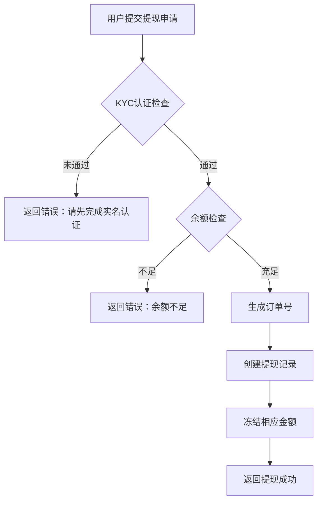
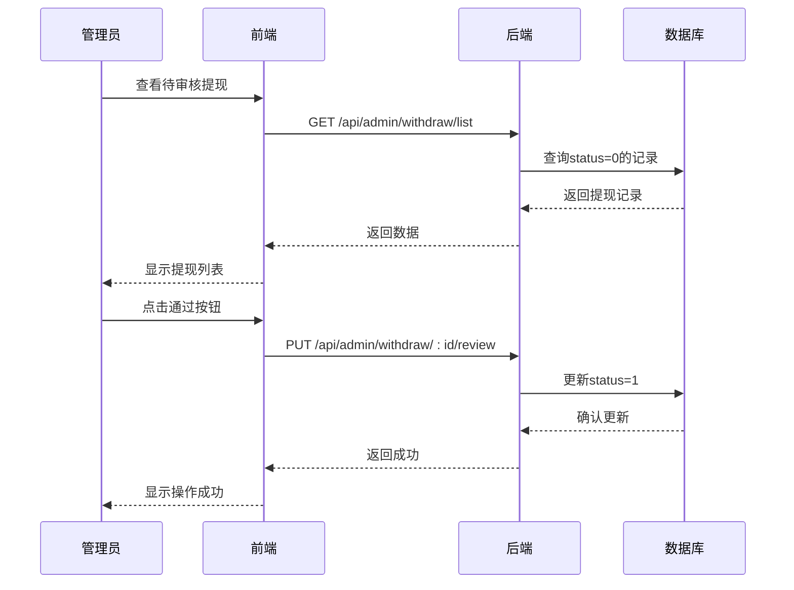
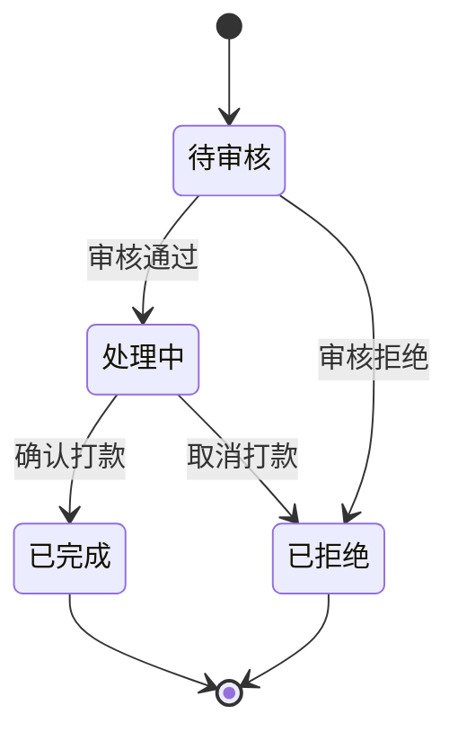

# 提现流程

<cite>
**本文档引用文件**   
- [withdraw.entity.ts](file://agx-backend/src/entities/withdraw.entity.ts)
- [account.service.ts](file://agx-backend/src/modules/account/account.service.ts)
- [account.controller.ts](file://agx-backend/src/modules/account/account.controller.ts)
- [account.dto.ts](file://agx-backend/src/modules/account/account.dto.ts)
- [admin.service.ts](file://agx-backend/src/modules/admin/admin.service.ts)
- [admin.controller.ts](file://agx-backend/src/modules/admin/admin.controller.ts)
- [withdraw.vue](file://agx-admin/src/views/agx/withdraw.vue)
- [wallet.entity.ts](file://agx-backend/src/entities/wallet.entity.ts)
</cite>

## 目录
1. [提现流程概述](#提现流程概述)
2. [Withdraw实体分析](#withdraw实体分析)
3. [提现申请处理流程](#提现申请处理流程)
4. [多级审核机制](#多级审核机制)
5. [状态流转与转换图](#状态流转与转换图)
6. [安全防护措施](#安全防护措施)
7. [错误码说明](#错误码说明)

## 提现流程概述

提现流程是系统中用户将数字资产从平台转移到外部钱包的核心功能。该流程涵盖了用户提交提现申请、风控规则校验、多级审核机制、区块链转账执行和状态同步等关键环节。整个流程设计注重安全性、可靠性和用户体验，通过多层次的验证和审核机制确保资金安全。

**Section sources**
- [withdraw.entity.ts](file://agx-backend/src/entities/withdraw.entity.ts)
- [account.service.ts](file://agx-backend/src/modules/account/account.service.ts)

## Withdraw实体分析

Withdraw实体是提现流程的核心数据模型，定义了提现记录的所有属性和关系。

### fee字段计算逻辑

在`account.service.ts`中，提现手续费的计算采用固定比例方式：
- 手续费率：1%
- 计算公式：`fee = amount × 0.01`
- 精度处理：结果保留8位小数，使用`toFixed(8)`方法
- 实际到账金额：`actualAmount = amount - fee`

该计算在用户提交提现申请时即时完成，并存储在数据库中。

### address字段格式验证

address字段的格式验证主要在前端和后端共同完成：
- 前端：在用户输入时进行基本格式检查
- 后端：通过DTO验证确保字段不为空且符合字符串格式要求
- 区块链网络特定验证：根据不同的链网络（如TRC20、ERC20等）进行地址格式校验

### 实体属性说明

Withdraw实体包含以下关键字段：
- `orderNo`: 订单号，唯一标识
- `userId`: 用户ID，关联用户实体
- `coin`: 币种
- `chain`: 链网络
- `amount`: 提现金额
- `fee`: 手续费
- `actualAmount`: 实际到账金额
- `toAddress`: 提现地址
- `txHash`: 交易哈希
- `status`: 状态（0待审核 1处理中 2已完成 3拒绝）
- `remark`: 审核备注
- `reviewedAt`: 审核时间

**Section sources**
- [withdraw.entity.ts](file://agx-backend/src/entities/withdraw.entity.ts#L1-L63)
- [account.service.ts](file://agx-backend/src/modules/account/account.service.ts#L456-L458)

## 提现申请处理流程

提现申请处理流程由前端界面、API控制器和服务层协同完成。

### 用户提交提现申请

用户通过前端界面提交提现申请，包含以下信息：
- 币种（coin）
- 链网络（chain）
- 提现金额（amount）
- 提现地址（address）
- 支付密码（payPassword，可选）

### 风控规则校验

在`account.service.ts`的`withdraw`方法中，系统执行以下风控校验：
1. **KYC认证检查**：用户必须完成实名认证（kycStatus = 2）
2. **余额检查**：钱包余额必须大于等于提现金额
3. **最小提现金额**：根据币种配置的最小提现限额
4. **最大提现金额**：根据币种配置的最大提现限额
5. **IP限制**：记录请求IP用于风险分析

### 资金处理逻辑

当提现申请通过校验后，系统执行以下操作：
1. 生成唯一订单号
2. 创建提现记录
3. 冻结相应金额：
   - 减少可用余额
   - 增加冻结余额
4. 记录资产流水

**Diagram sources **
- [account.service.ts](file://agx-backend/src/modules/account/account.service.ts#L433-L492)
- [wallet.entity.ts](file://agx-backend/src/entities/wallet.entity.ts#L30-L34)

**Section sources**
- [account.service.ts](file://agx-backend/src/modules/account/account.service.ts#L433-L492)
- [account.dto.ts](file://agx-backend/src/modules/account/account.dto.ts#L73-L89)

## 多级审核机制

系统实现了多级审核机制，确保提现操作的安全性和合规性。

### 审核流程

1. **一级审核**：普通管理员进行初步审核
2. **二级审核**：高级管理员进行复核
3. **最终确认**：财务人员确认打款

### 审核操作

在`admin.service.ts`中，`reviewWithdraw`方法处理审核逻辑：
- 只有状态为"待审核"（0）的提现记录才能被处理
- 审核通过：状态变为"处理中"（1）
- 审核拒绝：状态变为"已拒绝"（2），并退还冻结金额
- 打款确认：状态变为"已完成"（3）

### 前端审核界面

`withdraw.vue`文件实现了管理员审核界面，包含：
- 提现记录列表
- 搜索和筛选功能
- 通过/拒绝操作按钮
- 拒绝原因输入框
- 分页功能

**Diagram sources **
- [admin.service.ts](file://agx-backend/src/modules/admin/admin.service.ts#L945-L1006)
- [admin.controller.ts](file://agx-backend/src/modules/admin/admin.controller.ts#L240-L246)
- [withdraw.vue](file://agx-admin/src/views/agx/withdraw.vue#L123-L129)

**Section sources**
- [admin.service.ts](file://agx-backend/src/modules/admin/admin.service.ts#L945-L1006)
- [withdraw.vue](file://agx-admin/src/views/agx/withdraw.vue#L1-L172)

## 状态流转与转换图

提现记录的状态在生命周期中经历多个阶段的转换。

### 状态定义

根据`withdraw.entity.ts`中的注释，状态码定义如下：
- 0：待审核
- 1：处理中
- 2：已完成
- 3：已拒绝

### 状态流转规则

- 待审核 → 处理中：审核通过
- 待审核 → 已拒绝：审核拒绝
- 处理中 → 已完成：确认打款
- 处理中 → 已拒绝：发现异常取消打款

**Diagram sources **
- [withdraw.entity.ts](file://agx-backend/src/entities/withdraw.entity.ts#L48-L49)

**Section sources**
- [withdraw.entity.ts](file://agx-backend/src/entities/withdraw.entity.ts#L48-L49)
- [admin.service.ts](file://agx-backend/src/modules/admin/admin.service.ts#L956-L957)

## 安全防护措施

系统实施了多层次的安全防护措施，确保提现流程的安全性。

### 二次验证

- 支付密码验证：在提交大额提现时要求输入支付密码
- 短信验证码：关键操作需要短信验证
- Google Authenticator：支持双因素认证

### IP限制

- 记录用户登录和操作的IP地址
- 异常IP登录触发安全警告
- 多地点登录检测

### 大额提现延迟到账

- 大额提现（超过设定阈值）自动进入延迟处理队列
- 需要额外的人工审核
- 分批次打款以降低风险

### 其他安全措施

- 操作日志记录：所有审核操作都被详细记录
- 权限控制：不同级别管理员有不同的操作权限
- 交易哈希验证：确保区块链交易的真实性
- 余额双重检查：在打款前再次验证余额

**Section sources**
- [account.service.ts](file://agx-backend/src/modules/account/account.service.ts#L440-L442)
- [admin.service.ts](file://agx-backend/src/modules/admin/admin.service.ts#L994-L1002)

## 错误码说明

系统定义了详细的错误码，便于问题定位和用户提示。

| 错误码 | 错误信息 | 说明 |
|--------|--------|------|
| 6001 | 提现记录不存在 | 请求的提现记录ID不存在 |
| 6002 | 该提现订单已处理 | 提现订单状态不是待审核 |
| 6003 | 钱包不存在 | 用户的钱包记录未找到 |
| 6004 | 余额不足 | 钱包余额小于提现金额 |
| 6005 | 请先完成实名认证 | 用户未通过KYC认证 |

这些错误码在`business.exception.ts`中定义，并在服务层抛出相应的业务异常。

**Section sources**
- [business.exception.ts](file://agx-backend/src/common/filters/business.exception.ts)
- [account.service.ts](file://agx-backend/src/modules/account/account.service.ts#L440-L442)