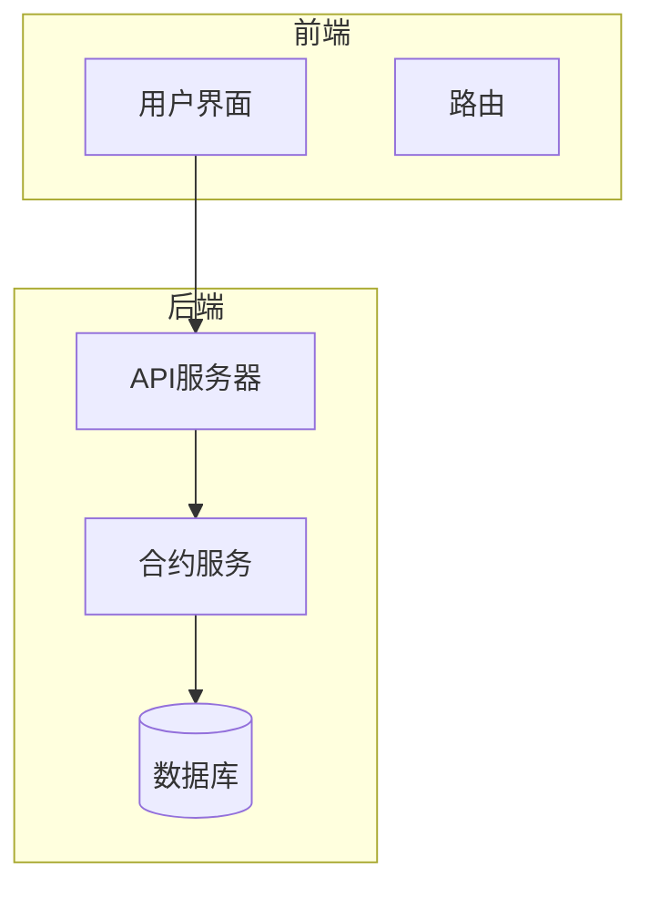
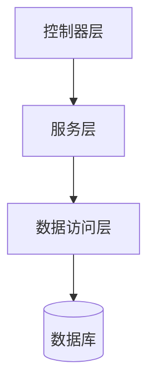
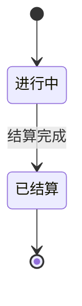
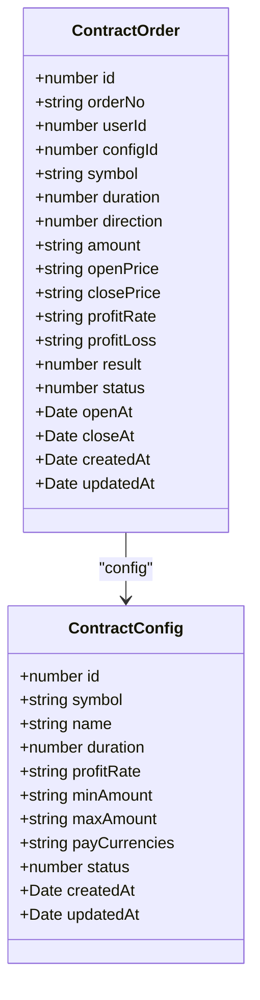
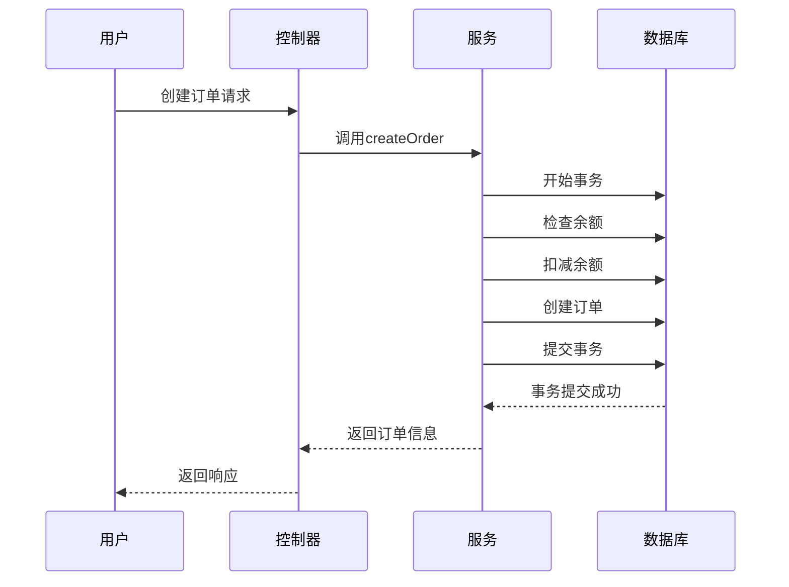
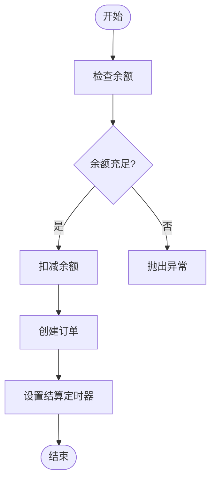
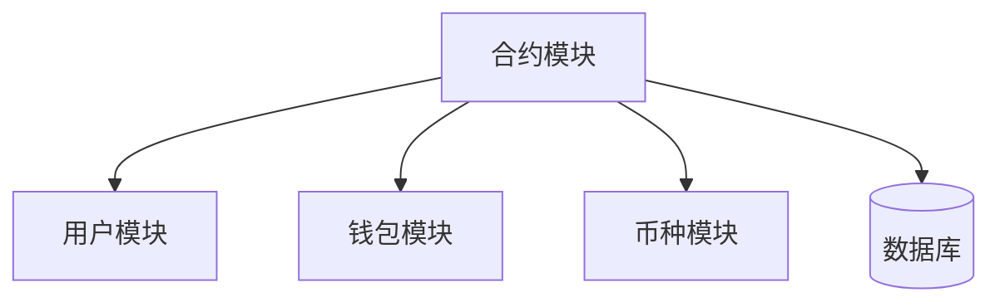

# 合约交易

<cite>
**本文档引用的文件**   
- [contract-order.entity.ts](file://agx-backend/src/entities/contract-order.entity.ts)
- [contract-config.entity.ts](file://agx-backend/src/entities/contract-config.entity.ts)
- [contract.service.ts](file://agx-backend/src/modules/contract/contract.service.ts)
- [contract.controller.ts](file://agx-backend/src/modules/contract/contract.controller.ts)
- [contract.dto.ts](file://agx-backend/src/modules/contract/contract.dto.ts)
- [user.entity.ts](file://agx-backend/src/entities/user.entity.ts)
- [wallet.entity.ts](file://agx-backend/src/entities/wallet.entity.ts)
- [coin.entity.ts](file://agx-backend/src/entities/coin.entity.ts)
- [schema.sql](file://agx-backend/schema.sql)
- [admin.service.ts](file://agx-backend/src/modules/admin/admin.service.ts)
</cite>

## 目录
1. [引言](#引言)
2. [项目结构](#项目结构)
3. [核心组件](#核心组件)
4. [架构概述](#架构概述)
5. [详细组件分析](#详细组件分析)
6. [依赖分析](#依赖分析)
7. [性能考虑](#性能考虑)
8. [故障排除指南](#故障排除指南)
9. [结论](#结论)

## 引言
本文档详细描述了合约交易系统的模型，重点关注合约订单和合约配置实体。文档涵盖了合约订单的生命周期管理、风险控制机制、保证金计算公式以及交易事务处理的代码示例。同时提供了合约交易查询性能优化策略，包括分库分表设计和历史订单归档方案。

## 项目结构
合约交易系统主要由后端服务和前端管理界面组成。后端服务采用NestJS框架，包含合约模块、用户模块、钱包模块等。前端管理界面采用Vue.js框架，提供合约配置、订单管理等功能。



**图表来源**
- [contract.controller.ts](file://agx-backend/src/modules/contract/contract.controller.ts#L7-L44)
- [contract.service.ts](file://agx-backend/src/modules/contract/contract.service.ts#L10-L282)

**章节来源**
- [contract.controller.ts](file://agx-backend/src/modules/contract/contract.controller.ts#L1-L44)
- [contract.service.ts](file://agx-backend/src/modules/contract/contract.service.ts#L1-L282)

## 核心组件
合约交易系统的核心组件包括合约订单实体、合约配置实体、合约服务和合约控制器。这些组件共同实现了合约交易的完整生命周期管理。

**章节来源**
- [contract-order.entity.ts](file://agx-backend/src/entities/contract-order.entity.ts#L1-L81)
- [contract-config.entity.ts](file://agx-backend/src/entities/contract-config.entity.ts#L1-L47)

## 架构概述
合约交易系统采用典型的分层架构，包括控制器层、服务层和数据访问层。控制器层处理HTTP请求，服务层实现业务逻辑，数据访问层负责与数据库交互。



**图表来源**
- [contract.controller.ts](file://agx-backend/src/modules/contract/contract.controller.ts#L7-L44)
- [contract.service.ts](file://agx-backend/src/modules/contract/contract.service.ts#L10-L282)
- [contract-order.entity.ts](file://agx-backend/src/entities/contract-order.entity.ts#L1-L81)

## 详细组件分析

### 合约订单实体分析
合约订单实体（ContractOrder）是系统的核心数据模型，用于存储用户的合约交易信息。

#### 字段定义
合约订单实体包含以下字段：

| 字段名 | 数据类型 | 描述 |
|--------|---------|------|
| id | number | 主键ID |
| orderNo | string | 订单号 |
| userId | number | 用户ID |
| configId | number | 配置ID |
| symbol | string | 交易对 |
| duration | number | 周期秒数 |
| direction | number | 方向：1看涨 2看跌 |
| amount | string | 下单金额 |
| openPrice | string | 开仓价 |
| closePrice | string | 平仓价 |
| profitRate | string | 收益率 |
| profitLoss | string | 盈亏金额 |
| result | number | 结果：1盈 2亏 3平 |
| status | number | 状态：0进行中 1已结算 |
| openAt | Date | 开仓时间 |
| closeAt | Date | 平仓时间 |
| createdAt | Date | 创建时间 |
| updatedAt | Date | 更新时间 |

#### 状态机转换
合约订单的状态机转换逻辑如下：



**图表来源**
- [contract-order.entity.ts](file://agx-backend/src/entities/contract-order.entity.ts#L65-L67)
- [contract.service.ts](file://agx-backend/src/modules/contract/contract.service.ts#L164-L219)

**章节来源**
- [contract-order.entity.ts](file://agx-backend/src/entities/contract-order.entity.ts#L1-L81)

### 合约配置实体分析
合约配置实体（ContractConfig）定义了合约交易的基本规则和参数。

#### 字段定义
合约配置实体包含以下字段：

| 字段名 | 数据类型 | 描述 |
|--------|---------|------|
| id | number | 主键ID |
| symbol | string | 交易对，如 XAU/USD |
| name | string | 名称 |
| duration | number | 周期秒数：30/60/120/300 |
| profitRate | string | 盈利收益率 |
| minAmount | string | 最小下单金额 |
| maxAmount | string | 最大下单金额 |
| payCurrencies | string | 支付币种: USDT,CNY |
| status | number | 状态 |

#### 关系分析
合约订单与合约配置实体之间存在多对一的关系，每个合约订单都关联一个合约配置。



**图表来源**
- [contract-order.entity.ts](file://agx-backend/src/entities/contract-order.entity.ts#L31-L36)
- [contract-config.entity.ts](file://agx-backend/src/entities/contract-config.entity.ts#L1-L47)

**章节来源**
- [contract-config.entity.ts](file://agx-backend/src/entities/contract-config.entity.ts#L1-L47)

### 交易事务处理分析
合约交易的事务处理确保了数据的一致性和完整性。

#### 交易流程
合约交易的完整流程如下：



**图表来源**
- [contract.service.ts](file://agx-backend/src/modules/contract/contract.service.ts#L105-L134)
- [contract.controller.ts](file://agx-backend/src/modules/contract/contract.controller.ts#L23-L29)

**章节来源**
- [contract.service.ts](file://agx-backend/src/modules/contract/contract.service.ts#L68-L158)

### 风险控制机制分析
系统实现了完善的风险控制机制，包括强平逻辑和保证金计算。

#### 保证金计算
保证金计算公式如下：



**图表来源**
- [contract.service.ts](file://agx-backend/src/modules/contract/contract.service.ts#L93-L113)
- [wallet.entity.ts](file://agx-backend/src/entities/wallet.entity.ts#L1-L42)

**章节来源**
- [contract.service.ts](file://agx-backend/src/modules/contract/contract.service.ts#L68-L158)

## 依赖分析
合约交易系统与其他模块存在明确的依赖关系。



**图表来源**
- [contract.module.ts](file://agx-backend/src/modules/contract/contract.module.ts#L7-L16)
- [contract.service.ts](file://agx-backend/src/modules/contract/contract.service.ts#L4-L21)

**章节来源**
- [contract.module.ts](file://agx-backend/src/modules/contract/contract.module.ts#L1-L16)

## 性能考虑
为提高查询性能，系统采用了以下优化策略：

1. **索引优化**：在常用查询字段上创建索引
2. **分页查询**：限制单次查询结果数量
3. **缓存机制**：缓存常用配置数据

```sql
-- 在合约订单表上创建索引
CREATE INDEX IF NOT EXISTS idx_order_user ON agx_contract_order(user_id);
CREATE INDEX IF NOT EXISTS idx_order_status ON agx_contract_order(status);
```

**章节来源**
- [schema.sql](file://agx-backend/schema.sql#L204-L206)
- [contract.service.ts](file://agx-backend/src/modules/contract/contract.service.ts#L236-L246)

## 故障排除指南
常见问题及解决方案：

1. **订单创建失败**：检查用户余额是否充足
2. **结算延迟**：检查定时任务是否正常运行
3. **查询性能低下**：检查索引是否已正确创建

**章节来源**
- [contract.service.ts](file://agx-backend/src/modules/contract/contract.service.ts#L73-L100)
- [admin.service.ts](file://agx-backend/src/modules/admin/admin.service.ts#L662-L696)

## 结论
本文档详细描述了合约交易系统的模型和实现。系统通过严谨的事务处理保证了数据的一致性，通过完善的风险控制机制保障了交易安全。未来可以考虑引入消息队列来优化结算流程，进一步提高系统的可扩展性和可靠性。