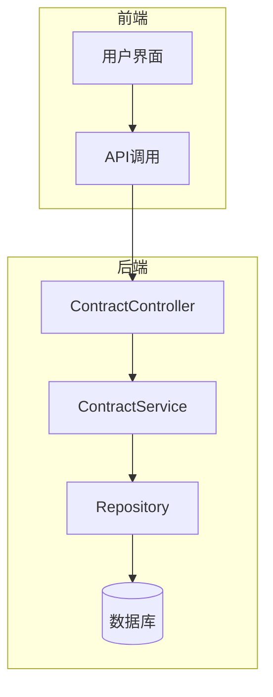
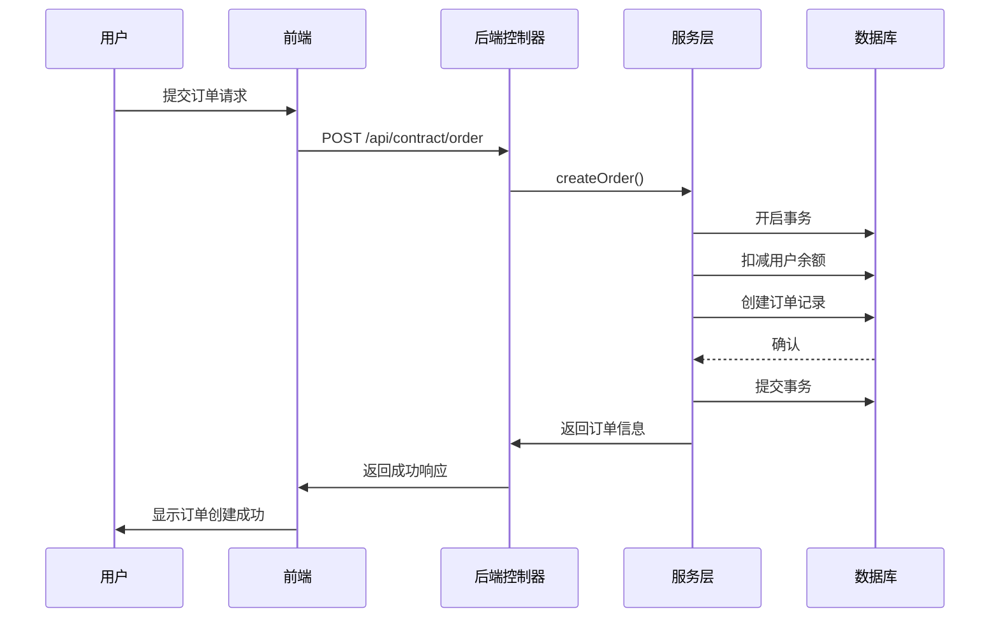
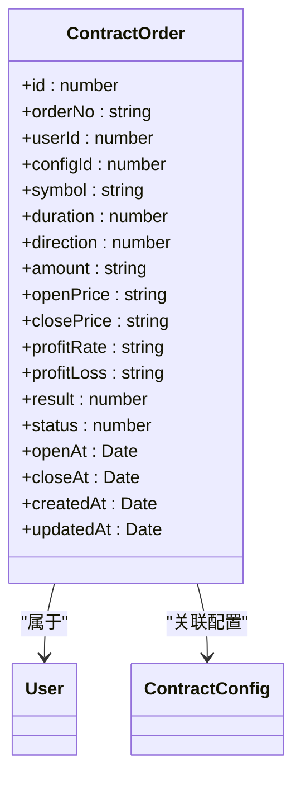
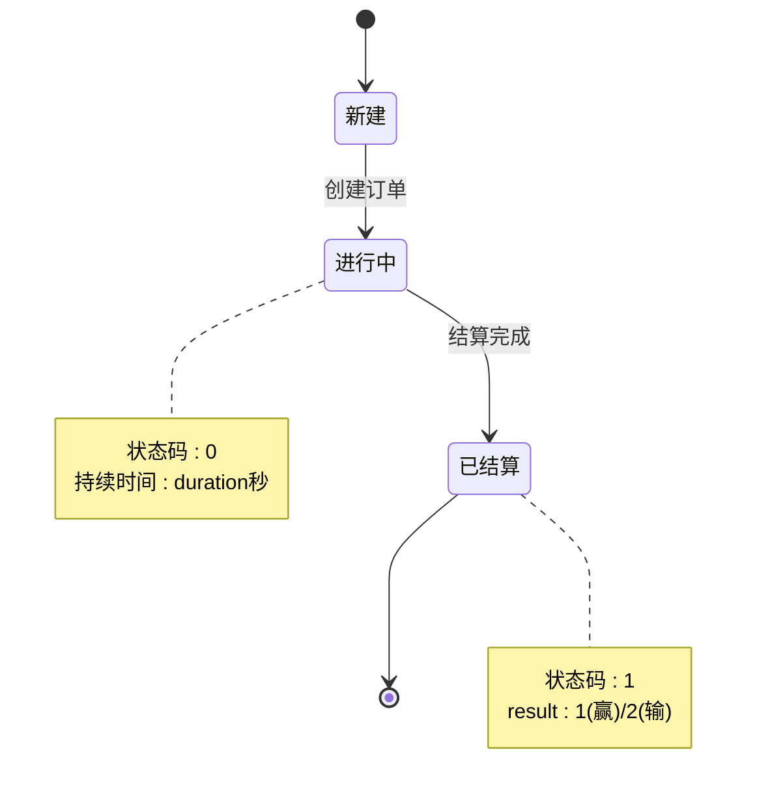
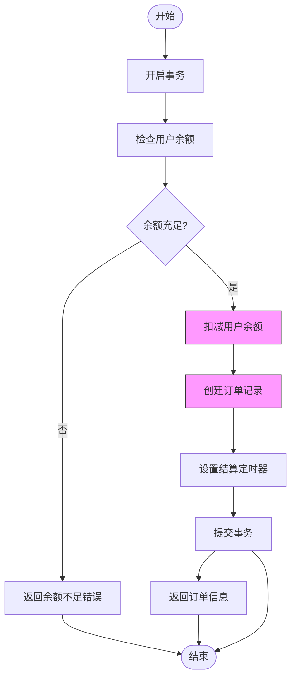
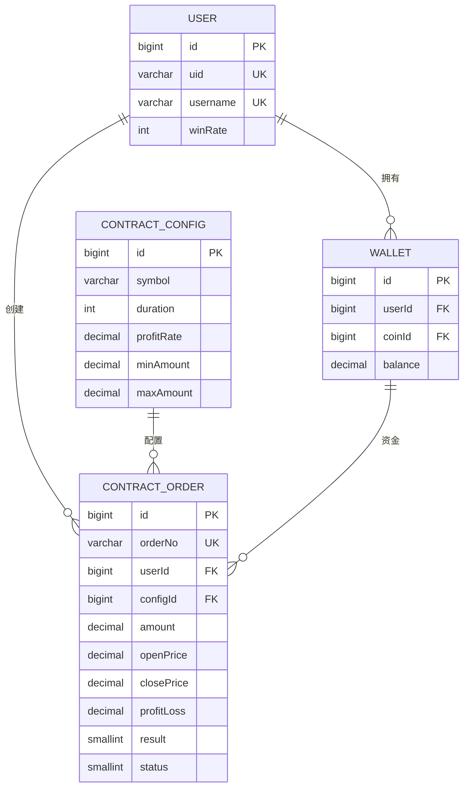

# 订单管理

<cite>
**本文档引用的文件**
- [contract-order.entity.ts](file://agx-backend/src/entities/contract-order.entity.ts)
- [contract.service.ts](file://agx-backend/src/modules/contract/contract.service.ts)
- [contract.controller.ts](file://agx-backend/src/modules/contract/contract.controller.ts)
- [contract.dto.ts](file://agx-backend/src/modules/contract/contract.dto.ts)
- [contract-config.entity.ts](file://agx-backend/src/entities/contract-config.entity.ts)
- [user.entity.ts](file://agx-backend/src/entities/user.entity.ts)
- [wallet.entity.ts](file://agx-backend/src/entities/wallet.entity.ts)
- [admin.service.ts](file://agx-backend/src/modules/admin/admin.service.ts)
- [API_CONTRACT.md](file://agx-backend/API_CONTRACT.md)
</cite>

## 目录
1. [引言](#引言)
2. [项目结构](#项目结构)
3. [核心组件](#核心组件)
4. [架构概述](#架构概述)
5. [详细组件分析](#详细组件分析)
6. [依赖分析](#依赖分析)
7. [性能考虑](#性能考虑)
8. [故障排除指南](#故障排除指南)
9. [结论](#结论)

## 引言
本文档详细描述了合约订单管理系统的实现，重点关注 `ContractOrder` 实体的生命周期管理。文档涵盖了订单状态机的转换逻辑、API接口设计、事务处理机制、性能优化策略以及与其他实体的关系。系统支持用户创建、查询、结算合约订单，并通过数据库事务保证数据一致性。

## 项目结构
合约订单管理功能主要分布在后端服务的 `contract` 模块中，包括实体定义、服务逻辑、控制器和数据传输对象。前端通过API与后端交互，实现订单的创建和查询功能。



**图表来源**
- [contract.controller.ts](file://agx-backend/src/modules/contract/contract.controller.ts)
- [contract.service.ts](file://agx-backend/src/modules/contract/contract.service.ts)

**章节来源**
- [contract.controller.ts](file://agx-backend/src/modules/contract/contract.controller.ts)
- [contract.service.ts](file://agx-backend/src/modules/contract/contract.service.ts)

## 核心组件
核心组件包括 `ContractOrder` 实体、`ContractService` 服务类和 `ContractController` 控制器。`ContractOrder` 实体定义了订单的所有属性和关系，`ContractService` 处理业务逻辑，`ContractController` 提供REST API接口。

**章节来源**
- [contract-order.entity.ts](file://agx-backend/src/entities/contract-order.entity.ts)
- [contract.service.ts](file://agx-backend/src/modules/contract/contract.service.ts)
- [contract.controller.ts](file://agx-backend/src/modules/contract/contract.controller.ts)

## 架构概述
系统采用分层架构，前端通过HTTP请求与后端控制器交互，控制器调用服务层处理业务逻辑，服务层通过TypeORM与数据库交互。订单创建时使用数据库事务确保余额扣减和订单创建的原子性。



**图表来源**
- [contract.controller.ts](file://agx-backend/src/modules/contract/contract.controller.ts)
- [contract.service.ts](file://agx-backend/src/modules/contract/contract.service.ts)

## 详细组件分析

### 订单实体分析
`ContractOrder` 实体是订单管理的核心，定义了订单的所有属性和状态。



**图表来源**
- [contract-order.entity.ts](file://agx-backend/src/entities/contract-order.entity.ts)
- [user.entity.ts](file://agx-backend/src/entities/user.entity.ts)
- [contract-config.entity.ts](file://agx-backend/src/entities/contract-config.entity.ts)

**章节来源**
- [contract-order.entity.ts](file://agx-backend/src/entities/contract-order.entity.ts)

### 订单状态机
订单状态机管理订单的生命周期，从创建到结算的完整流程。



**图表来源**
- [contract-order.entity.ts](file://agx-backend/src/entities/contract-order.entity.ts)
- [contract.service.ts](file://agx-backend/src/modules/contract/contract.service.ts)

**章节来源**
- [contract.service.ts](file://agx-backend/src/modules/contract/contract.service.ts)

### API接口设计
系统提供RESTful API接口用于订单管理，遵循统一的响应格式。

#### 订单创建API
创建新的合约订单。

| 参数 | 类型 | 必填 | 说明 |
|------|------|------|------|
| configId | number | 是 | 合约配置ID |
| amount | number | 是 | 下单金额 |
| direction | number | 是 | 方向：1看涨 2看跌 |

**响应格式**
```json
{
  "code": 0,
  "msg": "ok",
  "data": {
    "orderId": 123,
    "orderNo": "C202401151030123456",
    "symbol": "XAU/USD",
    "direction": 1,
    "directionText": "看涨",
    "amount": "100.00000000",
    "openPrice": "2050.00",
    "duration": 60,
    "profitRate": "0.85",
    "openAt": "2024-01-15 10:30:00",
    "closeAt": "2024-01-15 10:31:00"
  }
}
```

**错误码**
| 错误码 | 说明 |
|--------|------|
| 4001 | 合约配置不存在 |
| 4002 | 最小下单金额不足 |
| 4003 | 超过最大下单金额 |
| 4004 | AGX币种未配置 |
| 4005 | AGX余额不足 |

**章节来源**
- [contract.controller.ts](file://agx-backend/src/modules/contract/contract.controller.ts)
- [contract.service.ts](file://agx-backend/src/modules/contract/contract.service.ts)
- [API_CONTRACT.md](file://agx-backend/API_CONTRACT.md)

#### 订单查询API
获取用户订单列表。

| 参数 | 类型 | 必填 | 说明 |
|------|------|------|------|
| status | number | 否 | 订单状态筛选 |

**响应格式**
```json
{
  "code": 0,
  "msg": "ok",
  "data": {
    "list": [
      {
        "id": 123,
        "orderNo": "C202401151030123456",
        "symbol": "XAU/USD",
        "direction": 1,
        "directionText": "看涨",
        "amount": "100.00000000",
        "openPrice": "2050.00",
        "closePrice": "2052.50",
        "profitLoss": "85.00000000",
        "result": 1,
        "resultText": "盈",
        "status": 1,
        "openAt": "2024-01-15 10:30:00",
        "closeAt": "2024-01-15 10:31:00"
      }
    ]
  }
}
```

**章节来源**
- [contract.controller.ts](file://agx-backend/src/modules/contract/contract.controller.ts)
- [contract.service.ts](file://agx-backend/src/modules/contract/contract.service.ts)

### 事务处理
订单创建使用数据库事务确保数据一致性。



**图表来源**
- [contract.service.ts](file://agx-backend/src/modules/contract/contract.service.ts)

**章节来源**
- [contract.service.ts](file://agx-backend/src/modules/contract/contract.service.ts)

### 性能优化策略
系统采用多种策略优化订单查询性能。

#### 索引设计
在关键字段上创建索引以加速查询。

```sql
-- 订单号唯一索引
CREATE UNIQUE INDEX idx_order_no ON agx_contract_order(order_no);

-- 用户ID索引
CREATE INDEX idx_user_id ON agx_contract_order(user_id);

-- 状态索引
CREATE INDEX idx_status ON agx_contract_order(status);
```

**章节来源**
- [contract-order.entity.ts](file://agx-backend/src/entities/contract-order.entity.ts)

#### 分页查询
限制返回的订单数量，避免全表扫描。

```typescript
const orders = await this.orderRepo.find({
  where: { userId },
  order: { createdAt: 'DESC' },
  take: 50, // 限制返回50条记录
});
```

**章节来源**
- [contract.service.ts](file://agx-backend/src/modules/contract/contract.service.ts)

## 依赖分析
订单管理模块依赖于用户、钱包和合约配置等核心实体。



**图表来源**
- [contract-order.entity.ts](file://agx-backend/src/entities/contract-order.entity.ts)
- [user.entity.ts](file://agx-backend/src/entities/user.entity.ts)
- [wallet.entity.ts](file://agx-backend/src/entities/wallet.entity.ts)
- [contract-config.entity.ts](file://agx-backend/src/entities/contract-config.entity.ts)

**章节来源**
- [contract-order.entity.ts](file://agx-backend/src/entities/contract-order.entity.ts)

## 性能考虑
系统在高并发场景下通过以下方式保证性能：
1. 使用数据库索引加速查询
2. 限制查询结果数量
3. 使用事务保证数据一致性
4. 异步处理结算逻辑
5. 合理的数据库连接池配置

**章节来源**
- [contract.service.ts](file://agx-backend/src/modules/contract/contract.service.ts)

## 故障排除指南
常见问题及解决方案：

| 问题 | 可能原因 | 解决方案 |
|------|---------|---------|
| 订单创建失败 | 余额不足 | 检查用户AGX余额 |
| 订单创建失败 | 配置不存在 | 检查configId是否有效 |
| 订单状态不更新 | 结算服务异常 | 检查定时器和结算逻辑 |
| 查询速度慢 | 缺少索引 | 确认相关字段有索引 |

**章节来源**
- [contract.service.ts](file://agx-backend/src/modules/contract/contract.service.ts)
- [contract-order.entity.ts](file://agx-backend/src/entities/contract-order.entity.ts)

## 结论
合约订单管理系统实现了完整的订单生命周期管理，包括创建、查询和结算功能。系统通过数据库事务保证数据一致性，使用索引和分页优化查询性能，并通过清晰的API接口与前端交互。未来可考虑引入消息队列替代定时器，进一步提升系统的可靠性和可扩展性。