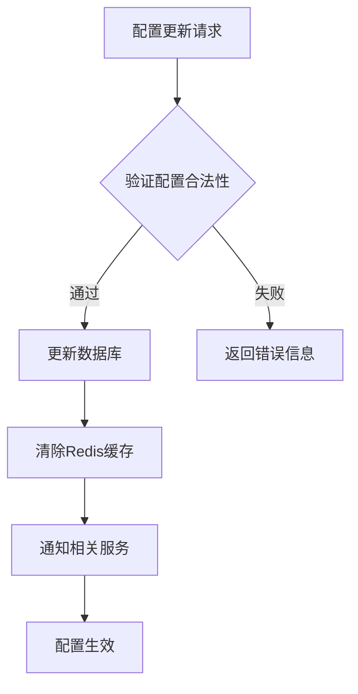
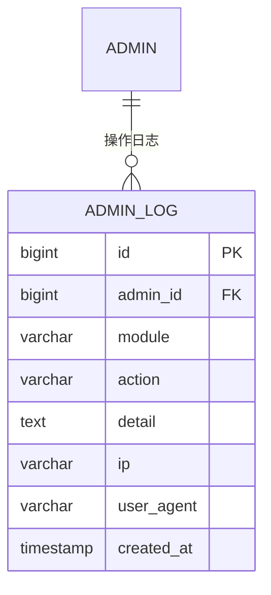

# 配置管理

<cite>
**本文档引用的文件**  
- [contract-config.entity.ts](file://agx-backend/src/entities/contract-config.entity.ts)
- [admin.service.ts](file://agx-backend/src/modules/admin/admin.service.ts)
- [admin.controller.ts](file://agx-backend/src/modules/admin/admin.controller.ts)
- [contract.service.ts](file://agx-backend/src/modules/contract/contract.service.ts)
- [admin-log.entity.ts](file://agx-backend/src/entities/admin-log.entity.ts)
</cite>

## 目录
1. [合约交易配置实体](#合约交易配置实体)
2. [配置分级管理机制](#配置分级管理机制)
3. [配置动态更新与缓存策略](#配置动态更新与缓存策略)
4. [配置变更审计日志](#配置变更审计日志)
5. [配置管理API使用示例](#配置管理api使用示例)
6. [配置一致性校验与回滚机制](#配置一致性校验与回滚机制)

## 合约交易配置实体

合约交易配置（ContractConfig）是系统中用于定义秒合约交易规则的核心实体，存储在 `agx_contract_config` 数据表中。该实体定义了交易对、杠杆范围、手续费率、最小订单量等关键交易参数。

### 字段定义与业务含义

| 字段 | 类型 | 说明 |
|------|------|------|
| symbol | varchar(20) | 交易对，如 XAU/USD，表示交易的资产对 |
| name | varchar(50) | 配置名称，用于展示 |
| duration | int | 周期秒数：30/60/120/300，表示合约持续时间 |
| profitRate | decimal(10,4) | 盈利收益率，决定用户盈利时的回报比例 |
| minAmount | decimal(20,8) | 最小下单金额，限制用户下单的最小值 |
| maxAmount | decimal(20,8) | 最大下单金额，限制用户下单的最大值 |
| payCurrencies | varchar(50) | 支付币种，如 USDT,CNY，支持的支付货币 |
| status | smallint | 状态，1表示启用，0表示禁用 |

这些字段共同定义了一个完整的合约交易产品，确保交易行为符合预设的业务规则。

**Section sources**
- [contract-config.entity.ts](file://agx-backend/src/entities/contract-config.entity.ts#L1-L46)

## 配置分级管理机制

系统采用多层级配置管理体系，确保配置的灵活性和优先级控制。配置分为全局配置、交易对配置和用户等级配置三个层级。

### 优先级处理逻辑

1. **用户等级配置**：具有最高优先级，针对不同用户等级（如VIP1、VIP2）设置差异化的交易参数。
2. **交易对配置**：次优先级，为每个交易对（如XAU/USD）设置独立的交易规则。
3. **全局配置**：最低优先级，作为所有交易的默认配置基础。

当用户发起交易时，系统按优先级顺序查找配置，优先应用用户等级配置，若未找到则回退到交易对配置，最后使用全局配置作为兜底。

**Section sources**
- [admin.service.ts](file://agx-backend/src/modules/admin/admin.service.ts#L1-L1488)
- [contract.service.ts](file://agx-backend/src/modules/contract/contract.service.ts#L1-L282)

## 配置动态更新与缓存策略

系统支持配置的动态更新，无需重启服务即可生效。为提高性能，配置数据采用缓存策略。

### 缓存实现机制

- **缓存存储**：使用Redis缓存配置数据，减少数据库查询压力。
- **缓存键设计**：以 `config:contract:{symbol}` 格式组织缓存键，便于快速检索。
- **缓存更新**：当配置更新时，自动清除相关缓存，确保数据一致性。
- **缓存失效**：设置合理的TTL（Time To Live），防止缓存长时间不更新。

前端管理界面提供缓存管理功能，可手动查看、删除缓存数据。



**Diagram sources**
- [admin.service.ts](file://agx-backend/src/modules/admin/admin.service.ts#L1-L1488)
- [contract.service.ts](file://agx-backend/src/modules/contract/contract.service.ts#L1-L282)

**Section sources**
- [admin.service.ts](file://agx-backend/src/modules/admin/admin.service.ts#L1-L1488)

## 配置变更审计日志

所有配置变更操作均被记录在审计日志中，确保操作可追溯。

### 审计日志结构

审计日志记录在 `agx_admin_log` 表中，包含以下关键字段：

- **module**：操作模块，如"contract"表示合约配置
- **action**：操作动作，如"create"、"update"、"delete"
- **detail**：操作详情，记录变更前后的配置值
- **ip**：操作者IP地址
- **userAgent**：操作者客户端信息
- **createdAt**：操作时间

管理员可通过管理后台查看完整的操作历史，支持按时间、操作类型、操作者等条件筛选。



**Diagram sources**
- [admin-log.entity.ts](file://agx-backend/src/entities/admin-log.entity.ts#L1-L41)

**Section sources**
- [admin-log.entity.ts](file://agx-backend/src/entities/admin-log.entity.ts#L1-L41)
- [admin.controller.ts](file://agx-backend/src/modules/admin/admin.controller.ts#L1-L364)

## 配置管理API使用示例

系统提供RESTful API用于安全地修改和发布新的交易配置。

### API端点

| 方法 | 路径 | 描述 |
|------|------|------|
| GET | /api/admin/contract/list | 获取合约配置列表 |
| POST | /api/admin/contract | 创建新合约配置 |
| PUT | /api/admin/contract/:id | 更新合约配置 |
| DELETE | /api/admin/contract/:id | 删除合约配置 |

### 创建配置示例

```json
POST /api/admin/contract
Authorization: Bearer <token>

{
  "symbol": "XAU/USD",
  "name": "黄金/美元",
  "duration": 60,
  "profitRate": "0.8000",
  "minAmount": "10.00000000",
  "maxAmount": "1000.00000000",
  "payCurrencies": "USDT",
  "status": 1
}
```

响应：
```json
{
  "id": 123
}
```

**Section sources**
- [admin.controller.ts](file://agx-backend/src/modules/admin/admin.controller.ts#L136-L162)
- [admin.service.ts](file://agx-backend/src/modules/admin/admin.service.ts#L1-L1488)

## 配置一致性校验与回滚机制

为确保配置数据的完整性和可靠性，系统实施严格的一致性校验和回滚机制。

### 一致性校验

- **字段验证**：使用DTO（Data Transfer Object）进行输入验证，确保必填字段不为空。
- **数值范围校验**：验证最小金额小于最大金额，收益率在合理范围内。
- **唯一性约束**：确保交易对符号（symbol）的唯一性。
- **状态校验**：禁止对已禁用的配置进行修改。

### 回滚机制

当配置更新失败或发现错误时，系统支持快速回滚：

1. **数据库事务**：配置更新操作在事务中执行，失败时自动回滚。
2. **版本快照**：定期备份配置数据，可恢复到任意历史版本。
3. **灰度发布**：新配置先对部分用户开放，验证无误后再全量发布。

这些机制共同保障了配置管理的安全性和稳定性。

**Section sources**
- [admin.service.ts](file://agx-backend/src/modules/admin/admin.service.ts#L1-L1488)
- [contract.service.ts](file://agx-backend/src/modules/contract/contract.service.ts#L1-L282)