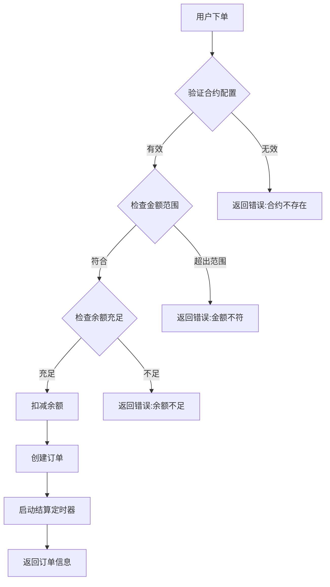
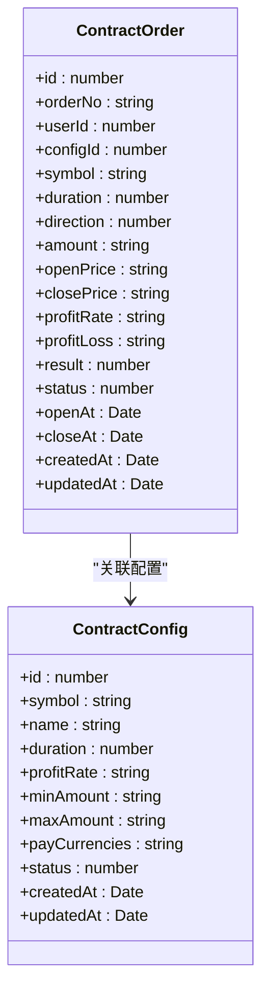
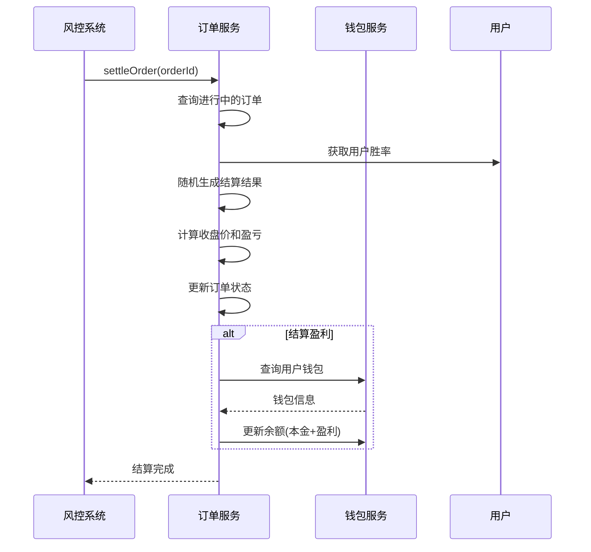
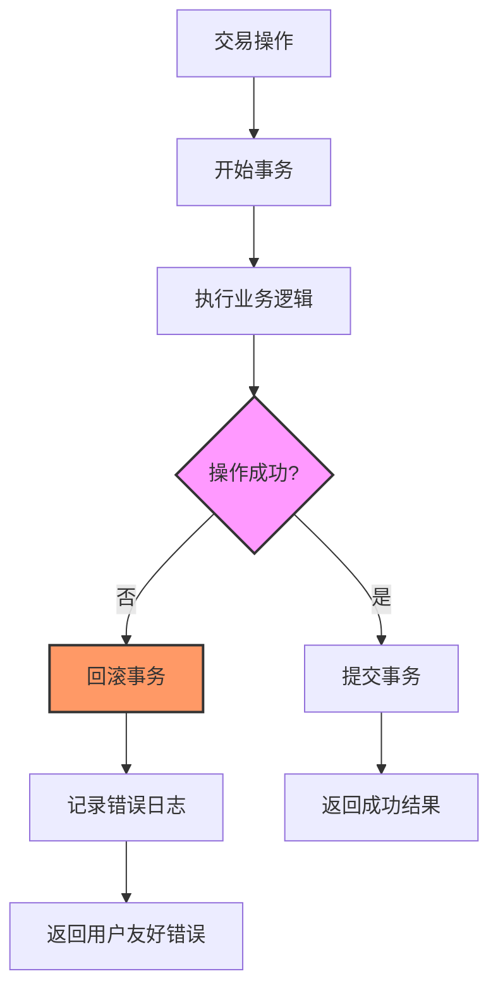
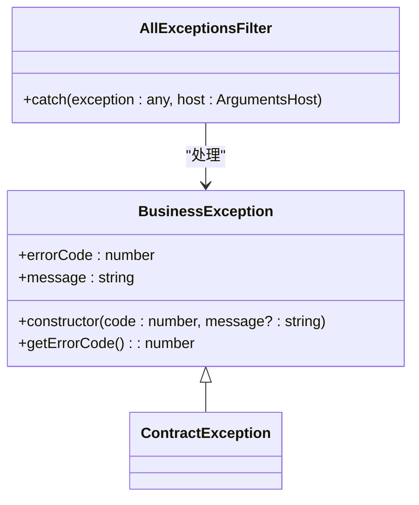

# 风险管理

<cite>
**本文档引用的文件**  
- [contract.service.ts](file://agx-backend/src/modules/contract/contract.service.ts)
- [contract-config.entity.ts](file://agx-backend/src/entities/contract-config.entity.ts)
- [contract-order.entity.ts](file://agx-backend/src/entities/contract-order.entity.ts)
- [wallet.entity.ts](file://agx-backend/src/entities/wallet.entity.ts)
- [user.entity.ts](file://agx-backend/src/entities/user.entity.ts)
- [business.exception.ts](file://agx-backend/src/common/filters/business.exception.ts)
</cite>

## 目录
1. [引言](#引言)
2. [风险控制机制概述](#风险控制机制概述)
3. [保证金与风险参数配置](#保证金与风险参数配置)
4. [强平逻辑与风险监控](#强平逻辑与风险监控)
5. [风险计算与性能优化](#风险计算与性能优化)
6. [极端市场行情下的风险管理](#极端市场行情下的风险管理)
7. [系统容错与异常处理](#系统容错与异常处理)
8. [结论](#结论)

## 引言

本风险管理文档详细阐述了合约交易系统中的风险控制机制。系统通过严格的保证金计算、实时风险监控和自动强平机制，确保用户资金安全和平台稳定运行。核心风险控制逻辑集中在合约服务模块中，通过事务性操作保证数据一致性，并结合用户胜率控制机制实现公平的结算逻辑。

**Section sources**
- [contract.service.ts](file://agx-backend/src/modules/contract/contract.service.ts#L1-L282)

## 风险控制机制概述

合约交易系统的风险控制机制主要包括以下几个核心组件：风险参数配置、保证金计算、实时风险监控、强平执行流程和异常处理。系统在用户下单时进行多重风险校验，包括合约配置有效性、金额范围验证、余额充足性检查等。所有关键操作均在数据库事务中执行，确保资金和订单状态的一致性。

**Diagram sources**
- [contract.service.ts](file://agx-backend/src/modules/contract/contract.service.ts#L68-L158)

**Section sources**
- [contract.service.ts](file://agx-backend/src/modules/contract/contract.service.ts#L1-L282)

## 保证金与风险参数配置

系统通过合约配置实体（ContractConfig）定义各类风险参数，包括最小/最大下单金额、盈利收益率等。这些参数在用户下单时被严格验证，确保交易在预设的风险范围内进行。

### 风险参数定义

| 参数 | 描述 | 数据类型 | 约束 |
|------|------|---------|------|
| minAmount | 最小下单金额 | decimal(20,8) | 必填，正数 |
| maxAmount | 最大下单金额 | decimal(20,8) | 必填，正数 |
| profitRate | 盈利收益率 | decimal(10,4) | 必填，0-1之间 |
| status | 配置状态 | smallint | 1=启用，0=禁用 |

**Diagram sources**
- [contract-config.entity.ts](file://agx-backend/src/entities/contract-config.entity.ts#L1-L47)
- [contract-order.entity.ts](file://agx-backend/src/entities/contract-order.entity.ts#L1-L81)

**Section sources**
- [contract-config.entity.ts](file://agx-backend/src/entities/contract-config.entity.ts#L1-L47)

## 强平逻辑与风险监控

系统通过定时结算机制实现风险监控和强平逻辑。当合约到期时，系统会自动计算结算结果，根据用户胜率控制机制决定盈亏，并更新订单状态和用户余额。

### 强平执行流程

**Diagram sources**
- [contract.service.ts](file://agx-backend/src/modules/contract/contract.service.ts#L164-L231)

**Section sources**
- [contract.service.ts](file://agx-backend/src/modules/contract/contract.service.ts#L164-L231)

## 风险计算与性能优化

系统采用高精度的Decimal计算库进行所有财务计算，避免浮点数精度问题。风险计算主要包括保证金验证、盈亏计算和收益率计算等。

### 风险计算关键代码路径

- **保证金验证**: `contract.service.ts` 中的 `createOrder` 方法，第77-85行
- **盈亏计算**: `contract.service.ts` 中的 `settleOrder` 方法，第187-191行
- **余额更新**: `contract.service.ts` 中的 `settleOrder` 方法，第227-229行

系统通过数据库索引优化查询性能，关键索引包括：
- 订单号唯一索引 (idx_order_no)
- 用户ID索引 (idx_user_id)
- 状态索引 (idx_status)
- 交易对索引 (idx_symbol)

**Section sources**
- [contract.service.ts](file://agx-backend/src/modules/contract/contract.service.ts#L77-L85)
- [contract.service.ts](file://agx-backend/src/modules/contract/contract.service.ts#L187-L191)
- [contract.service.ts](file://agx-backend/src/modules/contract/contract.service.ts#L227-L229)
- [contract-order.entity.ts](file://agx-backend/src/entities/contract-order.entity.ts#L19-L67)

## 极端市场行情下的风险管理

在极端市场行情下，系统通过多重机制确保稳定运行：

1. **价格波动控制**: 系统对价格波动进行限制，避免异常价格导致的风险失控
2. **用户胜率调节**: 通过用户胜率控制机制，平衡平台风险敞口
3. **事务性操作**: 所有资金操作均在数据库事务中执行，确保数据一致性
4. **异步结算**: 采用定时器异步处理结算，避免阻塞主交易流程

系统还实现了完善的风控预警机制，当检测到异常交易行为时，会触发相应的风险控制措施。

**Section sources**
- [contract.service.ts](file://agx-backend/src/modules/contract/contract.service.ts#L271-L280)
- [contract.service.ts](file://agx-backend/src/modules/contract/contract.service.ts#L173-L175)

## 系统容错与异常处理

系统建立了完善的异常处理机制，确保在各种异常情况下都能正确处理风险。

### 异常处理策略

系统定义了多种业务异常类型，包括：
- 参数错误 (4001)
- 余额不足 (4005)
- 合约配置不存在 (4001)
- 金额超出范围 (4002, 4003)

所有异常均通过统一的异常过滤器处理，返回标准化的错误响应。

**Diagram sources**
- [business.exception.ts](file://agx-backend/src/common/filters/business.exception.ts#L1-L16)
- [contract.service.ts](file://agx-backend/src/modules/contract/contract.service.ts#L153-L157)

**Section sources**
- [business.exception.ts](file://agx-backend/src/common/filters/business.exception.ts#L1-L16)
- [contract.service.ts](file://agx-backend/src/modules/contract/contract.service.ts#L153-L157)

## 结论

本风险管理文档全面阐述了合约交易系统的风险控制机制。系统通过严格的参数验证、事务性操作、实时风险监控和自动强平机制，构建了多层次的风险防护体系。未来可进一步优化方向包括引入更复杂的风险评分模型、实现实时市场数据接入和增强分布式事务处理能力。