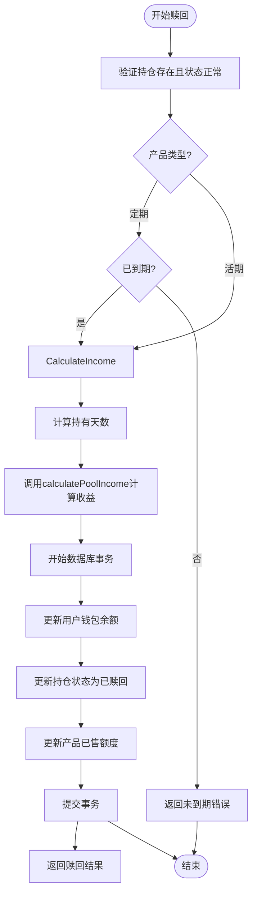
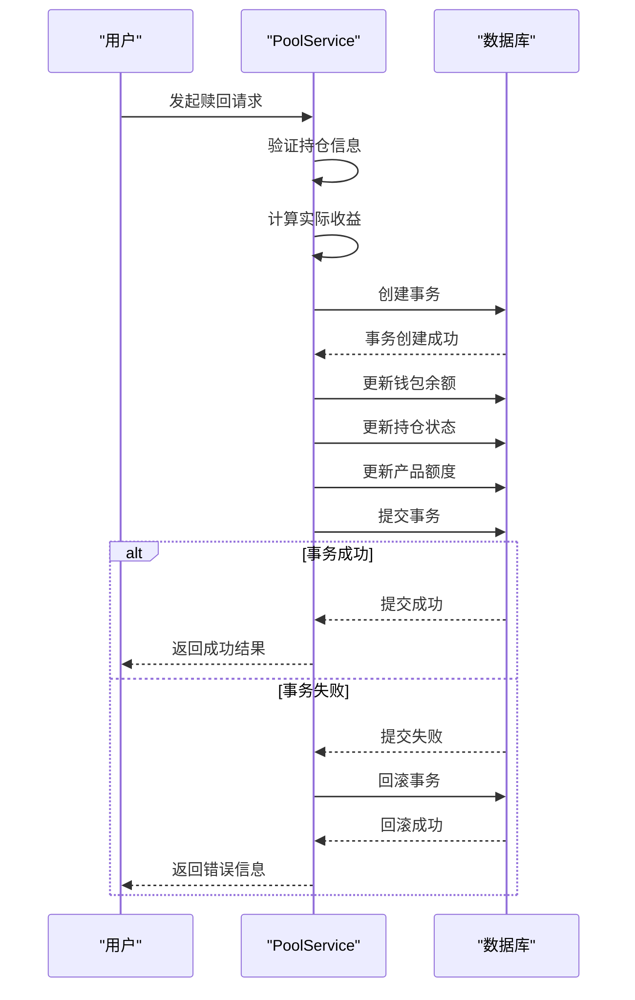
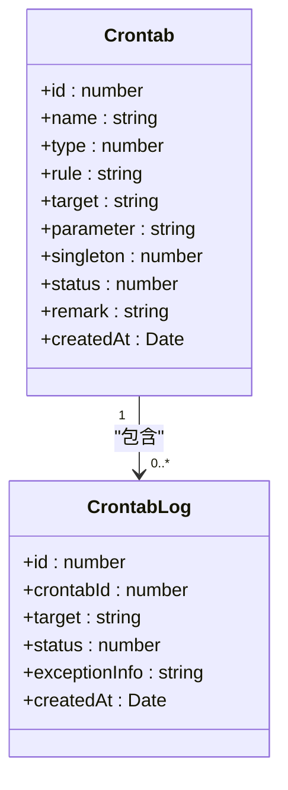
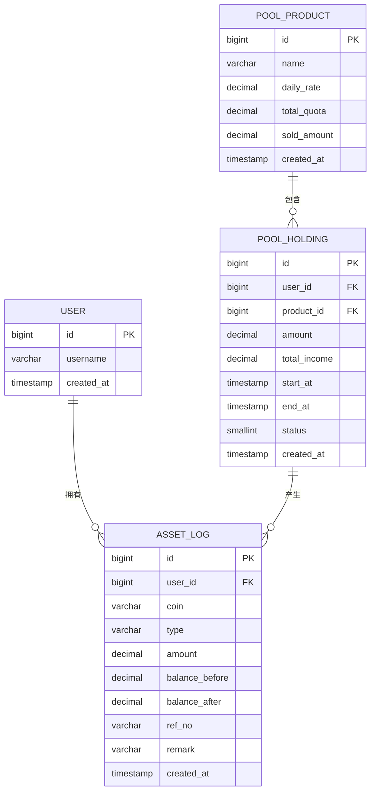
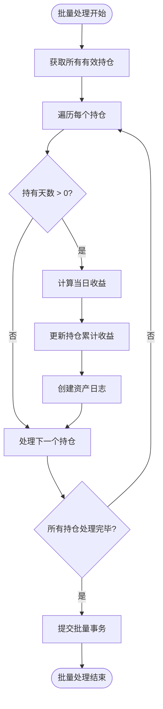

# 收益分配机制

<cite>
**本文档引用文件**  
- [pool.service.ts](file://agx-backend/src/modules/pool/pool.service.ts)
- [pool-product.entity.ts](file://agx-backend/src/entities/pool-product.entity.ts)
- [pool-holding.entity.ts](file://agx-backend/src/entities/pool-holding.entity.ts)
- [wallet.entity.ts](file://agx-backend/src/entities/wallet.entity.ts)
- [asset-log.entity.ts](file://agx-backend/src/entities/asset-log.entity.ts)
- [crontab.js](file://agx-admin/src/api/setting/crontab.js)
- [index.vue](file://agx-admin/src/views/setting/crontab/index.vue)
</cite>

## 目录
1. [简介](#简介)
2. [收益计算机制](#收益计算机制)
3. [收益分配流程](#收益分配流程)
4. [事务处理与异常处理](#事务处理与异常处理)
5. [定时任务实现](#定时任务实现)
6. [审计日志与对账机制](#审计日志与对账机制)
7. [代码示例](#代码示例)
8. [结论](#结论)

## 简介
本专项文档详细阐述了矿池收益分配机制的完整流程，包括基于APY和持有时间的收益计算算法、每日/每周收益分配的定时任务实现、收益分配过程中的事务处理和异常处理机制，以及收益记录的审计日志设计和对账机制。通过这些机制，确保财务数据的准确性和可追溯性。

## 收益计算机制
矿池收益计算基于产品的日收益率（dailyRate）和用户的持有时间。系统通过`calculatePoolIncome`方法实现收益计算，该方法接收持仓金额、日收益率和持有天数作为参数，使用高精度计算库Decimal.js进行计算，确保计算结果的准确性。

收益计算公式为：收益 = 持仓金额 × 日收益率 × 持有天数

对于预计收益的计算，在用户界面展示时，系统会根据当前持仓金额和产品日收益率预估日收益和年收益。年化收益率（APY）通过日收益率乘以365天计算得出，并以百分比形式展示。

**Section sources**
- [pool.service.ts](file://agx-backend/src/modules/pool/pool.service.ts#L99-L103)
- [pool-product.entity.ts](file://agx-backend/src/entities/pool-product.entity.ts#L28-L29)

## 收益分配流程
收益分配流程主要通过矿池服务中的订阅和赎回操作实现。当用户申购矿池产品时，系统会创建持仓记录并锁定相应金额；当用户赎回时，系统会计算实际持有期间的收益并返还本金加收益。

在赎回操作中，系统首先验证持仓是否存在且状态为"持仓中"，然后检查产品类型和到期时间。对于定期产品，必须在到期后才能赎回。系统计算实际持有天数，并调用`calculatePoolIncome`方法计算实际收益。

**Diagram sources**
- [pool.service.ts](file://agx-backend/src/modules/pool/pool.service.ts#L199-L267)

**Section sources**
- [pool.service.ts](file://agx-backend/src/modules/pool/pool.service.ts#L199-L267)

## 事务处理与异常处理
收益分配过程中的所有数据库操作都封装在事务中，确保数据的一致性和完整性。系统使用TypeORM的QueryRunner创建事务，包含以下关键步骤：

1. 连接数据库
2. 开始事务
3. 执行所有数据库操作
4. 提交事务
5. 异常时回滚事务
6. 释放资源

在申购操作中，事务包含：扣减用户钱包余额、更新产品已售额度、创建持仓记录。在赎回操作中，事务包含：增加用户钱包余额、更新持仓状态、更新产品已售额度。

系统实现了完善的异常处理机制，使用try-catch-finally结构确保事务的正确处理。在catch块中回滚事务，在finally块中释放QueryRunner资源，防止资源泄漏。

**Diagram sources**
- [pool.service.ts](file://agx-backend/src/modules/pool/pool.service.ts#L146-L193)
- [pool.service.ts](file://agx-backend/src/modules/pool/pool.service.ts#L223-L264)

**Section sources**
- [pool.service.ts](file://agx-backend/src/modules/pool/pool.service.ts#L146-L193)
- [pool.service.ts](file://agx-backend/src/modules/pool/pool.service.ts#L223-L264)

## 定时任务实现
系统通过定时任务实现周期性的收益分配和状态更新。定时任务配置在管理后台的定时任务模块中，支持多种任务类型，包括命令任务、类任务、URL任务和PHP脚本任务。

定时任务的规则使用标准的cron表达式定义，例如"30 */5 * * * *"表示每隔5分钟的第30秒执行任务。管理员可以通过管理界面查看、创建、编辑、删除定时任务，并可以手动触发任务执行。

**Diagram sources**
- [index.vue](file://agx-admin/src/views/setting/crontab/index.vue)
- [crontab.js](file://agx-admin/src/api/setting/crontab.js)

**Section sources**
- [index.vue](file://agx-admin/src/views/setting/crontab/index.vue)
- [crontab.js](file://agx-admin/src/api/setting/crontab.js)

## 审计日志与对账机制
系统通过资产日志（asset-log）实现完整的审计追踪功能。每次资产变动都会创建相应的日志记录，包括申购、赎回、收益分配等操作。

资产日志实体包含以下关键字段：
- userId: 用户ID
- coin: 币种
- type: 变动类型（recharge/withdraw/pool_in/pool_out/contract/commission）
- amount: 变动金额
- balanceBefore: 变动前余额
- balanceAfter: 变动后余额
- refNo: 关联单号
- remark: 备注
- createdAt: 创建时间

通过对资产日志的查询和分析，可以实现完整的财务对账功能，确保每笔交易都有据可查。

**Diagram sources**
- [asset-log.entity.ts](file://agx-backend/src/entities/asset-log.entity.ts)
- [pool-holding.entity.ts](file://agx-backend/src/entities/pool-holding.entity.ts)
- [pool-product.entity.ts](file://agx-backend/src/entities/pool-product.entity.ts)

**Section sources**
- [asset-log.entity.ts](file://agx-backend/src/entities/asset-log.entity.ts)
- [pool-holding.entity.ts](file://agx-backend/src/entities/pool-holding.entity.ts)
- [pool-product.entity.ts](file://agx-backend/src/entities/pool-product.entity.ts)

## 代码示例
以下代码示例展示了如何批量处理大量持仓的收益分配：

**Diagram sources**
- [pool.service.ts](file://agx-backend/src/modules/pool/pool.service.ts)

**Section sources**
- [pool.service.ts](file://agx-backend/src/modules/pool/pool.service.ts)

## 结论
本矿池收益分配机制通过精确的收益计算算法、可靠的事务处理、完善的异常处理和全面的审计日志，确保了收益分配的准确性和财务数据的可追溯性。定时任务的实现使得收益分配可以自动化执行，提高了系统的效率和可靠性。通过这些机制的协同工作，系统能够安全、准确地处理大量的收益分配请求，为用户提供稳定可靠的矿池服务。