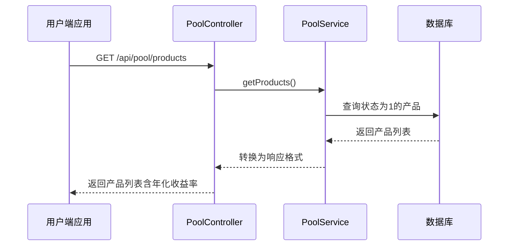
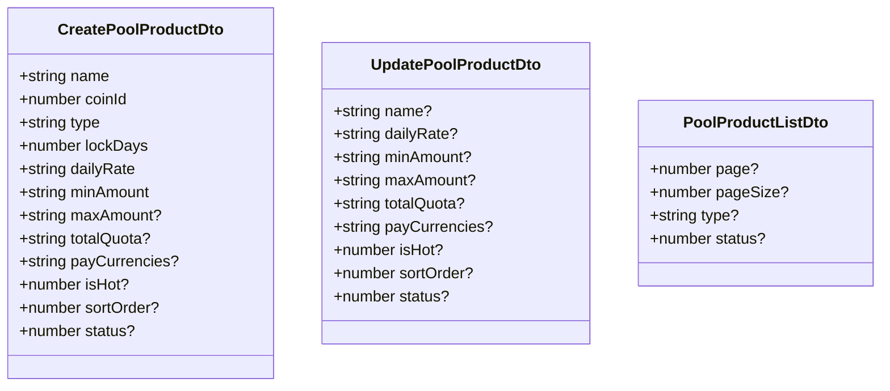
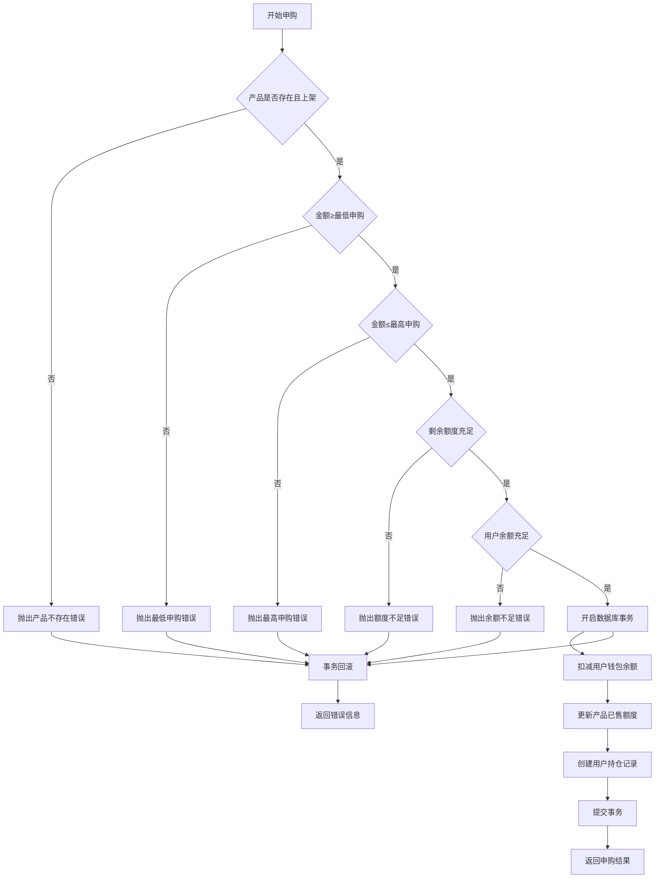
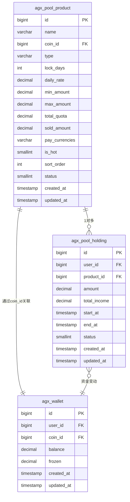

# 矿池产品管理

<cite>
**本文档引用文件**   
- [pool-product.entity.ts](file://agx-backend/src/entities/pool-product.entity.ts)
- [pool.service.ts](file://agx-backend/src/modules/pool/pool.service.ts)
- [pool.controller.ts](file://agx-backend/src/modules/pool/pool.controller.ts)
- [admin.dto.ts](file://agx-backend/src/modules/admin/admin.dto.ts)
- [admin.controller.ts](file://agx-backend/src/modules/admin/admin.controller.ts)
- [admin.service.ts](file://agx-backend/src/modules/admin/admin.service.ts)
- [pool.vue](file://agx-admin/src/views/agx/pool.vue)
</cite>

## 目录
1. [简介](#简介)
2. [核心实体与字段说明](#核心实体与字段说明)
3. [产品管理API接口](#产品管理api接口)
4. [业务逻辑与验证规则](#业务逻辑与验证规则)
5. [产品配置代码示例](#产品配置代码示例)
6. [缓存策略与数据一致性](#缓存策略与数据一致性)
7. [管理界面使用指南](#管理界面使用指南)
8. [常见问题与解决方案](#常见问题与解决方案)

## 简介
矿池产品管理系统是平台核心金融功能之一，支持活期与定期两种产品类型。系统提供完整的CRUD操作接口，支持管理员创建、更新、上下架产品，并通过前端管理界面进行可视化操作。产品信息通过API供用户端查询，申购与赎回操作确保事务一致性。

## 核心实体与字段说明
矿池产品由`PoolProduct`实体表示，存储于`agx_pool_product`数据库表中。核心字段包括：

| 字段名 | 类型 | 说明 | 约束条件 |
|--------|------|------|----------|
| productId | bigint | 主键，自增 | 非空，唯一 |
| name | varchar(100) | 产品名称 | 非空，必填 |
| coinId | bigint | 投入币种ID | 非空，外键关联币种表 |
| type | varchar(20) | 产品类型：flexible(活期)/fixed(定期) | 值域限制，必填 |
| duration | int | 锁定天数，0为活期 | 非负整数 |
| apy | decimal(10,6) | 年化收益率（基于日收益率计算） | 计算字段，精度6位 |
| dailyRate | decimal(10,6) | 日收益率 | 非空，必填 |
| minInvestment | decimal(20,8) | 最低申购金额 | 非空，大于0 |
| maxInvestment | decimal(20,8) | 最高申购金额 | 可为空，表示无上限 |
| totalQuota | decimal(20,8) | 总额度 | 可为空，表示无上限 |
| soldAmount | decimal(20,8) | 已售额度 | 默认0，自动更新 |
| payCurrencies | varchar(50) | 支付币种（如USDT,CNY） | 默认USDT，逗号分隔 |
| isHot | smallint | 是否热门（0否，1是） | 默认0 |
| sortOrder | int | 排序权重 | 默认0，升序 |
| status | smallint | 状态（0下架，1上架） | 默认1，索引字段 |

**Section sources**
- [pool-product.entity.ts](file://agx-backend/src/entities/pool-product.entity.ts#L1-L62)

## 产品管理API接口
系统提供两套API：用户端查询接口和管理员管理接口。

### 用户端产品查询接口


**Diagram sources**
- [pool.controller.ts](file://agx-backend/src/modules/pool/pool.controller.ts#L7-L17)
- [pool.service.ts](file://agx-backend/src/modules/pool/pool.service.ts#L31-L53)

### 管理员产品管理接口
管理员通过`AdminController`进行产品全生命周期管理：

| 操作 | HTTP方法 | 路径 | DTO | 说明 |
|------|---------|------|-----|------|
| 创建产品 | POST | /api/admin/pool | CreatePoolProductDto | 需AdminGuard权限 |
| 更新产品 | PUT | /api/admin/pool/:id | UpdatePoolProductDto | 部分更新，支持空值 |
| 删除产品 | DELETE | /api/admin/pool/:id | 无 | 逻辑删除 |
| 查询列表 | GET | /api/admin/pool/list | PoolProductListDto | 支持分页、类型、状态过滤 |



**Diagram sources**
- [admin.dto.ts](file://agx-backend/src/modules/admin/admin.dto.ts#L115-L175)
- [admin.controller.ts](file://agx-backend/src/modules/admin/admin.controller.ts#L114-L133)

**Section sources**
- [admin.controller.ts](file://agx-backend/src/modules/admin/admin.controller.ts#L114-L133)
- [admin.dto.ts](file://agx-backend/src/modules/admin/admin.dto.ts#L115-L175)

## 业务逻辑与验证规则
产品管理涉及严格的业务规则和数据验证。

### 创建与更新验证
- **必填字段**：名称、币种ID、类型、日收益率、最低申购金额
- **数值约束**：锁定天数≥0，日收益率>0，最低申购金额>0
- **范围约束**：最大申购金额≥最低申购金额，总额度≥已售额度
- **状态约束**：新创建产品默认上架（status=1）
- **支付币种**：默认USDT，可多选（USDT,CNY）

### 申购业务逻辑


**Diagram sources**
- [pool.service.ts](file://agx-backend/src/modules/pool/pool.service.ts#L108-L193)

### 收益计算规则
- **年化收益率(APY)**：`dailyRate * 365 * 100%`
- **预计日收益**：`申购金额 * dailyRate`
- **预计年收益**：`申购金额 * dailyRate * 365`
- **实际收益**：赎回时按持有天数重新计算

**Section sources**
- [pool.service.ts](file://agx-backend/src/modules/pool/pool.service.ts#L99-L103)

## 产品配置代码示例
通过`PoolService`进行产品生命周期管理。

### 创建新产品
```typescript
// 使用AdminService创建产品
const dto: CreatePoolProductDto = {
  name: 'USDT活期宝',
  coinId: 1,
  type: 'flexible',
  lockDays: 0,
  dailyRate: '0.005', // 0.5%
  minAmount: '100',
  maxAmount: '100000',
  totalQuota: '1000000',
  payCurrencies: 'USDT',
  isHot: 1,
  sortOrder: 10,
  status: 1
};

await adminService.createPoolProduct(dto);
```

### 更新产品信息
```typescript
// 更新产品收益率和状态
const dto: UpdatePoolProductDto = {
  dailyRate: '0.006', // 调整为0.6%
  status: 0 // 临时下架
};

await adminService.updatePoolProduct(productId, dto);
```

### 查询产品列表
```typescript
// 获取用户可见的产品列表
const products = await poolService.getProducts();
// 返回数据包含：id, name, type, lockDays, dailyRate, annualRate, minAmount, maxAmount, totalQuota, soldAmount, remainQuota, isHot
```

**Section sources**
- [admin.service.ts](file://agx-backend/src/modules/admin/admin.service.ts#L332-L349)
- [pool.service.ts](file://agx-backend/src/modules/pool/pool.service.ts#L31-L53)

## 缓存策略与数据一致性
系统采用多层缓存策略保障性能与一致性。

### 缓存机制
- **Redis缓存**：产品列表缓存于Redis，键名为`pool:products`
- **缓存更新**：产品创建、更新、删除时主动清除相关缓存
- **过期策略**：设置300秒过期时间，防止长时间脏数据
- **本地缓存**：服务内部使用内存缓存热点数据

### 数据一致性保障
- **数据库事务**：申购、赎回操作使用TypeORM QueryRunner确保ACID
- **乐观锁**：关键更新操作检查版本号或时间戳
- **最终一致性**：异步任务处理非核心业务，通过消息队列保障
- **索引优化**：在`status`和`type`字段建立数据库索引，加速查询



**Diagram sources**
- [pool-product.entity.ts](file://agx-backend/src/entities/pool-product.entity.ts#L10-L62)
- [pool-holding.entity.ts](file://agx-backend/src/entities/pool-holding.entity.ts)
- [wallet.entity.ts](file://agx-backend/src/entities/wallet.entity.ts)

## 管理界面使用指南
管理员通过`pool.vue`界面进行产品管理。

### 主要功能
- **搜索过滤**：按类型（活期/定期）、状态（启用/禁用）筛选
- **分页展示**：每页20条，支持排序（按sortOrder升序）
- **新增产品**：填写完整表单，支付币种支持多选
- **编辑产品**：可修改除ID外的所有字段
- **删除产品**：需二次确认，删除后不可恢复

### 字段输入规范
- **日收益率**：输入百分比数值（如0.5），系统自动转换
- **金额字段**：支持小数点后8位，符合区块链精度要求
- **排序权重**：数值越小越靠前，相同值按ID升序
- **热门标记**：开启后在用户端显示HOT标签

**Section sources**
- [pool.vue](file://agx-admin/src/views/agx/pool.vue#L1-L341)

## 常见问题与解决方案
### 产品创建失败
**现象**：提交表单后提示"创建失败"
**原因**：
1. 必填字段为空（名称、收益率、最低金额）
2. 币种ID不存在
3. 日收益率格式错误
**解决方案**：
- 检查所有必填项是否填写
- 确认`coinId`在`agx_coin`表中存在
- 确保收益率为正数字符串

### 申购额度不足
**现象**：用户申购时提示"剩余额度不足"
**原因**：
1. 产品`totalQuota`已满
2. 并发申购导致额度超卖
**解决方案**：
- 增加产品总额度
- 检查事务隔离级别，确保额度更新原子性
- 实现分布式锁防止超卖

### 收益计算偏差
**现象**：实际收益与预期不符
**原因**：
1. 日收益率更新未同步
2. 持有天数计算误差
3. 浮点数精度丢失
**解决方案**：
- 使用`decimal.js`进行高精度计算
- 确保赎回时重新计算实际收益
- 定期对账，修正累计误差

### 缓存未更新
**现象**：产品更新后用户端仍显示旧数据
**原因**：
1. Redis连接失败
2. 缓存清除逻辑未执行
3. 过期时间过长
**解决方案**：
- 检查Redis服务状态
- 确认`deletePoolProduct`等方法包含缓存清除逻辑
- 适当缩短缓存过期时间

**Section sources**
- [pool.service.ts](file://agx-backend/src/modules/pool/pool.service.ts#L129-L135)
- [admin.service.ts](file://agx-backend/src/modules/admin/admin.service.ts#L372-L378)