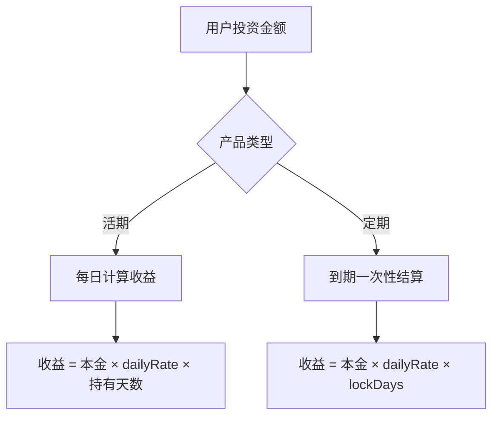
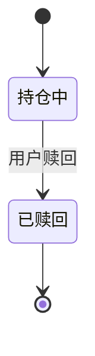
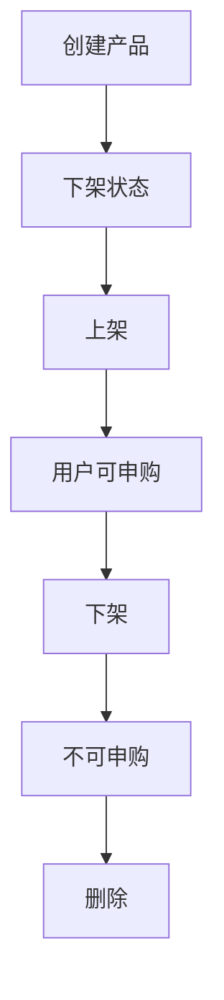
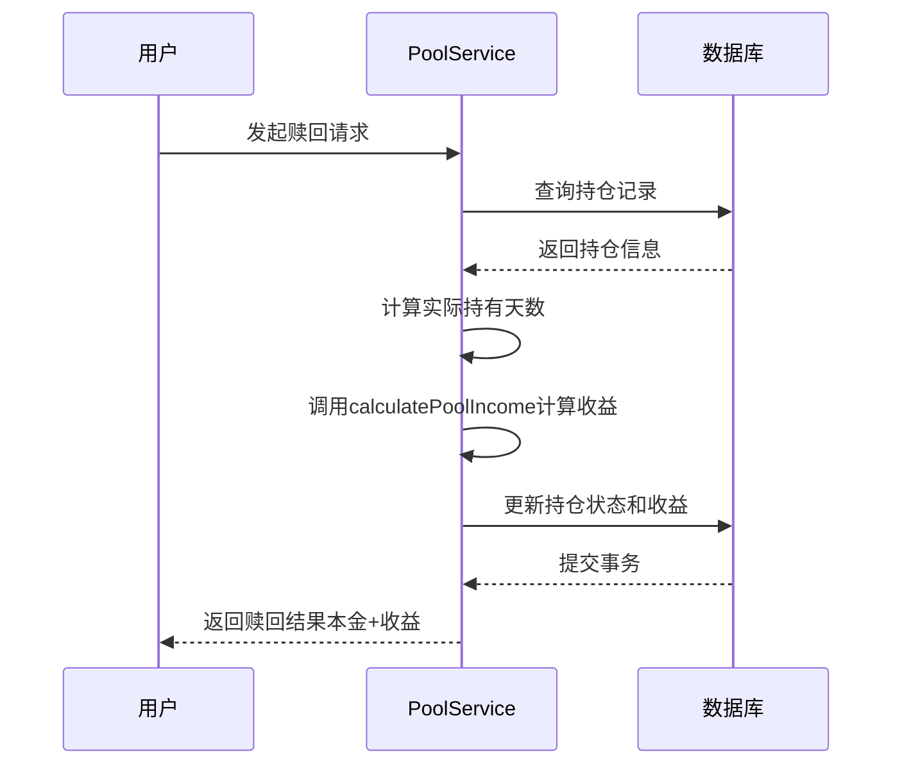
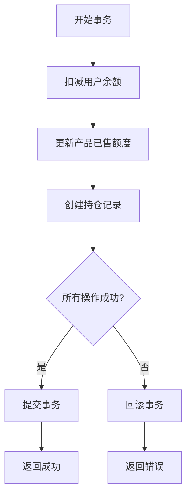
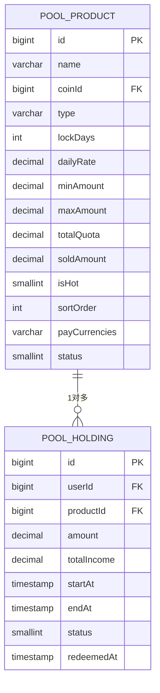

# 矿池投资

<cite>
**本文档引用文件**   
- [pool.controller.ts](file://agx-backend/src/modules/pool/pool.controller.ts)
- [pool.service.ts](file://agx-backend/src/modules/pool/pool.service.ts)
- [pool-product.entity.ts](file://agx-backend/src/entities/pool-product.entity.ts)
- [pool-holding.entity.ts](file://agx-backend/src/entities/pool-holding.entity.ts)
- [pool.vue](file://agx-admin/src/views/agx/pool.vue)
- [pool.dto.ts](file://agx-backend/src/modules/pool/pool.dto.ts)
- [schema.sql](file://agx-backend/schema.sql)
</cite>

## 目录
1. [引言](#引言)
2. [矿池产品实体（PoolProduct）](#矿池产品实体poolproduct)
3. [矿池持仓实体（PoolHolding）](#矿池持仓实体poolholding)
4. [矿池产品生命周期管理](#矿池产品生命周期管理)
5. [收益分配机制与计算规则](#收益分配机制与计算规则)
6. [提前赎回规则](#提前赎回规则)
7. [矿池投资事务处理](#矿池投资事务处理)
8. [查询性能优化策略](#查询性能优化策略)

## 引言

矿池投资系统是数字资产增值的核心功能模块，允许用户通过申购矿池产品获得稳定收益。本系统基于NestJS框架构建，采用TypeORM进行数据持久化，支持活期与定期两种投资模式。文档将深入解析PoolProduct和PoolHolding两个核心实体，阐述其字段定义、数据类型、业务逻辑及交互流程，为开发者和运营人员提供全面的技术参考。

## 矿池产品实体（PoolProduct）

PoolProduct实体代表矿池投资产品的配置信息，定义了用户可投资的产品参数。该实体存储于`agx_pool_product`数据库表中，是矿池系统的基础配置。

### 字段定义与数据类型

| 字段名 | 数据类型 | 精度 | 是否必填 | 默认值 | 说明 |
|--------|--------|------|----------|--------|------|
| id | BIGINT | - | 是 | 自增 | 主键ID |
| name | VARCHAR | 100 | 是 | - | 产品名称（如：USDT活期宝） |
| coinId | BIGINT | - | 是 | - | 投入币种ID，关联agx_coin表 |
| type | VARCHAR | 20 | 是 | - | 产品类型：flexible(活期) / fixed(定期) |
| lockDays | INT | - | 否 | 0 | 锁定天数，0表示活期，无锁定期 |
| dailyRate | DECIMAL | (10,6) | 是 | - | 日收益率，如0.001表示0.1% |
| minAmount | DECIMAL | (20,8) | 是 | - | 最低申购金额 |
| maxAmount | DECIMAL | (20,8) | 否 | NULL | 最高申购金额，NULL表示无限制 |
| totalQuota | DECIMAL | (20,8) | 否 | NULL | 总额度，NULL表示无限制 |
| soldAmount | DECIMAL | (20,8) | 否 | 0 | 已售额度，用于计算剩余额度 |
| isHot | SMALLINT | - | 否 | 0 | 是否热门产品（1:是, 0:否） |
| sortOrder | INT | - | 否 | 0 | 排序权重，数值越大越靠前 |
| payCurrencies | VARCHAR | 50 | 否 | 'USDT' | 支付币种列表，如'USDT,CNY' |
| status | SMALLINT | - | 否 | 1 | 产品状态（1:上架, 0:下架） |
| createdAt | TIMESTAMP | - | 否 | CURRENT_TIMESTAMP | 创建时间 |
| updatedAt | TIMESTAMP | - | 否 | CURRENT_TIMESTAMP | 更新时间 |

**Section sources**
- [pool-product.entity.ts](file://agx-backend/src/entities/pool-product.entity.ts#L1-L62)
- [schema.sql](file://agx-backend/schema.sql#L119-L136)

### 收益计算规则

系统通过日收益率（dailyRate）计算年化收益率（APY），公式如下：
- **年化收益率（APY）** = dailyRate × 365 × 100%
- **预计日收益** = 投资本金 × dailyRate
- **预计年收益** = 投资本金 × dailyRate × 365

前端展示时，APY以百分比形式呈现，保留两位小数。例如，dailyRate为0.001，则APY为36.50%。



**Diagram sources**
- [pool.service.ts](file://agx-backend/src/modules/pool/pool.service.ts#L44-L45)
- [pool.service.ts](file://agx-backend/src/modules/pool/pool.service.ts#L83-L86)

## 矿池持仓实体（PoolHolding）

PoolHolding实体记录用户的矿池投资持仓信息，反映用户的实际投资状态。该实体存储于`agx_pool_holding`数据库表中，是用户资产的重要组成部分。

### 字段定义与数据类型

| 字段名 | 数据类型 | 精度 | 是否必填 | 默认值 | 说明 |
|--------|--------|------|----------|--------|------|
| id | BIGINT | - | 是 | 自增 | 主键ID |
| userId | BIGINT | - | 是 | - | 用户ID，关联agx_user表 |
| productId | BIGINT | - | 是 | - | 产品ID，关联agx_pool_product表 |
| amount | DECIMAL | (20,8) | 是 | - | 持仓数量（投资本金） |
| totalIncome | DECIMAL | (20,8) | 否 | 0 | 累计收益，赎回时更新为实际收益 |
| startAt | TIMESTAMP | - | 是 | - | 开始计息时间 |
| endAt | TIMESTAMP | - | 否 | NULL | 到期时间，活期产品为NULL |
| status | SMALLINT | - | 否 | 1 | 持仓状态（1:持仓中, 0:已赎回） |
| redeemedAt | TIMESTAMP | - | 否 | NULL | 赎回时间 |
| createdAt | TIMESTAMP | - | 否 | CURRENT_TIMESTAMP | 创建时间 |
| updatedAt | TIMESTAMP | - | 否 | CURRENT_TIMESTAMP | 更新时间 |

**Section sources**
- [pool-holding.entity.ts](file://agx-backend/src/entities/pool-holding.entity.ts#L1-L60)
- [schema.sql](file://agx-backend/schema.sql#L139-L152)

### 持仓状态管理

持仓状态通过`status`字段进行管理，其状态流转如下：
- **创建持仓**：当用户成功申购时，`status`设为1（持仓中），`startAt`记录申购时间。
- **定期产品**：根据`lockDays`计算`endAt`，即`startAt + lockDays`天。
- **活期产品**：`endAt`为空，可随时赎回。
- **赎回操作**：当用户赎回时，`status`更新为0（已赎回），`redeemedAt`记录赎回时间，`totalIncome`更新为实际计算的收益。



**Diagram sources**
- [pool.service.ts](file://agx-backend/src/modules/pool/pool.service.ts#L162-L164)
- [pool.service.ts](file://agx-backend/src/modules/pool/pool.service.ts#L240-L244)

## 矿池产品生命周期管理

矿池产品的生命周期涵盖创建、上架、下架和删除四个阶段，由管理员通过后台系统进行管理。

### 生命周期阶段

1. **创建阶段**：管理员在后台填写产品信息（名称、类型、收益率、额度等）并创建产品，此时产品处于“下架”状态。
2. **上架阶段**：管理员将产品状态`status`设为1，产品对用户可见并可申购。
3. **下架阶段**：管理员将产品状态`status`设为0，产品不再对新用户展示，但不影响已有持仓。
4. **删除阶段**：管理员可删除已下架的产品，彻底移除产品配置。

### 管理接口

管理员通过以下API接口管理矿池产品：
- **GET /api/admin/pool/list**：获取产品列表（支持分页、筛选）
- **POST /api/admin/pool**：创建新产品
- **PUT /api/admin/pool/:id**：更新产品信息
- **DELETE /api/admin/pool/:id**：删除产品



**Diagram sources**
- [pool.vue](file://agx-admin/src/views/agx/pool.vue#L7-L27)
- [admin.controller.ts](file://agx-backend/src/modules/admin/admin.controller.ts#L120-L133)

**Section sources**
- [pool.vue](file://agx-admin/src/views/agx/pool.vue#L1-L341)
- [admin.controller.ts](file://agx-backend/src/modules/admin/admin.controller.ts#L120-L133)

## 收益分配机制与计算规则

系统的收益分配机制基于实际持有天数精确计算，确保收益公平准确。

### 收益计算逻辑

1. **持有期间收益**：系统不预分配收益，而是在用户赎回时或定期结算时，根据实际持有天数计算总收益。
2. **实际持有天数**：从`startAt`到当前时间或`endAt`的天数，向下取整。
3. **收益公式**：`收益 = 投资本金 × 日收益率 × 实际持有天数`

### 代码实现



**Diagram sources**
- [pool.service.ts](file://agx-backend/src/modules/pool/pool.service.ts#L199-L265)
- [pool.service.ts](file://agx-backend/src/modules/pool/pool.service.ts#L99-L103)

**Section sources**
- [pool.service.ts](file://agx-backend/src/modules/pool/pool.service.ts#L99-L103)
- [pool.service.ts](file://agx-backend/src/modules/pool/pool.service.ts#L215-L221)

## 提前赎回规则

系统根据产品类型实施不同的赎回规则，保障产品设计的灵活性和用户权益。

### 规则详情

- **活期产品（flexible）**：无锁定期，用户可随时赎回，无任何限制。
- **定期产品（fixed）**：在`endAt`到期前，用户无法赎回。系统通过以下代码检查：
  ```typescript
  if (holding.product.type === 'fixed' && holding.endAt && new Date() < holding.endAt) {
    throw new BusinessException(3007, '定期产品未到期，无法赎回');
  }
  ```
- **赎回流程**：赎回时，系统计算从`startAt`到当前时间的实际收益，并将本金与收益返还至用户钱包。

**Section sources**
- [pool.service.ts](file://agx-backend/src/modules/pool/pool.service.ts#L209-L212)

## 矿池投资事务处理

为确保投资数据的一致性和资金安全，所有投资操作均在数据库事务中执行。

### 申购事务流程

1. **验证产品**：检查产品是否存在且状态为上架。
2. **验证额度**：检查申购金额是否满足最小/最大限制及剩余额度。
3. **验证余额**：检查用户钱包余额是否充足。
4. **开启事务**：创建数据库查询运行器并启动事务。
5. **扣减余额**：更新用户钱包余额。
6. **更新已售额度**：增加产品的`soldAmount`。
7. **创建持仓**：插入新的PoolHolding记录。
8. **提交事务**：若所有操作成功，提交事务。
9. **回滚事务**：若任一操作失败，回滚事务，确保数据一致性。

### 代码示例



**Diagram sources**
- [pool.service.ts](file://agx-backend/src/modules/pool/pool.service.ts#L146-L193)
- [pool.service.ts](file://agx-backend/src/modules/pool/pool.service.ts#L153-L158)

**Section sources**
- [pool.service.ts](file://agx-backend/src/modules/pool/pool.service.ts#L108-L193)

## 查询性能优化策略

为提升系统性能，特别是面对大量用户持仓查询时，采用了以下优化策略。

### 缓存设计

- **产品列表缓存**：`getProducts`接口返回的矿池产品列表可被Redis缓存，减少数据库查询压力。
- **用户持仓缓存**：`getHoldings`接口可缓存用户持仓摘要信息，如总金额、总收益等。

### 批量收益计算方案

系统未采用实时计算每日收益的方案，而是：
- **按需计算**：仅在用户查看持仓或赎回时计算收益，避免不必要的计算开销。
- **批量结算任务**：可通过定时任务（Cron Job）批量处理到期产品的收益结算，提高效率。

### 数据库索引优化

关键字段已建立数据库索引，加速查询：
- `agx_pool_product`表：`idx_status` (status)
- `agx_pool_holding`表：`idx_user_id` (userId), `idx_status` (status), `idx_product_id` (productId)



**Diagram sources**
- [pool-product.entity.ts](file://agx-backend/src/entities/pool-product.entity.ts#L10)
- [pool-holding.entity.ts](file://agx-backend/src/entities/pool-holding.entity.ts#L14)
- [schema.sql](file://agx-backend/schema.sql#L119-L152)

**Section sources**
- [schema.sql](file://agx-backend/schema.sql#L137-L138)
- [schema.sql](file://agx-backend/schema.sql#L153-L154)