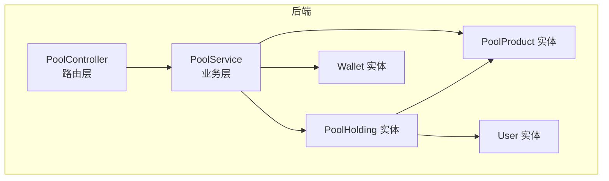
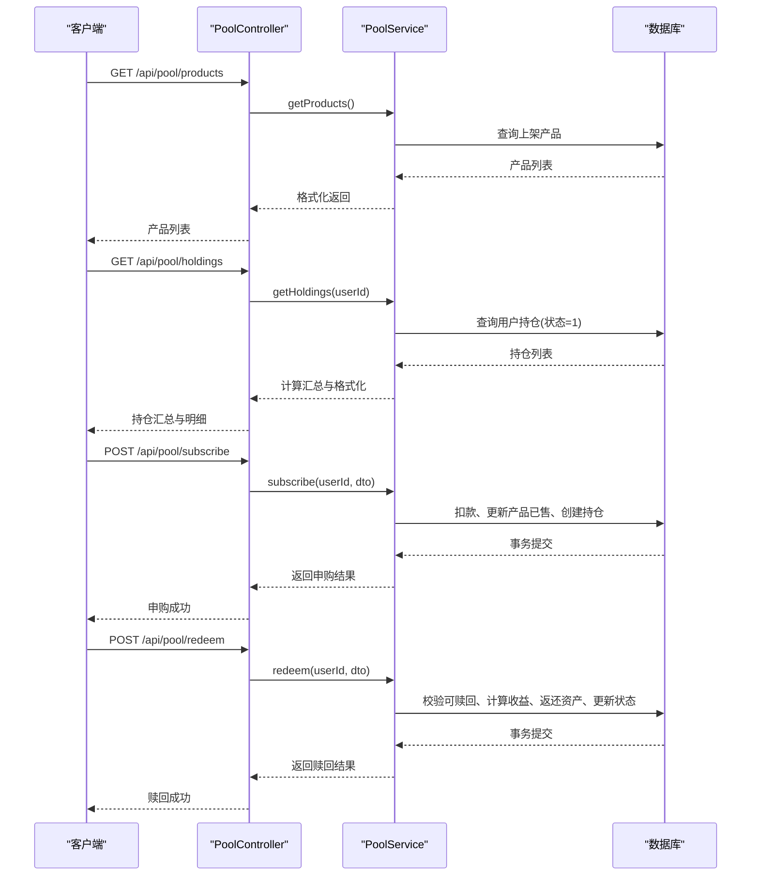
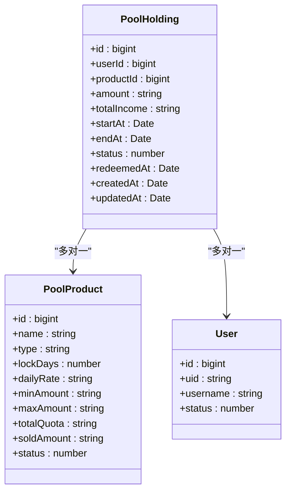
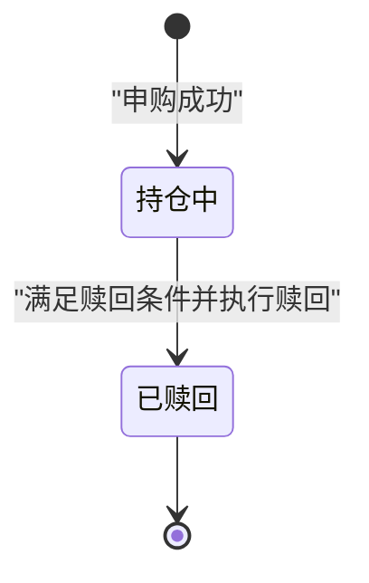
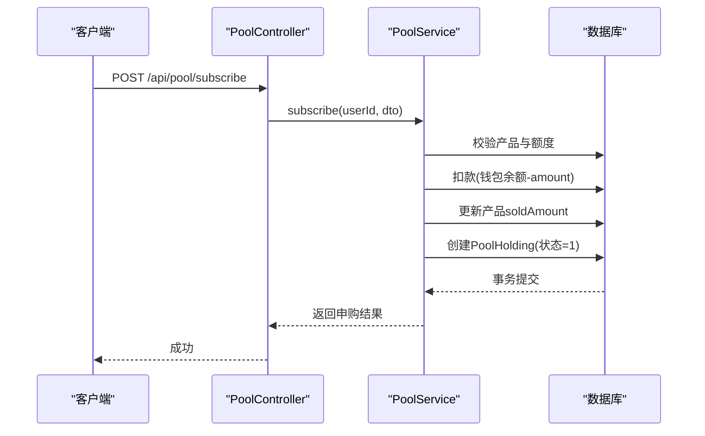
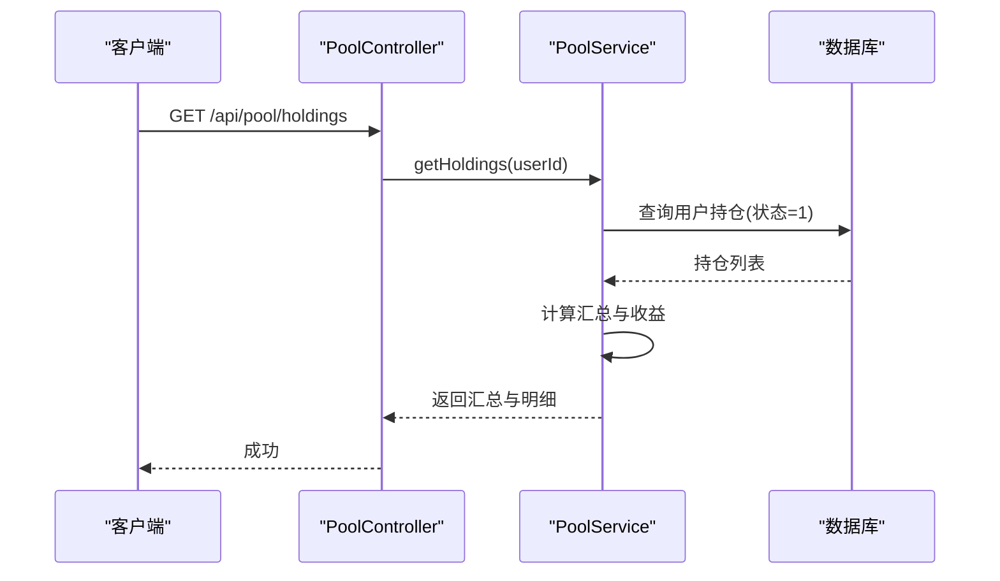
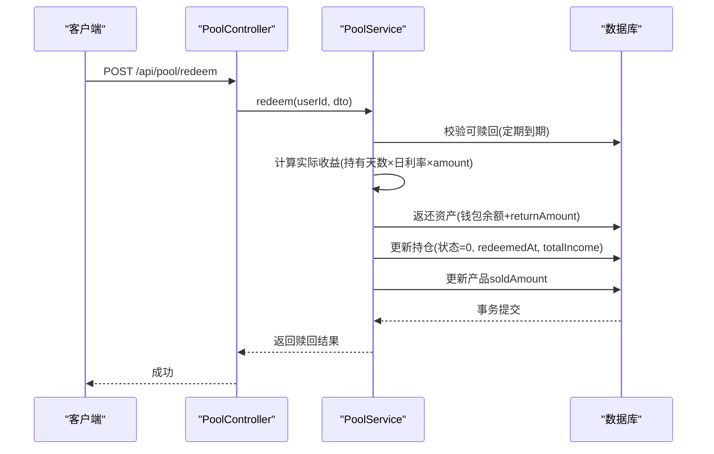
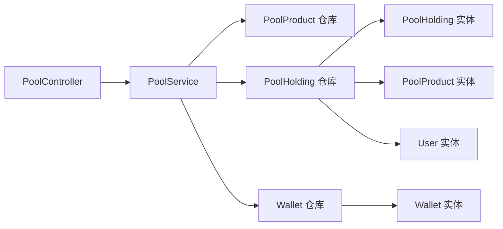

# 矿池持仓管理

<cite>
**本文引用的文件**
- [pool-holding.entity.ts](file://agx-backend/src/entities/pool-holding.entity.ts)
- [pool-product.entity.ts](file://agx-backend/src/entities/pool-product.entity.ts)
- [wallet.entity.ts](file://agx-backend/src/entities/wallet.entity.ts)
- [user.entity.ts](file://agx-backend/src/entities/user.entity.ts)
- [pool.service.ts](file://agx-backend/src/modules/pool/pool.service.ts)
- [pool.controller.ts](file://agx-backend/src/modules/pool/pool.controller.ts)
- [pool.dto.ts](file://agx-backend/src/modules/pool/pool.dto.ts)
</cite>

## 目录
1. [简介](#简介)
2. [项目结构](#项目结构)
3. [核心组件](#核心组件)
4. [架构总览](#架构总览)
5. [详细组件分析](#详细组件分析)
6. [依赖关系分析](#依赖关系分析)
7. [性能考虑](#性能考虑)
8. [故障排查指南](#故障排查指南)
9. [结论](#结论)
10. [附录](#附录)

## 简介
本文件围绕“矿池持仓管理”进行系统化技术文档整理，重点聚焦于 PoolHolding 实体的业务语义与状态转换、用户投资（申购）、持仓查询、提前赎回等核心流程，并给出事务一致性与并发安全的设计要点、性能优化建议（索引与分页），以及关键调用序列图与类图，帮助开发者快速理解与维护该模块。

## 项目结构
- 后端采用 NestJS + TypeORM 架构，矿池模块位于 agx-backend/src/modules/pool，数据模型位于 agx-backend/src/entities。
- 关键文件：
  - 控制器：pool.controller.ts
  - 服务：pool.service.ts
  - DTO：pool.dto.ts
  - 实体：pool-holding.entity.ts、pool-product.entity.ts、wallet.entity.ts、user.entity.ts

图表来源
- [pool.controller.ts](file://agx-backend/src/modules/pool/pool.controller.ts#L1-L52)
- [pool.service.ts](file://agx-backend/src/modules/pool/pool.service.ts#L1-L268)
- [pool-holding.entity.ts](file://agx-backend/src/entities/pool-holding.entity.ts#L1-L60)
- [pool-product.entity.ts](file://agx-backend/src/entities/pool-product.entity.ts#L1-L62)
- [wallet.entity.ts](file://agx-backend/src/entities/wallet.entity.ts#L1-L42)
- [user.entity.ts](file://agx-backend/src/entities/user.entity.ts#L1-L118)

章节来源
- [pool.controller.ts](file://agx-backend/src/modules/pool/pool.controller.ts#L1-L52)
- [pool.service.ts](file://agx-backend/src/modules/pool/pool.service.ts#L1-L268)
- [pool-holding.entity.ts](file://agx-backend/src/entities/pool-holding.entity.ts#L1-L60)
- [pool-product.entity.ts](file://agx-backend/src/entities/pool-product.entity.ts#L1-L62)
- [wallet.entity.ts](file://agx-backend/src/entities/wallet.entity.ts#L1-L42)
- [user.entity.ts](file://agx-backend/src/entities/user.entity.ts#L1-L118)

## 核心组件
- PoolHolding 实体：记录用户的单笔矿池持仓，包括持有数量、累计收益、起息/到期时间、状态、赎回时间等。
- PoolProduct 实体：定义矿池产品属性（类型、锁定期、日利率、额度限制等）。
- Wallet 实体：用户资产账户，用于扣款与返还。
- PoolService：实现产品查询、用户持仓查询、申购、赎回等业务逻辑。
- PoolController：对外暴露 REST 接口，鉴权后转发到服务层。
- DTO：SubscribePoolDto、RedeemPoolDto，约束输入参数。

章节来源
- [pool-holding.entity.ts](file://agx-backend/src/entities/pool-holding.entity.ts#L1-L60)
- [pool-product.entity.ts](file://agx-backend/src/entities/pool-product.entity.ts#L1-L62)
- [wallet.entity.ts](file://agx-backend/src/entities/wallet.entity.ts#L1-L42)
- [pool.service.ts](file://agx-backend/src/modules/pool/pool.service.ts#L1-L268)
- [pool.controller.ts](file://agx-backend/src/modules/pool/pool.controller.ts#L1-L52)
- [pool.dto.ts](file://agx-backend/src/modules/pool/pool.dto.ts#L1-L19)

## 架构总览
- 控制器接收请求，鉴权后调用服务层。
- 服务层通过仓库访问实体，执行业务规则与事务。
- 实体间通过外键关联，确保数据一致性。

图表来源
- [pool.controller.ts](file://agx-backend/src/modules/pool/pool.controller.ts#L1-L52)
- [pool.service.ts](file://agx-backend/src/modules/pool/pool.service.ts#L55-L267)

## 详细组件分析

### PoolHolding 实体与字段语义
- 字段与含义
  - id：自增主键，唯一标识一笔持仓。
  - userId：用户ID，建立用户与持仓的一对多关系。
  - productId：产品ID，建立持仓与产品的多对一关系。
  - amount：持仓数量（decimal，精度20，小数8位）。
  - totalIncome：累计收益（decimal，精度20，小数8位，默认0）。
  - startAt：开始计息时间（timestamp）。
  - endAt：到期时间（timestamp，可空，定期产品使用）。
  - status：状态（smallint，0=已赎回，1=持仓中）。
  - redeemedAt：赎回时间（timestamp，可空）。
  - createdAt/updatedAt：创建与更新时间戳。
- 关系
  - 与 PoolProduct：多对一，通过 productId 关联。
  - 与 User：多对一，通过 userId 关联。
- 索引
  - idx_user_id、idx_product_id、idx_status：提升查询效率。

图表来源
- [pool-holding.entity.ts](file://agx-backend/src/entities/pool-holding.entity.ts#L1-L60)
- [pool-product.entity.ts](file://agx-backend/src/entities/pool-product.entity.ts#L1-L62)
- [user.entity.ts](file://agx-backend/src/entities/user.entity.ts#L1-L118)

章节来源
- [pool-holding.entity.ts](file://agx-backend/src/entities/pool-holding.entity.ts#L1-L60)
- [pool-product.entity.ts](file://agx-backend/src/entities/pool-product.entity.ts#L1-L62)
- [user.entity.ts](file://agx-backend/src/entities/user.entity.ts#L1-L118)

### 业务状态与转换规则
- 状态定义
  - 0：已赎回
  - 1：持仓中
- 转换规则
  - 投资（申购）：创建时状态=1，startAt=当前时间；若产品为定期，则endAt=startAt+lockDays。
  - 赎回：校验可赎回条件，计算实际收益，事务内完成：
    - 返还本金+收益至钱包
    - 更新持仓状态=0、redeemedAt=当前时间、totalIncome=实际收益
    - 更新产品soldAmount=old-soldAmount
  - 查询：默认只查询状态=1的持仓。

图表来源
- [pool.service.ts](file://agx-backend/src/modules/pool/pool.service.ts#L196-L267)
- [pool-holding.entity.ts](file://agx-backend/src/entities/pool-holding.entity.ts#L41-L52)

章节来源
- [pool.service.ts](file://agx-backend/src/modules/pool/pool.service.ts#L196-L267)
- [pool-holding.entity.ts](file://agx-backend/src/entities/pool-holding.entity.ts#L41-L52)

### 用户投资（申购）流程
- 输入校验：productId 存在且上架；金额满足最小/最大限制；剩余额度充足；钱包存在且余额足够。
- 事务处理：
  - 扣减钱包余额
  - 更新产品soldAmount
  - 创建PoolHolding记录（状态=1，startAt=now，endAt根据lockDays设置）
- 输出：返回holdingId、amount、startAt、endAt、预计日/年收益。

图表来源
- [pool.controller.ts](file://agx-backend/src/modules/pool/pool.controller.ts#L31-L50)
- [pool.service.ts](file://agx-backend/src/modules/pool/pool.service.ts#L106-L194)

章节来源
- [pool.controller.ts](file://agx-backend/src/modules/pool/pool.controller.ts#L31-L50)
- [pool.service.ts](file://agx-backend/src/modules/pool/pool.service.ts#L106-L194)

### 持仓查询流程
- 查询条件：userId=当前用户，status=1。
- 关联查询：加载产品信息以显示产品名称、类型、日利率等。
- 计算与返回：汇总totalAmount、totalIncome，逐条计算每日/年化收益，判断是否可赎回（活期或定期已到期）。

图表来源
- [pool.controller.ts](file://agx-backend/src/modules/pool/pool.controller.ts#L22-L26)
- [pool.service.ts](file://agx-backend/src/modules/pool/pool.service.ts#L55-L94)

章节来源
- [pool.controller.ts](file://agx-backend/src/modules/pool/pool.controller.ts#L22-L26)
- [pool.service.ts](file://agx-backend/src/modules/pool/pool.service.ts#L55-L94)

### 提前赎回流程
- 可赎回校验：定期产品需到期；活期产品随时可赎。
- 收益计算：按持有天数与日利率计算实际收益；若持有天数为0则收益为0。
- 事务处理：
  - 返还本金+收益到钱包
  - 更新持仓状态=0、redeemedAt=当前时间、totalIncome=实际收益
  - 更新产品soldAmount=old-soldAmount
- 输出：返回returnAmount、principal、income、预计日/年收益。

图表来源
- [pool.controller.ts](file://agx-backend/src/modules/pool/pool.controller.ts#L43-L50)
- [pool.service.ts](file://agx-backend/src/modules/pool/pool.service.ts#L196-L267)

章节来源
- [pool.controller.ts](file://agx-backend/src/modules/pool/pool.controller.ts#L43-L50)
- [pool.service.ts](file://agx-backend/src/modules/pool/pool.service.ts#L196-L267)

### 事务处理与并发安全
- 事务边界
  - 申购：扣款、更新产品已售、创建持仓，三步在一个事务内完成，失败回滚。
  - 赎回：校验、计算收益、返还资产、更新持仓、更新产品已售，五步在一个事务内完成，失败回滚。
- 并发控制
  - 使用数据库事务隔离级别与行级锁，避免竞态条件。
  - 对关键写入路径（钱包余额、产品soldAmount、持仓状态）采用原子更新。
  - 建议在高并发场景下配合数据库连接池与合理的超时配置，避免长事务阻塞。

章节来源
- [pool.service.ts](file://agx-backend/src/modules/pool/pool.service.ts#L146-L194)
- [pool.service.ts](file://agx-backend/src/modules/pool/pool.service.ts#L223-L267)

### 字段业务含义与状态转换
- holdingId：PoolHolding 的主键，作为用户持有的唯一凭证。
- userId：用户标识，用于查询用户持仓与权限校验。
- productId：产品标识，决定产品类型、锁定期、日利率、额度限制等。
- amount：用户持有的产品份额数量，用于收益计算与赎回返还。
- purchaseTime：对应 PoolHolding.startAt，表示开始计息的时间点。
- maturityTime：对应 PoolHolding.endAt，定期产品的到期时间；活期产品为空。
- 状态转换：
  - 申购成功后：状态=1，startAt=当前时间，endAt=当前时间+lockDays（若为定期）。
  - 赎回成功后：状态=0，redeemedAt=当前时间，totalIncome=实际收益。

章节来源
- [pool-holding.entity.ts](file://agx-backend/src/entities/pool-holding.entity.ts#L41-L52)
- [pool-product.entity.ts](file://agx-backend/src/entities/pool-product.entity.ts#L21-L29)
- [pool.service.ts](file://agx-backend/src/modules/pool/pool.service.ts#L160-L174)
- [pool.service.ts](file://agx-backend/src/modules/pool/pool.service.ts#L210-L212)

## 依赖关系分析
- 控制器依赖服务：PoolController 依赖 PoolService。
- 服务依赖实体仓库：PoolService 依赖 PoolProduct、PoolHolding、Wallet、Coin 的仓库。
- 实体依赖关系：PoolHolding 依赖 PoolProduct 与 User；Wallet 依赖 Coin。
- 索引与约束：PoolHolding 的 userId/productId/status 建有索引；Wallet 的 user_id+coin_id 建有唯一索引。

图表来源
- [pool.controller.ts](file://agx-backend/src/modules/pool/pool.controller.ts#L1-L52)
- [pool.service.ts](file://agx-backend/src/modules/pool/pool.service.ts#L1-L268)
- [pool-holding.entity.ts](file://agx-backend/src/entities/pool-holding.entity.ts#L1-L60)
- [pool-product.entity.ts](file://agx-backend/src/entities/pool-product.entity.ts#L1-L62)
- [wallet.entity.ts](file://agx-backend/src/entities/wallet.entity.ts#L1-L42)
- [user.entity.ts](file://agx-backend/src/entities/user.entity.ts#L1-L118)

章节来源
- [pool.controller.ts](file://agx-backend/src/modules/pool/pool.controller.ts#L1-L52)
- [pool.service.ts](file://agx-backend/src/modules/pool/pool.service.ts#L1-L268)
- [pool-holding.entity.ts](file://agx-backend/src/entities/pool-holding.entity.ts#L1-L60)
- [pool-product.entity.ts](file://agx-backend/src/entities/pool-product.entity.ts#L1-L62)
- [wallet.entity.ts](file://agx-backend/src/entities/wallet.entity.ts#L1-L42)
- [user.entity.ts](file://agx-backend/src/entities/user.entity.ts#L1-L118)

## 性能考虑
- 索引设计
  - PoolHolding：idx_user_id、idx_product_id、idx_status，用于按用户/产品/状态快速过滤。
  - PoolProduct：idx_type、idx_status，用于产品筛选与上架状态查询。
  - Wallet：idx_user_coin（唯一），用于按用户+币种定位钱包。
- 分页策略
  - 当前查询默认按创建时间倒序，适合前端分页；建议在用户持仓量较大时增加基于主键的游标分页或基于时间戳+id的复合索引以提升分页性能。
- 数据类型与精度
  - 金额字段统一使用 decimal(20,8)，避免浮点误差；收益计算使用 decimal.js，保证精度。
- 缓存与异步
  - 对高频读取的产品列表可引入缓存；对收益计算可采用定时任务预计算并落库，减少实时计算压力。

章节来源
- [pool-holding.entity.ts](file://agx-backend/src/entities/pool-holding.entity.ts#L19-L21)
- [pool-holding.entity.ts](file://agx-backend/src/entities/pool-holding.entity.ts#L27-L29)
- [pool-holding.entity.ts](file://agx-backend/src/entities/pool-holding.entity.ts#L41-L49)
- [pool-product.entity.ts](file://agx-backend/src/entities/pool-product.entity.ts#L21-L23)
- [pool-product.entity.ts](file://agx-backend/src/entities/pool-product.entity.ts#L52-L54)
- [wallet.entity.ts](file://agx-backend/src/entities/wallet.entity.ts#L13-L15)

## 故障排查指南
- 常见错误与定位
  - 申购失败：检查产品是否存在且上架、最小/最大金额限制、剩余额度、钱包余额是否充足。
  - 赎回失败：定期产品未到期不可赎回；查询不到持仓或状态非1。
  - 事务异常：确认数据库连接与事务释放逻辑，查看回滚是否正确触发。
- 日志与监控
  - 在服务层的关键节点添加日志（参数校验、事务开始/提交/回滚、关键更新语句）。
  - 监控慢查询：针对高频查询（按用户/状态）观察执行计划与索引使用情况。
- 数据一致性
  - 确保所有写操作都在同一事务内完成；避免跨事务的中间态数据。
  - 对关键字段（balance、soldAmount、status）进行幂等性校验与补偿。

章节来源
- [pool.service.ts](file://agx-backend/src/modules/pool/pool.service.ts#L112-L135)
- [pool.service.ts](file://agx-backend/src/modules/pool/pool.service.ts#L199-L212)
- [pool.service.ts](file://agx-backend/src/modules/pool/pool.service.ts#L146-L194)
- [pool.service.ts](file://agx-backend/src/modules/pool/pool.service.ts#L223-L267)

## 结论
本模块通过清晰的实体设计、严格的业务校验与严谨的事务处理，实现了矿池投资、查询与赎回的完整闭环。PoolHolding 实体承载了核心业务状态与收益计算的基础数据，结合索引与分页策略，可在高并发场景下保持良好的性能与一致性。建议持续完善监控与缓存策略，进一步提升用户体验与系统稳定性。

## 附录
- 接口定义（REST）
  - GET /api/pool/products：获取产品列表（无需鉴权）
  - GET /api/pool/holdings：获取用户持仓（需 JWT 鉴权）
  - POST /api/pool/subscribe：申购矿池（需 JWT 鉴权）
  - POST /api/pool/redeem：赎回矿池（需 JWT 鉴权）

章节来源
- [pool.controller.ts](file://agx-backend/src/modules/pool/pool.controller.ts#L14-L50)
- [pool.dto.ts](file://agx-backend/src/modules/pool/pool.dto.ts#L1-L19)